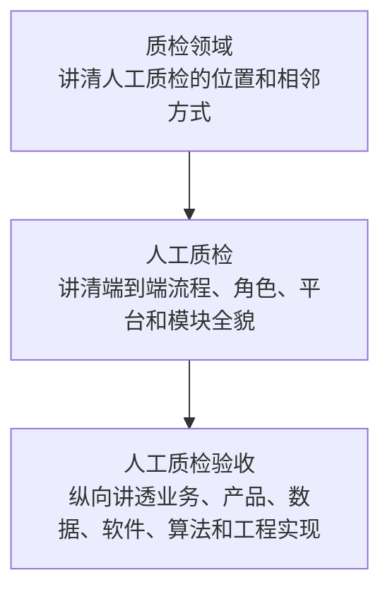

# M1 人工质检验收学习覆盖矩阵

> 状态：第 4 轮参考成果重构前的评测者私有设计稿。它规定“读者需要学会什么”，不作为候选 Harness 的输入，也不代表材料中的设计已经上线。

## 1. 当前判断

第 3 轮参考成果只能帮助读者理解验收的几个主题，还不能建立完整心智模型。第 4 轮应采用以下深度：



- **质检领域**解决“它属于哪里、为什么需要它”。
- **人工质检**解决“整套业务怎样运转、验收与谁协作”。
- **人工质检验收**解决“内部到底怎样实现和运行”，其中领域 Python 功能必须从业务动作一路讲到代码结构、运行过程和实际实现，而不是停在前后端分层图或设计名词上。

其他人工质检模块只需要说明职责、输入输出、关键状态和与验收的接口；本轮不展开其算法、数据库和代码。这样既不会让验收悬空，也不会把 M1 扩成完整质检知识库。

## 2. 怎样判断材料是否足够

矩阵使用三种普通状态：

| 状态 | 含义 | 第 4 轮处理 |
|---|---|---|
| 足够起草 | 至少有一份直接材料，并能被另一来源、代码或人工决定校验关键语义 | 形成规范知识和图表 |
| 可以讲，但必须标明性质 | 有较详细材料，但只能证明历史做法或目标设计 | 保留细节，同时明确“历史”或“目标” |
| 不能证明 | 来源冲突、缺少当前代码/系统证据，或只有一句结论 | 明确列为未知，不由模型补写 |

结构检查、文件数量和链接完整只能证明文档形式合格，不能替代上述内容判断。

## 3. 质检领域：讲清位置

| 学完后应该能回答 | 主要来源 | 当前覆盖 | 材料判断 | 第 4 轮落点 |
|---|---|---|---|---|
| 质检要解决什么问题，评价对象和结果是什么？ | [质检业务总览信息架构](../../../knowledge/raw/quality_check/质检业务总览信息架构.txt) | 只有一句定义 | 足够起草定位，不足以建立通用质检理论 | 重写 `domains/quality/overview.md` 的目标、对象、结果和边界 |
| 人工质检、自动化质检、大模型质检和专题数据质量分别做什么？ | [质检业务总览信息架构](../../../knowledge/raw/quality_check/质检业务总览信息架构.txt)、[质检平台顶层架构](../../../knowledge/raw/quality_check/质检一站式平台顶层架构.txt) | 只画了四个节点，没有职责对比 | 足够起草，但属于平台目标设计 | 增加四类方式的职责、成熟度、协作和不应混淆事项 |
| 一条数据需求为什么可能同时经过多种质检方式？ | [质检业务总览信息架构](../../../knowledge/raw/quality_check/质检业务总览信息架构.txt) | 未解释 | 足够起草业务协作图 | 增加“数据需求—质检方式—质量结果—交付”的上层关系图 |
| 人工质检在整体质检与数据交付中的位置是什么？ | 质检总览、[人工质检总览](../../../knowledge/raw/quality_check/人工质检总览信息架构.txt) | 只说“本次聚焦” | 足够起草；不同专题责任存在差异 | 在领域图中标出人工质检对城区/高速/园区/仿真与感知抽检的不同责任 |

这一层完成后，读者应能解释人工质检为什么存在、与另外三种方式如何分工，但不要求掌握自动化质检或大模型质检的内部实现。

## 4. 人工质检：讲清全貌

| 学完后应该能回答 | 主要来源 | 当前覆盖 | 材料判断 | 第 4 轮落点 |
|---|---|---|---|---|
| 人工质检从哪里开始，到什么结果才算真正完成？ | [交付任务与行动项机制](../../../knowledge/raw/quality_check/人工质检-交付任务与行动项机制.txt)、[人工质检总览](../../../knowledge/raw/quality_check/人工质检总览信息架构.txt) | 当前只有验收之后的局部流程 | 足够起草 | 新建人工质检端到端生命周期页 |
| 需求接纳、数据送检、规则/适配、任务生产、标注、验收、通过打回和交付怎样连接？ | 同上 | 验收页中只出现部分上下游 | 足够起草；并行、返工和多轮需要保留 | 用全链路图说明标准路径、并行路径和返工循环 |
| 需求方、质检负责人、标注员、验收员和平台各承担什么责任？ | 交付任务材料、[人力管理体系](../../../knowledge/raw/quality_check/人工质检-人力管理体系设计.txt) | 几乎未覆盖 | 可以起草角色地图；真实组织责任仍需人工确认 | 在人工质检总览中增加角色、交接和待确认责任边界 |
| 人工质检围绕什么核心对象推进？ | 交付任务材料 | 未建立“交付任务”中心对象 | 足够起草 | 增加交付任务、行动项、标注任务、验收样本和交付结果之间的对象关系 |
| 为什么交付阶段、健康情况、行动项状态和验收结论必须分开？ | 交付任务材料 | 只在验收监控页局部提及 | 足够起草 | 新建人工质检核心对象与状态页，作为各工作台共用解释 |
| 人工质检平台有哪些主要模块，各自输入输出是什么？ | [平台顶层架构](../../../knowledge/raw/quality_check/质检一站式平台顶层架构.txt)、人工质检总览、交付/标注/验收中心前端设计 | 没有人工质检模块全景图 | 足够形成目标模块地图；当前实现状态不能整体确认 | 新建人工质检平台与模块地图，至少包含总览、交付、标注、验收、人力、规则/适配和任务生产 |
| 人工质检平台的前端、接口、业务服务、数据访问、数据库和外部系统怎样分层？ | [后端分层与组件边界](../../../knowledge/raw/quality_check/质检平台-后端分层与组件边界设计.txt)、[API 契约](../../../knowledge/raw/quality_check/质检平台-API契约与前端交互设计.txt) | 只有验收原型局部实现页 | 可以讲目标架构，不能称为当前完整实现 | 人工质检平台页给顶层软件架构，验收页再下钻组件 |
| 其他模块怎样给验收提供输入，又怎样消费验收结果？ | 交付任务、总览、标注/验收/交付中心设计 | 当前没有明确接口表 | 足够描述业务输入输出；精确 API 和数据契约不足 | 在模块地图增加“提供什么、消费什么、交接失败会怎样” |
| 整个人工质检当前做到了哪里？ | [人工质检实施计划](../../../knowledge/raw/quality_check/质检平台-人工质检模块实施计划.txt)、固定代码提交 | 当前只说明验收局部原型 | 来源声明与固定代码冲突 | 单独给“已证明、来源声称、尚未证明”三栏，不汇总成一个完成百分比 |

这一层完成后，读者不需要掌握标注、人力和交付模块的代码，但应能画出整个人工质检平台、说出各模块责任，并准确指出验收的上下游。

## 5. 人工质检验收：纵向讲透

### 5.1 业务与产品

| 学完后应该能回答 | 主要来源 | 当前覆盖 | 材料判断 | 第 4 轮落点 |
|---|---|---|---|---|
| 验收为什么存在，输入、输出和完成条件是什么？ | [三阶段流程](../../../knowledge/raw/quality_check/人工质检-标注验收执行三阶段流程.txt)、交付任务材料 | 已有阶段边界，缺输入输出总表 | 足够起草 | 重写验收总览，加入职责、输入、输出、完成条件和上下游 |
| 标注、验收、形成结论和真正执行为什么不是一件事？ | 三阶段流程、旧运行材料 | 已较清楚 | 足够起草 | 保留并增加对象范围和责任人对比 |
| 分配、完成、分析、结论、回查和返工怎样形成循环？ | [验收中心前端设计](../../../knowledge/raw/quality_check/质检平台-人工质检验收中心前端设计.txt)、交付任务材料 | 已有监控页，尚未和完整工作台统一 | 足够起草目标产品流程 | 将工作台结构与业务生命周期互相链接，不复制事实 |
| 验收中心有哪些视图，用户在每一步能做什么、看到什么？ | 验收中心前端设计、[人工质检前端页面与状态](../../../knowledge/raw/quality_check/质检平台-人工质检前端页面与状态设计.txt) | 只有主题描述 | 可以讲目标设计；当前前端未实现 | 新建或重写验收产品工作台页，明确动作、输出、失败和权限 |
| 打回后怎样持续跟踪，怎样再次进入验收？ | 交付任务、验收中心设计 | 已有一页，但细节仍偏概念 | 足够起草业务闭环，轮次标识和责任机制仍未知 | 保留返工页并补多轮、剩余量、责任人与再次验收入口 |

### 5.2 数据与状态

| 学完后应该能回答 | 主要来源 | 当前覆盖 | 材料判断 | 第 4 轮落点 |
|---|---|---|---|---|
| 验收使用哪些业务对象和标识，它们怎样对应交付任务、日期、场景、人员、组和具体 task？ | [综合快照表设计](../../../knowledge/raw/quality_check/质检平台-综合快照表设计.txt)、[scene_name 概念](../../../knowledge/raw/quality_check/质检平台-scene_name概念.txt)、Repository 设计 | 只有原型字段说明，没有完整对象地图 | 可以起草目标数据模型；ID 映射仍不完整 | 新建验收数据对象与标识页，显式列出未知映射 |
| 原始任务数据怎样进入统计快照，再被采样、规则和页面使用？ | 综合快照、[快照刷新契约](../../../knowledge/raw/quality_check/验收前置条件-快照刷新四级实现契约.txt) | 未覆盖 | 可以讲目标数据流和历史刷新设计 | 新建数据流与新鲜度页，区分原始事实、派生快照和用户确认字段 |
| 分配计划、实际分配、验收完成、质量结果、结论和执行状态怎样变化？ | 综合快照、三阶段流程、通过打回设计 | 分散在多页 | 可以讲目标状态模型；字段版本冲突 | 在数据流页形成状态轴，不把多个版本字段合成当前 Schema |
| 哪些统计口径必须分开？ | 三阶段流程、人工质检总览 | 已暴露分母冲突 | 不能证明最终业务口径 | 保留完成进度、质量通过率和分配达成率的推荐解释，等待用户决定 D5 |
| 页面看到的数据有多新，外部执行返回与最终状态怎样区分？ | 综合快照、[Delta 调用与回查](../../../knowledge/raw/quality_check/质检平台-Delta调用与状态回查设计.txt) | 只在执行页提及 | 可以讲目标设计；真实刷新周期与外部状态未知 | 数据流页明确时间戳、回查和不确定状态 |

### 5.3 系统架构与跨层调用

| 学完后应该能回答 | 主要来源 | 当前覆盖 | 材料判断 | 第 4 轮落点 |
|---|---|---|---|---|
| 验收从前端操作到数据库和外部平台的总体调用链是什么？ | 后端分层、API、Delta、验收前端设计 | 没有统一架构页 | 足够形成目标软件架构；当前只实现局部 | 新建验收软件架构页，提供上下文图、分层图和两条关键时序 |
| Router、Schema、Service、Sampler/Rule、Repository、DeltaClient 和调度任务在整个系统调用链中的位置是什么？ | 后端分层、[数据结构组织](../../../knowledge/raw/quality_check/质检平台-领域模型层设计.txt)、Repository 设计 | 分散在来源记录中 | 足够形成跨层职责和禁止事项 | 系统架构页先解释跨层协作，再下钻领域 Python 软件设计 |
| 分配预览到执行的调用顺序和一致性要求是什么？ | [采样与任务选择](../../../knowledge/raw/quality_check/质检平台-验收采样配额与任务选择设计.txt)、API 契约 | 已讲当前原型和目标差异，但未贯通组件 | 足够起草 | 在架构页加入 preview → execute 时序，并链接算法页 |
| 结论预览、人工确认、执行和回查的调用顺序是什么？ | [通过打回规则与执行](../../../knowledge/raw/quality_check/质检平台-通过打回规则与执行设计.txt)、Delta 设计 | 已有业务描述，缺系统组件串联 | 足够起草目标时序 | 在架构页加入结论执行时序，并标当前未实现 |
| HTTP 数据、内部计算结构和数据库行为什么不能混用？ | 数据结构组织、API 契约 | 未覆盖 | 足够起草工程边界 | 系统架构页增加契约转换图，不展开所有类字段 |

### 5.4 领域 Python 软件结构、设计与实现

这里的“软件设计”不是模式名词清单，而是回答：一个验收业务动作最后由哪些 Python 代码完成，这些代码怎样分层、怎样协作、为什么这样组织，以及当前实现是否清楚自然。讲解顺序固定为：

```text
业务目的与用户动作
→ Python 入口与调用链
→ 包、模块、类、函数和数据结构
→ 运行时的数据与状态变化
→ 设计理由、实际效果和已知不足
```

第 4 轮采用面向本项目裁剪的 **4+1 多视图**。它是理解工具，不是要求每页机械凑齐五张图：

| 视图 | 要回答的问题 | 合适的表达 |
|---|---|---|
| `+1` 业务场景/用例视图 | 谁为了什么发起动作，输入输出是什么，成功或失败意味着什么？ | 业务流程图、用例说明、场景步骤 |
| 逻辑视图 | 核心概念、模块、类和数据结构各自负责什么，彼此是什么关系？ | 模块关系图、类图、对象/状态图 |
| 开发/代码视图 | Python 包和文件怎样组织，依赖从哪里指向哪里，真实代码入口在哪里？ | 包结构图、代码地图、业务步骤到代码追溯表 |
| 进程/运行视图 | 一次操作运行时按什么顺序调用，数据和状态怎样变化，哪里与数据库或外部系统交互？ | 时序图、活动图、数据流图 |
| 物理/部署视图 | API 进程、调度任务、数据库和外部平台实际部署在哪里、怎样连接？ | 上下文图、部署图；只有来源足以证明或理解确有需要时才展开 |

| 学完后应该能回答 | 主要来源 | 当前覆盖 | 材料判断 | 第 4 轮落点 |
|---|---|---|---|---|
| 一个具体业务动作怎样落到 Python 入口、核心函数、数据读写和最终输出？ | [后端分层与组件边界](../../../knowledge/raw/quality_check/质检平台-后端分层与组件边界设计.txt)、API 契约、采样/执行材料、固定代码 `3cf3934` | 业务步骤和代码说明分散，尚未贯通 | 分配预览可以基于当前代码讲透；结论执行和回查只能讲目标调用链 | 选“分配预览”为当前代码走读，再用“结论执行”展示目标调用链并明确未实现 |
| 采样、规则、任务选择、业务编排、数据访问和外部调用分别位于哪些包、模块、类和函数？ | 后端分层、[数据结构组织](../../../knowledge/raw/quality_check/质检平台-领域模型层设计.txt)、Repository、Delta 设计、固定代码 | 只有分散目录和组件说明 | 可以形成目标代码地图；当前固定代码只能覆盖查询、Ratio 预览和数据库访问 | 用包结构图和模块职责表讲清“放在哪里、接收什么、产出什么、调用谁” |
| 核心类、函数和数据结构之间是什么关系，哪些只是文档设计、哪些真实存在？ | 数据结构组织、API 契约、固定代码 | 尚无统一类图或对象关系图 | 可为当前原型形成有代码证据的局部类图；目标部分必须另图或显式标注 | 提供当前实现类图/对象图，并把目标设计和当前代码分开呈现 |
| 分配预览、结论执行和状态回查在运行时分别经过哪些步骤？ | API、采样、通过打回、Delta、Repository 设计、固定代码 | 跨层时序分散 | 分配预览可由代码验证；后两者只能形成目标时序 | 提供最少但足够的关键时序，并链接业务规则、算法和数据页 |
| 代码中的数据在请求结构、内部计算结构和数据库记录之间怎样转换？ | 数据结构组织、API 契约、Repository、固定代码 | 未贯通 | 可以解释目标边界并核对当前局部实现 | 用数据流/转换图和具体字段示例说明，不复制完整 Schema |
| 当前实现为什么这样拆分，这种结构是否清楚、自然、便于理解和修改？ | 真实包结构、调用链、职责和变更场景 | 现有材料偏向声明采用了什么做法 | 只有理解实际代码后才能评价；完整系统证据不足时不得给整体结论 | 基于职责是否明确、依赖是否自然、修改是否局部、行为是否重复或隐藏作出具体判断，不按模式数量或术语打分 |
| 如果新增一种采样方式或修改一条业务规则，真实修改路径是什么？ | 采样/规则设计、固定代码 | 目标扩展思路存在，当前代码只覆盖 Ratio 附近 | 可以把扩展场景作为结构是否合理的验证，不应先假定其“可扩展” | 给出一个基于当前代码的修改走查和一个目标设计推演，列清修改文件、影响与未知 |
| 哪些专题不进入基础学习主线？ | 用户审查意见、任务场景 | 现有矩阵把性能、幂等、重试、可测试性和可观察性前置了 | 除非它们直接决定当前业务动作是否正确，否则没有必要一开始展开 | 默认只登记下钻入口；用户提出性能分析、维测或专项工程需求时再建立专题说明 |

除多视图外，还应按需使用三种更贴近代码的讲法：一是“业务步骤 → 代码入口 → 关键函数 → 数据 → 输出”的追溯表；二是选一个真实场景做可跟随的代码走读；三是用“当前实现 / 目标设计 / 为什么不同”解释设计取舍。模式名称只在代码真实采用且有助理解时顺带说明，不能替代对代码本身的解释。

### 5.5 核心算法与执行保护

| 学完后应该能回答 | 主要来源 | 当前覆盖 | 材料判断 | 第 4 轮落点 |
|---|---|---|---|---|
| Group、Personal 和 Ratio 三种采样策略解决什么问题？ | 采样与任务选择、旧脚本、当前 Ratio 原型 | Ratio 很细，另外两种只作历史/目标介绍 | 可以讲三种策略，但只有 Ratio 有当前代码证据 | 重写采样页，先比较用途，再分别讲算法和现实状态 |
| 配额怎样取整、类别不足怎样补足、怎样保证不超容量？ | 采样设计、当前 Ratio 代码 | Ratio 已较完整 | Ratio 足够证明；Group 奇数余量和 task 排序未知 | 保留算法步骤、不变量、边界示例和未知 |
| 从统计配额到具体任务选择还需要哪些约束？ | 采样设计、Repository 设计 | 只在目标方案中提到 | 可以讲目标约束，不能证明当前实现 | 单列 task 选择、人员有效性、供应商隔离、状态重查和稳定排序 |
| 数据什么时候足以形成 PASS/REJECT，什么时候必须暂不执行？ | 通过打回设计、旧脚本 | 已有历史阈值和目标 PENDING | 可以讲历史与目标；当前规则未知 | 结论页保留来源性质和边界用例，等待 D1/D4 |
| 质量通过率、Good/Bad 分支和总通过率兜底怎样计算？ | 通过打回设计、旧脚本 | 已有详细历史公式 | 只能证明历史脚本 | 保留公式、严格大于边界和反例，不写成当前规则 |
| 为什么执行前要重算、重查状态，超时后先回查而非盲目重试？ | API、Delta、通过打回设计 | 分散 | 足够形成目标执行保护原则 | 结论页与架构时序共同说明一致性、幂等和未知结果 |
| 快照怎样聚合标注与验收数据，刷新怎样避免覆盖人工执行字段？ | 综合快照、快照刷新契约、Repository 设计 | 未覆盖 | 设计很细但版本冲突严重，固定代码不足 | 只提炼稳定不变量；具体 26/18/JSONB 字段版本进入冲突与待核实区 |

### 5.6 工程实现与验证

| 学完后应该能回答 | 主要来源 | 当前覆盖 | 材料判断 | 第 4 轮落点 |
|---|---|---|---|---|
| 当前固定代码版本真正实现了什么？ | `/home/yyh/project/ai-knowledge-base@3cf3934`、7 项聚焦测试 | 已有当前原型页 | 足够证明查询、日期展开和 Ratio 预览 | 保留系统实现页，并从每个相关主题链接到当前代码入口 |
| 目标设计中的文件、类、API、表和调度任务分别在哪里？ | 实施计划及组件设计 | 当前没有总表 | 可以形成“目标实现地图”，不能标成已存在 | 新建业务步骤到组件、接口、代码和证据的追溯表 |
| 哪些实现声明与固定代码冲突？ | 实施计划、Repository、快照契约与固定代码 | 已在开放问题中提到 | 已证明存在冲突 | 实现地图采用“固定代码已证明 / 材料声称 / 未证明”三栏 |
| 测试能证明什么，真实端到端还缺什么？ | 当前测试、各组件测试计划 | 已在原型页局部说明 | 局部代码测试可信；数据库、外部平台和生产运行不足 | 增加测试层级、真实输入输出、外部依赖和缺失证据 |
| 哪些工程约束必须随基础流程说明，哪些留到专项需求再展开？ | API、Delta、前端状态、平台顶层架构、用户审查意见 | 当前材料把多类工程话题混在一起 | 与业务正确性直接相关的权限边界、执行确认和结果不确定状态应保留；性能、通用重试、可测试性和可观察性默认按需下钻 | 基础页只解释会改变业务结果的保护；专项分析另建下钻内容，不挤占零背景学习主线 |

### 5.7 跨模块公共能力与领域使用契约

公共能力采用“一个规范落点，多处使用契约”，而不是每个领域复制一份数据库或 OBS 说明。


| 学完后应该能回答 | 当前证据 | 本轮处理 |
|---|---|---|
| 什么属于公共能力，什么仍属于人工质检领域？ | Blueprint C3、平台顶层架构、用户确认 | 数据库连接池/Connector/事务和 OBS 客户端属于公共能力；`t_qc_daily_snapshot` 等业务表及字段口径属于人工质检/验收领域 |
| 验收怎样使用公共数据库能力？ | 固定代码中的 `src/database/`、`src/api/deps.py`、`AcceptanceRepository` | 本轮可以形成数据库公共能力规范页，并在验收软件设计中只写命名连接、事务、查询/写入和失败保证等使用契约 |
| OBS 怎样呈现？ | 用户确认其被质检多模块乃至数据团队复用；平台目标设计列出 `src/obs/ObsManager`，固定代码未发现对应实现 | 本轮建立公共能力概览和知识缺口，不虚构客户端 API；只有验收存在真实 OBS 用例时，验收页才增加使用契约 |
| 公共能力何时值得独立建页？ | 用户确认的跨团队复用、Blueprint P6 | 已有两个以上真实消费者或必须全团队一致时建立唯一规范页；仅被一个模块提到时先留在领域依赖表 |
| 领域页面需要重复写多少公共细节？ | 一个规范落点原则 | 只写本领域用途、输入输出、配置、所依赖保证、领域特有限制和失败影响；实现原理、通用 API、安全和运维回到公共页 |

这一区分尤其重要：数据库技术是公共能力，数据库里的业务表不是；OBS 客户端是公共能力，某个质检任务的对象路径、保留周期和文件语义是领域使用契约。

## 6. 材料充分性结论

| 目标内容 | 当前是否足以产出 | 必须保留的边界 |
|---|---|---|
| 质检领域位置 | 是 | 只能讲当前资料定义的四块业务与协作，不扩写通用行业理论 |
| 人工质检端到端业务全貌 | 是 | 角色责任、预测算法和最终交付口径仍有待确认项 |
| 人工质检平台目标模块地图 | 是 | 不能声称整个平台已经实现 |
| 验收业务与产品工作台 | 是 | 大部分是目标设计，不是当前产品事实 |
| 验收目标软件架构与组件职责 | 是 | 目录与组件来自设计材料，需与当前原型分开 |
| 领域 Python 软件结构、设计与实现 | 可以用业务到代码追溯和多视图讲透当前局部实现，并解释目标设计 | 当前代码只覆盖部分业务场景；设计好坏必须从实际结构和运行行为得出，不能由目录图或模式名称推出 |
| 验收数据流和状态 | 可以起草 | 多版快照 Schema、ID 映射和生产字段不能静默合并 |
| 验收核心算法 | 部分可以讲透 | Ratio 有当前代码；Group/Personal、结论规则主要是历史和目标 |
| 当前工程实现 | 只能讲局部 | 固定代码只证明查询、日期展开和 Ratio 预览 |
| 数据库公共能力 | 是 | 固定代码可证明连接池、命名连接、事务、健康检查和依赖提供；仍需评审接口与业务 Repository 的边界 |
| OBS 公共能力 | 只能建立概览和缺口 | 跨团队复用由用户确认，但当前固定代码没有实现证据，不能写具体 API 和运行行为 |
| 当前生产运行方式 | 否 | Delta、生产表、阈值、部署和真实端到端证据缺失 |

因此，第 4 轮可以成为“完整且诚实的学习材料”：完整覆盖知识维度，同时诚实显示哪些内容只是目标、历史或未知。它不能被包装成当前生产系统说明书。

## 7. 第 4 轮建议目录

下面只是规范落点和阅读路线，不要求候选 Harness 生成完全相同的文件名。

```text
knowledge/index.md                         学习总入口与三层阅读路线
capabilities/
├── database-access.md                    数据库连接、事务、健康检查和使用契约
└── object-storage.md                     OBS 公共定位、消费者和当前实现缺口
domains/quality/
├── overview.md                           质检位置、四类方式及协作
└── manual/
    ├── overview.md                       人工质检全貌与验收位置
    ├── end-to-end-lifecycle.md           需求到交付、并行与返工
    ├── platform-and-module-map.md         模块、输入输出与顶层软件架构
    ├── core-objects-and-status.md         交付任务、行动项和四类状态
    └── acceptance/
        ├── overview.md                   验收职责、输入输出、上下游与学习导航
        ├── lifecycle.md                  业务流程、角色和异常循环
        ├── product-workbench.md           分配、监控、分析、结论与返工工作台
        ├── data-flow-and-state.md         数据对象、数据流、状态、新鲜度和口径
        ├── system-architecture.md         前端/API/数据/外部系统和关键时序
        ├── python-architecture-and-implementation.md  业务到代码、4+1 多视图、结构层级与当前实现
        ├── sampling-and-assignment.md     三种策略、配额、取整和任务选择
        ├── conclusion-and-execution.md    结论算法、人工确认、执行与回查
        ├── implementation-map.md          业务→组件→API/表→代码→证据
        └── open-questions.md              冲突、未知和补知责任
systems/
└── manual-qc-acceptance-prototype.md      固定提交中的当前代码事实
views/
├── by-domain/quality.md                   从质检逐层定位到验收
└── by-journey/manual-qc-acceptance.md     零背景学习顺序
```

现有“过程监控、结果分析与返工”页建议合并进 `product-workbench.md`，避免业务工作台知识散成多个相互重叠的页面。当前原型继续留在 `systems/`，不与目标架构混写。

`database-access.md` 可以基于当前代码写到接口与实现边界；`object-storage.md` 当前只写公共定位、已知消费者、证据状态和待补内容。验收页面只有在确有 OBS 输入输出时才链接相应使用契约，不能为了展示架构完整而强行引入。

## 8. 第 4 轮的内容验收问题

零背景读者沿推荐路线阅读后，应能不翻原始资料回答：

1. 人工质检在质检领域和数据交付中处于什么位置？
2. 人工质检从需求进入到交付完成经过哪些阶段，哪里可能并行或返工？
3. 人工质检平台有哪些模块，验收的上下游分别提供和消费什么？
4. 验收从抽样、分配、完成、结论、执行到返工怎样运转？
5. 验收中的核心数据、标识、状态和统计口径是什么？
6. 前端、API、数据库、调度和外部平台怎样协作？
7. 一个验收业务动作怎样落实到 Python 包、模块、类和函数；从多视图能否看清代码层级、运行过程和设计取舍？
8. 数据库、OBS 等公共能力在哪里维护，验收只需要表达哪些使用契约？
9. Ratio 算法怎样处理总量、类别不足、取整和容量；其他策略已知到什么程度？
10. 验收结论怎样形成，什么情况下不能执行，执行后为什么还要回查？
11. 当前固定代码实现到哪里，目标设计和历史脚本又分别是什么？
12. 哪些问题现在没有证据，应该由谁提供什么信息？

任一问题只能通过猜测、遍历原始资料或混用历史与目标才能回答，都说明第 4 轮仍未完成。

## 9. 对后续 Harness 评测的影响

- 候选结果不要求复制上述目录，但必须覆盖十二个学习问题，并提供清晰下钻路径。
- 评分应同时检查内容覆盖、层间连接、技术细节保真和信息性质；不能只数文件、标题或链接。
- 对材料不足处，正确输出未知优于生成完整但虚假的说明。
- 参考矩阵和标准答案继续只留在设计仓；候选 Harness 只能看到真实原料和生产工作流。

详细来源盘点和冲突见[来源覆盖](source-coverage.md)。
