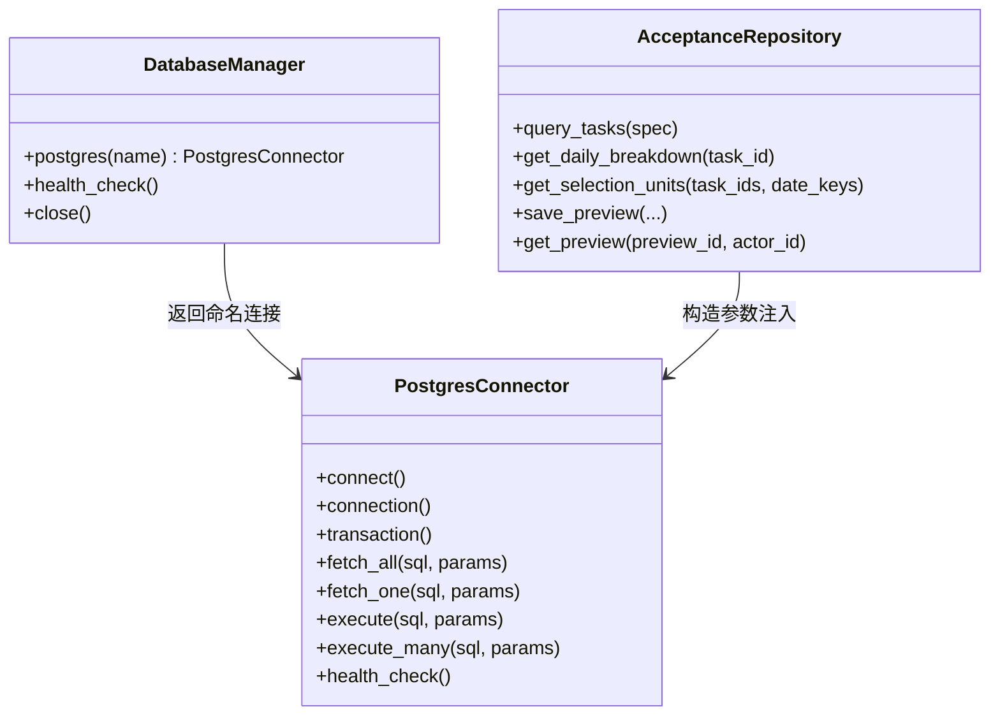
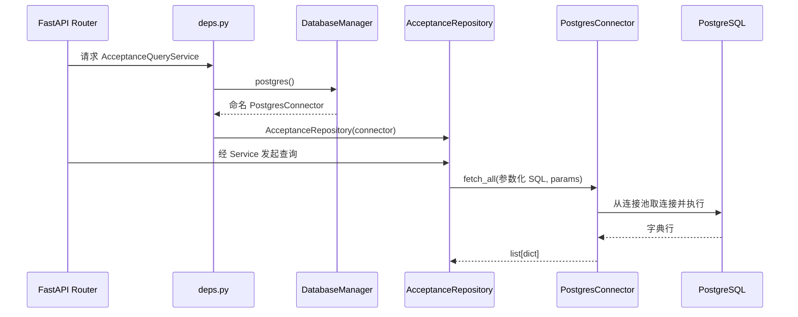

# 数据库访问公共能力

## 先看结论

固定代码把“怎样连接 PostgreSQL”与“人工质检要查询什么”分开了：`src/database/` 管理连接池、事务和通用查询；`AcceptanceRepository` 保存人工质检 SQL 和行映射。这样其他业务可以复用连接能力，但不会被迫理解验收表和字段。

这项结论只适用于固定提交 `3cf3934` 中的本地原型，不证明生产数据库、部署方式或负载表现。

## 当前代码结构

| 代码 | 实际职责 | 不负责什么 |
|---|---|---|
| `src/database/manager.py` | 从配置组装命名连接，提供默认连接，统一关闭 | 不知道验收表或业务查询 |
| `src/database/postgresql.py` | 懒加载连接池、连接归还、事务提交/回滚、参数化执行和健康检查 | 不拼接领域 SQL，不映射业务对象 |
| `src/api/deps.py` | 取得共享连接并组装 Repository、Service | 不执行业务流程 |
| `src/manual_qc/repository.py` | 编写人工质检查询、过滤、聚合和预览读写 | 不创建连接池，不决定采样配额 |

## 一次验收查询怎样使用它

连接池第一次实际查询时才创建。读操作从池中借出连接并归还；写操作通过 `transaction()` 在成功时提交、异常时回滚。当前 `SimpleConnectionPool` 的使用适不适合未来部署并发，需要真实运行条件后再判断，本页不提前做性能结论。

## 人工质检验收的使用契约

验收模块依赖公共能力提供以下保证：

- 能按配置取得正确的命名 PostgreSQL 连接；
- SQL 参数与 SQL 模板分离；
- 一组写操作可以处于同一事务；
- 连接由公共组件取得、归还和关闭；
- 数据库异常向上抛出，由 API 或任务入口转换成用户可理解的失败。

验收模块自己负责：

- `t_qc_delivery_task`、`t_qc_daily_snapshot`、`t_qc_operation_preview` 等业务表语义；
- 查询条件、聚合口径、行到业务结构的转换；
- 哪些步骤必须放在同一事务，以及失败后业务状态如何解释。

## 当前边界

- 固定代码确实存在上述连接和依赖链；没有证据说明其已经用于生产。
- 原型测试使用 `FakePostgres` 或内存替身，没有连接真实 PostgreSQL。
- 当前迁移没有创建查询依赖的 `t_qc_daily_snapshot`，因此仅凭该迁移不能从空库运行完整查询。
- 连接池规模、并发模型、监控和故障演练不属于本轮基础学习内容；有真实维测需求时再单独分析。

# Citations

1. [当前验收原型来源](../sources/current-prototype.md)
2. [ChatGPT 质检项目导出](../sources/chatgpt-quality-project.md)
