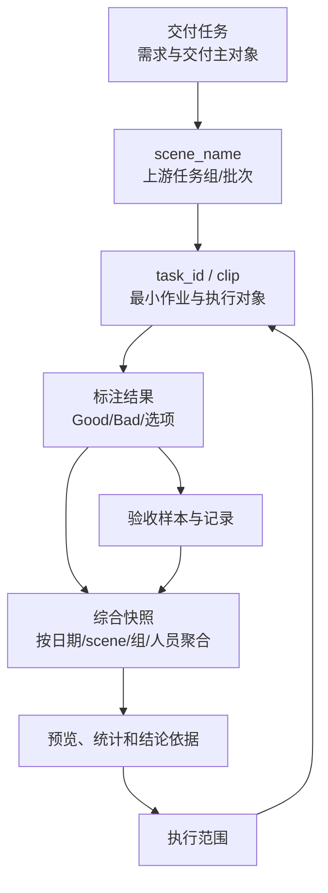
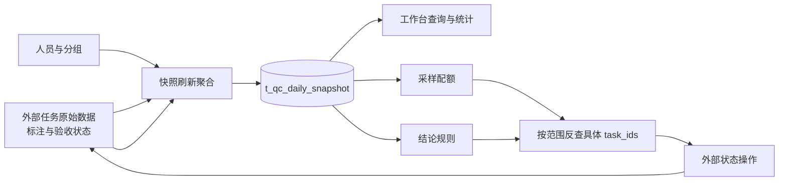

# 人工质检验收数据对象、数据流与状态

## 先看结论

验收数据至少有三层：底层 task/clip 是作业和执行对象，`scene_name` 与日期/人员等维度用于管理和统计，交付任务把多个过程结果汇总回需求。目标设计还引入综合快照作为派生读模型；快照只保存计数和结论，不保存全部 task/clip ID，因此真正执行必须回到原始任务数据重新取得操作对象。

## 核心对象和标识

| 对象 | 作用 | 当前已知边界 |
|---|---|---|
| 交付任务 | 连接需求、目标数量、时间和全流程 | 当前迁移有 `t_qc_delivery_task`；生产模型未知 |
| `scene_name` | 一批上游任务的管理与统计标识 | 不是 clip 名或 task_id；与交付任务当前以 `scene_name` 连接 |
| task/clip | 单条标注、验收或执行对象 | 材料中两词近似，但精确外部模型需平台确认 |
| 综合快照 | 为页面、采样和规则提供聚合计数 | 目标 Schema 版本多；固定迁移未创建该表 |
| 操作预览 | 保存本次选择、参数、结果、来源版本和有效期 | 当前原型已实现，但不保存具体 task_ids |
| 结论与执行结果 | 保存决定依据、确认人和外部结果 | 目标设计存在，固定代码未实现 |

## 目标数据流

目标材料把快照最小统计单元定义为 `(stat_date, scene_name, group_name, employee_id)`，同时冗余 `project_name`。个人行可以向上聚合到组、scene、项目和日期；`group_name` 作为当时人员归属的历史快照，不应因之后调组而回写历史。

这是目标设计，不是当前生产表事实。

## 目标快照中的字段组

| 字段组 | 主要语义 | 关键说明 |
|---|---|---|
| 标注进度 | `annotation_total`、`annotation_submitted`、选项分布 | 待完成数可以运行时相减 |
| 验收分配与完成 | `acceptance_allocated`、`acceptance_completed` | allocated 是成功分配条数，不是人数 |
| Good/Bad 和选项结果 | allocated、completed、passed、conclusion | 固定维度可用列，可变选项可用 JSONB |
| 执行与人工确认 | 执行计数、确认人/时间、执行人/时间和备注 | 刷新统计时不应覆盖人工执行字段 |
| 新鲜度 | `computed_at`、`updated_at` | 页面必须展示数据计算时间 |

## 当前代码与目标模型的差异

固定代码使用 `acceptance_submitted`、`good_passed`、`bad_passed` 等字段查询 `t_qc_daily_snapshot`；较新的目标材料改称 `acceptance_completed`，并增加 `good_completed`、`bad_completed`。固定迁移只创建交付任务、操作预览和视图配置，没有创建快照表。因此：

- 当前代码能够说明查询期望什么字段，不能证明数据库真实存在或字段版本正确；
- `submitted` 与 `completed` 不能在知识中静默合并；
- 目标材料声称已经落地的另一版本，必须取得对应仓库提交后才能升级为当前代码事实。

## 三个统计口径

| 指标 | 推荐表达 | 回答的问题 | 状态 |
|---|---|---|---|
| 分配达成率 | 实际成功分配 / 预期分配 | 分配是否按计划完成 | 推荐解释 |
| 验收完成进度 | 已完成验收 / 已分配验收 | 已分的任务做完多少 | 有人工纠正材料支持 |
| 质量通过率 | 通过 / 已完成验收 | 已判断样本的质量怎样 | 用户确认采用；来源中的另一口径继续记录为历史冲突 |

用户于 2026-07-20 确认未完成样本不提前计入质量失败；分配是否完成由独立进度表达。这个人工决定解决当前知识口径，但不改变原始材料。

## 状态与新鲜度

页面至少要同时说明：数据统计到什么时候、预览何时生成并过期、结论依据何时计算、执行请求何时提交、外部状态何时最后确认。同一任务可以出现“结论 PASS，但执行仍在回查”的组合，不能压成一个状态字段。

# Citations

1. [ChatGPT 质检项目导出](../../../../sources/chatgpt-quality-project.md)
2. [目标验收平台设计](../../../../sources/target-design.md)
3. [当前验收原型](../../../../sources/current-prototype.md)
4. [人工语义决定来源](../../../../sources/human-decisions.md)
