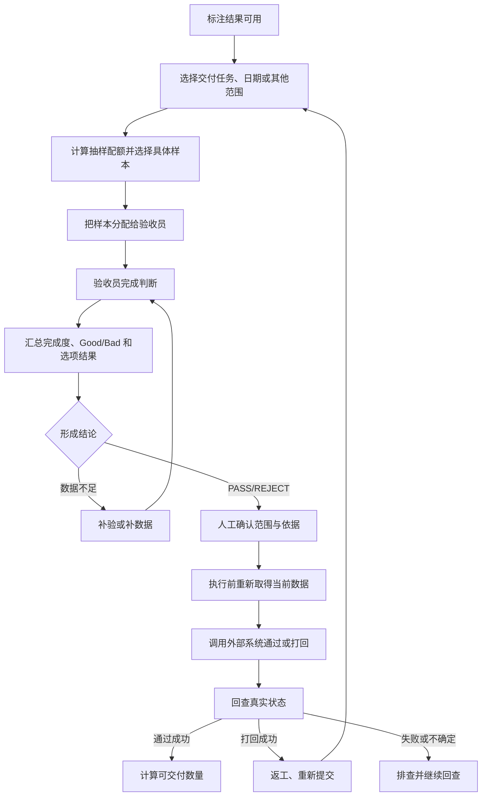

# 人工质检验收生命周期与阶段边界

## 先看结论

整个验收闭环至少要分清三类职责：标注产生结果，验收只判断抽样集并形成依据，执行根据结论作用于决定范围内的标注全集。抽样集、验收结论、执行对象和最终外部状态是四个不同对象，任何一个都不能代替另一个。

## 三阶段边界

| 阶段 | 执行者 | 输入 | 输出 | 明确不做什么 |
|---|---|---|---|---|
| 标注 | 标注员 | 待标注 clip 和规则 | Good、Bad 或选项级标注结果 | 不产生正式验收结论 |
| 验收 | 验收员 | 标注结果的抽样集 | 验收记录、完成度和质量依据 | 不直接对标注全集执行通过/打回 |
| 执行 | 有相应权限的人员与外部系统 | 已确认结论及操作范围 | 标注全集的通过/打回实际状态 | 不能用接口即时返回替代最终回查 |

这里的 clip 是最小作业片段；一批 clip 通常由 `scene_name` 归组。执行范围可以是 Good/Bad 类别、选项、任务、组或个人，但都必须显式说明，不允许从抽样集偷偷推成全集。

## 完整业务流程

## 每一步的输入输出

| 步骤 | 输入 | 可观察输出 | 下一步不能省略的检查 |
|---|---|---|---|
| 选择范围 | 交付任务、日期、scene、组或人员 | 明确的候选总体 | 范围是否仍有可验收数据 |
| 抽样与预览 | 总体计数、策略参数 | 配额、样本或统计单元、缺口和警告 | 预览是否过期、条件是否变化 |
| 正式分配 | 已确认预览、验收人员 | 实际成功、跳过、失败和待回查数量 | 外部状态是否真正改变 |
| 实际验收 | 已分配样本、规则 | 已完成数、通过数、原因和人员进度 | 未完成样本不能提前算成质量失败 |
| 形成结论 | 当前完成度、通过率、规则和范围 | PASS、REJECT 或数据不足 | 结论适用范围和数据时间 |
| 执行 | 已确认结论、全集范围 | 请求结果和操作记录 | 执行前重取数据，执行后回查 |
| 后续闭环 | 外部最终状态 | 可交付判断或返工轮次 | 数量、责任人、再次验收和归档 |

## 三条容易被误解的边界

1. **验收完成不等于交付完成**：通过以后还要看真实执行状态、可交付 Good 数量和归档。
2. **REJECT 不等于流程结束**：任务进入返工，之后重新提交、抽样和验收。
3. **按日统计不等于按日割裂业务**：验收可以按天执行和统计，但仍必须汇总回同一交付任务和当前轮次。

## 历史与当前实现

历史材料曾记录脚本按 `waiting_review` 状态抽样、按看板结果批量通过或打回，并定时刷新状态；这些只能作为历史。固定代码当前只实现范围查询和 Ratio 数量预览，没有真正分配、结论、执行或回查。

# Citations

1. [人工语义决定来源](../../../../sources/human-decisions.md)
2. [历史验收运行快照](../../../../sources/historical-pipeline.md)
3. [目标验收平台设计](../../../../sources/target-design.md)
4. [当前验收原型](../../../../sources/current-prototype.md)
5. [ChatGPT 质检项目导出](../../../../sources/chatgpt-quality-project.md)
