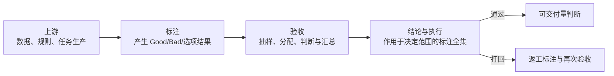
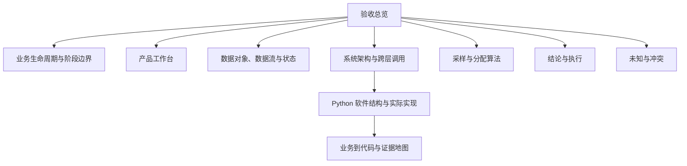

# 人工质检验收领域

## 先看结论

验收接收已经产生的标注结果，从中抽取样本并由验收员判断，形成可以支持整体通过、打回或暂不执行的质量依据。真正改变标注全集状态属于后续执行；接口返回以后还要回查实际状态。验收因此不是一个按钮，而是一段包含分配、作业、监控、分析、结论、执行和返工的闭环。

## 在人工质检中的位置

## 内部知识地图

## 推荐阅读顺序

1. [验收生命周期](lifecycle.md)：先把标注、抽样验收、结论和执行分开。
2. [验收产品工作台](product-workbench.md)：理解实际负责人每天怎样推进任务。
3. [数据对象、数据流与状态](data-flow-and-state.md)：理解数字和状态从哪里来。
4. [系统架构与跨层调用](system-architecture.md)：理解页面、API、Python、数据库和外部系统怎样连接。
5. [Python 软件结构、设计与实现](python-architecture-and-implementation.md)：从一个业务动作跟到实际代码。
6. [采样与分配](sampling-and-assignment.md)与[结论和执行](conclusion-and-execution.md)：下钻算法和保护边界。
7. [实现与证据地图](implementation-map.md)：核对哪些已实现、哪些只是目标或历史。
8. [当前未知与冲突](open-questions.md)：知道下一步需要谁补什么。

## 当前可信范围

| 内容 | 当前可以怎样表述 |
|---|---|
| 阶段边界和执行全集 | 来源中有明确人工纠正记录；仍建议业务负责人最终确认 |
| 完整业务和产品工作台 | 目标设计，可以用于理解应有能力，不能说已经上线 |
| 当前 Python 原型 | 固定提交可证明任务查询、按天展开和 Ratio 数量预览 |
| 真正分配、正式结论、通过/打回、回查和返工 | 固定代码未实现；历史脚本和目标方案不得冒充当前能力 |
| 生产规则、表字段、外部接口和部署 | 当前未知 |

# Citations

1. [人工语义决定来源](../../../../sources/human-decisions.md)
2. [ChatGPT 质检项目导出](../../../../sources/chatgpt-quality-project.md)
3. [当前验收原型](../../../../sources/current-prototype.md)
4. [目标验收平台设计](../../../../sources/target-design.md)
