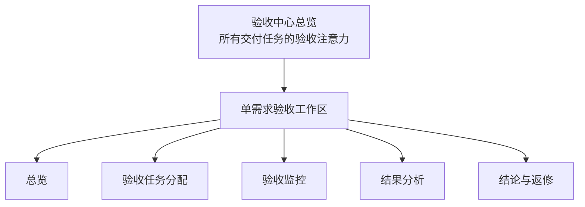
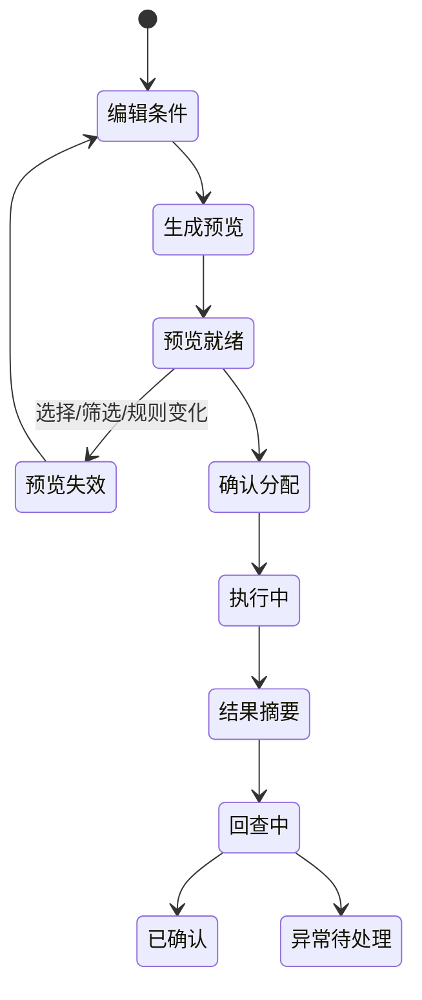
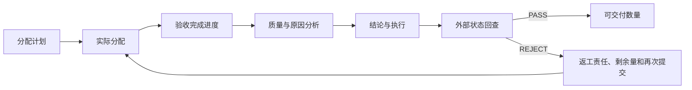

# 人工质检验收产品工作台

## 先看结论

验收中心的目标不是提供一个“运行脚本”表单，而是让负责人从所有交付任务中先找到需要关注的对象，再进入单需求工作区连续完成分配、过程监控、结果分析、结论和返工。用户始终带着交付任务、优先级、交付时间和当前轮次行动。

这是目标产品设计；固定代码没有对应完整前端。

## 两级页面结构

总览默认一行是一条数据集交付任务，而不是一个底层 task。用户需要时再从任务下钻到 scene、组、标注员/验收员和具体 task，避免一进页面就加载全部细节。

## 验收中心总览

总览顶部按注意力展示待分配、验收中、进度风险、待结论、返修中和异常数量。默认排序优先暴露部分失败、已经满足结论条件、临近交付和待分配任务。

三套常用列视图回答不同问题：

| 视图 | 主要字段 | 回答的问题 |
|---|---|---|
| 进度 | 应抽、已分配、已完成、预计完成、剩余时间、当前轮次 | 能否按交付窗口做完？ |
| 质量 | Good/Bad/整体通过率、通过/打回量、原因和结论 | 质量问题集中在哪里？ |
| 效率 | 验收员数、今日完成、人均标效、积压和预计清空 | 人力和速度是否匹配？ |

这些视图共享同一数据和筛选，只改变选择、排序和展示，不复制三套事实。

## 单需求工作区

| 标签 | 用户动作 | 页面输出 | 失败或异常怎样暴露 |
|---|---|---|---|
| 总览 | 查看任务当前验收状态 | 应抽、实际分配、完成、质量、结论、风险和下一动作 | 指标点击下钻到对应标签 |
| 验收任务分配 | 选择范围和采样方式，生成预览，确认执行 | Good/Bad 配额、分布、具体数量、缺口和警告 | 条件变化使旧预览失效；执行结果分成功/跳过/失败/待回查 |
| 验收监控 | 查看人员、组、scene 和 task 进度 | 分配差额、完成、处理中、积压、标效和预计完成 | 暴露无进展、速度过低、状态异常和漏分范围 |
| 结果分析 | 切换维度比较质量与原因 | Good/Bad/整体通过率、打回原因、多轮对比 | 小样本量与比例同时展示，避免排名误导 |
| 结论与返修 | 查看依据，确认并执行 PASS/REJECT，跟踪返修 | 决定、自然语言原因、影响范围、执行与回查状态、返工轮次 | PENDING 不给执行按钮；执行后留在页面持续回查 |

## 分配页面的状态变化

高风险动作必须让用户知道“将对什么做什么”，但基础页面不需要一开始展开通用幂等、重试或可观察性理论。这里只保留与业务正确性直接相关的事实：旧预览不能执行、重复点击应被禁用、请求成功不等于最终成功。

## 监控、分析和返工怎样形成闭环

返工至少要记录操作范围、外部状态、责任人、截止时间、剩余数量、重新提交、再次验收和轮次变化。否则页面只能展示一次性结论，无法支持交付负责人推进闭环。

## 当前边界

- 工作台结构和交互来自目标材料；不能表述为当前前端已上线。
- 固定代码提供的 preview API 只冻结统计单元和数量结果，没有正式 execute。
- 页面所需的效率、原因、多轮和返工字段是否已在生产数据中存在，当前无法证明。

# Citations

1. [ChatGPT 质检项目导出](../../../../sources/chatgpt-quality-project.md)
2. [目标验收平台设计](../../../../sources/target-design.md)
3. [当前验收原型](../../../../sources/current-prototype.md)
