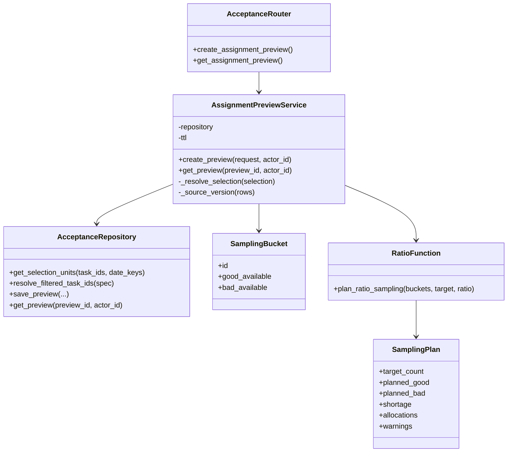
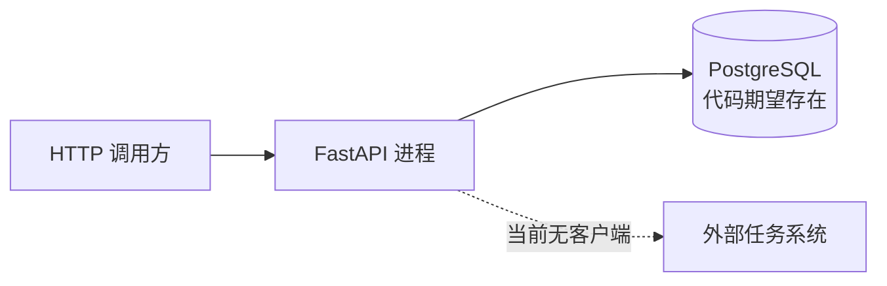

# 人工质检验收 Python 软件结构、设计与实现

## 先看结论

固定代码为“查询任务、按天展开、Ratio 分配预览”建立了一条短而可读的 Python 纵向链路：Router 处理 HTTP，Service 组织用例，纯函数计算配额，Repository 访问 PostgreSQL，公共数据库组件管理连接。这个结构对当前切片是清楚的；但它还没有真正执行分配，也没有证明目标文档中注册表、结论规则、外部客户端和调度任务的设计已经存在。

下面先理解代码，再评价设计。模式名称不是阅读入口。

## +1｜业务场景：生成一次分配预览

用户已经在验收队列选择一个任务或若干日期，希望知道：当前最多能抽多少、Good/Bad 各抽多少、每个日期桶分多少、数据是否不足。系统生成 30 分钟有效的预览，但不会真正改变任务状态。

```text
选择范围和 Ratio 参数
→ 解析任务/日期
→ 查询可用量
→ 计算配额
→ 组装预览
→ 保存预览
→ 返回用户
```

## 逻辑视图｜核心对象怎样协作



`SamplingBucket` 和 `SamplingPlan` 是冻结 dataclass，服务把 Repository 字典行转成算法所需的最小输入。算法不知道 FastAPI、SQL、用户或预览表，因此可以直接用普通 Python 数据验证。

## 开发/代码视图｜包与文件层级

```text
src/
├── api/
│   ├── deps.py                              组装连接、Repository 与 Service
│   └── schemas/acceptance.py                HTTP 请求与响应
├── database/
│   ├── manager.py                           命名数据库连接
│   └── postgresql.py                        连接池、事务和查询助手
└── manual_qc/
    ├── repository.py                        人工质检 SQL 与预览持久化
    └── acceptance/
        ├── router.py                        HTTP 路由
        ├── sampler.py                       纯 Ratio 配额算法
        └── services/
            ├── query_service.py             只读查询编排
            └── assignment_preview_service.py 选择解析、计算与保存预览
```

依赖方向基本是 `Router → Service → 算法/Repository → 数据库公共能力`。当前 Service 还直接 import API Schema，这是后文会说明的实际耦合点。

## 进程/运行视图｜一次调用具体经过什么

| 顺序 | 真实代码入口 | 输入如何变化 | 输出或副作用 |
|---|---|---|---|
| 1 | `router.create_assignment_preview` | HTTP JSON 先成为 `AssignmentPreviewRequest`；请求头得到 `employee_id` | 调用 Service，非法选择转为 422 |
| 2 | `AssignmentPreviewService._resolve_selection` | 显式 ID 解析成 task_ids/date_keys；筛选全选转为最多 5000 个 task IDs | 无数据库写入 |
| 3 | `AcceptanceRepository.get_selection_units` | 业务范围转成参数化 SQL | 读交付任务和快照，返回可用量字典行 |
| 4 | `SamplingBucket(...)` | 字典行收缩为 ID、Good 可用量、Bad 可用量 | 算法输入不含 SQL 或用户对象 |
| 5 | `plan_ratio_sampling` | 计算总目标、类别补足和每桶配额 | 返回不可变 `SamplingPlan` |
| 6 | `AssignmentPreviewResponse(...)` | 将计划与原行的任务、日期、scene 信息合并 | 生成 preview_id、来源版本和过期时间 |
| 7 | `AcceptanceRepository.save_preview` | Pydantic 对象转成 JSON payload | 写入 `t_qc_operation_preview` |
| 8 | Router | Service 返回对象 | FastAPI 包装成统一响应 |

## 物理/部署视图｜当前能证明到哪里



代码可以证明进程内调用结构，不能证明它已经部署，也不能证明空数据库执行迁移后即可工作：查询依赖的 `t_qc_daily_snapshot` 不在当前迁移中。

## 数据怎样跨边界转换


这种转换让算法只得到需要的计数，也让数据库行不会直接泄漏给前端。代价是 `AssignmentPreviewService` 同时负责选择解析、算法输入转换、响应组装和预览保存；当前规模尚可理解，未来职责是否拆分应由真实扩展压力决定。

## 设计是否清楚、自然

### 当前做得比较好的地方

- Router 很薄：读取请求、注入 Service、映射错误和响应，没有 SQL 或配额公式。
- Ratio 算法是无 I/O 的普通函数，输入输出明确、同样输入结果稳定。
- Repository 集中参数化 SQL；公共连接组件不理解业务表。
- 依赖在 `deps.py` 组装，测试可以把 Repository 或数据库替换成小型替身。
- 当前只实现 Ratio，没有为了目标文档中的所有未来策略先搭一套复杂框架。

### 当前真实限制

- `AssignmentRuleSpec.strategy` 被限制为 `ratio`，Service 也直接调用 `plan_ratio_sampling`；目标文档中的采样注册表和多策略并未实现。
- Service 直接依赖 API Pydantic Schema。若未来同一用例还由 DAG、CLI 或其他接口调用，HTTP 结构变化可能波及应用服务；目前还没有足够消费者证明必须抽象。
- `AcceptanceRepository` 同时承担队列查询、统计单元查询和预览持久化。当前文件仍可读，继续加入快照刷新、人员、执行和外部状态 SQL 后可能需要按真实职责拆分。
- 当前预览只冻结数量和统计单元，不冻结具体 task_ids，因此不能直接支撑目标所说的“看到什么就执行什么”。
- 测试证明纯 Python 和模拟数据路径，不证明真实 PostgreSQL、外部系统或完整用户旅程。

## 用一个修改场景检验结构

如果现在新增 `Personal` 采样，真实代码至少要修改：

1. 在 `sampler.py` 增加算法输入/输出或新函数；
2. 扩展 `AssignmentRuleSpec.strategy` 及其参数；
3. 在 `AssignmentPreviewService` 根据策略分支调用；
4. 补充人员/组所需查询字段；
5. 增加算法和 Service 的真实输入输出测试；
6. 更新 `/metadata` 返回的能力。

这说明当前结构能容纳一次有限扩展，但并不是“新增策略零修改”。只有多种策略真的出现后，注册表或统一接口才可能减少重复；不能因为目标文档写了 `SAMPLER_REGISTRY` 就宣称当前已具备开闭性。

## 按需专题

性能、通用幂等、重试、可测试性和可观察性不在本页基础路线中展开。若未来遇到大规模查询、并发执行、维测或专项验证需求，应基于真实负载与故障路径另建分析；本页只保留会直接改变业务结果的预览过期、执行对象和状态回查边界。

# Citations

1. [当前验收原型](../../../../sources/current-prototype.md)
2. [目标验收平台设计](../../../../sources/target-design.md)
3. [数据库访问公共能力](../../../../capabilities/database-access.md)
