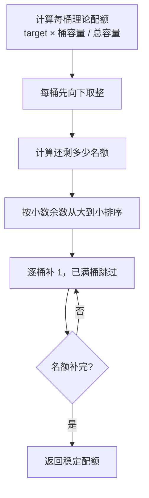

# 人工质检验收采样、选择与分配

## 先看结论

采样包含两个不同问题：先根据统计决定“各范围抽多少”，再从原始任务中决定“具体抽哪些 task”。固定代码只实现 Ratio 的数量计算和预览，没有真正选择并分配 task。Group 和 Personal 来自历史规则及目标设计，不能当作当前代码能力。

## 三种策略解决什么问题

| 策略 | 业务目的 | 已知规则 | 证据状态 |
|---|---|---|---|
| Group | 以组为单位保证覆盖并控制组总抽检量 | 历史记录为 `min(组员数×90, 300)`，Good/Bad 初始各半，再按 scene 分配 | 历史与目标；当前代码未实现 |
| Personal | 每个标注员独立抽检，支持个人质量观察 | 历史记录每人 90，Good/Bad 各 45，一侧不足由另一侧补 | 历史与目标；当前代码未实现 |
| Ratio | 用户指定最终数量和 Good 比例，处理临时业务范围 | 按容量比例分桶、类别互补和总量缺口 | 固定代码已实现数量预览 |

90、300 和 50% 都是旧材料中的数值，当前是否沿用仍需业务决定。

## 当前 Ratio 算法

### 输入与输出

| 项目 | 内容 |
|---|---|
| 输入 | 多个统计桶的 ID、Good/Bad 可用量，可选目标总数，Good 目标比例 |
| 输出 | 最终目标、Good/Bad 计划数、总量缺口、每桶配额和警告 |
| 保证 | 不超过总可用量、不超过任一桶容量、相同输入得到相同结果 |
| 不负责 | 查询数据库、选择具体 task、选择验收员或调用外部系统 |

### 总量和类别配额

1. 汇总全部桶的 Good、Bad 和总可用量。
2. 最终目标为“请求目标或总可用量”与总可用量的较小值。
3. 请求超过可用量的部分记录为 `shortage`。
4. 期望 Good 数为 `round(target × good_ratio)`；固定代码使用 Python `round`，恰好 `.5` 时采用向偶数舍入。
5. Good 先取期望值与 Good 可用量的较小值，Bad 再填剩余目标。
6. 仍有缺口时，先由额外 Good、再由额外 Bad 补足，且始终不超过可用量。
7. 类别不足和总量不足生成用户可见 warning。

### 每个类别怎样分到多个桶

小数余数相同时按桶 ID 排序，所以结果可重复；任何桶都不会超过自身 Good 或 Bad 容量。

### 一个类别不足的例子

目标 20，Good 比例 50%，理论上 Good/Bad 各 10。如果全部桶只有 5 个 Bad、40 个 Good，最终会计划 Bad 5、Good 15，并产生“Bad 可用量不足，已由 Good 补足”的警告；总量仍达到 20。

## 选择范围与当前预览

当前 Service 支持：

- 纯数字任务 ID；
- `<任务ID>-date-<YYYY-MM-DD>` 的日期桶 ID；
- 携带 `filter_snapshot` 的筛选全选，最多解析 5000 个任务；
- 排除特定行或任务。

Repository 计算 `annotation_submitted - acceptance_allocated` 作为总可用量；Good 可用量取选项中的 GOOD 减已分配 Good，并受总可用量限制；Bad 是剩余量。这个口径属于固定代码期待的快照版本，真实生产字段仍未知。

预览保存选择、请求、结果、创建人、来源版本和 30 分钟过期时间。它不保存具体 task_ids，因此当前“预览”只能回答数量规划，不能直接成为正式分配执行凭证。

## 从配额到真正分配还缺什么

目标方案还需要：

1. 按日期、scene、人员和 Good/Bad 类别查询仍处于合法状态的具体 task_ids；
2. 确认标注员与验收员的供应商隔离、人员有效性和分组情况；
3. 在预览时固定具体任务，不在执行时重新随机选择；
4. 用户确认后调用外部系统；
5. 区分即时成功、跳过、失败和后续回查确认的实际成功量。

固定代码没有这些能力。

## 边界和失败行为

- 空选择、无法识别的 ID 和当前不支持的叶子维度会被拒绝。
- 目标总数不能小于 1，Good 比例必须在 0 到 1 之间。
- 数据不足不应静默减少目标，必须显示缺口和类别补足。
- Group 的奇数余量、具体 task 排序和当前业务常量都尚未确认。

# Citations

1. [当前验收原型](../../../../sources/current-prototype.md)
2. [历史验收运行快照](../../../../sources/historical-pipeline.md)
3. [目标验收平台设计](../../../../sources/target-design.md)
4. [ChatGPT 质检项目导出](../../../../sources/chatgpt-quality-project.md)
