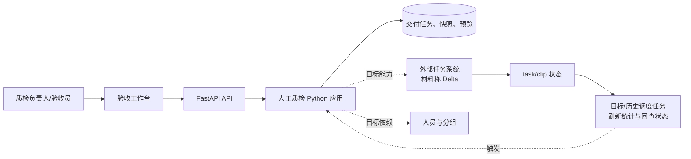
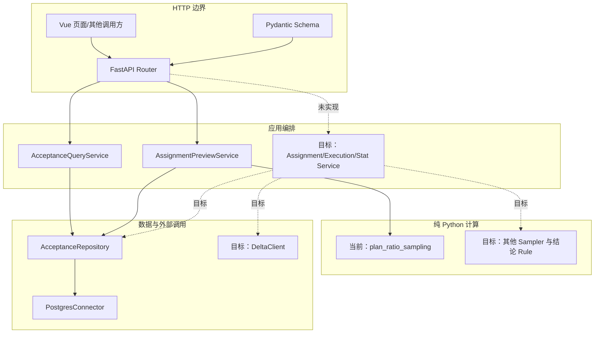
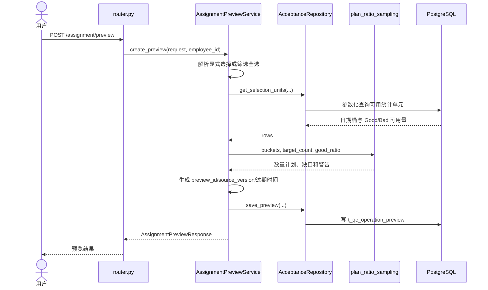
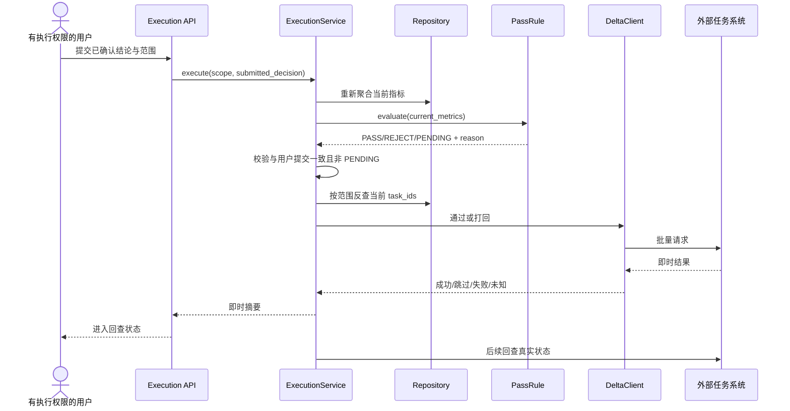
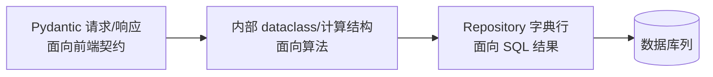

# 人工质检验收系统架构与跨层调用

## 先看结论

验收系统目标上由五个边界协作：工作台表达用户任务，API 校验请求并提供稳定契约，Service 串起完整用例，纯 Python 规则完成配额或结论计算，Repository 和外部客户端分别访问本地数据与外部任务状态。固定代码只实现了其中“查询与 Ratio 数量预览”的局部纵向链路。

## 系统上下文

数据库与外部任务系统不能混成同一个数据源：数据库提供本平台读模型、预览和管理状态；task/clip 的最终状态属于外部系统，真正执行后必须在那里确认。目标材料使用调度任务周期刷新快照和回查状态，固定代码提交中没有这些 DAG。

## 跨层组件和责任

图中实线是固定提交中可以定位的当前代码，虚线是材料中的目标设计。

## 当前已实现：分配预览时序

这条链路只冻结选择描述、请求、统计单元和数量结果；没有冻结具体 task_ids，也没有 execute 端点。

## 目标链路：结论执行与回查

这是目标设计，不是当前代码。生产接口、状态值和调用顺序仍需实时系统确认。

## 三种数据结构为什么要转换

当前代码已经存在这种分工，但并未完全隔离：`AssignmentPreviewService` 直接依赖 `src.api.schemas.acceptance` 中的 Pydantic 类型。它对当前小切片很直接，却意味着应用服务与 HTTP Schema 一起变化；未来是否拆出内部结构，应由真实变化证明，而不是先建一套抽象。

## 当前与目标的边界

| 能力 | 固定代码 | 目标材料 |
|---|---|---|
| 工作台 | 无完整验收前端证据 | 总览与单需求五标签工作区 |
| 查询、按天展开 | 已实现 | 继续扩展到组、人员和 scene |
| Ratio 数量预览 | 已实现 | 预览应含具体 task_ids 和更多约束 |
| 真正分配 | 未实现 | Service + Repository + DeltaClient |
| 结论规则 | 未实现 | 纯规则输出 PASS/REJECT/PENDING |
| 通过/打回与回查 | 未实现 | 执行前重算、即时结果、最终回查 |
| 快照刷新与调度 | 未实现 | 目标材料描述周期刷新和状态驱动任务；历史材料也记录过定时脚本 |

# Citations

1. [当前验收原型](../../../../sources/current-prototype.md)
2. [目标验收平台设计](../../../../sources/target-design.md)
3. [ChatGPT 质检项目导出](../../../../sources/chatgpt-quality-project.md)
4. [数据库访问公共能力](../../../../capabilities/database-access.md)
