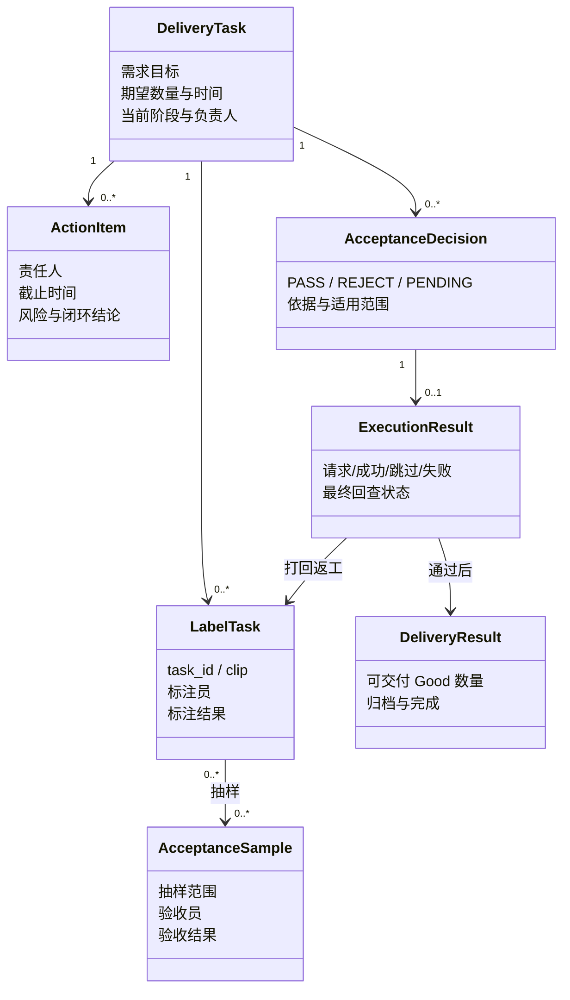
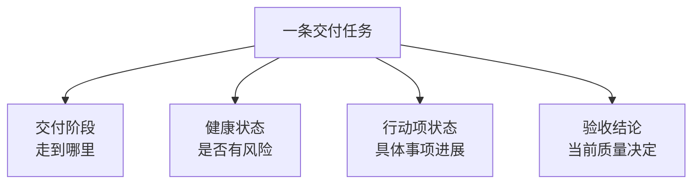

# 人工质检核心对象与状态

## 先看结论

人工质检应围绕“交付任务”管理，而不是围绕某一次脚本或某张中间表。交付任务承载需求目标和全生命周期；标注任务、验收样本、结论和执行结果都是它在不同阶段产生的对象。状态也不能只有一个：阶段、健康、行动项和验收结论回答的是四个不同问题。

## 核心对象关系

## 对象分别回答什么

| 对象 | 回答的问题 | 关键边界 |
|---|---|---|
| 交付任务 | 这个需求是否能按数量和时间交付？ | 生命周期跨越全部阶段 |
| 行动项 | 谁在什么时候解决哪一个非标准问题？ | 可绑定阶段，也可跨阶段 |
| 标注 task/clip | 哪一条内容由谁产生了什么标注？ | 是作业最小单元，不是管理全局的主对象 |
| `scene_name` | 一批上游任务怎样归组并统计？ | 高于单个 task/clip；与交付任务的精确映射仍需确认 |
| 验收样本/记录 | 抽到了哪些标注结果，验收员怎样判断？ | 只覆盖样本，不代表执行全集 |
| 验收结论 | 依据规则和完成度，本次范围应通过、打回还是暂不执行？ | 结论不是外部状态 |
| 执行结果 | 通过/打回请求真正影响了哪些标注结果？ | 即时返回与最终回查分开 |
| 交付结果 | 最终可交付量是否满足需求？ | 通过不自动等于数量足够或归档完成 |

## 四类状态必须分开

| 状态维度 | 示例 | 典型组合 |
|---|---|---|
| 交付阶段 | 数据准备、标注中、验收中、返工、可交付 | “返工阶段” |
| 健康状态 | 正常、风险、阻塞、逾期 | “返工阶段且交付逾期风险” |
| 行动项状态 | 待处理、进行中、已阻塞、已闭环 | “培训问题由张三处理中” |
| 验收结论 | PENDING、PASS、REJECT | “本轮 REJECT，但外部执行仍在回查” |

把它们合成一个 `status` 会丢失信息。例如“PASS”不能告诉用户任务是否已经执行、交付量是否足够，`验收中`也不能告诉用户是否已出现严重低通过率。

## 计划值和实际值也要分开

需求数量、数据到达、阶段截止、验收分配和交付时间都可能先有计划、后有实际结果。后一次编辑不能覆盖原计划，否则无法判断偏差和风险。目标产品至少要保存计划值、实际值、更新时间和责任人；具体 Schema 尚未冻结。

# Citations

1. [ChatGPT 质检项目导出](../../../sources/chatgpt-quality-project.md)
2. [人工语义决定来源](../../../sources/human-decisions.md)
