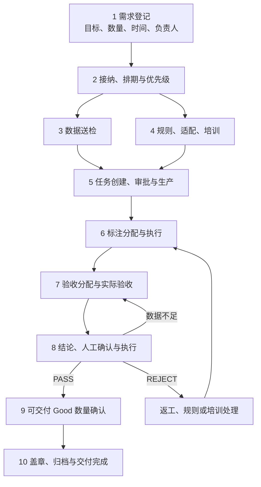

# 人工质检端到端生命周期

## 先看结论

人工质检以“一条交付任务”持续跟踪需求，不以创建标注 task、标注完成或验收员做完样本为结束。真正完成还要确认通过/打回已经落地、可交付 Good 数量满足需求、关键规则和适配版本已经归档。

## 生命周期与循环

## 每个阶段交接什么

| 阶段 | 主要输入 | 可交接结果 | 常见未闭环问题 |
|---|---|---|---|
| 需求登记与接纳 | 需求范围、期望数量和时间 | 已接纳任务、负责人、排期、优先级 | 目标模糊、排期未定、责任人缺失 |
| 数据与规则准备 | 预计/实际数据、规则版本、适配和培训 | 数据已到、规则和作业界面可用 | 实际到数偏差、新规则争议、适配未完成 |
| 任务创建与生产 | 已准备数据和规则 | 可供标注的任务 | 审批、视频/文本任务生产或配置阻塞 |
| 标注 | 待标注任务和规则 | 已提交标注结果、进度和质量分布 | 标效偏低、Good/Bad 异常、培训偏差 |
| 验收 | 标注结果总体和抽样规则 | 样本验收记录、完成度和通过率 | 漏分、未完成、口径异常、低通过率 |
| 结论与执行 | 验收依据、规则、操作范围 | PASS/REJECT/暂不执行及外部实际状态 | 结论过期、部分失败、请求结果未回查 |
| 交付或返工 | 最终外部状态和通过数据 | 可交付数量、归档完成，或下一轮返工 | 数量不足、返工未跟踪、版本未归档 |

## 为什么它不是严格直线

- 数据准备和规则对齐可以并行。
- 沿用规则的任务可直接进入“规则就绪”；新规则可能经过多轮试标、培训和再对齐。
- 同一任务可一边接收新增数据、一边标注已到数据。
- 验收按日期或范围分批推进，前几天的结果可能先通过，后续范围仍在验收。
- REJECT 会进入返工，再回到标注和验收；“本轮验收结束”不等于“交付任务结束”。

## 什么才算完成

至少同时满足：

1. 本轮通过/打回已经执行，并由真实状态回查确认；
2. 通过结果中的 Good 数量能够形成最终交付量；
3. 最终可交付量已经与需求期望数量对照；
4. 使用的规则、视频/文本适配版本和关键质检记录已归档；
5. 返工、风险和行动项不存在未闭环事项。

正式留存率公式、交付预测算法和当前生产审批责任仍未知，不能由本页补写。

## 下钻

- 验收内部怎样运行：[验收生命周期](acceptance/lifecycle.md)
- 整条链路靠什么对象跟踪：[核心对象与状态](core-objects-and-status.md)
- 各工作台怎样分工：[平台与模块地图](platform-and-module-map.md)

# Citations

1. [ChatGPT 质检项目导出](../../../sources/chatgpt-quality-project.md)
2. [人工语义决定来源](../../../sources/human-decisions.md)
