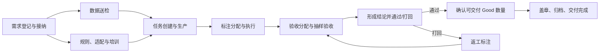
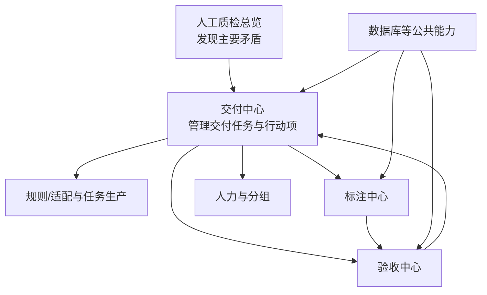

# 人工质检领域

## 先看结论

人工质检不是“把任务发给标注员做选择题”这一小段，而是一条以交付任务为中心的业务链：需求进入后要完成数据、规则、适配和任务生产准备，再进行标注、验收、通过或打回，最终确认可交付数量并归档。验收位于标注之后、真正执行和交付判断之前；打回会让链路回到返工和再次验收。

## 端到端全貌

数据准备与规则对齐可以并行；新增规则还可能经过培训、试标和再对齐。完整说明见[人工质检端到端生命周期](end-to-end-lifecycle.md)。

## 谁在链路中做什么

| 角色 | 主要责任 | 与验收的关系 |
|---|---|---|
| 需求方/数据专题负责人 | 提出需求，说明目标、数量、时间和业务语义 | 消费质量和可交付结论 |
| 质检负责人 | 接纳、排期、规则对齐、风险跟踪和最终交付推进 | 确保验收有输入、问题闭环且结果可交付 |
| 标注员 | 按规则产生 Good、Bad 或选项级结果 | 提供验收抽样总体，承担打回后的返工 |
| 验收员 | 对抽取样本作出验收判断 | 产生验收记录和形成结论所需依据 |
| 有执行权限的人员 | 确认范围并真正执行通过或打回 | 不能把样本判断直接当作执行成功 |
| 平台与数据组件 | 记录任务、统计状态、提供工作台和外部调用 | 让过程可追踪、可核验 |

真实组织中的责任人和审批关系仍需业务负责人确认；本表只表达材料中的职责边界。

## 平台模块全貌

- [平台与模块地图](platform-and-module-map.md)解释各模块的输入、输出和边界。
- [核心对象与状态](core-objects-and-status.md)解释交付任务、行动项、标注任务、验收样本和四类状态。
- [人工质检验收](acceptance/overview.md)是本轮纵向深入的子域。

## 当前能证明到哪里

业务和产品全貌主要来自目标信息架构与人工整理材料。固定代码只实现验收领域的局部查询和按比例分配预览，不能据此声称交付中心、标注中心、人力中心或完整验收平台已经上线。

# Citations

1. [ChatGPT 质检项目导出](../../../sources/chatgpt-quality-project.md)
2. [目标验收平台设计](../../../sources/target-design.md)
3. [当前验收原型](../../../sources/current-prototype.md)
