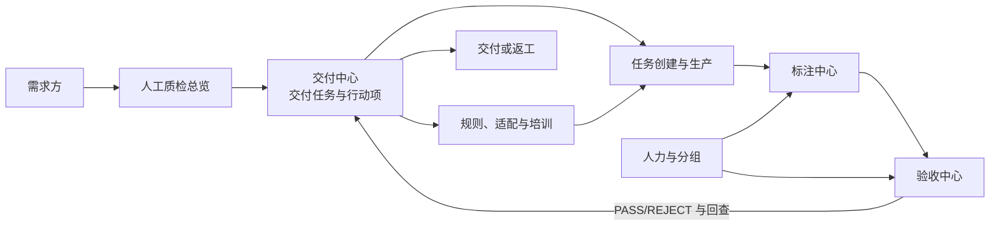
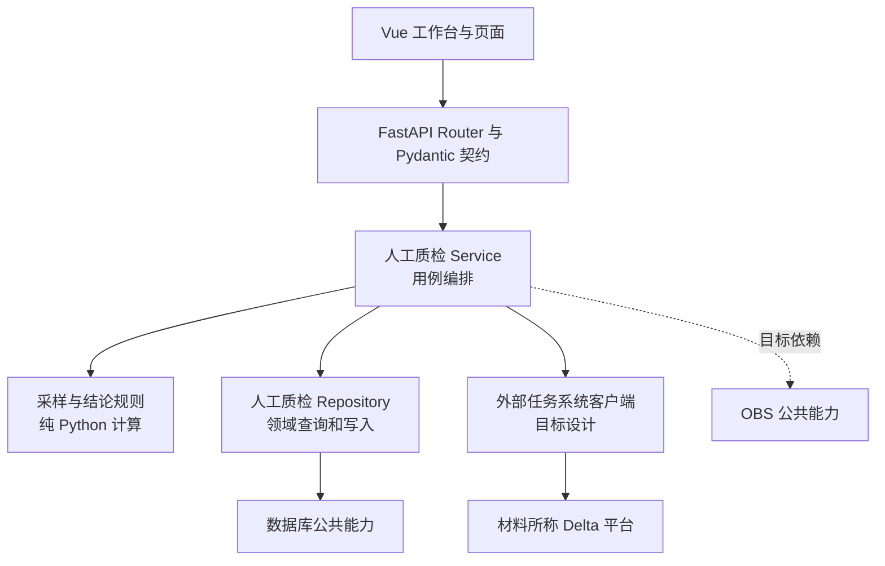

# 人工质检平台与模块地图

## 先看结论

人工质检平台的目标不是把散落脚本各做成一个按钮，而是让同一条交付任务在多个专业工作台之间保持上下文。总览负责发现矛盾，交付中心维护主线，标注和验收中心完成专业作业，人力、规则/适配和任务生产提供必要输入。

这是目标产品和软件边界，不是当前完整实现清单。

## 模块协作图

## 模块责任、输入和输出

| 模块 | 主要输入 | 主要输出 | 不应承担的责任 |
|---|---|---|---|
| 人工质检总览 | 全部活跃交付任务的浓缩状态 | 近期风险、阶段分布和下钻入口 | 不编辑高风险业务状态，不替代专业工作台 |
| 交付中心 | 需求目标、阶段进展、计划/实际时间、行动项 | 统一交付上下文、风险和下一动作 | 不执行具体标注或验收算法 |
| 规则/适配与培训 | 场景要求、已有规范、争议和作业界面需求 | 可执行规则版本、适配版本、培训就绪状态 | 不把未确认讨论直接变成生产规则 |
| 任务创建与生产 | 已就绪数据、规则和配置 | 可供标注的任务及生产进度 | 不把创建成功等同于质检完成 |
| 标注中心 | 待标注任务、规则、人员 | 标注结果、进度、标效和问题反馈 | 不形成正式验收结论 |
| 验收中心 | 标注结果、抽样规则、人员和统计 | 抽样验收、质量依据、结论、执行与返工状态 | 不把抽样集误当执行全集 |
| 人力与分组 | 人员、项目、供应商、角色和组 | 可用人员、分组和历史变更 | 不拥有交付任务或质量规则 |

## 顶层软件结构

顶层图只解释责任方向：页面表达用户任务，API 提供边界，Service 串起用例，规则负责计算，Repository 负责业务数据，公共能力管理技术连接。验收层的具体 Python 结构见[验收 Python 软件结构与实现](acceptance/python-architecture-and-implementation.md)。

## 当前实现状态

| 范围 | 当前证据判断 |
|---|---|
| 总览、交付、标注、人力工作台 | 有目标信息架构；固定代码不能证明已实现 |
| 验收任务查询与按天展开 | 固定代码已实现 |
| Ratio 分配预览 | 固定代码已实现数量预览 |
| 真正分配、过程监控、结论、执行和返工 | 目标设计存在；固定代码未实现 |
| 数据库连接公共能力 | 固定代码已实现 |
| OBS 客户端 | 目标设计存在；固定代码只有占位目录 |

# Citations

1. [ChatGPT 质检项目导出](../../../sources/chatgpt-quality-project.md)
2. [目标验收平台设计](../../../sources/target-design.md)
3. [当前验收原型](../../../sources/current-prototype.md)
4. [数据库访问公共能力](../../../capabilities/database-access.md)
5. [对象存储公共能力](../../../capabilities/object-storage.md)
