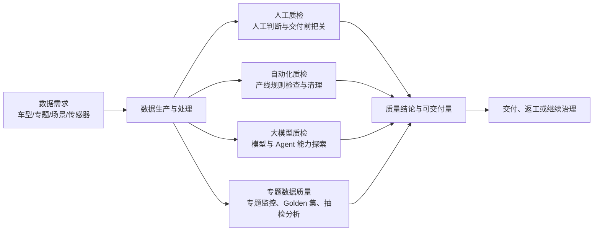

# 质检领域

## 先看结论

质检不是单一平台动作，而是围绕数据或业务结果回答三个问题：质量是否达标、问题在哪里、结果能否进入下一环节。现有材料把团队工作分为人工质检、自动化质检、大模型质检和专题数据质量四块；同一数据需求可能同时消费多种结果，但它们承担的责任和成熟度不同。

本次只对人工质检继续下钻。这里的四块业务来自当前项目材料，不冒充通用行业分类法。

## 数据需求与四类质检怎样连接

图中的共同终点是“可消费的质量结果”，不是说四种方式都直接管理交付。材料特别区分：

- 城区、高速、园区和仿真等专题中，人工质检可能处在交付前最后一环，可交付 Good 数量直接影响交付；
- 感知更多体现为抽检防护，不能描述成团队直接管理全部交付；
- 自动化质检跟随数据产线运行，主要产出覆盖、拦截、清理和异常结果；
- 大模型质检在材料中仍偏 POC 和 Benchmark 演进，不应伪装成稳定交付产线。

## 四块业务各自回答什么

| 方式 | 主要对象与动作 | 典型结果 | 本轮深度 |
|---|---|---|---|
| [人工质检](manual/overview.md) | 人对视频、文本或标注结果进行判断、验收和反馈 | Good/Bad、验收结论、返工或可交付数量 | 讲清全貌，并深入验收 |
| 自动化质检 | 规则随产线检查、拦截或清理数据 | 覆盖率、异常类型、拦截/清理量 | 只说明位置 |
| 大模型质检 | 基模型或 Agent 对质量任务进行判断和评测 | Benchmark、能力成熟度、实验结果 | 只说明位置 |
| 专题数据质量 | 围绕特定专题维护 Golden 集、抽检和趋势 | 专题 Good 比例、抽检覆盖、质量提升 | 只说明位置 |

## 一条需求为什么会经过多种方式

不同方式看到的问题不同。自动化规则适合稳定、可编码的异常；人工判断适合复杂语义和定制规则；大模型质检探索规模化语义判断；专题数据质量从更长周期观察质量趋势。它们可以在同一需求上协作，但最终回答必须保留来源和适用范围，不能把不同口径的结果平均成一个模糊“质量分”。

## 本次知识边界

- 已覆盖：人工质检的位置、人工质检全链路和人工质检验收纵深。
- 未覆盖：自动化规则引擎、大模型质检内部实现、专题数据质量完整指标体系。
- 未知：四种方式在当前生产中的精确责任矩阵、权威指标和实时数据入口。

# Citations

1. [ChatGPT 质检项目导出](../../sources/chatgpt-quality-project.md)
2. [目标验收平台设计](../../sources/target-design.md)
