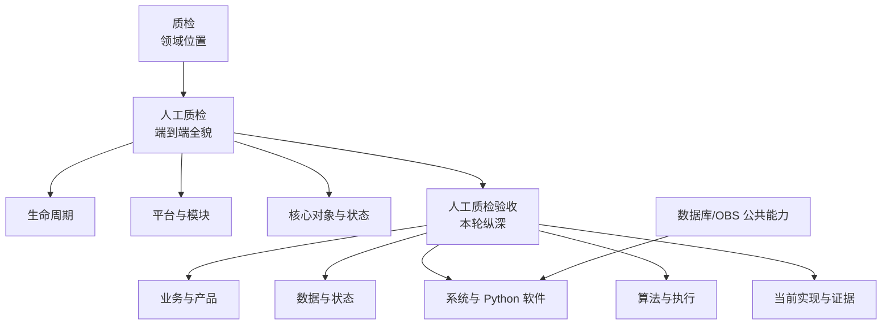

# 人工质检验收知识入口

这套知识让零背景读者先看清人工质检在质检领域的位置，再理解人工质检全链路，最后深入验收的业务、产品、数据、软件、算法和当前代码。当前内容同时保留历史记录、目标设计、固定代码和生产未知，不把它们混成一份“现状”。

## 第一次来，推荐这样读

1. [质检领域位置](views/by-domain/quality.md)：从四类质检方式定位人工质检。
2. [人工质检全貌](domains/quality/manual/overview.md)：看需求到交付、角色和平台模块。
3. [验收学习旅程](views/by-journey/manual-qc-acceptance.md)：按业务顺序进入验收细节。

## 当前知识版图

## 按你要解决的问题进入

| 你的目标 | 最短入口 | 下一步下钻 |
|---|---|---|
| 想从零学习整个业务 | [领域位置视图](views/by-domain/quality.md) | [人工质检全貌](domains/quality/manual/overview.md) → [验收总览](domains/quality/manual/acceptance/overview.md) |
| 想推进一条验收任务 | [验收产品工作台](domains/quality/manual/acceptance/product-workbench.md) | [验收生命周期](domains/quality/manual/acceptance/lifecycle.md) → [结论与执行](domains/quality/manual/acceptance/conclusion-and-execution.md) |
| 想理解数字和状态 | [数据对象、数据流与状态](domains/quality/manual/acceptance/data-flow-and-state.md) | [核心对象与状态](domains/quality/manual/core-objects-and-status.md) |
| 想学习软件和代码 | [系统架构](domains/quality/manual/acceptance/system-architecture.md) | [Python 软件结构与实现](domains/quality/manual/acceptance/python-architecture-and-implementation.md) → [实现地图](domains/quality/manual/acceptance/implementation-map.md) |
| 想核对采样算法 | [采样与分配](domains/quality/manual/acceptance/sampling-and-assignment.md) | [当前原型](systems/manual-qc-acceptance-prototype.md) |
| 想知道哪些不能回答 | [当前未知与冲突](domains/quality/manual/acceptance/open-questions.md) | [来源记录](sources/index.md) |

## 领域结构

- [质检](domains/quality/overview.md)
  - [人工质检](domains/quality/manual/overview.md)
    - [端到端生命周期](domains/quality/manual/end-to-end-lifecycle.md)
    - [平台与模块地图](domains/quality/manual/platform-and-module-map.md)
    - [核心对象与状态](domains/quality/manual/core-objects-and-status.md)
    - [人工质检验收](domains/quality/manual/acceptance/overview.md)

## 验收纵深主题

- 业务与产品：[生命周期](domains/quality/manual/acceptance/lifecycle.md)｜[产品工作台](domains/quality/manual/acceptance/product-workbench.md)
- 数据：[数据对象、数据流与状态](domains/quality/manual/acceptance/data-flow-and-state.md)
- 软件：[系统架构](domains/quality/manual/acceptance/system-architecture.md)｜[Python 结构与实现](domains/quality/manual/acceptance/python-architecture-and-implementation.md)
- 算法：[采样与分配](domains/quality/manual/acceptance/sampling-and-assignment.md)｜[结论与执行](domains/quality/manual/acceptance/conclusion-and-execution.md)
- 工程事实：[实现与证据地图](domains/quality/manual/acceptance/implementation-map.md)｜[当前原型](systems/manual-qc-acceptance-prototype.md)
- 可信边界：[未知与冲突](domains/quality/manual/acceptance/open-questions.md)

## 公共能力

- [数据库访问](capabilities/database-access.md)：当前代码中的连接、事务和 Repository 使用契约。
- [对象存储（OBS）](capabilities/object-storage.md)：公共定位已知，具体实现和验收用例仍缺证据。

## 怎样判断信息能不能信

| 信息性质 | 本知识中的用法 | 能否当成当前生产事实 |
|---|---|---|
| 人工纠正记录 | 用于定义抽样、结论和执行的业务边界 | 仍建议业务负责人最终确认 |
| 历史运行快照 | 保留旧脚本、阈值和调用细节 | 不能 |
| 目标设计 | 解释希望建设的业务、产品和软件结构 | 不能 |
| 固定代码提交 | 说明该版本实际存在的 Python 行为 | 只能证明该提交，不证明上线 |
| 开放问题 | 显式说明还需要什么证据 | 不得猜测 |

## 常用名词

| 名词 | 白话解释 |
|---|---|
| clip / task | 一条具体的标注或验收作业；外部系统精确模型仍需确认 |
| `scene_name` | 一批上游任务的任务组/场景标识，高于单条 task |
| Ratio | 当前原型中的按目标总量和 Good 比例计算配额的算法 |
| PASS / REJECT / PENDING | 通过 / 打回 / 数据不足暂不执行 |
| preview / execute | 先展示将发生什么 / 确认后真正改变状态 |
| Delta | 材料对外部任务状态系统的称呼；当前生产接口未知 |
| GT | 材料提到的后续数据链路名称，本轮不扩写其含义 |

## 其他目录

- [全部领域](domains/index.md)
- [公共能力](capabilities/index.md)
- [系统与实现](systems/index.md)
- [来源与证据](sources/index.md)
- [全部浏览视图](views/index.md)
