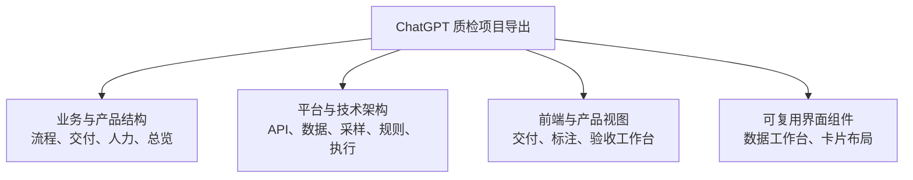

# ChatGPT 质检项目导出

## 来源状态

- **原项目**：[ChatGPT 质检项目](https://chatgpt.com/g/g-p-6a574e9160d88191b9fc129cb47cbb1a/project)
- **本地原料**：仓库中的 `knowledge/raw/quality_check/`。
- **取得方式**：用户于 2026-07-19 人工下载并放入项目；不是 Codex 从项目链接推断或转写。
- **规模**：25 个 UTF-8 文件，共 6,954 行、447,012 字节。
- **实际格式**：文件后缀都是 `.txt`，正文是 Markdown；原始文件不改名、不覆盖。
- **资料集指纹**：`7add0cb2ffb9ca100c657fbcc418bf17ea36a8695f1e5f10775d504c1f3955d9`。校验方法和完整导航见仓库级 `knowledge/raw/index.md`。

## 这批材料包含什么

这些文件是已经整理过的知识材料，不是原始系统日志或固定代码快照。它们混合了人工纠正、历史脚本事实、目标设计、实施进度声明、待决问题和模型综合，因此不能按文件头的 `status: active` 整体当成当前生产事实。

## M1 实际吸收了什么

围绕人工质检验收，本轮使用了以下新增信息：

- 标注、验收和执行是三个职责不同的阶段；执行作用于决定范围内的完整标注结果，不限于抽样集。
- 交付任务从需求登记持续到交付完成，打回会进入返工和再次验收，不是一次性结束。
- 验收产品工作台需要同时覆盖总览、分配、过程监控、结果分析、结论执行和返工跟踪。
- 交付阶段、健康状态、行动项状态和验收结论应分开表达，不能塞进一个模糊的“状态”。
- 预览和执行要分离；执行前重新检查状态；即时请求结果与最终回查结果要分开。
- 新增了采样、结论规则、API、快照和 Repository 的更详细目标设计，但这些设计不自动成为当前实现。

这些内容分别进入[人工质检全貌](../domains/quality/manual/overview.md)、[验收生命周期](../domains/quality/manual/acceptance/lifecycle.md)、[产品工作台](../domains/quality/manual/acceptance/product-workbench.md)、[采样与分配](../domains/quality/manual/acceptance/sampling-and-assignment.md)、[结论与执行](../domains/quality/manual/acceptance/conclusion-and-execution.md)和[软件结构](../domains/quality/manual/acceptance/python-architecture-and-implementation.md)。

## 重复与冲突

### 字节级重复

`质检平台-Delta调用与状态回查设计.txt` 与旧 NotebookLM 导出中的对应文件 SHA-256 完全相同。本轮只把它当作同一语义来源，不用重复副本提高可信度。

### 口径冲突

`人工质检-标注验收执行三阶段流程.txt` 明确质量通过率分母应为已完成验收数；`人工质检总览信息架构.txt` 的部分文案以已分配数为分母。参考成果没有静默合并：用户于 2026-07-20 决定将 `完成数 / 分配数` 表示验收完成进度，将 `通过数 / 完成数` 表示质量通过率；两份原料的差异继续保留为来源冲突。

### 实施状态冲突

部分材料声称 2026-07-09/14 的快照迁移、人员 Repository 和 141 项测试已经落地；固定代码来源 `/home/yyh/project/ai-knowledge-base` 提交 `3cf3934` 中不存在对应路径。当前实现范围继续以固定提交为准，材料中的说法只记录为可能来自另一代码版本的实施历史。

## 能证明与不能证明

这批文件能证明“下载材料怎样描述业务、设计和实施状态”，也能为后续质检、平台设计和开发任务提供高价值线索。它不能单独证明：

- 当前生产接口、状态值、数据库字段和阈值；
- 材料声称的代码是否位于另一个未提供的提交；
- 目标方案已经部署或在真实数据上工作；
- 文件头所称的 `active` 等于今天仍然有效。

后续任务无需重复下载或全量阅读。先从仓库级 `knowledge/raw/index.md` 定位相关文件，再结合当前代码、实时系统或人工决定定向核验。
