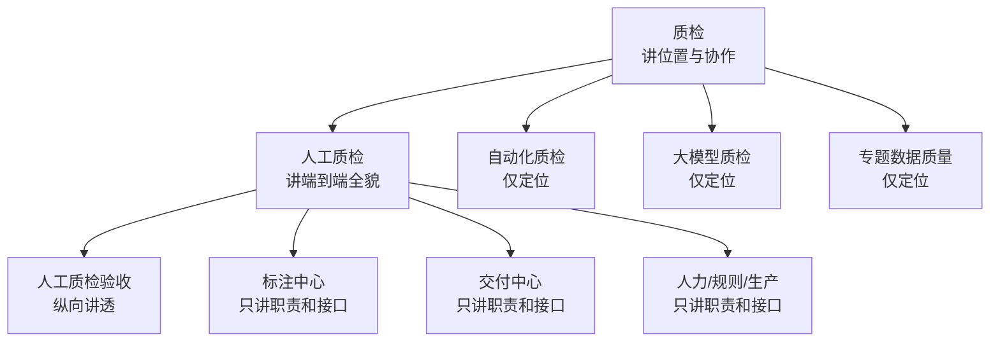

# 质检领域位置与人工质检全貌

## 先看结论

本次知识位于“质检 → 人工质检 → 人工质检验收”。质检层解释四类方式怎样协作，人工质检层解释需求到交付和模块全貌，验收层才深入业务、数据、软件、算法与当前代码。

## 领域与覆盖深度

| 层级 | 读完应该能回答 | 入口 |
|---|---|---|
| 质检 | 人工、自动化、大模型和专题数据质量分别做什么？ | [质检领域](../../domains/quality/overview.md) |
| 人工质检 | 从需求接纳到交付经过什么，平台有哪些模块？ | [人工质检全貌](../../domains/quality/manual/overview.md) |
| 人工质检验收 | 抽样、分配、验收、结论、执行和返工怎样运行和实现？ | [验收总览](../../domains/quality/manual/acceptance/overview.md) |

## 人工质检层的三个结构入口

- [端到端生命周期](../../domains/quality/manual/end-to-end-lifecycle.md)：按阶段理解业务。
- [平台与模块地图](../../domains/quality/manual/platform-and-module-map.md)：按工作台和软件责任理解系统。
- [核心对象与状态](../../domains/quality/manual/core-objects-and-status.md)：按交付任务、行动项和状态理解管理模型。

## 验收层的五条下钻路线

- 业务人员：[生命周期](../../domains/quality/manual/acceptance/lifecycle.md) → [产品工作台](../../domains/quality/manual/acceptance/product-workbench.md)
- 数据人员：[数据对象、数据流与状态](../../domains/quality/manual/acceptance/data-flow-and-state.md)
- 软件人员：[系统架构](../../domains/quality/manual/acceptance/system-architecture.md) → [Python 软件结构与实现](../../domains/quality/manual/acceptance/python-architecture-and-implementation.md)
- 算法人员：[采样与分配](../../domains/quality/manual/acceptance/sampling-and-assignment.md) → [结论与执行](../../domains/quality/manual/acceptance/conclusion-and-execution.md)
- 核验现状：[实现地图](../../domains/quality/manual/acceptance/implementation-map.md) → [当前原型](../../systems/manual-qc-acceptance-prototype.md) → [未知与冲突](../../domains/quality/manual/acceptance/open-questions.md)

## 跨模块公共能力

- [数据库访问](../../capabilities/database-access.md)：连接和事务由公共能力维护，人工质检只维护业务查询与表语义。
- [对象存储（OBS）](../../capabilities/object-storage.md)：公共定位已识别，固定代码尚无客户端实现证据。

# Citations

1. [质检领域](../../domains/quality/overview.md)
2. [人工质检领域](../../domains/quality/manual/overview.md)
3. [人工质检验收](../../domains/quality/manual/acceptance/overview.md)
