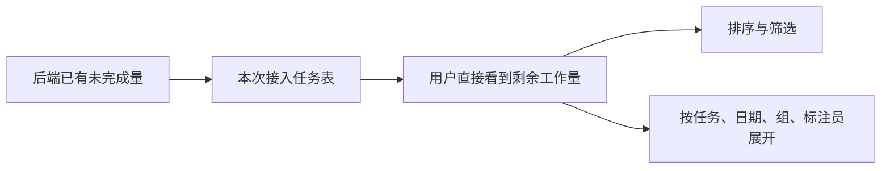
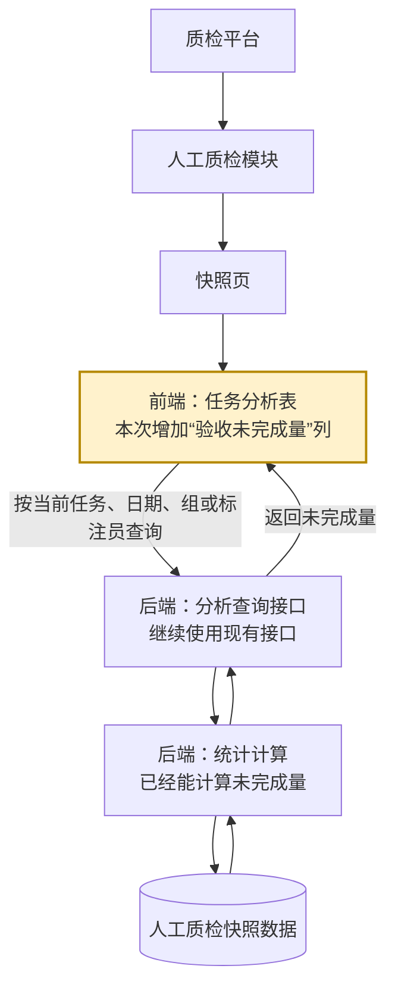
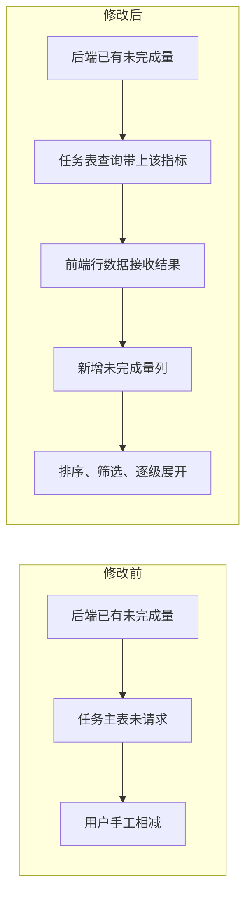
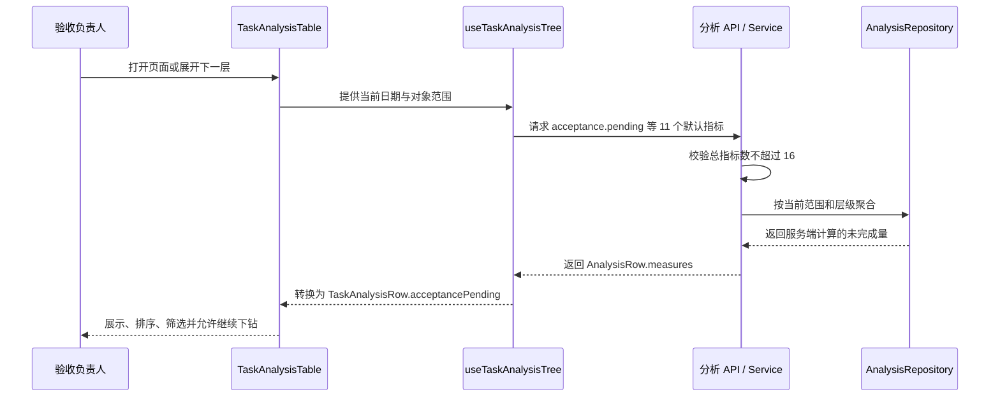

# “验收未完成量”开发工作审查单

> **审查单版本：** v0.3 第二版候选（已处理首次 D1 反馈）
> **审查对象：** `quality-platform-lab` 参考实现 `26db0e1`
> **当前状态：** 等待人工审查；没有合并产品，也没有发布正式知识
> **任务性质：** 独立 Harness 开发用例，不代表原始“人工质检多维统计与详情”诉求

## 怎样使用这张审查单

**审查顺序：** 先确认任务是否成立，再依次审方案、实现和验证。前一阶段不成立时，后续内容只保留为事实，不需要继续批准。

**反馈方式：** 直接回复稳定编号即可，例如“R2：共享上限不应该直接调整，需要说明其他消费者影响”。不需要编辑本文件。

## 内容导航

1. [完整工作全貌](#1-完整工作全貌)
2. [需求审查](#2-需求审查)
3. [方案审查](#3-方案审查)
4. [修改内容与软件实现审查](#4-修改内容与软件实现审查)
5. [运行演示与验证审查](#5-运行演示与验证审查)
6. [总体决定](#6-总体决定)
7. [审查单体验反馈](#7-审查单体验反馈)

## 1. 完整工作全貌

### 1.1 背景与任务来源

**业务背景：** 人工质检快照页已经可以按任务、日期、组、标注员查看验收进度，但任务主表没有直接显示剩余未验收量。验收负责人需要用“实际验收分配量 − 验收完成量”逐行计算。

**任务来源：** 本任务由 Harness 实验设计者整理成独立开发用例，交给模型完成。它用于验证“最低充分知识查询 → 真实开发 → 真实运行 → 知识变化交接”，不是用户原始多维分析需求的子任务，也没有获得生产上线批准。

**任务目标：** 在既有任务分析表中增加“验收未完成量”，继续支持排序、数值筛选、已保存列设置以及任务 → 日期 → 组 → 标注员四级下钻。

### 1.2 采用的方案

后端已经能算出“验收未完成量”，缺的是前端任务表没有把它展示出来。本次把这个已有结果接到任务表中，并让新列沿用表格原有的排序、筛选、列设置和逐级展开能力。



### 1.3 完成的功能与结果

| 方面 | 完成结果 |
|---|---|
| 用户功能 | 任务表新增“验收未完成量”，可排序、数值筛选并沿四级对象查看 |
| 业务计算 | 继续由后端既有 `acceptance.pending` 负责，前端没有复制公式 |
| 兼容性 | 旧版已保存列顺序中没有新列时，新列仍会出现 |
| 查询组合 | 11 个默认指标 + 5 个固定问题选项返回 HTTP 200；第 17 项受控返回 HTTP 422 |
| 真实结果 | 固定全周期四级值为 `1737 → 144 → 51 → 20` |
| 回归 | Python 18 项、Vue 30 项、类型检查和生产构建通过 |

### 1.4 当前边界

- **未获业务批准：** 这是已完成的参考候选，不代表用户已批准该功能进入产品。
- **不解释风险：** 未完成量只表示剩余工作量，不代表风险等级，不触发催办、责任人或告警。
- **只证明实验环境：** 证据来自固定本地 PostgreSQL、FastAPI、Vue 和 Edge，不能外推为生产系统已上线。
- **正式知识未发布：** 只形成知识变化候选，正式质检知识保持不变。

## 2. 需求审查

### 2.1 原始问题

模型收到的核心问题如下。完整任务及开发、环境和验证约束见[固定任务原文](../../../fixtures/real_work/manual_qc_pending_visibility_composite_v1/prompt.md)。

> 人工质检快照页的任务分析表已经显示“实际验收分配量”和“验收完成量”，但验收负责人仍要手工相减，才能知道每个任务还有多少工作没有验收完成。请让表格直接展示“验收未完成量”，并在任务 → 日期 → 组 → 标注员的既有下钻中保持一致。

### 2.2 这项需求要做成什么

**要解决的问题：** 验收负责人现在必须逐行做减法，才能判断还有多少任务没有验收完成，查看和定位剩余工作量都不够直接。

**希望达到的使用效果：** 打开任务分析表就能看到每一行的验收未完成量；需要定位时，可以按数值排序、筛选，并从任务继续展开到日期、组和标注员。

**需要增加的功能：**

1. 在现有任务分析表增加“验收未完成量”列；
2. 新列支持表格原有的排序、数字范围筛选和列设置；
3. 从任务展开到日期、组、标注员时，各层都显示当前范围内的未完成量；
4. 新列加入后，用户原来可固定的 5 个问题选项列仍然可用，旧列设置也不能把新列意外隐藏。

**做到什么算完成：** 固定日期范围内，数据库结果、接口结果和页面四级结果一致；排序、筛选和逐级展开可实际操作；项目原有测试、类型检查和构建不受影响。

**本次不扩展的内容：** 不定义风险阈值，不增加责任人、催办和告警，也不把该独立用例解释成完整的多维统计与任意指标下钻能力。

### R1：任务与需求是否成立

**审查目的：** 确认上面的“问题、使用效果、功能和完成标准”是否准确说明了这项独立开发任务。

**当前待审内容：** 给任务表增加可排序、筛选和逐级展开的未完成量，不扩张成完整多维分析需求。

**请你决定：** 认可该任务作为独立开发用例；要求修订任务边界；或认为它不值得作为正向审查样板。

**处理结果：** 若不认可，后续方案、实现和验证不再需要批准，本样板改为新的负向用例；若认可，继续 R2。

**你的反馈：**

> 审查状态：待审
> 意见：

## 3. 方案审查

### 3.1 功能位于系统的哪里

本次修改位于**质检平台**的**人工质检模块**，用户入口是**快照页中的任务分析表**。页面属于前端；未完成量来自后端已有的统计查询，最终数据来自人工质检快照表。



图中黄色节点是用户直接看到、也是本次主要修改的前端模块；后端查询和统计计算已经存在，本次只做必要的查询容量调整。

### 3.2 总体方案

**原来的情况：** 后端已经能算未完成量，详情区域也会使用这个数据，但任务主表没有请求和展示它，所以验收负责人仍要手工计算。

**改造后的情况：** 任务表查询时一并请求未完成量，前端把返回值放入每一行，再增加对应的数量列。用户查看或展开任一层级时，都沿同一条查询链取得该层级的结果。



### 3.3 模块变更方案

| 所在位置 | 原来的情况 | 本次修改 | 修改后的作用 |
|---|---|---|---|
| 后端统计计算 | 已经计算未完成量 | 不改公式 | 继续提供唯一的业务计算结果 |
| 后端分析查询 | 最多接收 15 个指标 | 上限调到 16 | 11 个默认指标和 5 个固定问题选项可以同时查询 |
| 前端任务表查询 | 没有请求未完成量 | 加入该指标 | 任务和各级展开都能收到结果 |
| 前端行数据 | 没有未完成量字段 | 增加明确字段并接收接口值 | 表格可以稳定读取，不在页面临时计算 |
| 前端任务分析表 | 没有未完成量列 | 增加数量列 | 用户可以查看、排序、筛选并随层级展开 |

### R2：方案是否合理

**审查目的：** 确认本次功能在系统中的位置、前后端通路和每个模块要改什么都已经讲清楚。

**当前待审内容：** 后端保留已有计算，只调整查询容量；前端在现有任务表查询、行数据和表格列三个位置接入未完成量。

**请你决定：** 认可该模块变更方案；指出哪一层设计不合理；或说明还缺少哪段系统关系才能判断。

**处理结果：** 方案变化会重新检查受影响模块、测试和运行证据；若方案不成立，不批准现有实现。

**你的反馈：**

> 审查状态：等待 R1 通过
> 意见：

## 4. 修改内容与软件实现审查

### 4.1 版本与查看入口

| 项目 | 固定身份 |
|---|---|
| 修改前 | `quality-platform-lab@35948aebf41b8772b77df18bd68ce9ff2d295344` |
| 修改后 | `reference/manual-qc-pending-visibility-v1@26db0e1c98657cd120430cec0b92964c888cacd5` |
| 正式知识输入 | `omni-brain-harness-quality-check-v1@900cf85`，本任务未修改 |

查看完整代码差异：

```bash
git -C /home/yyh/project/quality-platform-lab diff \
  35948aebf41b8772b77df18bd68ce9ff2d295344..26db0e1c98657cd120430cec0b92964c888cacd5
```

### 4.2 按模块说明修改

| 层次 | 文件 | 修改及作用 |
|---|---|---|
| 查询契约 | `src/manual_qc/analysis/models.py` | `MAX_ANALYSIS_MEASURES` 从 15 调为 16；Schema 和 Service 已共同引用该常量 |
| 前端查询 | `.../composables/useTaskAnalysisTree.ts` | 默认指标加入 `acceptance.pending`；所有下钻级别复用同一数组 |
| 前端类型 | `.../types/analysis.ts` | `TaskAnalysisRow` 增加明确的 `acceptancePending: number` |
| 数据转换 | `.../utils.ts` | 在统一转换边界读取 `acceptance.pending` |
| 页面组件 | `.../components/TaskAnalysisTable.vue` | 增加数量列，复用 `countCell`、降序优先和数字范围筛选 |
| 回归保护 | Python/Vue 测试 | 保护 16/17 查询边界、转换字段、列存在和旧列顺序兼容 |
| 验证记录 | `docs/acceptance-pending-visibility-verification.md` | 固定运行范围、四级数值、真实交互和回归结果 |

### 4.3 关键实现流程



### 4.4 核心算法与边界

本次没有新增算法。基线 Repository 已持有以下规则：

```text
acceptance.pending = max(acceptance.allocated - acceptance.completed, 0)
```

参考实现只消费这个结果。前端没有重新计算，避免服务端口径变化后两处不一致。查询上限使用同一个服务端常量同时约束 HTTP Schema 和 Service，不存在两个手写数字。

### R3：实现是否符合方案

**审查目的：** 确认实际 Diff 落在方案声明的责任边界，没有隐藏的平行计算、无关重构或兼容性遗漏。

**当前待审内容：** 参考提交中的 10 个文件；其中业务代码只连接已有指标、扩展类型/列和调整共享上限，其余为回归与验证记录。

**请你决定：** 认可；指出需要修改的模块或实现；或要求先补充某段源码、调用关系或影响分析。

**处理结果：** 实现问题只修改受影响模块并重跑对应真实路径；如果暴露方案错误，则退回 R2。

**你的反馈：**

> 审查状态：等待 R2 通过
> 意见：

## 5. 运行演示与验证审查

### 5.1 验证范围

**要证明的结果：** 新列不是静态文字，而是能在固定数据范围中经过 PostgreSQL、API 和真实页面完成展示、排序、筛选、四级下钻及组合上限验证。

**环境范围：** 本地 PostgreSQL 16，3024 条员工日快照，日期为 2026-07-13 至 2026-07-26；FastAPI、Vue 和 Windows Edge 151。未执行 migration、seed、reset 或业务写入。

### 5.2 真实结果

| 验证路径 | 实际观察 | 结论 |
|---|---|---|
| 任务层 | 拥堵跟车任务-08：1737 | 数据库、HTTP、页面一致 |
| 日期层 | 2026-07-16：144 | 当前任务范围内下钻一致 |
| 组层 | 质检组-12：51 | 当前日期范围内下钻一致 |
| 员工层 | E120：20 | 当前组范围内下钻一致 |
| 排序 | 首次点击后目标任务以 1737 位于首行 | 降序行为可用 |
| 数字筛选 | 24 个任务缩为目标任务 1 个 | 范围筛选可用 |
| 最大合法组合 | 11 个默认指标 + 5 个固定选项，HTTP 200 | 既有 5 列能力未被挤掉 |
| 超限 | 第 17 项，HTTP 422 | 契约边界受控 |
| 浏览器状态 | 四级交互期间控制台无错误 | 未观察到页面运行错误 |

### 5.3 回归与证据边界

| 检查 | 结果 |
|---|---|
| Python | 18 项通过 |
| Vue | 30 项通过 |
| `vue-tsc --noEmit` | 通过 |
| 生产构建 | 通过；保留既有大 chunk 警告 |
| `git diff --check` | 通过 |

完整验证记录位于参考提交的 `docs/acceptance-pending-visibility-verification.md`，评测审计见[Trial 审计](../../../trials/real_work/MANUAL_QC_PENDING_VISIBILITY_CODEX_LUNA_HARNESS_001/audit.md)。这些证据只支持固定本地实验切片，不证明生产数据、生产性能或业务上线效果。

### R4：验证是否足以支持当前结论

**审查目的：** 判断证据是否证明了本页声称的本地功能和边界，而不是用测试数量替代用户结果。

**当前待审内容：** 固定范围四级数值、接口 16/17 边界、真实页面排序/筛选/下钻以及全量回归；生产环境没有验证。

**请你决定：** 证据足以认证该实验参考；需要补充某条真实路径；或当前结果不能接受。

**处理结果：** 缺证据时先补运行验证，不通过改报告文字掩盖；若运行结果错误，退回实现或方案阶段。

**你的反馈：**

> 审查状态：等待 R3 通过
> 意见：

## 6. 总体决定

只有 R1—R4 均可接受后，才做总体决定。

| 决定 | 后续处理 |
|---|---|
| 认证为审查正向参考 | 冻结本报告、事实参考和评价方法；不自动合并产品代码 |
| 修改后复审 | 修正对应阶段，更新同一张审查单并重跑受影响验证 |
| 驳回 | 保留为负向或失败案例，说明失败发生在哪一阶段 |

### R5：总体决定

**审查目的：** 对这项开发工作本身作出最终决定。

**请你决定：** 认证为开发参考、修改后复审或驳回。

**处理结果：** 决定开发参考是否成立；不会自动合并产品代码或发布正式知识。

**你的反馈：**

> 审查状态：等待 R1—R4 通过
> 决定与意见：

## 7. 审查单体验反馈

本节评价的是**审查能力和这张报告本身**，不改变 R1—R5 对开发工作的判断。即使开发工作被驳回，报告仍可能因为帮助发现真实问题而有效；反之，开发正确也不代表报告好用。

### D1：这张报告是否帮助你完成审查

**审查目的：** 判断 v0.3 的信息顺序、解释深度和提问方式能否迁移进后续审查 Harness。

**请你反馈：** 哪一处仍缺背景、重点不清、顺序不合理、信息过多，或没有提供作决定所需的内容；也可以明确“当前结构可作为正向样板”。

**处理结果：** 反馈先修订本样板和评价方法；只有跨第二类任务仍成立的做法，才进入共享 Skill 或 AGENTS 路由。

**你的反馈：**

> 结论：首次反馈已处理，等待复审
> 意见摘要：需求部分应先抓主要问题，再按使用效果、功能和完成标准说明；方案部分应先定位产品、业务模块、页面和前后端层级，用图展示原模块及本次修改，删除重复的需求—交付表和形式化“关键取舍”。
