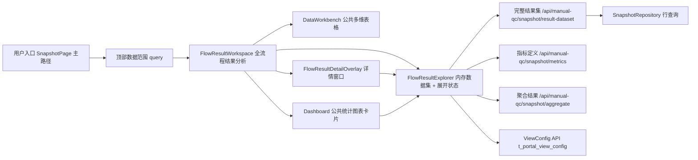

# review.md — 人工质检全流程结果统计与详情展开表

- 任务：为 Quality Platform Lab 实现"人工质检标注验收等流程的结果统计和详情展开表"，
  形成**可复用的多维结果分析能力**（公共多维表格 + 公共统计图表卡片 + 后端统计接口）。
- 审查入口：本文件唯一；R1（需求理解）与 R2（技术方案）是同一条工作链的阶段。
- 审批状态：**R1 已通过；R2 已确认**。

## R1 确认记录

2026-08-15 用户确认 R1 通过，并说明三项原待确认问题不阻塞需求确认，归属 R2 处理：
新能力接入现有页面的方式、已保存配置是否迁移、导出实现细节；具体使用者不改变主要
矛盾与功能范围。

---

## R1 需求理解

**（R1 已确认，内容保留供追溯；不再开放修改。）**

### 本轮修订说明

按人类反馈重写 R1：核心目标改为"可复用的多维结果分析能力"而非分步小切；补充默认
展示（项目+任务，日期/组/标注员聚合）、任意维度展开（整列与单行、分支可不同）、
各列筛选、勾选导出、详情窗口结构（未锁定维度各一张图 + 公共多维表格继续展开）、
图表编辑与联动、同一范围数据只取一次共同复用；合并范围与完成标准为分类表；
收敛待确认问题。

### 1. 要解决什么问题

平台已经有一条可运行的 PostgreSQL → FastAPI → Vue 数据链：快照表
`t_qc_daily_snapshot` 覆盖多天、多任务、多组与轮换标注员的确定性数据；V2 任务汇总
支持沿任务→日期→组→标注员逐级展开、列筛选和点击部分比率列打开详情；业务总览与
多图层统计卡片已可编辑并保存。

当前阻碍有两个：

1. **结果分散**：标注、验收各环节的结果分散在多张卡片和一张固定路径的任务表里，
   缺少一个入口完整看到全流程结果统计，也不能围绕这些结果自由聚合、展开、筛选、
   勾选、导出并下钻详情。
2. **能力没有沉淀**：支撑这些交互的多维表格和统计图表目前以页面内实现为主，没有被
   提炼成可复用的公共能力，每增加一种维度或视图都要重复建设。

本次要解决的核心矛盾：把"人工质检标注→验收的结果统计与详情展开"做成一个统一的、
**可复用的多维结果分析能力**。公共多维表格和公共统计图表卡片是真实产品能力，不是
一次性页面，也不是只完成一小块的实验小切。

### 2. 用户怎样使用

用户打开平台、选定顶部数据范围（日期、项目等）后：

1. 主表默认按**项目 + 任务**显示每一行的标注与验收结果；每个任务唯一属于一个项目，
   所以同时显示项目与任务不会增加行数；**日期、组、标注员默认聚合**。
2. 需要时重新选择哪些维度聚合；**展开不依赖预设顺序**，使用者可以任意选择尚未展开
   的维度；既支持把当前一批同层行按某个维度**整列展开**，也支持只让**某一行按某个
   维度展开**，不同分支可以选择不同维度。
3. 对适合筛选的列做筛选——不只是指标列，其他适合筛选的列同样可筛。
4. 勾选表格行（可混合聚合行与明细行），**导出**勾选结果。
5. 点击任意合法的统计数值列打开**详情窗口**：它是覆盖当前页面的独立窗口；上方针对
   当前行**尚未锁定**的每个维度各放一张图，每张图先只展开一个维度；下方用公共多维
   表格显示明细，并可继续按任意剩余维度展开。
6. 把聚合或展开结果做成**统计图表卡片**，卡片可编辑（坐标轴、图表类型、数据范围、
   维度、大小和布局），点击图表可联动到详情表。
7. 常用视图配置保存，重开页面按最新快照重算并恢复。

### 3. 产品需要哪些能力

| 能力 | 用户怎样用 |
|---|---|
| 全流程结果统计主表 | 一个入口同时看到标注与验收各环节结果；默认按项目+任务展示、日期/组/标注员聚合；可重选聚合维度、任意展开、列筛选、行勾选导出、点数值列开详情 |
| 公共多维表格组件 | 被主表与详情共同使用：多维度聚合与展开、各列筛选、行勾选、任意统计列作详情入口；两处行为一致 |
| 详情窗口 | 覆盖当前页面的独立窗口；上方按"尚未锁定的每个维度各一张图"呈现，下方用公共多维表格显示明细并可继续展开 |
| 公共统计图表卡片 | 对聚合/展开结果生成图卡；可编辑坐标轴、图表类型、数据范围、维度、大小和布局；点击图卡联动详情表 |
| 数据共同复用 | 同一顶部范围的数据只取一次，主表、筛选、聚合、展开、详情、图表与导出共同复用，不重复查询 |
| 视图保存与恢复 | 保存维度、列、筛选、图卡配置；重开按最新快照重算恢复 |

### 4. 数据与业务规则

- **数据与指标范围**：覆盖当前快照表的全部数据，以及从这些数据能够计算且符合业务
  语义的标注、验收统计指标；指标范围由数据决定，不再逐个挑选字段。
- **默认与聚合**：默认按项目+任务显示，日期、组、标注员聚合；聚合维度可重选；展开
  不依赖预设顺序，任意选择尚未展开的维度。
- **展开方式**：支持把当前一批同层行按某个维度整列展开，也支持只对某一行按某个维度
  展开；不同分支可以选择不同维度。
- **筛选**：不只指标列，其他适合筛选的列也有筛选能力；表头筛选默认只影响明细，只有
  显式"应用到全页"才转换可无损表达的条件。
- **勾选与导出**：表格行支持勾选；第一项明确动作是导出勾选结果，不虚构其他批量动作。
- **详情入口**：所有合法的统计数值列都能作为详情入口，不只某个特定指标。
- **业务口径**：验收完成率是当前范围的整体完成率，不按 Good/Bad 拆分；验收通过率
  需要能分别观察整体、Good 和 Bad。
- **复用**：同一顶部范围的数据尽可能只取一次，各区域共同复用，不让各区域重复查询。

### 5. 范围与完成标准

| 类别 | 范围 | 完成标准 |
|---|---|---|
| 全流程结果统计主表 | 标注、验收各环节结果统计；默认项目+任务，日期/组/标注员聚合，可重选维度 | 一个入口看全流程结果，能聚合、展开、筛选、勾选、导出 |
| 公共多维表格 | 聚合与任意维度展开（整列/单行、分支可不同）、各列筛选、行勾选、任意统计列作详情入口；主表与详情共用同一组件 | 同一组件服务主表与详情，行为一致 |
| 详情窗口 | 覆盖当前页面的独立窗口；上方按未锁定维度各一张图，下方公共多维表格继续展开 | 点击任意合法数值列能打开详情并继续下钻 |
| 公共统计图表卡片 | 可编辑坐标轴、图表类型、数据范围、维度、大小和布局；点击图表联动详情表 | 图卡可编辑、可保存，点击可与表格联动 |
| 数据与接口复用 | 同一顶部范围数据只取一次；后端接口/类高内聚、低耦合、可扩展 | 主表/筛选/聚合/展开/详情/图表/导出不重复查询，易扩展新维度 |
| 业务口径 | 验收完成率按整体、验收通过率分整体/Good/Bad；统计指标符合业务语义 | 口径可验证、与规则一致 |
| 保持不变 | 长期看板（业务总览、统计图卡）及已保存配置不破坏；V1 四级 API 保留为回退边界；快照表结构与本地实验边界不变 | 现有功能回归通过 |

### 6. 仍需确认的问题

1. **与现有页面的关系**：新能力是替代现有"任务分析"区成为主路径，还是并行区块？
   已保存的表格/图卡配置是否需要迁移？—— 在 R2 收敛为：新公共多维分析成为快照结果
   分析**主路径**，迁移任务分析有用能力与配置后退出旧固定路径。
2. **导出内容**：导出勾选行还是整表？—— 在 R2 收敛为：导出勾选行 XLSX（多工作表，
   含统计结果、快照明细、问题选项明细与导出说明）。
3. **使用对象**：日常使用者是谁？—— 已确认不影响主要矛盾与功能范围，按普通质检
   分析用户处理。

---

## R2 技术方案

### 系统位置

产品是人工质检只读分析工作台，入口为 `http://127.0.0.1:5173/manual-qc/snapshots`
（`SnapshotPage.vue`）。本次把"全流程结果分析"做成快照结果分析的**主路径**：公共多维
分析工作区承接现有固定任务分析的职责，迁移其有用能力与已保存配置后退出旧固定路径；
长期看板（总览卡、统计图卡）继续复用。前端新增 `features/manual-qc/flow-result/`
领域模块；后端把仍有价值的统计指标与聚合规则并回 `manual_qc/snapshot` 领域，泛化的
`manual_qc/analysis` 仅作迁移期对账并在退出条件达成后删除。

| 节点 | 职责 | 本次改变 | 承载的数据/动作 |
|---|---|---|---|
| 顶部数据范围 `query` | 定义全页快照范围（日期/项目/任务/组/员工） | 不变 | 传入工作区作为取数范围 |
| 完整结果集端点 | 返回范围内完整叶子行；成功即取齐，取不齐整体失败 | **新增** | 顶部范围 → 完整叶子行 + computed_at |
| 指标定义端点 | 返回统计指标与维度定义 | **新增（并入 snapshot）** | 指标/维度/参数/筛选算子 |
| 聚合结果端点 | 按明确范围与维度计算聚合结果 | **新增（并入 snapshot）** | 范围 + 维度 + 指标 → 聚合行 |
| FlowResultExplorer | 持有内存数据集，管理聚合与展开状态 | **新增** | 行树、总数、错误、computed_at |
| 公共多维表格 DataWorkbench | 排序/筛选/展开/勾选/列状态/制图 | **小幅扩展** | 行、列定义；详情入口与导出事件 |
| 详情窗口 | 覆盖页面的独立窗口，多图 + 明细表 | **新增** | 当前行 + 未锁定维度图表 + 继续展开 |
| 公共统计图表卡片 | 可编辑多图层图卡 | **复用 + 新增解析器** | 由同一内存数据集解析；点击联动表格 |
| ViewConfig API | 保存/恢复视图配置 | 不变（用新 page key） | 表格列/维度配置与 flow-result 图卡定义 |

### 总体方案

现状：固定任务分析表沿固定路径（任务→日期→组→标注员）逐级服务端懒加载，每次展开
都是一次分析查询；统计图卡由 `manual_qc/analysis` 接口解析；总览卡已在浏览器聚合
快照行。各区域对同一范围重复查询；泛化的 `analysis` 模块同时承载指标目录、聚合与
结果，缺乏领域边界。

本次改变：

1. **数据与聚合**：顶部范围取齐叶子快照行形成**浏览器端内存数据集**；新增纯函数的
   **客户端聚合引擎**，让"聚合维度重选、任意维度展开（整列/单行、分支不同）、各列
   筛选、行勾选导出、点列开详情、图卡分析"全部复用同一数据集，不再按区域重复请求。
2. **后端领域收敛**：统计指标定义与聚合规则并入 `manual_qc/snapshot`，新 API 按三个
   具体用例分离（完整结果集、统计指标定义、按范围与维度聚合结果）；泛化的
   `manual_qc/analysis` 仅作迁移期对账，对账通过后删除（见"迁移与退出条件"）。
3. **主路径迁移**：公共多维分析工作区成为快照结果分析的主路径，迁移现有固定任务分析
   的有用能力与已保存配置后退出旧固定路径；长期看板继续复用。
4. **导出**：客户端直接消费已取得的数据生成多工作表 XLSX，不新增导出 API，不做异步
   导出。

用户结果：一个入口看到标注→验收全流程结果，自由聚合、展开、筛选、勾选、导出，点任意
数值列打开覆盖详情并继续下钻，聚合/展开结果一键生成可编辑图卡，点击图卡反查表格；
同一顶部范围只取一次数据。

### 模块方案

| 所在位置 | 当前职责与现状 | 本次改变 | 改变后的作用 | 上下游 |
|---|---|---|---|---|
| `SnapshotPage.vue` | 组装总览、图卡、任务分析，管理全页范围 | 任务分析区块由 FlowResultWorkspace 主路径替代 | 页面以全流程结果分析为主路径，长期看板保留 | 接收顶部 `query`，转发给工作区 |
| `flow-result/`（新，前端） | 不存在 | 新增工作区、引擎、表格、详情、图卡解析 | 实现全流程结果分析主路径 | 依赖 snapshot 领域端点；驱动 DataWorkbench/Dashboard |
| `useFlowResultExplorer`（新） | 不存在 | 取数一次、保存内存数据集与展开状态 | 输出只读行树、总数、错误、computed_at | 上游 snapshot 端点；下游工作区与详情 |
| `flowAggregation.ts` / `flowMetrics.ts`（新） | 不存在 | 纯函数聚合引擎，公式镜像并入 snapshot 的指标定义 | 任意分组/展开/指标计算（比率分母为零为 null） | 输入叶子行；输出行树与指标 |
| `FlowResultTable.vue`（新） | 不存在 | 业务列定义 + 详情/导出接线 | 承接任务分析迁移的固定选项列与列配置 | 使用数据集；发出 detail/export/筛选 |
| `FlowResultDetailOverlay.vue`（新） | 不存在 | 覆盖窗口：未锁定维度各一张图 + 明细表 | 对选中行继续展开与统计 | 同一数据集；复用 DataWorkbench |
| `flowChart.ts`（新） | 不存在 | 从数据集+维度生成 ECharts 解析 | 详情窗口图与 flow-result 图卡共用 | 输入数据集、维度、指标 |
| 现有任务分析（`TaskAnalysisWorkspace` / `TaskAnalysisTable` / `useTaskAnalysisTree`） | 固定路径任务表 | 有用能力（固定选项列、表头筛选、列配置持久化）迁移入主路径后**退出** | 旧固定路径不再保留 | 被 flow-result 吸收；旧 page key 退出 |
| `DataWorkbench.vue` | 排序/筛选/展开/勾选/列状态/制图事件 | 增加数值列点击详情与导出事件（向后兼容） | 公共表格同时服务主路径与详情 | 上游行/列；下游业务事件 |
| `WorkbenchToolbar.vue` | 行数、筛选、制图、列管理 | 增加导出按钮（勾选启用时） | 支持勾选行导出 XLSX | 上游选中行；下游导出动作 |
| `Dashboard` 卡片体系 | V2 多图层图卡、编辑器、持久化 | 新增 flow-result 解析器与 page key | 可编辑图卡从同一数据集解析；点击联动表格 | 复用编辑器/网格/持久化，不改内核 |
| 后端 snapshot 领域端点（并入） | 现只有行与四级聚合 | 增加 `metrics` / `result_dataset` / `aggregate` 三用例方法 | 完整结果集、指标定义、聚合结果三职责分离 | 上游范围参数；下游浏览器内存 |
| `SnapshotRepository` | 行与四级聚合 SQL | 并入聚合 SQL，成为唯一 SQL 出口 | 行查询与聚合 SQL 同一 Repository | 被 snapshot Service 复用 |
| `manual_qc/analysis`（现有） | 泛化指标目录/聚合/结果 | 迁移期仅用于对账，退出条件达成后删除 | 不保留平行生产路径 | 对账后移除 Service/Repository/Router/Schema |
| 导出（前端，新） | 无 | 客户端生成多工作表 XLSX | 统计结果、快照明细、问题选项明细、说明页 | 消费已取得数据；无异步任务 |

### 关键流程与数据

- **默认展示与聚合维度**：根级默认展示**项目 + 任务**（任务唯一属于项目，不增行数），
  `date / group / employee` 折叠进行；当前聚合维度是一个**无序集合**，不保存、也不
  要求顺序；顶部可重选当前聚合的维度集合。
- **展开模型**：展开是"对当前整批同层行"或"对某一行"选择一个**尚未锁定维度**的动作，
  不同分支可选不同维度；展开结果由纯函数从内存数据集重新推导，保证子行合计等于父行、
  比率分母一致。
- **筛选**：维度列用文字包含/精确多选，数值与比率列用区间，日期列用区间；表头筛选
  默认只影响当前明细，只有可无损表达的条件（日期、单值维度）可显式"应用到全页"，
  与现有任务表语义一致。
- **勾选与导出**：复用 TanStack 行选择（聚合行勾选含子行）；导出勾选行为 **XLSX**，
  列为当前可见列，聚合行导出其聚合值、明细行导出明细值；默认 XLSX 以规避 Excel 打开
  CSV 的中文乱码。
- **导出工作簿结构**：至少四张工作表——**当前统计结果**、**快照明细**、**变长问题
  选项明细**、**导出说明**。固定 JSON 字段（`good_metrics` / `bad_metrics` /
  `option_metrics` 的 11 个计数键）平铺为指标列，不把大段 JSON 塞进单一单元格；变长
  问题选项按"问题标签 × 问题选项"展开为独立行/列，每个单元格只放一个可直接使用的
  数值；说明页记录筛选范围、更新时间、导出时间与指标口径。无异步导出：数据已在浏览器
  内存中，同步生成 XLSX，不设计导出队列、异步任务或备用导出方式。
- **详情**：点击任意合法统计数值列，以当前行为焦点打开覆盖页面的详情窗口；上方对
  **尚未锁定**的每个维度各放一张图（每张图只展开一个维度，展示所点指标在该维度上的
  分布），下方用同一公共多维表格显示该行的明细并可继续按剩余维度展开。
- **图卡**：flow-result 图卡沿用现有 V2 卡片定义（横轴/坐标轴/图层/数据范围/筛选/
  样式/布局）与 `ChartBuilderDialog` 编辑 UI，但解析器改为从内存数据集计算；点击图卡
  分类联动当前表格（收窄明细或定位到详情），不改变全页范围。
- **数据复用**：同一顶部范围的数据只取一次；聚合、展开、筛选、详情、图卡、导出全部
  在浏览器端对同一数据集计算，只有顶部范围变化才重新取数。
- **业务口径**：验收完成率只按整体显示（`acceptance.completion_rate`）；验收通过率
  以整体、Good、Bad 三列并列（`acceptance.pass_rate` / `good.acceptance.pass_rate` /
  `bad.acceptance.pass_rate`）；分母为零返回 `null` 显示 `—`；问题选项多选占比之和
  可超过 100%，不截断。
- **取数与完整性（由接口保证）**：完整结果集接口对当前顶部范围返回完整叶子行，成功即
  取齐、取不齐整体失败并暴露问题；后端内部做完整性校验（一次取齐，不依赖前端对账），
  响应契约不包含 `complete` / `loaded` 等完成标志。前端在**新范围加载失败时允许保留
  上一份已完整成功的数据并显式报错**——这是保留上次完整结果，不是局部结果或备用数据
  路径。现有代码里的 1000 行分页、10,000 行停止加载只是临时数字，不固化为业务上限；
  真实数据量证明单次返回不可行时再讨论分页或服务端聚合。
- **错误处理**：加载失败（保留上一份完整数据并显式报错）、导出无勾选等状态给出可理解
  提示；不掩盖不完整，不静默丢数据。

### 接口与代码组织

**后端**（体现人工质检快照领域；目录遵循项目领域层级，不退化到脱离 manual-qc 的
`/api/snapshots`。不新增泛化 `analysis` Service，也不造职责重叠的 Repository）：

- `src/manual_qc/snapshot/`（同一模块内按文件职责组织，不再拆目录）：
  - `snapshot_service.py`：`SnapshotQueryService` 增加三个用例方法——`metrics()`
    （统计指标与维度定义）、`result_dataset(filters)`（完整结果集）、
    `aggregate(query)`（按范围与维度计算聚合结果）；校验逻辑由现有 analysis_service
    并入。
  - `repository.py`：现有 `SnapshotRepository` 承接行查询与聚合 SQL（原
    analysis/repository 的聚合 SQL 并入），SQL 单一出口。
  - `catalog.py`（新）：指标与维度定义并入（原 analysis/catalog）。
  - `models.py`：并入 analysis models。
- `src/api/schemas/snapshot.py`：新增 `SnapshotMetricsOut`、`SnapshotResultDatasetOut`
  （`schema_version` / `items` / `computed_at`，行契约复用 `SnapshotRowOut`）、
  `SnapshotAggregateOut`。
- `src/api/routers/snapshot.py`（manual-qc snapshot 路由，前缀 `/api/manual-qc/snapshot`）：
  - `GET /metrics` —— 统计指标定义；
  - `GET /result-dataset` —— 完整结果集（成功即取齐，取不齐整体失败）；
  - `POST /aggregate` —— 按明确范围与维度计算聚合结果；候选值作为该用例的辅助查询
    `POST /aggregate/facets`。
- **导出无 API**：客户端直接消费已取得数据生成 XLSX。
- **迁移与退出条件**：迁移期内 `manual_qc/analysis` 仅用于对账。退出条件（全部达成才
  删除）：① 前端调用方全部切换到 `/api/manual-qc/snapshot/*`；② 客户端聚合引擎与服务端
  聚合在至少 3 个范围对账一致；③ 任务分析能力与配置已迁移、旧固定路径已退出。达成后
  删除 `src/manual_qc/analysis/` 的 Service、Repository、Router、Schema 与
  `/api/manual-qc/analysis` 路由。不把 `analysis` 长期保留为平行生产路径。
- 依赖接线在 `src/api/deps.py` 补齐。

**前端**：

- `features/manual-qc/flow-result/`：`types/flowResult.ts`、`api/snapshotStats.ts`
  （完整结果集、指标定义、聚合结果三个用例分离）、`utils/flowAggregation.ts`、
  `utils/flowMetrics.ts`、`utils/flowChart.ts`、`utils/exportXlsx.ts`、
  `composables/useFlowResultExplorer.ts`、`composables/useFlowResultWorkspace.ts`、
  `components/FlowResultWorkspace.vue`、`components/FlowResultTable.vue`、
  `components/FlowResultDetailOverlay.vue`。
- `utils/exportXlsx.ts`（新）：生成至少四张工作表（统计结果 / 快照明细 / 问题选项明细 /
  导出说明）；**XLSX 库选型先作为候选**（如 SheetJS `xlsx`、`exceljs` 等），用中文文本、
  多工作表、数值单元格类型与代表性数据量比较验证后再定，不预设唯一包。
- `shared/data-workbench`：`DataWorkbench.vue` 增加 `enableCellDetail` 与
  `cellActivate` 事件、`enableExport` 与 `exportSelection` 事件；`WorkbenchToolbar.vue`
  增加导出按钮；`types.ts` 扩展列 meta 与事件类型，全部向后兼容。
- `shared/dashboard`：不改卡片内核；新增 flow-result 解析器（客户端）与
  `manual-qc-flow-result-charts` page key，复用 `useDashboardWorkspace`。
- 视图持久化：新 page key `manual-qc-flow-result-table`（当前聚合维度**无序集合**、列
  状态、固定选项列）与 `manual-qc-flow-result-charts`（图卡定义）；现有任务分析已保存
  配置迁移到新表后，旧 `manual-qc-task-analysis` page key 退出。只保存定义与布局，不
  保存一次性筛选/展开/勾选状态。

### 验证方案

- **真实用户路径（主路径）**：启动数据库/API/前端 → 打开页面 → 默认项目+任务视图 →
  重选聚合维度（无序集合）→ 整列展开与单行展开、分支不同维度 → 各列筛选 → 勾选行导出
  XLSX → 点数值列打开详情并在详情中继续展开 → 生成/编辑 flow-result 图卡并点击联动
  表格 → 保存后重开恢复。每步以可观察结果判断通过。
- **数据正确性**：取至少 3 个范围（默认全量、单项目、单任务+单日期），把客户端聚合
  引擎结果与服务端聚合端点（同 scope、同维度、同指标）对账一致；核对验收完成率=整体、
  验收通过率=整体/Good/Bad 三口径，分母为零为 `—`。
- **完整性验证**：以当前真实范围验证完整结果集接口成功即取齐；构造失败场景验证整体
  失败并暴露原因，且前端保留上一份完整成功数据并显式报错；确认响应无 `complete` /
  `loaded` 标志、无局部结果或备用数据路径，不静默漏数据。对真实数据量记录查询耗时与
  响应体积，作为后续是否需要分页/服务端聚合的讨论证据，不预先固化上限。
- **迁移验证**：任务分析的有用能力（固定选项列、表头筛选、列配置持久化）迁移到主路径
  后旧固定路径退出；`manual_qc/analysis` 对账通过后删除，全量回归确认无残留引用。
- **导出验证**：用 Excel 打开导出文件确认四张工作表（统计结果、快照明细、问题选项
  明细、导出说明）中文正常显示、数值为数值单元格类型、固定 JSON 已平铺、变长问题选项
  可读可筛、说明页含筛选范围/更新时间/导出时间/指标口径；导出无勾选时给出提示；候选
  XLSX 库的比较结论记录在案。
- **回归**：现有 `pytest`（16 项）、前端 Vitest（29 项）、`vue-tsc`、`npm run build`
  全绿；长期看板（总览、图卡）行为不变。

### R2 结论（已确认）

- **主路径**：公共多维分析成为快照结果分析的主路径，不再新增与任务分析并排的永久区块；
  任务分析有用能力与配置迁移后退出旧固定路径，长期看板继续复用。
- **维度语义**：根级默认展示项目+任务；当前聚合维度为**无序集合**，不保存、不要求
  顺序；展开是对整批或某一行选择一个尚未锁定维度的动作，分支可不同。
- **后端领域**：统计指标与聚合规则并回 `manual_qc/snapshot`；API 体现人工质检快照
  领域，完整结果集、指标定义、聚合结果三用例职责分离；泛化 `analysis` 仅迁移期对账，
  退出条件达成后删除，不保留平行生产路径。
- **完整性**：由接口保证成功即取齐、取不齐整体失败；前端失败时保留上一份完整成功数据
  并显式报错；无 `complete` / `loaded` 标志。
- **导出**：客户端消费已取得数据生成多工作表 XLSX，无导出 API、无异步导出；库选型先
  候选比较再定。
- **施工说明**：分阶段只是同一完整任务的实现顺序，每个阶段都不构成原需求的关闭；只有
  主路径、迁移、对账、删除旧路径全部完成后才视为本任务完成。

### 尚未实施

- 未修改任何产品代码；本方案只描述目标设计与验收，全部开发待实施。

### 待真实验证项

- 客户端聚合引擎与服务端聚合在真实数据上的对账一致（≥3 个范围）；
- 完整结果集单次返回在真实范围下的查询耗时与响应体积（当前种子 3024 行；更大规模待
  真实数据出现后再评估，不预先固化上限）；
- XLSX 库候选（SheetJS `xlsx`、`exceljs` 等）在中文、多工作表、数值单元格类型与代表性
  数据量下的实际表现，据此定选型；
- 任务分析能力与配置迁移、旧固定路径退出、`manual_qc/analysis` 删除后的全量回归。

---

## 修订记录（合并，最终版）

按三轮反馈收敛后定稿；此前草稿中与下列结论矛盾的旧表述一律以本版为准，不再保留平行
版本。

1. 聚合维度是无序集合，展开是选择尚未锁定维度的动作；根级默认展示项目+任务，不保存、
   不要求顺序。
2. 泛化 `manual_qc/analysis` 不作为长期平行生产路径：指标与统计规则并入
   `manual_qc/snapshot`，迁移期仅用于对账，退出条件达成后删除（写清退出条件）。
3. 新公共多维分析是快照结果分析的主路径：迁移固定任务分析的有用能力与配置后退出旧
   固定路径，不新增并排的重叠区块；长期看板继续复用。
4. API 体现人工质检快照领域且职责完整分离：完整结果集、统计指标定义、按范围与维度
   计算聚合结果是三个具体用例；导出直接消费已取得数据，不新增导出 API；路径与目录
   遵循项目领域层级，不退化到脱离 manual-qc 的 `/api/snapshots`。
5. 导出默认 XLSX，至少承载统计结果、快照明细、变长问题选项明细与导出说明四张工作表；
   固定 JSON 平铺，说明页记录筛选范围、更新时间、导出时间和指标口径；XLSX 库先作为
   候选比较验证再定，不锁死单一包。
6. 完整性由接口保证（成功即取齐，取不齐整体失败）；前端失败可保留上一份完整成功数据
   并显式报错，这不是局部结果或备用数据路径；移除 `total` 不等于省略后端内部完整性
   校验。
7. 页面接入、导出范围、图卡数据源不再作为阻塞询问项，已按收敛结论确认。
8. 施工分阶段只是实现顺序，不暗示部分阶段即可关闭原需求。
