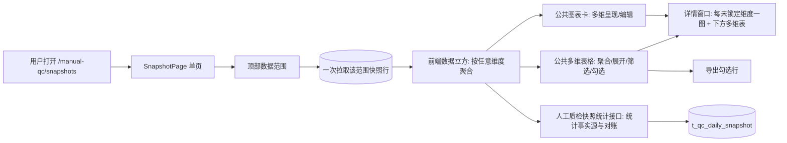

# 人工质检标注验收流程结果统计与详情展开

**审查状态**

- R1 需求理解：已确认（用户答复"R1 通过"；入口接入方式与图表配置保存方式交由 R2 结合现有实现形成方案）
- R2 可实施方案：开放，等待用户确认

**来源**：`initial-request.md` 原始请求、`feedback-r1.md` 人工反馈；产品工程入口文档
`../product/README.md`、`../product/AGENTS.md`。本阶段未读取源码。

---

## R1 需求理解

本轮修订：目标从"补齐流程统计的散点功能"改为"形成可复用的多维结果分析能力"；明确默认
聚合、任意维度展开、整列与单行展开、勾选导出、详情窗口布局、图表编辑与联动、数据一次
取用复用等行为；删去需要用户逐一挑选字段的问题。

### 1. 背景与主要问题

产品工程是人工质检一站式平台的本地实验实现（PostgreSQL → FastAPI → Vue）。现有页面已经
能选全页数据范围、看业务总览卡片、多图层统计卡、任务汇总表按任务→日期→组→标注员逐级
展开、点击占比列打开详情、把问题选项固定为列并保存。

用户要的是把人工质检标注验收等流程的**结果统计与详情展开**沉淀为真实、可复用的多维结果
分析能力，而不是为实验把需求拆成只完成一小点的纵切：

- 公共表格承担多维聚合/展开、各列筛选、行勾选、点击列打开详情；
- 详情复用同一公共表格做更细粒度展开和统计；
- 公共统计图表卡片做多维呈现，可编辑并支持点击联动；
- 后端有效提供前端需要的统计，接口与类高内聚、低耦合、可扩展；
- 前端同一顶部范围的数据只取一次，各区域共同复用。

主要矛盾：现有统计展示能力散落在页面里、多为单点实现，尚未形成可复用的多维结果分析能力。

### 2. 目标与使用结果

用户打开页面，先由顶部选择数据范围（日期、项目、任务、组、员工），然后在公共表格中
查看整个人工质检标注验收流程的结果，并可按需钻取：

- 表格**默认按项目和任务显示**——每个任务唯一属于一个项目，同时显示项目与任务不会增加
  行数；日期、组、标注员默认聚合；需要时可**重新选择哪些维度聚合**；
- 展开不依赖预设顺序，使用者可以**任意选择尚未展开的维度**；既能把当前一批同层行按某
  维度**整列展开**，也能**只让某一行按某维度展开**，不同分支可以选择不同维度；
- 各列都可筛选，不只指标列；
- 行支持**勾选**，当前唯一的明确动作是**导出**；
- 点击**任意合法统计数值列**打开详情：详情是覆盖当前页面的独立窗口，上方针对当前行尚未
  锁定的每个维度各放一张图（每张图先只展开一个维度），下方用公共多维表格显示明细，并可
  继续按任意剩余维度展开；
- 统计图表卡片支持编辑坐标轴、图表类型、数据范围、维度、大小和布局，**点击图表可联动详情表**。

### 3. 产品需要的能力

- **公共表格组件**：多维度聚合与展开、各列筛选、行勾选、点击列打开详情；主表与详情复用同一组件；
- **公共统计图表卡片**：对聚合和展开数据多维呈现，可编辑坐标轴、图表类型、数据范围、维度、
  大小和布局，支持点击联动；
- **详情窗口**：独立覆盖当前页面，上方逐维度出图、下方公共表格明细并可继续展开；
- **后端能力**：有效提供上述统计；接口与类高内聚、低耦合、可扩展，新增维度或环节时便于扩展。

### 4. 数据与业务规则

- 统计覆盖**当前快照表的全部数据**，以及从这些数据能够计算、符合业务语义的**标注与验收
  统计指标**；指标范围由数据能算出的事实决定，不要求用户逐一挑选字段；
- 同一顶部范围的数据**尽可能只取一次**，主表、筛选、聚合、展开、详情、图表和导出共同复用，
  不让各区域重复查询；
- **验收完成率**是当前范围的整体完成率，不按 Good/Bad 拆分；
- **验收通过率**需要能分别观察整体、Good 和 Bad；
- 聚合与明细使用同一口径，展开任何维度都不改变统计口径。

### 5. 范围与完成标准

| 类别 | 范围（本次做到） | 完成标准（怎样算完成） |
|---|---|---|
| 结果统计 | 覆盖标注、验收流程的结果统计，含完成率与通过率（整体/Good/Bad）等口径 | 表格与图表能呈现所选范围内的全部既定统计 |
| 公共表格 | 多维度聚合/展开、任意选维度、整列与单行展开、各列筛选、行勾选、点击列开详情 | 用户沿真实路径完成聚合、展开、筛选、勾选、进详情，主表与详情同一组件 |
| 详情 | 所有合法统计数值列可进入；独立窗口内上方逐维度出图、下方明细可继续展开 | 点击任意统计列后，详情按规则呈现并能按任意剩余维度展开 |
| 图表卡片 | 多维呈现；可编辑坐标轴/类型/范围/维度/大小/布局；点击联动详情 | 编辑生效（并按约定保存/恢复），点击图表联动详情表 |
| 导出 | 勾选行的内容可导出 | 勾选内容完整导出 |
| 数据复用 | 同一顶部范围数据只取一次，各区域共用 | 无重复查询，各区域数据一致 |
| 后端 | 有效提供上述统计，接口与类高内聚低耦合可扩展 | 前端所需统计均由后端提供且契约清晰，新增维度/环节可扩展 |

保持不变：数据源仍是本地实验快照与现有 PostgreSQL 连接；全页数据范围"显式应用才影响
全局"的既有口径继续成立；不得悄悄改变既有用户入口、已保存配置与既有能力行为。

### 6. 待 R2 处理的问题

两个 R1 待决项已由用户交回 R2 结合现有实现处理：

1. 入口接入方式：这套公共能力如何接入现有页面；
2. 图表配置保存方式：沿用现有保存恢复行为还是新增机制。

验收 Good/Bad 口径以现有数据与快照契约为准；R2 查证时若发现存在多种解释，会单独列出
请确认，不在此处预先设定。

---

## R2 可实施方案

### 1. 系统位置与现状

**产品**：Quality Platform Lab（人工质检一站式平台本地实验工程）。
**入口**：`/manual-qc/snapshots` 单页（`SnapshotPage.vue`），自上而下为全页数据范围 →
业务总览卡 → 统计图表看板 → 任务分析区。
**前端**：`shared/data-workbench/`（公共表格 `DataWorkbench`）、`shared/dashboard/`
（公共图表卡与编辑器）、`features/manual-qc/analysis/`（任务树、详情抽屉、查询 composable）。
**后端**：后端 `src` 按人工质检领域组织，接口归属**人工质检快照统计**业务；快照刷新、
Repository、对外 Service 与统计规则强相关，全部集中在 `src/manual_qc/snapshot/`
一个模块内按文件职责组织，不另拆 snapshot 与 snapshot_statistics 两个目录，也不新建
职责重叠的 Repository。
**数据**：`t_qc_daily_snapshot` 快照表；`useSnapshotExplorer` 已按顶部范围拉取
原始快照行（`snapshotRows`，当前 seed 3024 行），业务总览卡在浏览器端据此聚合。

现状与需求的差距：

- 任务表是固定四级树（任务→日期→组→标注员），不是"任意维度聚合/展开"；行勾选被关闭；
- 详情是固定 3 个指标的右侧抽屉（`TaskMetricDetailDrawer`），不是覆盖全页、每未锁定维度
  一张图的窗口，也没有下方可继续展开的公共多维表；
- 图表点击当前把分类写回顶部范围（`drillFromCard`），不是打开详情表；
- 总览用浏览器聚合，统计图和任务表走后端受控查询，同一范围存在多套取数路径；
- 表格列筛选已具备（`DataWorkbench` 列头筛选），只需扩展到所有列；导出不存在；
- 现有快照行拉取把 1000 行/页、10000 行上限（`api/snapshot.ts` 的
  `SNAPSHOT_PAGE_SIZE`/`SNAPSHOT_BROWSER_LIMIT`）当作浏览器取数边界，这些是临时数字，
  不能固化为业务上限，更不能因此漏数据。

### 2. 总体方案

**现状能力**：已能看标注→验收结果、固定四级下钻、固定指标详情、可编辑图表卡。
**本次改变**：把"任务分析"升级为**可复用的多维结果分析能力**——一个公共表格承担任意
维度聚合/展开、各列筛选、行勾选导出、所有统计列点开详情；详情为覆盖全页的独立窗口
（上方每未锁定维度一张图、下方公共多维表继续展开）；公共图表卡保留编辑能力并增加点击
联动详情；同一顶部范围数据尽量只取一次，主表/筛选/聚合/展开/详情/图表/导出共同复用。
**用户结果**：在一个入口完成人工质检标注验收流程的结果统计、任意维度下钻、详情分析和导出。

各节点职责与本次变化：

| 节点 | 职责 | 本次是否改变 |
|---|---|---|
| 用户入口 `SnapshotPage.vue` | 组装范围/总览/图表/表格 | 改造：任务分析区升级为多维结果分析；图表点击打开详情 |
| 顶部数据范围 | 决定本页数据 | 不变 |
| 前端数据立方（新） | 按任意维度组合聚合、筛选、下钻 | 新增：供表格/详情/导出复用 |
| 公共多维表格（`DataWorkbench` 增强） | 聚合/展开/筛选/勾选/导出/点列开详情 | 增强：任意维度展开、导出、统一详情入口 |
| 公共图表卡（`shared/dashboard`） | 多维呈现、编辑、持久化（数据走后端受控查询） | 增强：点击联动详情；编辑与持久化沿用；取数源随待决项 1 决定 |
| 详情窗口（新） | 覆盖全页，每未锁定维度一图 + 下方多维表 | 新增，替代固定指标抽屉 |
| 人工质检快照统计接口（后端） | 快照统计聚合的事实源，归属人工质检领域 | 基本不变；复用现有快照 Repository，不新建重叠 Repository |

### 3. 模块方案

| 所在位置 | 当前职责与现状 | 本次改变 | 改变后的作用 | 上下游 |
|---|---|---|---|---|
| `SnapshotPage.vue` | 组装范围、总览、图表、任务树 | 任务分析区改挂多维结果分析工作区；图表 `@drill` 改为打开详情窗口 | 单入口承载统计、下钻、详情、导出 | 依赖顶部范围与数据立方 |
| `features/manual-qc/analysis/`（领域前端） | 固定四级任务树、固定指标详情、快照统计查询封装 | 新增指标计算模块（与后端快照统计契约对齐）、数据立方 composable、多维结果工作区、详情窗口 | 提供任意维度分析语义与交互 | 消费 `snapshotRows`；调用快照统计接口对账 |
| `TaskAnalysisWorkspace / TaskAnalysisTable` | 固定任务→日期→组→员工树，详情入口仅 3 列 | 替换为多维结果工作区（默认项目+任务，可展开日期/组/标注员，任意列详情入口） | 任意维度聚合/展开的主表 | 复用增强后的 `DataWorkbench` |
| `shared/data-workbench/DataWorkbench.vue` | 排序、筛选、父子懒加载展开、行选择、列配置 | 支持按维度展开（整列/单行）、导出勾选行、列头筛选覆盖全部列 | 真正的公共多维表格组件 | 被主表与详情表复用 |
| `shared/data-workbench/WorkbenchToolbar.vue` | 行数/筛选/折叠/列配置/生成卡片 | 增加"导出"动作与勾选行导出入口 | 工具栏承担导出 | 发出导出事件 |
| `TaskMetricDetailDrawer.vue` | 右侧抽屉，固定 3 指标 summary/趋势/问题选项 | 替换为覆盖全页的详情窗口 | 详情窗口 | 复用 `BaseEChart` 与 `DataWorkbench` |
| `shared/dashboard/ChartCard / ChartBuilderDialog` | 编辑坐标轴/类型/维度/大小/布局并保存（后端查询取数） | 图表点击分类 → 打开对应详情；编辑与持久化沿用；取数源随待决项 1 | 公共统计图表卡片 | 联动详情窗口 |
| `useSnapshotExplorer` | 拉取顶部范围原始行与聚合 | 作为数据立方的一次取数来源，保持范围语义 | 提供"只取一次"的原始数据 | 数据立方消费 |
| `src/manual_qc/snapshot/`（后端） | 快照刷新、Repository、Service 与统计规则集中在一模块内按文件职责组织 | 统计规则、导出或明细所需查询进入同一模块并复用现有快照 Repository；不新建重叠 Repository | 统计事实源与对账基准 | 前端立方按契约对齐 |

### 4. 关键流程与数据

**默认与可调整路径**

- 根表默认按**项目 + 任务**聚合（任务唯一属于项目，不增行），日期、组、标注员默认聚合；
  每行记录其**已锁定维度**（如 project=园区、task=任务A）与可展开维度集合。
- 用户可重新选择哪些维度聚合；展开不依赖预设顺序，可任意选择尚未展开的维度；既支持对
  当前一批同层行**整列展开**某维度，也支持**单行**按某维度展开，不同分支可选用不同维度。

**数据复用与何时重新查询**

- 顶部范围确定后，`useSnapshotExplorer` 拉取该范围原始快照行；数据立方缓存这份数据，
  主表根查询、各层展开、筛选、聚合、详情图表、详情表和导出全部从立方派生，各区域不重复取数。
- 前端指标计算模块与后端快照统计契约对齐，作为前端立方的统计口径；后端快照统计接口
  保留为统计事实源，通过固定 seed 对账验证两者一致。后端查询缓存层不需要新建。
- 页面图表卡的取数随待决项 1 二选一：采用前端立方时，图表卡与编辑器预览同样从立方解析；
  保留后端快照统计接口时，图表卡继续走后端、仅点击联动详情。这是设计时选定的一条主路径，
  运行时不切换、不互为备用；两条选项的指标口径一致，靠对账保证。

**分页与取数边界**

- 现有 1000 行/页、10000 行上限（`SNAPSHOT_PAGE_SIZE`/`SNAPSHOT_BROWSER_LIMIT`）是
  临时实现数字，不代表合理方案。分页大小、上限和取数方式不在此处固化；先通过真实查询
  效率、负载、传输和浏览器成本的实际观察或实验判断，且必须保证**不因上限漏数据**。
  当前 seed 3024 行以内可完整取齐；若数据规模超出单次可行传输量，用分页取齐全部结果，
  不用截断代替分页。
- 结果完整性由接口保证：成功响应代表结果已取齐；取不齐时**整体失败**并显式暴露原因。
  不增加 `complete`、`loaded` 一类标志，不提供局部结果或运行时备用数据路径——它们会
  掩盖正确性问题并增加定位、维护成本。

**指标与口径**

- 指标范围覆盖当前快照表全部数据及可计算、符合业务语义的标注与验收指标，不要求用户挑字段；
  默认列参考现有基础指标（标注提交、Good 占比、验收分配、覆盖率、完成、完成率、通过率等）+
  全部合法统计列，均可作为详情入口。
- **验收完成率**为当前范围整体完成率，不按 Good/Bad 拆分；**验收通过率**提供整体、
  Good、Bad 三种口径分别观察。
- 问题选项保留"问题标签→问题选项"两层语义，可从详情中固定为表格新列（沿用现有能力）。

**完整性与错误**

- 立方加载失败则主表、详情、图表、导出同时进入失败态并暴露原因，不消费半份数据；
  详情窗口打开后显示其独立的加载/错误状态；接口不提供"部分成功"的成功响应。

**公共组件与领域边界**

- `DataWorkbench` 提供稳定的排序、筛选、展开、选择、列配置与导出动作；
  任意维度的业务语义（维度集合、默认聚合、指标口径）留在 `features/manual-qc/analysis/`，
  不复制进共享组件。

### 5. 接口与代码组织

- 前端共享组件保持通用：`DataWorkbench` 增加按维度展开与导出事件，不感知人工质检维度；
- 领域前端集中业务语义：数据立方 composable、指标计算模块、多维结果工作区、详情窗口，
  命名体现业务动作（如 `useManualQcCube`、`ResultAnalysisWorkspace`），不新建"分析/结果"
  之类的万能容器；
- 后端不创建泛化的 `analysis` Service，也不叫 `query`、`catalog`、`export` 这类无边界
  名称；接口命名清楚说明查询或计算的具体对象（如"快照统计聚合""问题选项候选值""勾选行
  导出"）。一个接口只服务一个可说清输入、输出和失败方式的用例：完整结果、指标定义、
  聚合统计与导出分属不同接口，不由一个万能接口包办；
- 快照刷新、Repository、对外 Service 与统计规则全部放在 `src/manual_qc/snapshot/`
  一个模块内按文件职责组织，不另拆 snapshot 与 snapshot_statistics 目录；导出或明细
  所需查询进入该模块、复用现有快照 Repository，并保持 Router→Service→Repository 分层；
- 配置保存沿用现有 `t_portal_view_config` 机制（page key 各自保存定义，重开按最新快照
  重算），不新建持久化通道；
- 导出为同步动作：导出内容由前端已持有的勾选行与已展开明细生成，不设计导出队列、异步
  任务或备用导出方式；当前没有异步导出的真实需求，实际规模证明有必要时再讨论。

### 6. 验证方案

- 真实用户路径（浏览器）：选范围 → 根表默认项目+任务 → 整列展开日期 → 单行展开组 →
  点通过率列 → 详情窗口上方各未锁定维度一图、下方表继续展开 → 勾选行导出 XLSX →
  用 Excel/WPS 打开验证中文、数值/日期类型、列顺序与 JSON 展开结果；
- 对账：前端立方聚合结果与后端快照统计接口在同一 seed 快照上的数值一致；
- 口径验证：完成率为整体（不拆 Good/Bad）、通过率整体/Good/Bad 三个口径数值正确；
- 导出内容验证：固定 JSON 字段与变长问题选项以可读列/行呈现，不在单元格中塞入整段 JSON；
  导出文件用目标软件真实打开核验；
- 分页与取数：先测量真实查询效率、负载、传输和浏览器成本，再决定分页大小、上限与取数
  方式；验证在代表数据规模下结果完整，不因上限漏数据；接口整体失败而非部分成功；
- 回归：`pytest`、`npm test`、`vue-tsc`、`npm run build`，及图表点击联动详情的真实
  Edge 验证；不再重复验证已收口的既有能力。

### 7. 仍需用户决定

1. **数据架构**：推荐**前端数据立方**（一次拉取范围原始行、浏览器聚合任意维度），
   主表/详情/导出/图表全部同源，支持任意组合与真正"只取一次"；代价是把聚合从后端移到
   前端，需与后端快照统计契约对账保证口径一致，图表卡取数也要一并切到立方。
   保守替代是保留后端快照统计接口为主、前端只做查询缓存，主表和详情任意维度展开仍有
   往返查询，但后端仍是唯一统计事实源、图表卡改动最小。
   无论选哪种，后端都在 `src/manual_qc/snapshot/` 单模块内按文件职责组织、复用现有快照
   Repository，不建泛化 `analysis` Service；分页大小、上限与取数方式不在此固化，按验证
   方案先实测再定；结果完整性由接口保证，不设 complete/loaded 标志。
2. **导出格式**：推荐默认 **XLSX**（避免 CSV 在 Excel 中因编码出现中文乱码；需引入
   `xlsx` 类库，与现有 CSV 依赖决策一并确认）。导出为**同步动作**，不设计导出队列、
   异步任务或备用导出方式，当前无异步导出真实需求。
3. **现有固定四级任务表与固定指标抽屉的去留**：推荐替换并迁移（问题选项固定列等能力
   在新表中保留），避免两套并存长期运行。
4. **图表点击行为**：点击图表分类 → 打开该分类的详情窗口；现有"应用到全页"保留为显式
   按钮动作。若希望点击图表直接改全页范围（现状），请在反馈中指出。

**R2 确认项（本轮收敛后）**

- 模块组织：后端按人工质检领域组织，快照刷新、Repository、Service 与统计规则集中在
  `src/manual_qc/snapshot/` 一个模块内按文件职责组织，不拆两个目录；
- 结果完整性：成功即取齐，取不齐整体失败并暴露原因；不加 `complete`/`loaded` 标志，
  不提供局部结果或运行时备用数据路径；
- 接口命名：按具体业务对象命名，不叫泛化的 `query`/`catalog`/`export`，一个接口一个用例；
- 导出：默认 XLSX，固定 JSON 与变长问题选项以可读列/行呈现，不把大段 JSON 塞进单元格；
  同步导出，不建异步任务或队列；
- 其他 R2 内容按本轮反馈前状态确认。

**尚未实施边界**：本 review.md 仍是方案审查产物，仅说明拟做的改动与验收方式；R1/R2
确认后，实际开发由 `develop-with-knowledge` 依据本方案在 `../product/` 实施，并通过
`review-work` 在同一审查入口补充实现与验证阶段。在本方案获批前不修改产品代码。

**R2 反馈区**：本轮反馈已合入（单 snapshot 模块、接口保证完整性、具体接口命名、XLSX 导出
与 JSON 处理、同步导出无异步）。请确认上方"R2 确认项"与待决项 1–4；确认后本方案即为
批准基准，按"尚未实施边界"交接开发。R2 通过前不修改产品代码。
