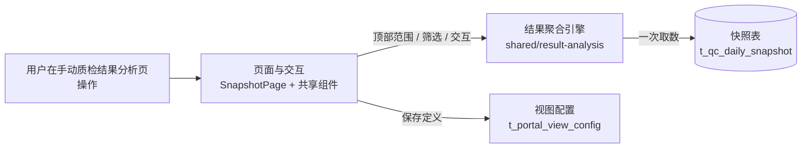
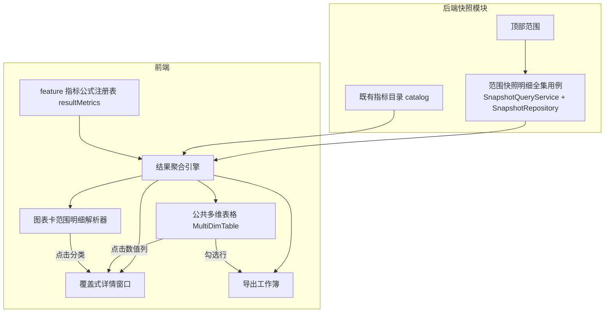

# 人工质检标注验收结果统计与详情展开

- 任务 ID：`manual-qc-result-stats`
- 日期：2026-08-16
- 阶段：**R1 已通过，R2 待审**
- 产品工程：`../product/`（Quality Platform Lab）
- 审查入口：本文件。当前开放 **R2 方案**；从 R2 开始逐条回复编号和意见，R1 不再重开。

---

**R2 内容导航**：系统位置与现状 → 总体方案 → 模块方案 → 关键流程与数据 → 接口与代码组织 → 迁移与退出 → 验证方案 → 仍需用户决定。

## R1 需求理解

### 1. 要解决什么问题

平台已经打通标注 → 验收的数据链（PostgreSQL → FastAPI → Vue），并能看到标注产出、验收分配、
完成和结论的聚合与逐级明细，也有可编辑的总览卡片和统计图。但这些能力分散实现，没有形成一套
统一、可复用、足够高效的多维结果分析能力。

本请求的核心矛盾是把“人工质检标注验收的结果统计与详情展开”做成**可复用的多维结果分析能力**：
公共表格和公共统计图表卡片都是真实产品能力，不是一次性页面，也不是为了实验把需求切成只完成
一小点的纵切。

现有可衔接的现状（来自产品入口文档）：
- 已有四级聚合与 V2 跨周期任务汇总，页面根表已切到 V2；
- 已有任务 → 日期 → 组 → 标注员逐级展开、列筛选、点击率列开详情；
- 已有可编辑的多图层统计图和总览卡片，表格与总览配置保存到 PostgreSQL；
- 顶部筛选控制全页数据范围，表头筛选默认只影响明细，仅显式“应用到全页”时转换。

### 2. 用户怎样使用

用户打开结果分析页，走完一条完整操作链：

1. 用顶部数据范围（日期、项目、任务、组、员工）界定全页口径；
2. 默认按**项目、任务**两个维度查看；由于每个任务唯一属于一个项目，同时显示项目与任务不会
   增加行数。**日期、组、标注员**默认聚合；
3. 需要时重新选择哪些维度聚合，对尚未展开的维度任意选择展开：既可以按某个维度整列展开当前
   一批同层行，也可以只展开某一行；不同分支可以选择不同维度，展开不依赖预设顺序；
4. 对适合筛选的列做筛选——不只是指标列，其他适合筛选的列也有筛选能力；
5. 勾选表格行并导出当前批次数据（当前第一项明确动作是导出）；
6. 点击任意合法的统计数值列打开该数据的详情：详情是覆盖当前页面的独立窗口，上方针对当前行
   尚未锁定的每个维度各放一张图（每张图先只展开一个维度），下方用同一公共多维表格显示明细，
   并能继续按任意剩余维度展开；
7. 统计图表卡片对聚合和展开数据做多维度分析，支持编辑坐标轴、图表类型、数据范围、维度、
   大小和布局；点击图表可以联动详情表；
8. 刷新后按现有保存机制恢复用户关心的查询口径、表格列与图表配置。

### 3. 产品需要哪些能力

按用户可见的产品能力组织，不混入实现模块：

| 能力 | 要求 |
|---|---|
| 多维聚合表格 | 默认行列与维度重选；两种展开（整列展开同层行 / 单行按维度展开）；各分支独立选维度；适合筛选的列都可筛选；行勾选并导出；任意合法统计数值列可点击打开详情 |
| 详情窗口 | 覆盖当前页面的独立窗口；复用公共表格；上方每张图按当前行尚未锁定的一个维度展开；下方明细可继续按任意剩余维度展开 |
| 统计图表卡片 | 对聚合与展开数据做多维度分析；可编辑坐标轴、图表类型、数据范围、维度、大小和布局；点击图表联动详情表 |
| 后端统计供给 | 覆盖当前快照表的全部数据，以及从这些数据能计算且符合业务语义的标注、验收统计指标；接口与类高内聚、低耦合、可扩展 |
| 前端数据与复用 | 同一顶部数据范围尽可能只取一次，主表、筛选、聚合、展开、详情、图表和导出共同复用，不让各区域重复查询 |

### 4. 数据与业务规则

- 数据覆盖当前快照表全部数据，以及从这些数据能够计算且符合业务语义的标注、验收统计指标，
  不要求用户继续挑选字段；
- 每个任务唯一属于一个项目，项目与任务同时显示不增加行数；
- 维度包含项目、任务、日期、组、标注员；日期、组、标注员默认聚合，可重选；展开只针对尚未
  展开的维度，不依赖预设顺序；
- 勾选行的明确动作是导出，本阶段不虚构其他批量动作；
- 口径：验收完成率是当前范围的**整体完成率**，不按 Good/Bad 拆分；验收通过率需要能分别观察
  **整体、Good 和 Bad**；
- 复用：同一顶部范围的数据尽量只取一次，各区域共用，口径一致；
- 保持现有规则：顶部筛选定义全页数据范围，表头筛选默认只影响明细，仅显式“应用到全页”时
  转换可无损表达的条件；V1 旧四级 API 与迁移基线保留为显式回退边界，不悄悄删除；不引入掩盖
  结果不完整的状态位或假完成标志。

### 5. 范围与完成标准

| 范围项 | 必须包含 | 完成表现 |
|---|---|---|
| 结果统计闭环 | 标注、验收各环节统计与详情展开 | 用真实数据（数据库/API/页面）走通聚合 → 展开 → 筛选 → 勾选 → 详情 → 图表 → 导出 |
| 公共多维表格 | 维度重选、两种展开、各列筛选、行勾选、列点击开详情、详情内复用 | 统计页与详情复用同一组件；任意分支可选不同维度展开 |
| 公共统计图表卡片 | 多维分析、编辑、点击联动 | 坐标轴/类型/数据范围/维度/大小/布局可编辑；点击图表联动详情表 |
| 数据与复用 | 全量快照 + 业务语义可计算指标；一次取数共同复用 | 各区域口径一致、无重复查询；完成率/通过率口径符合规则 |
| 兼容保持 | 现有已验证页面与行为、V1 回退边界 | 回归验证通过，现有规则不被悄悄改变 |
| 完成验收方式 | 真实路径验证 + 自动检查 | `src/cli verify`、pytest、前端 type-check/build，以及真实页面检查通过 |

### 6. 本轮修订说明

- 主要矛盾改为“可复用的多维结果分析能力”，公共表格与公共统计图表卡片定位为真实产品能力，
  不按纵切交付；
- 明确默认维度（项目 + 任务）、默认聚合维度（日期、组、标注员）、任务唯一归属项目、维度可
  重选、展开不依赖顺序、整列展开与单行展开并存、不同分支可选不同维度；
- 筛选覆盖所有适合筛选的列，不限于指标列；
- 勾选动作收敛为导出，不虚构其他批量动作；
- 详情窗口明确为覆盖当前页面的独立窗口：上图为每个未锁定维度一张（每图先展开一个维度），
  下图复用公共多维表格并可继续按剩余维度展开；所有合法统计数值列都可作为详情入口；
- 统计图表卡片明确编辑项与点击联动详情表；
- 口径明确：验收完成率整体计算，验收通过率分整体/Good/Bad 观察；
- 数据范围明确为全量快照与业务语义可计算的统计指标；复用明确为一次取数共同复用。

### 7. 仍需确认的问题

- 上一轮 4 个问题已按反馈收敛，不再重复。
- 剩余一个影响范围的业务问题：结果分析页与现有“任务汇总页 / 总览卡片 / 统计图”是**共存**还是
  由新能力**逐步替代**？这决定 R2 的边界与迁移策略；若暂时不做决定，R2 先以保证现有行为不
  被破坏为前提。

---

## R2 可实施方案

> R2 修订说明：按两轮架构反馈收敛。(1) 快照刷新、Repository、对外 Service 与统计规则在
> `src/manual_qc/snapshot/` **同一模块内按文件职责组织**，不再拆 `snapshot` / `snapshot_statistics`
> 子目录；(2) 结果完整性由接口保证：成功即取齐，取不齐整体失败并暴露原因，不设
> `complete` / `loaded` 标志，不做局部结果或运行时备用数据路径；(3) 接口按具体对象命名且
> 单一职责，导出是前端工作簿构建而非后端接口；(4) 默认导出 XLSX，固定 JSON 展开为类型列、
> 变长问题选项放独立可关联明细表，不把大段 JSON 塞进格子；(5) 不做异步导出、队列或备用导出。

### 1. 系统位置与现状

产品是人工质检平台，本次改动落在 **标注与验收结果分析** 业务模块，入口仍是现有页面
`/manual-qc/snapshots`（`SnapshotPage`），涉及前端 Vue、后端 FastAPI 和 PostgreSQL
快照表三层。

现有能力（来自 handoff / component-map / 源码）与本次阻碍：

| 层 | 现状 | 阻碍 |
|---|---|---|
| 数据 | 3024 行员工日快照，粒度 `stat_date×project×scene×group×employee`；指标在 `good_metrics` / `bad_metrics` / `option_metrics` JSONB | 前端按 1000 行分页取 `/api/snapshots/rows`、超过 10000 行直接阻止加载，这是规模种子的**临时兼容层**，不代表合理方案；各区域还会重复查询 |
| 后端 | 快照领域：`SnapshotQueryService` / `SnapshotRepository` 提供行与四级聚合；另有受控查询 `POST /api/manual-qc/analysis/query`、`facets`、`catalog` | 指标公式只存在于后端 SQL 字符串，前端无法按同口径自行聚合；取数缺少“一次返回范围全集”的用例 |
| 前端表格 | `DataWorkbench`（TanStack 状态内核）+ `TaskAnalysisTable`，固定按 任务→日期→组→标注员 懒加载展开 | 只支持固定顺序单行展开；不能任意重选聚合维度、不能不同分支不同维度、没有整列展开、行不可勾选导出 |
| 前端图表 | `DashboardGrid` + 多图层卡片，编辑时走服务端查询解析；点击图表改变全页范围 | 图表与表格各自查询；点击不联动详情表 |
| 前端详情 | `TaskMetricDetailDrawer` 侧抽屉，只支持 3 个比率指标 | 不是覆盖式窗口；不按剩余维度出图；下方没有可继续展开的多维明细 |

### 2. 总体方案

**现状是“各区域各自查询、表格固定顺序展开、详情只开 3 个指标” → 本次改为“同一顶部范围
只取一次数据，用一个共享聚合引擎驱动主表、筛选、聚合、展开、详情、图表和导出”。**

核心决策（依据 R1 的“一次取数共同复用”与“前端决定接口和数据形式”）：

1. 后端在**快照模块**（`src/manual_qc/snapshot/`：快照刷新、Repository、对外 Service 与统计
   规则同模块按文件职责组织，不再拆子目录）新增“读取顶部范围快照明细全集”用例，接口按对象
   命名（见接口节），不扩展泛化 `analysis` 服务；
2. **结果完整性由接口保证**：成功即返回范围全集，取不齐则整体失败并暴露原因；分页是否必要
   按真实测量与讨论决定，但任何策略都不得漏数据；不设 `complete` / `loaded` 标志，不做局部
   结果或运行时备用数据路径；
3. 前端新增**共享结果聚合引擎**，在内存中对这份数据集做任意维度组合聚合、逐级展开、筛选和
   指标计算（比率一律“聚合后的总分子÷总分母”，分母为零显示 `—`）；
4. 指标口径由**人工质检 feature 的公式注册表**提供（延续 `snapshotOverview.ts` 的既有做法），
   与后端 SQL 的正确性由对账测试保证，不为本需求扩展 analysis 领域；
5. 前端把表格增强为**公共多维表格**：维度重选、单行/整列展开且各分支可选不同维度、所有适合
   筛选的列可筛选、聚合行勾选并导出、所有统计数值列可点击开详情；
6. 新增**覆盖式详情窗口**：上方按当前行尚未锁定的每个维度各放一张图，下方复用公共多维表格
   继续按任意剩余维度展开；页面图表卡片点击分类直接联动该详情窗口；
7. 在**现有 `SnapshotPage` 内演进**任务分析区（不新建平行页面），总览卡、图表卡、表格和详情
   全部改从同一份数据集计算，口径一致。

### 3. 模块方案

| 所在位置 | 当前职责与现状 | 本次改变 | 改变后的作用 | 上下游 |
|---|---|---|---|---|
| `SnapshotRepository`（后端，`src/manual_qc/snapshot/repository.py`） | 快照行查询与四级聚合 SQL | 新增 `fetch_scope_rows(filters)`：返回顶部范围内**全部**快照明细行（含原始字段与 `computed_at`），不带固定 limit | “一次取数”的数据访问 | 被取数用例调用 |
| `SnapshotQueryService`（后端，`src/manual_qc/snapshot/snapshot_service.py`） | 快照行/聚合业务边界 | 新增 `scope_rows(filters)` 用例：校验范围、返回范围全集；**成功即取齐，取不齐整体失败** | 取数用例的边界守卫 | 被快照 Router 调用 |
| `src/api/routers/snapshot.py`（后端） | `/api/snapshots/*` 快照路由 | 新增 `GET /api/snapshots/rows/full`：返回顶部范围全部快照明细行（不分页、不截断） | 暴露范围快照明细全集接口 | 前端 `useScopeSnapshot` |
| `shared/result-analysis/engine.ts`（前端） | 不存在 | 新增聚合引擎：输入范围快照明细 + 指标目录 + 公式注册表，按任意维度组合聚合、算指标、支持 option 参数指标与筛选 | 主表、图表、详情、导出的公共计算源 | 被页面、图表解析器、详情窗口消费 |
| `resultMetrics.ts`（前端 feature） | `snapshotOverview.ts` 已镜像部分指标公式 | 新增覆盖目录全部指标的公式注册表（count 求和 / rate 分子分母，含 pending、Good/Bad/option 变体） | 前端引擎的指标口径 | 引擎 |
| `shared/result-analysis/MultiDimTable.vue`（前端） | 不存在 | 基于 `DataWorkbench` 的多维表格：维度重选、单行/整列展开且各分支可选维度、全列筛选、勾选、导出、全部数值列可点击 | 主表与详情底部共用的公共表格 | 主页面与详情窗口 |
| `shared/data-workbench`（前端） | 通用表格状态与渲染 | 增强：展开动作支持**维度选择**（`expandDimensions(row)` + `loadChildren(row, dimensionId)`）、工具栏加**整列展开**与**导出**动作 | 支撑多维展开语义 | `MultiDimTable` 复用 |
| `shared/result-analysis/ResultDetailWindow.vue`（前端） | 不存在 | 覆盖式窗口：上方按未锁定维度各一张单维图，下方复用 `MultiDimTable` 继续展开 | 点击任意数值列/图表分类的详情入口 | 主页面 |
| `shared/result-analysis/chartFromScopeRows.ts`（前端） | 不存在 | 用引擎把图表卡定义解析为分类/序列（支持横轴、筛选、图层、拆分） | 图表卡与表格共用同一份数据 | 图表卡解析器 |
| `shared/result-analysis/exportWorkbook.ts`（前端） | 不存在 | 勾选行 + 范围快照明细 + 目录 → **同步构建 XLSX**（四表，见导出设计） | 勾选导出的第一项明确动作；不设队列/异步任务/备用导出 | 主表导出按钮 |
| `useScopeSnapshot` / `useMultiDimView`（前端 feature） | 不存在 | 顶部范围一次取数；维护主表聚合/展开/勾选状态 | 页面数据与交互状态 | 页面装配 |
| 人工质检列定义与预设（前端 feature） | 任务表列定义、图表预设、总览解析 | 列定义改为“维度列 + 全部指标列（数值列都可点击）”；图表卡改走范围明细解析器；总览卡迁移到完整范围快照明细 | 口径统一、全列可点击 | 页面 |
| `TaskAnalysisWorkspace` / `SnapshotPage`（前端 feature） | 任务树 + 抽屉组装页面 | 任务分析区换成 `MultiDimTable`，详情换成覆盖式窗口，图表点击联动详情，总览用完整范围快照明细 | 演进后的结果分析页 | 用户 |
| 旧组件（`useTaskAnalysisTree`、`TaskMetricDetailDrawer`） | 固定顺序树、3 指标抽屉 | 被吸收后**删除**，相关测试同步更新 | 退出旧职责 | — |
| 前端 `getSnapshotRows` 分页兼容层 | 按 1000 行分页、10000 行阻止 | 被范围快照明细一次取数取代后**删除**（含 `SNAPSHOT_PAGE_SIZE` / `SNAPSHOT_BROWSER_LIMIT`） | 退出临时兼容层 | — |

保持不变：`SnapshotFilters` 顶部范围、顶部筛选定全页/表头筛选只影响明细/“应用到全页”才提升的
规则、`t_portal_view_config` 只保存定义不保存过期统计、V1 旧四级 API 与迁移基线。

### 4. 关键流程与数据

**默认使用路径**：打开页面 → 顶部范围界定 → 主表默认按 `项目+任务` 显示、日期/组/标注员聚合
→ 任意统计数值列点击开详情 → 详情上方按剩余维度出图、下方表格继续展开 → 勾选行导出。

**数据复用与重新查询时机**：范围快照明细只在**顶部范围变化**（或首次进入）时取一次；主表、
筛选、聚合、展开、详情、图表和导出全部消费同一份内存数据，不重复请求。表头筛选保持“只影响
明细”，只有显式“应用到全页”才改变顶部范围并触发重新取数。

**取数与分页**：范围快照明细用例先返回范围全集。是否需要分页以及如何分页，不由现有
1000/10000 临时数字决定，而在实现时按真实测量（查询耗时、传输大小、负载、浏览器处理成本）
与讨论判断；无论采用何种策略，**接口成功即返回完整结果、无遗漏**，不做静默截断，也不靠
`complete` / `loaded` 之类标志让调用方判断能否使用。

**聚合与展开语义**：
- 聚合维度选择是一个**集合**，用户可重选哪些维度进入分组键（默认 `project`+`task`）；
- 展开只针对“尚未锁定”的维度：单行展开时用户为该行选一个剩余维度；整列展开时对当前一层
  全部行按同一个所选维度批量展开；不同分支可保留不同维度（每行记录自己的下一维度）；
- 行路径 = 已锁定的维度值序列；详情窗口的“剩余维度” = 全部维度 − 行路径维度。

**指标计算责任**：比率一律先聚合再相除（`总分子÷总分母`，分母为零显示 `—`），与现有 SQL
语义一致。前端引擎按**人工质检 feature 的公式注册表**计算（延续 `snapshotOverview.ts` 的既有
做法），正确性由对账测试保证：同一 scope 上引擎结果与后端受控查询结果逐指标等价。
`acceptance.pending`、覆盖率/达成率/完成率/通过率及 Good/Bad/option 变体都写在该注册表里，
不由调用方猜测。

**完整结果与异常**：范围快照明细接口**成功即取齐**，取不齐则整体失败并显式暴露原因（422 校验
失败 / 503 连接失败）。响应不含 `complete` / `loaded` 等完整性标志；前端直接消费成功响应，
不做局部结果，也不设计运行时备用数据路径（如降级查询或备用聚合）。具体是否分页按上面的实验
判断，不把数字写死成业务上限。

### 5. 接口与代码组织

本轮确定的接口（**按具体对象命名，每接口只负责一个职责**）：

| 用例 | owner | 输入 | 成功输出 | 失败方式 | 消费者 |
|---|---|---|---|---|---|
| 读取顶部范围快照明细全集 | `SnapshotQueryService.scope_rows` + `SnapshotRepository.fetch_scope_rows` | 快照范围（日期/项目/任务/组/员工） | `items`（范围全集快照明细，含全部原始字段）、`total`、`computedAt`；**成功即取齐** | 整体失败：422 校验失败 / 503 连接失败 | `useScopeSnapshot`，驱动主表/图表/详情/导出 |
| 读取指标目录 | 既有 catalog 用例 | — | dimensions + metrics（标签/单位/算子） | 422 | 引擎与图表编辑器 |
| 受控聚合查询 | 既有 query 用例 | 同现状 | 同现状 | 同现状 | 对账测试、旧页面回归与回退 |
| 勾选行导出 | 前端 `MultiDimTable` + `exportWorkbook` | 勾选行 + 范围快照明细 + 目录 | **同步**构建的 xlsx 工作簿 | 前端提示 | 用户 |

说明：导出不是后端接口，而是前端基于已取齐数据的同步工作簿构建，不设导出队列、异步任务或
备用导出格式；指标定义（目录）、聚合统计（受控查询）与完整结果读取（范围快照明细）各是一个
独立接口，不由万能接口包办。

**代码组织**：后端按**人工质检领域**归属——取数用例落在 `src/manual_qc/snapshot/`，该模块
内**不拆子目录**，快照刷新、Repository、对外 Service 与统计规则按文件职责组织在同一个
`snapshot` 模块里（`SnapshotRepository` 提供数据访问，`SnapshotQueryService` 提供业务边界，
快照 Router 暴露接口）。不新建职责重叠的 `AnalysisRepository`，也不扩展泛化 `analysis` Service。
前端共享 UI/引擎能力放 `shared/result-analysis/`（引擎、多维表格、详情窗口、导出、范围明细
图表解析器）；指标口径由人工质检 feature 的 `resultMetrics.ts` 公式注册表提供，目录仍走既有
catalog 接口。目录先按 `shared/`（公共能力）与 `features/manual-qc/`（领域）归属，再在模块内
按组件/composable/工具文件职责分开。

**导出设计**：默认导出 **XLSX**（Excel/WPS 中避免 CSV 中文乱码；JSON 字段不塞进单元格）。
工作簿四张表，sheet 间用可关联键：
1. **统计结果**：当前勾选的聚合行，维度列 + 指标列（带单位），关联键为行路径；
2. **底层明细**：这些行路径下的员工日明细，键为
   `stat_date×project×task×group×employee`，与“统计结果”的聚合路径可对上；`good_metrics` /
   `bad_metrics` 是**固定结构 JSON**，展开为有类型的列（每个数值键一列，如 Good/Bad 各自的
   submitted / expect_alloc / actual_alloc / actual_complete / pass / reject 等），不写 JSON 文本；
3. **问题选项明细**：`option_metrics` 是**变长嵌套**（问题标签 → 选项），一对多，每行一个
   `(员工日键 × 问题标签 × 问题选项)`，选项数值指标展开为有类型的列，用员工日键与“底层明细”
   关联；
4. **说明**：顶部范围、应用的筛选、数据时间、导出时间、各指标口径（来自目录）。

导出为**同步**构建下载；当前没有异步导出的真实需求，不设计队列、异步任务或备用导出方式，
实际规模证明有必要时再讨论。

### 6. 迁移与退出

- 前端 `getSnapshotRows` 的 1000 行分页与 10000 行阻止逻辑被范围快照明细一次取数取代后
  **删除**（该逻辑本就是“规模种子的正确性兼容层”，不是合理上限）；总览卡随之从分页拼接行
  迁移到完整范围快照明细；
- 旧固定顺序任务树（`useTaskAnalysisTree`）和 3 指标侧抽屉被 `MultiDimTable` + 覆盖式详情窗口
  吸收，在范围明细解析器与页面回归通过后**删除**旧组件及其测试；
- 受控查询 `query` 接口保留：先作为旧图表卡回退与对账测试基线，图表卡全部迁移到范围明细
  解析器后，`query` 仅服务对账测试与兼容回退，不新增依赖；
- V1 旧四级 API 与迁移基线继续保留为显式回退边界；取数用例不碰既有 analysis 领域，
  不在 `AnalysisRepository` 上叠加职责；
- 新能力吸收旧职责的**条件**：前端引擎与后端 SQL 在相同范围上所有指标等价（对账测试通过）、
  现有页面回归通过、新页面真实路径走通。

### 7. 验证方案

- **后端 pytest**：范围快照明细取数的范围过滤与返回全集正确（与 `/api/snapshots/rows` 分页结果
  对账一致）；`SnapshotQueryService.scope_rows` 校验拒绝非法范围；
- **分页实验**：实现时对代表性范围实测查询耗时、响应大小、负载与浏览器聚合/渲染成本，据结果
  决定是否需要分页及分页形式；记录测量值，不把临时数字写死为业务上限；验证任何策略下结果
  **无遗漏**；
- **前端 vitest**：引擎聚合正确性（与后端 query 结果对账的固定数据）、维度重选/单行与整列展开/
  各分支不同维度、全列筛选、勾选导出内容、详情窗口与图表解析；
- **真实路径**（启动 PG + FastAPI + Vite，Edge 浏览器）：
  1. 默认 `项目+任务` 聚合，重选聚合维度；
  2. 某行按“组”展开、另一行按“日期”展开（不同分支不同维度）；整列展开一批同层行；
  3. 对维度列与指标列分别筛选；
  4. 勾选若干聚合行 → 导出 xlsx，用 WPS/Excel 真实打开，验证中文、数值/日期类型、四张表
     （统计结果 / 底层明细 / 问题选项明细 / 说明）与关联键；确认 `good_metrics` / `bad_metrics`
     已展开为类型列、`option_metrics` 落在可关联的问题选项明细表中，没有 JSON 文本塞进单元格；
  5. 点击任一统计数值列 → 覆盖式详情窗口，上方每剩余维度一张图、下方表格按剩余维度继续展开；
  6. 点击图表卡分类 → 联动详情表；编辑图表卡（坐标轴/类型/数据范围/维度/大小/布局）保存后刷新恢复；
  7. 主表、图表、详情、导出在相同顶部范围下口径一致；
- **回归**：现有 16 项 Python + 29 项前端测试、`vue-tsc`、Vite build、现有页面真实路径全部通过。

### 8. R2 确认项与仍需用户决定

本轮已按反馈收敛、默认进入方案的确认项（用户无异议即视为确认）：

1. 快照刷新、Repository、对外 Service 与统计规则在 `src/manual_qc/snapshot/` **同一模块内按文件
   职责组织**，不拆 `snapshot` / `snapshot_statistics` 子目录；
2. 结果完整性由接口保证：范围快照明细接口**成功即取齐**，取不齐整体失败并暴露原因；不设
   `complete` / `loaded` 标志，不做局部结果或运行时备用数据路径；
3. 接口按具体对象命名、单一职责：完整结果读取、指标目录、聚合统计各一个接口，导出是前端
   同步工作簿构建，不是后端接口；
4. **默认导出 XLSX**：固定 JSON（`good_metrics` / `bad_metrics`）展开为类型列，变长问题选项
   （`option_metrics`）放独立可关联的“问题选项明细”表，不把大段 JSON 塞进格子；
5. 不做异步导出、导出队列或备用导出方式（无真实需求；规模证明有必要时再讨论）。

仍需用户决定：

| 编号 | 问题 | 推荐项 | 差异与影响 |
|---|---|---|---|
| D1 | 页面形态 | 在现有 `SnapshotPage` 内演进并吸收旧任务树（推荐，符合“不新建平行 Demo”） | 若选择保留旧任务树共存，则新增一页并存，公共组件仍复用，但删除条件后移 |

其余技术选择（分页策略按真实测量与讨论决定、导出库等）不影响用户行为，由实现结合验证裁决。

**尚未实施边界**：本方案只形成 R1/R2，尚未进入实现。以下内容属于实施与后续阶段，不在本方案
内视为已完成——分页策略的实测与定夺、对账测试、旧任务树与 3 指标抽屉的吸收删除、
`getSnapshotRows` 分页兼容层移除、XLSX 导出库选型与真实软件打开验证；本平台仍是本地实验实现，
不涉及生产化、多用户或跨领域推广。

---

## 状态

- [x] R1 需求理解：已确认
- [ ] R2 可实施方案：等待用户批准（仅 D1 开放；确认项见 R2 §8）
- [ ] R2 通过后：交给 `develop-with-knowledge` 实施，再由 `review-work` 在同一入口补实现与验证阶段
