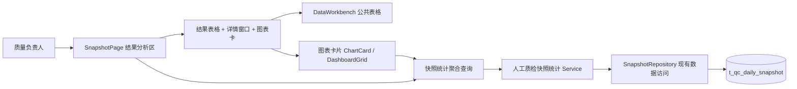

# 人工质检标注验收流程：结果统计与详情展开表

## 状态

- 当前阶段：**R1 需求理解，已确认（用户批准）**
- 下一阶段：R2 可实施方案，进行中
- 本轮未修改产品代码

### 本轮修订说明

- 明确核心目标是**可复用的多维结果分析能力**：公共表格组件与公共统计图表卡片是真实产品能力，不是一次性页面；
- 明确日常使用：默认按项目与任务显示、日期/组/标注员默认聚合，维度可重选，任意选择未展开维度展开，支持整列展开与单行展开、分支各自选维度，各列筛选，勾选后第一个明确动作是导出；
- 明确详情与图表：所有合法统计数值列均可作详情入口；详情是覆盖当前页面的独立窗口，顶部按未锁定维度每维度一图、底部公共多维表格；图表支持编辑坐标轴/类型/数据范围/维度/大小/布局，点击联动详情表；明确完成率与通过率口径；
- 明确数据与复用：覆盖当前快照全部数据与可计算指标，同一顶部范围数据尽量一次取用、多区域共享；
- 按"要解决什么问题 → 用户怎样使用 → 产品需要哪些能力 → 数据与业务规则 → 范围与完成标准"的自然逻辑重写 R1。

---

## R1 需求理解

### 1. 要解决什么问题

质量负责人在人工质检工作台上，需要看清"标注 → 验收"完整流程的结果，并能从汇总一路下钻到明细、对选中行继续细看。当前工作台已有全页范围筛选、业务总览、多图层统计图、任务四级展开表和指标详情，但它们是相对独立的能力，还没有形成一张覆盖完整流程、可复用的多维结果分析视图；勾选、详情复用、图表联动和导出也没有打通。

核心矛盾是形成**可复用的多维结果分析能力**：公共表格组件和公共统计图表卡片是真实产品能力，不只服务本次"标注 → 验收"流程结果分析，也应能支持后续同类分析，而不是为了实验把需求不断拆成只完成一小点的页面。

### 2. 用户怎样使用

1. 打开结果分析视图，**默认按项目与任务显示**（每个任务唯一属于一个项目，同时显示项目与任务不会增加行数），日期、组、标注员默认聚合；
2. 需要时**重新选择要聚合的维度**；展开不依赖预设顺序，可任意选择一个尚未展开的维度；既支持把当前一批同层行按某维度整列展开，也支持只让某一行按某维度展开，不同分支可以选择不同维度；
3. 对**适合筛选的列**（不只指标列）做筛选与排序，聚焦关注的数据；
4. **勾选表格行**，第一个明确动作是导出；
5. 点击**任意合法的统计数值列**进入详情：详情是覆盖当前页面的独立窗口，上方针对当前行尚未锁定的每个维度各放一张图（每张图先只展开一个维度），下方用公共多维表格显示明细，并可继续按任意剩余维度展开；
6. 用统计图表卡片做多维呈现：图表支持编辑坐标轴、图表类型、数据范围、维度、大小与布局，点击图表可联动详情表。

### 3. 产品需要哪些能力

| 能力 | 用户可见行为 |
|---|---|
| 全页数据范围 | 日期、项目、标注任务、组、标注员筛选作用于本页所有统计、表格、图表与导出 |
| 结果统计 | 覆盖当前快照表全部数据，以及从这些数据可计算且符合业务语义的标注、验收统计指标 |
| 多维表格 | 多维度聚合；任意选择未展开维度展开；整列展开或单行展开；不同分支选择不同维度；各列筛选与排序 |
| 行勾选 | 可勾选聚合行或展开行，勾选聚合行代表其全部下级；当前唯一明确动作是导出 |
| 详情窗口 | 覆盖当前页面的独立窗口；顶部为当前行每个尚未锁定的维度各出一张图（每图先展开一个维度），底部用公共多维表格显示明细并继续按剩余维度展开 |
| 图表卡片 | 消费聚合与展开数据；支持编辑坐标轴、图表类型、数据范围、维度、大小与布局；点击图表联动详情表 |
| 导出 | 把勾选行数据导出（内容范围待确认） |

### 4. 数据与业务规则

- 覆盖当前快照表全部数据，以及从这些数据可计算且符合业务语义的标注、验收统计指标；不要求用户逐个挑选字段；
- 同一顶部范围的数据应**尽可能只取一次**：主表、筛选、聚合、展开、详情、图表与导出共同复用，不让各区域重复查询；
- 百分比使用聚合后的总分子÷总分母，禁止平均各员工行百分比；分母为零返回 `null`，页面显示"—"；
- **验收完成率**是当前范围的整体完成率，不按 Good/Bad 拆分；
- **验收通过率**需要能分别观察整体、Good 与 Bad 三个口径；
- 问题选项可能多选，占 Bad 比例之和不保证等于 100%；问题信息保留"问题标签 → 问题选项"两层结构；
- 表头筛选默认只影响明细，只有可无损表达的条件才能提升到全页；
- 通用组件只负责呈现与交互，质检指标与问题选项语义留在业务侧。

### 5. 范围与完成标准

| 分类 | 范围（本次必须覆盖） | 完成标准（怎样算完成） |
|---|---|---|
| 统计结果 | 标注与验收流程各环节统计，覆盖快照全部数据与可计算指标 | 设置全页范围后能看到完整流程统计；数值与业务口径一致 |
| 多维表格 | 多维度聚合、任意维度展开、整列/单行展开、分支独立维度、各列筛选排序 | 能按所选维度聚合并逐级展开；筛选排序正确 |
| 行勾选与导出 | 勾选聚合/展开行，导出勾选数据 | 勾选行为一致，勾选聚合行含全部下级；导出内容正确 |
| 详情窗口 | 覆盖页面的独立窗口；顶部每维度一图、底部公共多维表格 | 点击任意合法统计数值列能打开详情；详情可继续按任意剩余维度展开 |
| 图表卡片 | 消费聚合/展开数据；编辑坐标轴、图表类型、数据范围、维度、大小布局；点击联动详情 | 图表数据正确、可编辑；点击可联动详情表 |
| 数据复用 | 同一顶部范围数据尽量一次取用、多区域共享 | 各区域不重复查询，结果一致 |
| 后端能力 | 按所需维度、筛选、分组提供统计与明细；职责单一、可复用、可扩展 | 真实数据/API 与页面一致；无万能接口 |

**保持不变：** 现有全页范围筛选、业务总览、统计图卡、任务分析与指标详情的既有行为不被悄悄改变；快照数据粒度与字段语义、问题标签—选项两层、分母为零返回 null 等口径不变；只连接本地实验 PostgreSQL；不连接材料中的任何生产地址。

### 6. 需要确认的问题

- **Q1 页面组织：** 这个统一的结果分析视图是新增页面，还是替换/增强现有任务分析表与指标详情？与业务总览、统计图卡的入口关系如何？
- **Q2 导出内容：** 导出具体导出什么（勾选行、当前筛选后的整批、当前页面全部明细）？格式留到 R2。
- **Q3 详情"锁定"维度：** "当前行尚未锁定的每个维度各放一张图"中的"锁定"，是否指已经展开/已使用的维度，其余未使用维度各出一张图？请确认这个理解。

---

## R2 可实施方案

### 状态

- R1 需求理解：**已确认**（用户批准）
- R2 可实施方案：**已接收两轮反馈，最终修订待审**
- 本轮未修改产品代码；R2 基于当前源码与运行契约形成

### 修订说明

第一轮：
- 数据形式改为**后端聚合 + 前端一次取用当前聚合结果**，不以现有 1000 行分页、10000 行上限
  作为业务上限；分页实现由实际测量实验决定，保证完整、不静默漏数据；
- 接口与后端 `src` 按**人工质检快照统计**业务功能组织，不创建泛化 `analysis` Service；
  快照数据访问继续由现有 `SnapshotRepository` 提供，不再造职责重叠的 `AnalysisRepository`；
  现有 `/api/manual-qc/analysis` 仅作为当前图表/任务表的兼容入口。

第二轮：
- `manual_qc` 下统一在 `snapshot` 一个模块内按文件职责组织，不再拆"快照"与"快照统计"
  两个目录；
- 结果完整性由接口保证：成功就取齐、取不齐整体失败并暴露问题；不设 `complete`/`loaded`
  一类标志，不设计局部结果或运行时备用数据路径；
- 接口按具体业务对象命名并拆分职责，不让万能接口包办结果统计、指标定义与导出；
- 导出默认 **XLSX 工作簿**（避免 CSV 中文乱码），固定 JSON 与变长问题选项展开为可直接
  使用的行列，不把大段 JSON 塞进单元格；当前无异步导出真实需求，不建设导出队列或异步任务。

### 1. 系统位置与现状

产品是人工质检实验平台，业务模块为"人工质检快照分析"，用户入口是 `SnapshotPage`
（`/manual-qc/snapshots`）。数据层为本地 PostgreSQL 的 `t_qc_daily_snapshot`（3024 条员工日快照）。

现状能力与本次关系：

| 现状 | 本次 |
|---|---|
| 现有前端 `snapshot.ts` 用 1000 行分页、10000 行上限取快照行供总览使用；这些是历史临时值 | 结果统计改为**后端聚合查询**，前端按当前维度集一次取用聚合结果，展开时按层级追加子级查询；不以 1000/10000 为业务上限 |
| 现有 `analysis` 模块与接口供当前图表、任务表查询 | 本方案接口归属**人工质检快照统计**，不复用泛化命名；现有 `analysis` 保留为兼容入口 |
| DataWorkbench 已支持排序、各列筛选、展开、列配置，`enableRowSelection` 开关已存在 | 启用行勾选，新增"整列展开"与导出动作 |
| 多图层图表卡已可编辑坐标轴/类型/数据范围/维度/大小/布局，点击触发 `drill` | 增加"消费统计聚合结果"的解析路径，点击联动详情表 |
| 指标目录含 5 维度、37 指标（含 Good/Bad/问题选项） | 指标由后端快照统计查询计算，前端消费聚合行，不复制指标公式 |
| 任务表固定 任务→日期→组→标注员 四级下钻，无勾选导出 | 新增通用多维结果表；任务表作为过渡并存 |

### 2. 总体方案

**一句话：** 保留现有总览、图表与任务表不动，在 SnapshotPage 内新增"结果统计与详情展开"
区域。它通过后端人工质检快照统计查询取得按所选维度集聚合的结果，前端一次取用当前聚合
结果并共享给表格、筛选、详情、图表与导出；展开时按维度追加子级查询。提供可任意选维度
聚合/展开、可勾选导出、可点击开详情的公共表格。

**数据形式与分页决策（对应 R1"查询效率、结果复用、日常使用频次"）：**

- **结果统计由后端聚合：** 前端按当前维度集与指标集发起一次查询，得到当前视图的聚合行；
  主表、筛选、详情、图表与导出共同复用这一份结果，展开时才追加子级查询。指标口径由后端
  快照统计计算，前端不复制公式。
- **不以现有临时数字作为业务上限：** 现有 `snapshot.ts` 的 1000 行分页、10000 行浏览器上限
  是历史临时值，不是合理方案的依据。分页实现（页大小、是否服务端分页、是否虚拟滚动）在
  实现开始时通过**实际测量实验**决定：用当前种子与一组更大规模代表性数据测量查询耗时、
  传输大小与浏览器渲染成本，记录证据后再定。
- **不静默漏数据：** 接口承诺完整结果；一次返回或分页取齐，取不齐时整体失败并显式暴露
  原因，不允许截断返回。

**Q1 页面组织推荐（依据：不破坏已验证行为 + 复用顶部范围与共享组件）：** 在现有
SnapshotPage 内新增区域，与任务分析表并存。任务表保留其固定下钻、固定问题选项列和指标
详情专属能力；结果表提供通用多维聚合与勾选导出。后续按第 6 节条件收敛任务表。

**Q2 导出内容推荐：** 勾选了行时导出勾选行的明细（聚合行展开为其全部下级）；未勾选时
导出当前筛选后的全部明细。采用 **XLSX 工作簿**（默认导出格式，避免 CSV 在 Excel 中因编码
出现中文乱码）。工作簿按职责分表：**结果统计**（当前聚合行与指标列）、**底层明细**（可关联
的快照行，含维度与计数键）、**问题选项明细**（问题标签 → 选项 → 指标，展开为有类型的
列）、**说明**（筛选范围、数据时间、导出时间与口径）。`option_metrics` 等 JSON 不塞进单个
格子，按"标签/选项"键展开为独立行或关联表。XLSX 库候选（如 `xlsx`/`exceljs`）在实现开始
时按中文、数值、日期、嵌套结构真实打开验证后确定；**不建设导出队列、异步任务或备用导出
方式**，当前规模直接同步生成并下载。

**Q3 详情"锁定"维度推荐：** "已锁定"= 当前行已经聚合/展开时使用的维度；未锁定的剩余维度
每个各出一张图，每张图先只按该维度展开。示例：按项目+任务聚合的行，日期/组/标注员都未
锁定，详情顶部各出一张图。

### 3. 模块方案

后端 `manual_qc` 下只保留 **`snapshot` 一个模块**：快照刷新、Repository、对外 Service 和
统计规则都在该模块内按文件职责组织，不再拆"快照"与"快照统计"两个目录。

| 所在位置 | 当前职责与现状 | 本次改变 | 改变后的作用 | 上下游 |
|---|---|---|---|---|
| `SnapshotPage.vue` | 组装总览、图表、任务表 | 新增结果分析区，接入快照统计查询 | 结果统计的统一入口 | 顶部筛选 → 快照统计 → 新区域 |
| `src/manual_qc/snapshot/`（快照统计 Service 文件，新增） | — | 在现有 `snapshot` 模块内按业务命名提供结果统计行与候选值查询 | 人工质检快照统计的业务服务；不叫泛化 `analysis`，不新建 `snapshot_statistics` 目录 | 校验查询 → 调 SnapshotRepository |
| `SnapshotRepository`（现有） | 快照行与四级聚合 SQL | 增加按任意维度集/指标集聚合的统计查询方法 | 快照数据访问的唯一入口；不新建重叠 Repository | Service → PostgreSQL |
| `useResultAnalysis`（新增） | — | 通过统计查询取数，管理聚合维度集、展开、筛选、选择、导出 | 结果表状态的唯一 owner | 统计查询 → 结果表与导出 |
| `ResultAnalysisWorkspace.vue`（新增） | — | 组合维度工具栏、结果表、详情窗口 | 结果统计与详情展开容器 | 结果表 ↔ 详情 ↔ 图表 |
| `ResultDetailWindow.vue`（新增） | — | 覆盖页面窗口：顶部每未锁定维度一图、底部复用公共表格 | 详情复用公共多维表格 | 选中行 + 聚合结果 |
| `DataWorkbench.vue` / `WorkbenchToolbar.vue`（共享） | 通用表格状态与渲染 | 启用行勾选；新增整列展开与导出动作 | 公共多维聚合展开表格 | 业务行数据；发出选择/展开/导出 |
| 图表卡（`ChartCard`/`DashboardGrid`/`ChartBuilderDialog`） | 多图层统计卡 | 增加"消费统计聚合结果"的解析路径；点击联动详情 | 图表消费聚合/展开数据 | 聚合结果 → 图表；`drill` → 详情 |
| 现有 `analysis` 模块与 `/api/manual-qc/analysis` | 供当前图表、任务表查询 | 保持为兼容入口，不作为本方案主链路 | 兼容与回退边界 | 现有图表/任务表 → 迁移 → 退出 |

### 4. 关键流程与数据

**默认路径：** 顶部筛选 → 快照统计查询（按"项目 + 任务"聚合）→ 结果表显示聚合行，日期/组/
标注员聚合为可展开维度。当前视图的聚合结果一次取用，表格、筛选、详情、图表与导出共享。

**聚合与展开：** 维度可重选；展开任意未展开维度；整列展开（同一层全部行按某维度展开）与
单行展开（仅某一行按某维度展开）都支持，不同分支可选择不同维度。展开状态是行级"按哪个
维度展开"，不是全局固定顺序；展开子级时按当前行路径发起子级统计查询（懒加载，成功后置为
展开，避免伪状态）。

**分页与完整性：** 分页实现不以现有 1000/10000 为业务上限，由实现开始时的测量实验决定
（见第 7 节）。**结果完整性由接口保证：成功就取齐，取不齐就整体失败并显式暴露问题；**
不增加 `complete`、`loaded` 一类标志，不设计局部结果或运行时备用数据路径，避免掩盖
正确性问题。

**勾选：** 勾选聚合行代表全部下级（TanStack `enableSubRowSelection`）。唯一动作是导出。

**详情窗口：** 覆盖当前页面。顶部为每个未锁定维度一张图（用当前点击指标，按该维度先展开
一层），底部复用 `DataWorkbench` 显示明细并可继续按任意剩余维度展开。

**指标口径（R1 已确认）：** 验收完成率 = 当前范围整体完成率（不按 Good/Bad 拆）；验收
通过率分别提供整体、Good、Bad 三口径（目录已有 `acceptance.pass_rate`、`good.acceptance.pass_rate`、
`bad.acceptance.pass_rate`）。空分母返回 `null` 显示"—"；问题选项可能多选、占 Bad 比例之
和不等于 100%。

**图表联动：** 点击图表分类 → 在详情表/详情窗口中定位并选中对应行（沿用现有 `drill` 事件）。

### 5. 接口与代码组织

**归属：** 本需求接口归属"人工质检快照统计"业务功能，接口名称清楚说明查询或计算的具体
对象（如"结果统计行""候选值""指标定义"），不叫泛化的 `query`、`catalog`、`export`；
后端 `src` 在 `snapshot` 模块内组织，快照数据访问继续由现有 `SnapshotRepository` 提供，
不再造职责重叠的 `AnalysisRepository`。现有 `/api/manual-qc/analysis` 仅作为当前图表/任务表
的兼容入口，不作为目标新架构主链路（见第 6 节退出条件）。

接口按职责拆分，不合并为万能接口：

| 用例 | owner | 输入 | 成功输出 | 失败方式 | 消费者 |
|---|---|---|---|---|---|
| 结果统计行查询 | 快照统计 Service / SnapshotRepository | 顶部范围、聚合维度集、指标集、筛选、排序、分页 | 统计行 + total（完整或整体失败） | 参数校验失败 422；取不齐整体失败 | 结果表、详情、图表、导出 |
| 候选值查询 | 快照统计 Service / SnapshotRepository | 顶部范围、维度 | 候选值列表 | 参数校验失败 422 | 结果表筛选 |
| 指标定义查询 | 沿用现有目录内容 | — | 维度/指标元数据 | — | 结果表列头与图表编辑器 |
| 导出 | 前端 `exportResults.ts`（共享组件调用） | 已取用的统计行 + 勾选/筛选状态 | XLSX 工作簿（结果统计/底层明细/问题选项明细/说明） | 数据不完整时不生成 | 用户下载 |

导出不复用任何"完整结果标志"：导出所需数据必须已经由统计行查询完整取得，取不齐就不生成
导出文件；导出是同步的，不建设队列或异步任务。

**前端新增（归入 `manual-qc` feature）：**

| 文件 | 责任 |
|---|---|
| `analysis/composables/useResultAnalysis.ts` | 聚合维度、展开、筛选、选择、导出状态；调用结果统计行查询 |
| `analysis/components/ResultAnalysisWorkspace.vue` | 结果分析容器与维度工具栏 |
| `analysis/components/ResultDetailWindow.vue` | 详情窗口（顶部图 + 底部公共表格） |
| `analysis/utils/exportResults.ts` | XLSX 导出：结果统计/底层明细/问题选项明细/说明四个工作表；JSON 展开为行列 |

前端不再从原始快照行复制指标公式：指标由后端快照统计计算，前端消费聚合行。共享组件只
负责呈现与交互，指标语义留在 `manual-qc` 与后端统计服务。

### 6. 迁移与退出

- 现有 `/api/manual-qc/analysis` 泛化接口与 `AnalysisRepository` 承担当前图表/任务表职责，
  作为兼容入口保留；目标统计接口归属人工质检快照统计并复用 `SnapshotRepository`。现有
  消费者迁移到业务命名接口后，泛化 `analysis` 命名退出，不长期并存。
- 本轮"结果统计与详情展开"区域与任务分析表并存，作为过渡。收敛条件：结果表补齐任务表
  已有能力（固定问题选项列、指标详情、表格配置持久化）并经真实对账后，把任务表收敛为
  结果表的"任务下钻预设"，删除独立 `TaskAnalysisWorkspace` 实现。不因"风险低"默认让两套
  职责长期并存；是否执行收敛由后续确认决定。

### 7. 验证方案

- **分页与数据量实验：** 用当前种子（3024 行）和一组更大规模代表性数据，实测结果统计行
  查询的响应时间、传输大小与浏览器渲染成本，记录证据后确定页大小、是否服务端分页与是否
  需要虚拟滚动；不允许以临时数字静默截断数据。
- **真实用户路径：** 打开 SnapshotPage → 设置范围 → 结果表默认项目+任务 → 整列展开日期 →
  单行展开组/标注员（分支维度不同）→ 各列筛选 → 勾选聚合行（含下级）→ 导出 → 点击指标列
  打开详情 → 详情顶部每未锁定维度一图、底部继续展开 → 图表点击联动详情。
- **口径对账：** 完成率=整体、通过率=整体/Good/Bad，与 PostgreSQL 全表聚合一致
  （沿用 `src.cli verify` 与现有确定性核对）。
- **单次取数：** 浏览器网络面板确认当前视图聚合结果一次取用，主表/筛选/详情/图表/导出
  共享；展开才触发子级查询。
- **导出：** 用 Excel/WPS 真实打开 XLSX，核对中文无乱码、数值/日期类型正确、问题标签—
  选项与底层明细可关联、说明表完整；验证无异步导出路径。
- **自动化：** `pytest`、前端 `npm test`、`vue-tsc`、生产构建；必要真实 Edge 交互。

### 8. 仍需用户决定

- R2 已按两轮反馈完成最终修订。**确认项：**
  1. 后端在 `snapshot` 单模块内按文件职责组织，快照统计 Service 归属其中，不新建
     `snapshot_statistics` 目录，也不新建重叠 Repository；
  2. 结果完整性由接口保证，成功即取齐、取不齐整体失败，不设 `complete`/`loaded` 标志，
     不设计局部结果或运行时备用路径；
  3. 接口按业务对象命名并拆分职责（结果统计行/候选值/指标定义/导出），不建万能接口；
  4. 导出默认 XLSX 工作簿，JSON 与变长问题选项展开为可直接使用的行列；同步导出，不建设
     队列或异步任务；
  5. Q1 新增区域并存、Q3 锁定语义沿用正文推荐。
- **尚未实施边界：** 本轮只修订方案，未修改任何产品代码；分页参数与 XLSX 库选型将在实现
  开始时实测后确定；任务表收敛与泛化 `analysis` 退出属于后续迁移，不在本轮实施。
