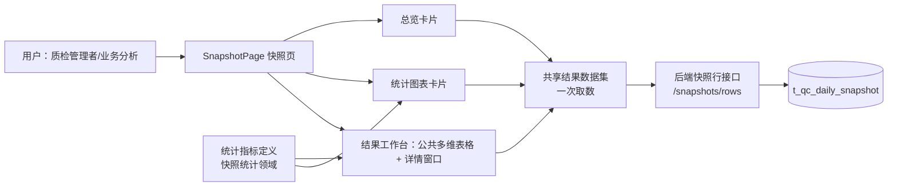

# 人工质检标注与验收结果统计及详情展开 —— 方案审查

- 审查文件：本文件（唯一，R1/R2 为同一条工作链的两个阶段）
- 当前阶段：**R2 可实施方案，等待用户确认**
- R1 状态：已确认（用户明确通过）
- 状态：产品代码未修改

## 原始请求（事实）

> 要实现一下前端显示完整的人工质检标注验收等流程的结果统计和详情展开表。这是一个复杂的前后端完整开发内容：
>
> - 后端要能有效吐出前端想要的统计信息；
> - 前端需要考虑查询效率、结果复用性和日常使用频次，决定接口和数据形式；
> - 需要一个优质的公共表格组件，实现多维度聚合和展开、各列筛选、聚合展开行勾选、点击某些列后打开详情；
> - 详情里也要复用公共表格组件，对选中行的数据做更细粒度的展开和统计；
> - 需要公共统计图表卡片，对聚合和展开数据做多维度呈现分析，并支持编辑、点击交互等；
> - 后端接口和类需要高内聚、低耦合、可扩展。
>
> 请先结合当前项目和已有知识，把需求理解和技术方案形成一份可以逐步审查的本地 `review.md`。不要直接开发；需求没有确认前不要把技术选择写成已经批准的规格，方案没有确认前不要修改产品代码。

## R1 需求理解

### 1. 背景与主要问题

质检负责人和业务人员日常需要了解标注与验收的结果：这批做完了没有、质量如何、问题落在哪个任务／组／人员上。当前平台已经有总览卡片、统计图和按任务 → 日期 → 组 → 标注员的明细表，但这些能力分散实现、各视图相互独立，无法支撑"多维度聚合、任意展开、勾选、点列下钻、图表联动"这类高频分析。

主要矛盾是把标注与验收的结果统计和详情展开，建成**可复用的多维结果分析能力**：公共多维表格和公共统计图表卡片是真实产品能力，而不是为某个页面一次性写死、也不拆成只完成一小块的零碎改动。

### 2. 用户怎样使用

在"标注 → 验收"结果页面上：

1. 打开即看到整体结果统计，并可把同一批数据放入统计图表卡片做多维度分析；
2. 主表默认按项目＋任务显示行（每个任务唯一属于一个项目，同时显示项目与任务不会增加行数），日期、组、标注员默认聚合；需要时可重新选择哪些维度聚合；
3. 展开不依赖预设顺序，可以任意选择尚未展开的维度；既能把当前一批同层行按某个维度整列展开，也能只让某一行按某个维度展开，不同分支可以选择不同维度；
4. 对行做勾选并导出（当前第一项明确动作是导出）；
5. 点击任一合法的统计数值列打开详情：详情是覆盖当前页面的独立窗口，上方针对当前行尚未锁定的每个维度各放一张图，下方用公共多维表格显示明细并可继续按任意剩余维度展开；
6. 统计图表卡片支持编辑，点击图表可以联动详情表。

### 3. 产品需要哪些能力

**公共多维表格（主工作区）**

- 多维聚合与任意维度展开：默认项目＋任务、日期／组／标注员聚合，可重新选择聚合维度；支持整列展开与单行展开，不同分支可用不同维度；
- 各列筛选：不只是指标列，其他适合筛选的列也要能筛选；
- 行勾选：聚合展开出的行可勾选，当前动作用于导出；
- 详情入口：所有合法的统计数值列都能点击打开详情，不限于某个特定指标；
- 列配置可保存并在刷新后恢复（沿用既有行为）。

**详情展开视图**

- 覆盖当前页面的独立窗口；
- 上方针对当前行尚未锁定的每个维度各放一张图，每张图先只展开一个维度；
- 下方用公共多维表格显示明细，并继续按任意剩余维度展开；
- 与主表复用同一套表格和图表能力。

**统计图表卡片**

- 对聚合与展开数据做多维度呈现分析；
- 支持编辑坐标轴、图表类型、数据范围、维度、大小和布局；
- 点击图表可联动详情表。

**结果复用**

- 同一顶部数据范围的快照数据尽可能只取一次，主表、筛选、聚合、展开、详情、图表与导出共同复用，不让各区域重复查询。

### 4. 数据与业务规则

- 覆盖当前快照表的全部数据，以及从这些数据可计算、符合业务语义的标注与验收统计指标；
- 验收完成率是当前范围的整体完成率，不按 Good/Bad 拆分；
- 验收通过率可分别观察整体、Good 与 Bad；
- 顶部数据范围决定全页数据口径；表头筛选默认只影响明细，显式"应用到全页"才影响全局（沿用既有语义）；
- 默认只读展示，行勾选当前仅用于导出，不引入其他未确认的批量动作；
- 前端所需统计信息由后端有效输出，接口与领域结构的具体设计留到 R2。

### 5. 范围与完成标准

| 类别 | 本次范围 | 完成标准（可观察） |
|---|---|---|
| 结果统计 | 覆盖当前快照表全部数据及符合业务语义的标注、验收统计指标 | 打开页面即看到标注与验收各阶段结果；完成率为整体口径，通过率可分整体／Good／Bad |
| 公共多维表格 | 多维聚合与任意维度展开（整列／单行／分支异维）、各列筛选、行勾选、任意合法数值列可打开详情、列配置保存恢复 | 默认按项目＋任务显示、日期／组／标注员聚合；可重新选维度、按任意顺序展开；勾选行可导出；点击任一合法数值列打开详情；筛选与列配置跨刷新保留 |
| 详情与图表 | 覆盖当前页面的详情窗口，上方按未锁定维度各放一张图、下方公共表格继续展开；图表卡片可编辑坐标轴／图表类型／数据范围／维度／大小／布局，点击联动详情表 | 从主表进入详情后能继续下钻与统计；图表可编辑并点击联动详情；图表、表格、详情口径一致 |
| 数据复用与性能 | 同一顶部数据范围一次取用，多视图复用 | 主表、筛选、聚合、展开、详情、图表、导出不重复查询，加载符合日常使用频次 |
| 保持不变 | 本地实验工程边界、既有数据模型与维度／指标口径、顶部全页数据范围语义、默认只读 | 不引入未确认的写操作或批量动作，行勾选当前仅导出 |

### 6. 本轮修订与确认状态

**本轮修订：** 依人工反馈重写需求主线——以可复用的多维结果分析能力为目标；补充默认显示与展开交互细节（项目＋任务同行、任意维展开、整列／单行展开、分支异维）；勾选第一动作明确为导出；详情改为覆盖页面的独立窗口（上方按未锁定维度各一图、下方公共表格继续展开）；所有合法数值列均可作为详情入口；图表卡片编辑项与点击联动明确；完成率／通过率口径明确；数据一次取用多视图复用。

**确认状态：** 上一轮提出的 4 个问题均已由反馈解答（流程范围为标注与验收并覆盖全部快照数据；勾选用途为导出；详情按剩余维度继续展开；数据规模与性能策略作为技术选择留待 R2）。当前**无剩余开放问题**，等待你对本版 R1 的确认。

## R2 可实施方案

> 状态：R2 待用户确认。R1 已确认。产品代码未修改。
> 方案依据来自对产品工程的定向查证（`docs/handoff.md`、`docs/component-map.md`、`docs/snapshot-contract.md`、`src/manual_qc/analysis/*`、`src/frontend/src/features/manual-qc/*`、`src/frontend/src/shared/*`）。

### 1. 系统位置与现状

产品是本地实验工程 **Quality Platform Lab**：PostgreSQL → FastAPI → Vue 一条数据链。变化集中在人工质检快照页 `/manual-qc/snapshots` 的"任务分析"区（总览、统计图、逐级明细、指标详情）以及支撑它的数据取用方式。

现状关键事实（已查证）：

- **后端统计能力已具备但命名泛化、组织需重构**：`POST /api/manual-qc/analysis/query` 支持按 日期/项目/任务/组/标注员 任意 1–3 维分组、白名单指标与维度筛选、排序与分页；`/catalog` 提供指标目录；`/facets` 提供候选值。但该能力以泛化的 `analysis` 命名存在（`src/manual_qc/analysis/` 的 `AnalysisQueryService`/`AnalysisRepository`），`AnalysisRepository` 与现有 `SnapshotRepository` 的聚合职责重叠；按人工反馈，本任务应把统计能力归入"人工质检快照统计"领域、由现有快照 Repository 承担数据访问，删除泛化命名与重叠仓库。
- **总览已经用浏览器端聚合**：`useSnapshotExplorer` 取齐顶部范围的叶子快照行（`/snapshots/rows` 按 1000 行分页、浏览器 1 万行兼容上限），`snapshotOverview.ts` 在浏览器端从叶子行计算全部指标。**这些分页/上限是临时兼容数字，不代表业务上限，取数与分页实现须经实测判定，不能据此漏数据**。
- **任务表与详情当前依赖后端逐级查询**：`useTaskAnalysisTree` 固定按 任务→日期→组→标注员 懒加载；`useTaskMetricDetail` 打开详情时再发起汇总、趋势、问题选项多次查询；只有 Good 占比/完成率/通过率三列可点开详情（`TaskAnalysisTable.vue`）。
- **已知口径偏差**：详情抽屉对"验收完成率"同时展示 Good/Bad 完成率，与 R1"完成率不按 Good/Bad 拆"冲突，需修正；"通过率"分整体/Good/Bad 则保留。
- **图表卡片已可编辑**（坐标轴、图层类型、数据范围、维度、大小与布局），点击图表目前是收窄全页范围并滚动到表格（`drillFromCard`），与 R1"点击图表联动详情表"不同。
- **表格公共组件已有基础**：`DataWorkbench`（TanStack）已支持排序、各列筛选、树形懒加载展开、行勾选、列配置持久化；任务表当前把勾选关闭（`enable-row-selection=false`），工具栏也没有导出动作。
- **导出能力不存在**，前端无导出依赖库（`package.json` 无 xlsx/papaparse）。

### 2. 总体方案

**现状能力 → 本次改变 → 用户结果：** 现状是"总览浏览器汇总、任务表/图表/详情各自向后端查询"的分散取数；本次把它统一为"**顶部范围数据一次取齐为共享结果数据集，表格、筛选、聚合、展开、详情、图表、导出全部在本地复用同一份数据**"，并把任务表升级为可任意选维聚合/展开、可勾选导出、所有数值列可点开覆盖页面详情窗口的结果工作台。

核心工程决定（有依据，非用户待决）：

1. **共享结果数据集**：以 `useSnapshotExplorer` 取齐的顶部范围叶子快照行（`SnapshotRow[]`，含全部 good/bad/option 指标计数）作为唯一数据集。主表、聚合、展开、详情、导出与图表解析全部消费它；唯一重新取数的时机是顶部范围变化。**结果完整性由接口保证**：成功即取齐、可直接使用，取不齐则整体失败并暴露问题；不增加 `complete`/`loaded` 一类标志，不消费半份结果，也不设计局部结果或运行时备用数据路径。取数与分页方式不预先固化为现有 1000 行分页或 1 万行上限：实施首步先实测当前与代表性更大范围的查询耗时、payload、传输与浏览器聚合/渲染成本，据此**一次性**判定"整批取齐 + 本地聚合"是否成立——成立即按此实现；不成立则改为服务端聚合/分页并重新确认，生产只保留一条数据路径。
2. **指标计算单点化（前端）**：新建领域前端模块统一按统计指标定义语义计算指标值（计数求和；比率 = 100×分子÷分母，分母为零返回空），总览、工作台、详情、图表、导出共用，避免各视图各算一套口径。后端统计查询仍是权威口径，保留用于验证对账。
3. **图表解析改为消费共享数据集**：`resolveSnapshotChartCard` 由"逐卡查询"改为在共享数据集上按卡片配置本地聚合，消除每张卡片的重复查询（满足 R1"图表共同复用"）；卡片编辑能力与呈现逻辑不变。
4. **后端在 `src/manual_qc/snapshot/` 内按文件职责组织，不新增平行能力**：统计能力不再使用泛化的 `analysis` 命名——接口归属什么业务就命名为什么业务，本需求统计归属"人工质检快照统计"；统计指标定义与统计校验在 `snapshot` 模块内按文件职责承载（不拆 `snapshot_statistics` 等子目录），统计聚合 SQL 并入现有 `SnapshotRepository`，删除职责重叠的 `AnalysisRepository`；路由按人工质检领域组织并以业务对象命名（如 `/api/manual-qc/snapshots/statistics/metric-definitions`、`/api/manual-qc/snapshots/statistics/dimension-totals`），前端 api 同步迁移。

本次**新建**：结果工作台（替换任务分析区）、覆盖页面的详情窗口（替换抽屉）、共享指标/聚合模块、XLSX 导出工作簿。本次**修改**：`DataWorkbench`/工具栏（勾选、XLSX 导出）、`snapshotChart`、`snapshotOverview`、表格配置持久化（加聚合维度，升版本）、后端统计能力重构（归入 `snapshot` 模块按文件职责组织、SQL 并入 `SnapshotRepository`、路由按领域与业务对象命名）。本次**删除**：固定四级树及其懒加载 composable、旧详情抽屉及其查询 composable、旧任务表组件、`AnalysisRepository` 与旧 `/api/manual-qc/analysis/*` 路由（迁移后退出）。本次**保持不变**：顶部范围语义、总览与图表卡片的编辑/布局/保存、问题选项固定列、只读展示、表头筛选"应用到全页"的转换规则、快照行取数仍由现有快照 Repository 提供、导出不设异步任务/队列/备用方式。

### 3. 模块方案

| 所在位置 | 当前职责与现状 | 本次改变 | 改变后的作用 | 上下游 |
|---|---|---|---|---|
| `SnapshotPage.vue`（页面） | 组装总览、图表、任务分析区；图表点击收窄全页范围 | 改为持有详情请求状态并渲染 `DetailOverlay`；图表点击改为打开该类目的详情窗口；把共享数据集与统计指标定义传给结果工作台 | 页面统一编排"总览→图表→工作台→详情"，一处数据源 | 消费 `useSnapshotExplorer`；给 `ResultWorkspace` 传 dataset/统计指标定义；接收图表 `drill` 与工作台 `openDetail` |
| `useSnapshotExplorer.ts`（数据 owner） | 一次取齐顶部范围叶子行与项目/任务候选 | 不变取数，作为共享数据集出口；保留失败整体报错 | 全页唯一数据源 | 数据集 → 总览、工作台、详情、图表、导出 |
| `workspace/metric.ts`（新，领域前端） | — | 新增统一指标计算：桶累计 + 目录指标取值（含 good./bad./option. 与比率规则） | 单一口径来源，替代总览/详情各自公式 | 被总览、工作台、详情、图表、导出调用 |
| `workspace/rollup.ts`（新，领域前端） | — | 新增任意维度分组/聚合、节点路径与锁定语义、整列/单行/分支异维展开 | 把数据集按所选维度聚合成树节点，支持任意顺序展开 | 结果工作台与详情表格消费 |
| `ResultWorkspace.vue` + `ResultTable.vue`（新，替换任务分析区） | `TaskAnalysisWorkspace/Table` 固定四级树、三列可点详情、无勾选 | 按聚合维度选择器生成根节点；所有数值指标列可点开详情；启用行勾选与导出；保留筛选/排序/列配置/固定问题选项列 | 可复用多维结果工作台：默认项目＋任务，可重选维度、整列/单行/分支异维展开 | 消费 dataset/统计指标定义/rollup；对 `DataWorkbench` 传入列定义、筛选、勾选、展开与导出请求 |
| `DetailOverlay.vue`（新，替换 `TaskMetricDetailDrawer`） | 右侧抽屉，仅展示所点指标的汇总/趋势/问题选项，完成率含 Good/Bad | 改为覆盖页面的独立窗口；上方针对该行未锁定维度各放一张图（每图只展开一个维度），下方用公共多维表格显示明细并可继续按剩余维度展开；完成率只显示整体、通过率显示整体/Good/Bad | 详情与主表复用同一套表格与图表能力，全部本地计算 | 消费 dataset/统计指标定义/metric/rollup 与 `DataWorkbench`、`BaseEChart` |
| `DataWorkbench.vue` + `WorkbenchToolbar.vue`（共享） | 通用表格状态与呈现，工具栏有筛选/制图/应用到全页 | 新增"导出"动作（勾选行 → XLSX 工作簿），暴露导出请求 emit；不改变树、筛选、排序语义 | 公共表格支持勾选导出 | 供 `ResultTable` 与详情表格复用 |
| `snapshotChart.ts`（领域前端） | 卡片按图层向 `/analysis/query` 逐卡查询（`queryAll`） | 改为在共享数据集上按卡片配置本地聚合（分类、拆分、问题选项、比例图层），保留呈现/排序/截断逻辑 | 图表与主表同源，无重复查询 | 消费 dataset/metric/rollup；输出 `DashboardChartResult` |
| `snapshotOverview.ts`（领域前端） | 自带一套指标求和/比例公式 | 改为复用 `workspace/metric.ts`，删除重复公式 | 总览与工作台口径一致 | 消费 dataset 与 metric 模块 |
| `exportWorkbook.ts`（新，领域前端） | — | 生成 XLSX 工作簿（默认导出格式）：统计结果 / 明细行 / 问题选项 / 说明 四张工作表；单元格类型化；问题选项等变长数据展开为带关联键的行，不把大段 JSON 塞进单元格 | 勾选行的结构化、可直接使用的导出，WPS/Excel 打开无乱码 | 由 `ResultWorkspace` 调用，消费勾选行、列定义、数据集与口径说明 |
| `useTaskTableWorkspace.ts`（配置持久化） | 保存列显隐/顺序/宽度与固定问题选项 | 配置升级到 v2，新增聚合维度；v1 配置迁移到默认维度；一次性筛选/展开仍不保存 | 聚合维度与列配置跨刷新恢复 | 读写 `t_portal_view_config`（不变） |
| `SnapshotRepository`（`src/manual_qc/snapshot/repository.py`，现有） | 快照行查询与四级聚合 SQL | 承接统计聚合 SQL（从 `AnalysisRepository` 并入），继续只负责数据访问 | 快照领域唯一数据访问入口 | 供统计服务与快照服务调用；不写 HTTP 或页面状态 |
| 后端统计能力（`src/manual_qc/snapshot/`，重构） | 统计以泛化 `analysis` 命名存在：`AnalysisQueryService`/`AnalysisRepository`、路由 `/api/manual-qc/analysis/*`，与快照 Repository 聚合职责重叠 | 统计能力在 `snapshot` 模块内按文件职责组织（快照刷新、Repository、对外 Service、统计规则同模块，**不拆 `snapshot_statistics` 子目录**）：统计指标定义与统计校验以业务名命名（如 `SnapshotStatisticsService`），统计聚合 SQL 并入现有 `SnapshotRepository`，删除职责重叠的 `AnalysisRepository`；路由按人工质检领域组织并以业务对象命名（如 `/api/manual-qc/snapshots/statistics/metric-definitions`、`/api/manual-qc/snapshots/statistics/dimension-totals`），前端 api 同步迁移 | 作为权威统计口径与验证参照，并支撑快照行取数 | 快照行取数（现有）供前端数据集；统计指标定义供前端列/图表；按维度聚合统计供验证对账 |

### 4. 关键流程与数据

**一份数据怎样被复用，何时重新查询。** 共享结果数据集 = 顶部范围的全部叶子快照行（完整事实，不是某一层聚合、也不是当前页）。主表、表头筛选、聚合、展开、勾选、详情、图表、导出都在本地消费同一份数据；唯一重新取数时机是顶部范围变化（含"应用到全页"）。图表卡片不再逐卡查询；表头筛选"生成统计卡片"只用本地条件构造新卡片定义，不触发后端查询。

**聚合与展开语义（忠实表达 R1）。** 维度集合 {项目, 任务, 日期, 组, 标注员}；默认聚合维度 = 项目＋任务（任务唯一属于一个项目，同显不增行），日期/组/标注员默认折叠。用户可增删聚合维度；展开不依赖预设顺序，可任意选择尚未展开的维度；既支持"整列展开"（把当前层全部行按某维度展开），也支持"单行展开"（仅某一行按某维度展开），不同分支可选择不同维度。节点路径 = 锁定维度值集合，剩余维度即未锁定维度。聚合结果对维度顺序不敏感（分组键规范化），维度顺序只影响默认展开顺序与列顺序。

**指标与状态由谁计算。** 指标值统一由 `workspace/metric.ts` 计算：计数对桶内行求和；比率 = 100×分子合计÷分母合计，分母为零返回空（显示 `—`）；未完成量 = 分配量−完成量取不小于零。问题选项按"标签→选项"两层从数据集聚合，固定问题选项列继续支持（沿用最多 5 个）。完成率只显示整体口径；通过率分整体/Good/Bad。勾选是集合语义（TanStack `RowSelectionState`），导出导出的是勾选的那一批当前层行。

**完整性与大数据量（接口保证完整，分页由实验判定）。** 结果完整性由接口保证：成功即取齐、可直接使用，取不齐则整体失败并暴露问题；不增加 `complete`/`loaded` 一类标志，不消费半份结果，不设计局部结果或运行时备用数据路径。取数与分页方式不预先固化为现有 1000 行分页或 1 万行兼容上限：实施首步先实测当前种子与代表性更大范围的查询耗时、payload 大小、传输耗时与浏览器聚合/渲染成本，据此**一次性**判定"整批取齐 + 本地聚合"是否成立——成立即按此实现；不成立则改为服务端聚合/分页并重新确认，生产只保留一条数据路径，不以实验不成立为运行时回退。该取舍以实验证据为准，不把临时数字写成业务上限。图表、详情、导出所需底层数据都来自同一数据集或同一统计口径，不存在"聚合行里没有明细"的情况。

**详情窗口。** 覆盖当前页面的独立窗口（Teleport + 模态语义，ESC/点击背景关闭，复用页面不可见时禁止聚焦的保护）。打开时传入"行 + 指标"：上方针对该行每个未锁定维度各放一张图（图 = 该行范围按该维度分组所点指标的聚合，计数用柱、比率用线，复用 `BaseEChart`）；下方公共多维表格显示该行范围明细，可继续按任意剩余维度展开；表格内所有数值列再次可点，实现窗口内的继续下钻；问题选项"固定为列"能力保留。

**图表点击联动详情表。** 点击图表分类（项目/任务/组/标注员/日期类目）改为打开该分类行的详情窗口（页面范围不变，不重置总览与图表）；问题选项类目不打开详情。

**公共组件与领域配置的边界。** `DataWorkbench` 只负责表格状态与交互（树、筛选、排序、勾选、列配置、导出事件），不包含任何质检指标公式；指标口径、聚合维度、问题选项语义全部留在 `features/manual-qc/workspace/`。

### 5. 接口与代码组织

后端不新增与前端需求对应的平行能力；统计能力在 `src/manual_qc/snapshot/` 模块内按文件职责组织（快照刷新、Repository、对外 Service、统计规则同模块，不拆子目录），消除泛化 `analysis` 命名；快照数据访问继续由现有 `SnapshotRepository` 提供。前端以本地计算承接聚合、展开、详情与导出（XLSX 本地同步生成，无导出队列、异步任务或备用导出方式）。接口一律按具体业务对象命名并保持单一职责，不使用 `query`/`catalog`/`export` 等通用名，也没有万能接口包办完整结果、指标定义、聚合统计与导出。

| 用例 | owner | 输入 | 成功输出 | 失败方式 | 消费者 |
|---|---|---|---|---|---|
| 工作台数据集取数（快照行） | `useSnapshotExplorer` | 顶部范围（日期/项目/任务/组/员工） | 该范围全部叶子快照行（现有 `/snapshots/rows`）；接口保证取齐或整体失败，无 `complete`/`loaded` 标志、无局部结果 | 取不齐整体失败并暴露原因；取数/分页方式由实施首步实测一次性判定，不固化为 1000/10000 | 总览、工作台、详情、图表、导出 |
| 统计指标定义 | `SnapshotStatisticsService`（`src/manual_qc/snapshot/` 内，业务名） | 无 | 快照统计指标定义（维度/指标/单位/筛选运算符），业务命名接口如 `GET /api/manual-qc/snapshots/statistics/metric-definitions` | 失败展示错误 | 工作台列定义、图表编辑器、总览 |
| 按维度聚合统计（权威口径） | `SnapshotStatisticsService` + `SnapshotRepository` | 范围 + 维度 + 指标 + 筛选 + 排序 + 分页 | 按所选维度的统计值（取齐或整体失败），业务命名接口如 `POST /api/manual-qc/snapshots/statistics/dimension-totals` | 校验失败抛错 | 实施/验证对账本地计算值；生产取数路径由实验证据二选一，仅保留一条 |
| 任意维度聚合与展开 | `workspace/rollup.ts` | 数据集 + 聚合维度集合 + 展开维度 | 树节点（路径、锁定维度、指标值、子节点） | 本地，无失败路径 | `ResultTable`、`DetailOverlay` |
| 指标取值 | `workspace/metric.ts` | 行桶 + 统计指标定义引用（含问题选项参数） | 数值或空 | 本地，无失败路径 | 总览、工作台、详情、图表、导出 |
| 勾选行导出（XLSX） | `exportWorkbook.ts` | 勾选行 + 当前列定义 + 顶部范围/口径 + 数据集 | XLSX 工作簿下载：统计结果 / 明细行 / 问题选项 / 说明 四张工作表，类型化单元格，问题选项展开为关联行 | 未勾选时按钮禁用；本地同步生成，无队列/异步/备用方式 | `ResultWorkspace` 工具栏 |
| 详情窗口 | `DetailOverlay.vue` | 行 + 指标 + 数据集 + 统计指标定义 | 汇总、每未锁定维度一图、可展开明细表 | 本地，无失败路径 | 表格数值列点击、图表分类点击 |
| 图表数据解析 | `snapshotChart.ts` | 卡片定义 + 数据集 + 统计指标定义 | `DashboardChartResult` | 未知数据源报错（保留） | `ChartVisualization` |

**代码组织（前端）。** 新增 `features/manual-qc/workspace/`（`metric.ts`、`rollup.ts`、`exportWorkbook.ts`、`components/ResultWorkspace.vue`、`components/ResultTable.vue`、`components/DetailOverlay.vue`、`composables/useResultWorkspace.ts`）。迁移后删除 `analysis/components/TaskAnalysisWorkspace.vue`、`TaskAnalysisTable.vue`、`TaskMetricDetailDrawer.vue`、`analysis/composables/useTaskAnalysisTree.ts`、`useTaskMetricDetail.ts`（旧"固定四级/逐级查询/抽屉"路径）；保留 `analysis/types`、`analysis/utils`（`metricReferenceKey`）。前端 `api/analysis.ts` 改为只取统计指标定义并同步到重构后的路由，移除对聚合统计/维度候选的调用（候选值由数据集派生）。共享层：`DataWorkbench` 增加 XLSX 导出 emit，`WorkbenchToolbar` 增加导出按钮。

**代码组织（后端，重构）。** `src/manual_qc/snapshot/` 是唯一快照领域模块，**不拆 `snapshot`/`snapshot_statistics` 子目录**：快照刷新、Repository、对外 Service 与统计规则在同一模块内按文件职责组织——`models.py`（快照行 + 统计查询模型）、`repository.py`（现有 `SnapshotRepository`，并入统计聚合 SQL）、`snapshot_service.py`（`SnapshotQueryService`）、`statistics_service.py`（业务命名 `SnapshotStatisticsService`，含校验与统计指标定义）。删除 `src/manual_qc/analysis/`（泛化 `AnalysisQueryService`/`AnalysisRepository`/目录）。路由按人工质检领域组织并以业务对象命名：`GET /api/manual-qc/snapshots/statistics/metric-definitions`（统计指标定义）、`POST /api/manual-qc/snapshots/statistics/dimension-totals`（按维度聚合统计）；删除旧 `/api/manual-qc/analysis/*`。快照行取数（`/snapshots/rows`）与四级聚合仍由现有 `SnapshotRepository`/`SnapshotQueryService` 提供，不因重构改变。每个接口只承担一个业务对象/职责，不以 `query`/`catalog`/`export` 等通用名包办。

### 6. 验证方案

| R1 用户结果 | 真实证据 |
|---|---|
| 打开即见标注/验收各阶段结果，完成率整体、通过率整体/Good/Bad | 真实页面：总览卡片与详情窗口数值符合统计指标定义口径；详情窗口完成率不再出现 Good/Bad |
| 默认项目＋任务、日期/组/标注员聚合；可重选聚合维度 | 真实页面：默认行数 = 任务数；增删聚合维度后根节点随之重排 |
| 任意顺序展开、整列/单行展开、分支异维 | 真实页面：整列展开、单行展开、不同分支选不同维度均可操作且合计一致 |
| 各列筛选 | 真实页面：维度与所有指标列均有对应筛选，筛选后明细/合计正确 |
| 勾选行导出（XLSX） | 用 WPS/Excel 真实打开 XLSX：中文无乱码、数值/比率类型正确；统计结果 / 明细行 / 问题选项 / 说明 四张工作表可打开，问题选项按关联键可查，无大段 JSON 塞单元格；导出内容与勾选行一致 |
| 导出无异步/队列 | 导出为本地同步生成下载；无导出队列、异步任务或备用导出方式（当前无规模证据需要） |
| 所有合法数值列可开详情 | 真实页面：每个数值列点击均打开覆盖页面的详情窗口 |
| 详情窗口每未锁定维度一图 + 下方表格继续展开 | 真实页面：窗口覆盖页面；图数 = 未锁定维度数；下方表格可继续展开；点击数值列在窗口内继续下钻 |
| 图表可编辑并点击联动详情表 | 真实页面：编辑能力不变；点击图表分类打开对应详情窗口 |
| 一次取数多视图复用 | 浏览器 DevTools 网络：顶部范围内数据集请求次数按实测判定（整批取齐时仅一次；服务端分页时无重复查询）；展开/聚合/详情/导出/图表刷新不触发额外后端查询 |
| 分页与规模实验（实施首步） | 实测当前种子与代表性更大范围的查询耗时、payload、传输与浏览器聚合/渲染成本，**一次性**判定"整批取齐 + 本地聚合"是否成立并选定唯一生产数据路径；不以 1000/10000 固化为业务上限，不漏数据 |
| 口径与后端一致 | 对账：抽样任务行/日期/组，工作台与图表本地值 = 重构后按维度聚合统计同口径结果；本地比率公式与统计口径 `_rate` 规则一致 |
| 后端重构回归 | `python -m pytest` 全绿；统计指标定义/按维度聚合统计在重构后输入输出不变；旧 `/api/manual-qc/analysis/*` 与 `AnalysisRepository` 移除后无残留调用与导入 |
| 回归 | `npm test`、`npm run type-check`、`npm run build`；既有 V1 配置迁移用例保留 |

自动化：为 `metric.ts`/`rollup.ts` 补纯逻辑测试（分组、比率/空分母、问题选项、整列/单行展开、维度顺序无关性），为 `exportWorkbook.ts` 补工作表内容、类型与问题选项关联行测试（并以 WPS/Excel 真实打开为验收），为 `ResultTable`/`DetailOverlay` 补交互测试；图表解析补数据集消费测试；为后端统计能力重构补重构后统计指标定义/按维度聚合统计回归测试。规模结论不预设阈值：以分页/规模实验证据为准，虚拟滚动或服务端聚合只在实际测量不支持整批取齐时才引入，且只保留一条生产数据路径。

### 7. 确认摘要与尚未实施

**R2 第二轮修订（依人工收敛反馈）：** ① 后端统计能力在 `src/manual_qc/snapshot/` 模块内按文件职责组织（快照刷新、Repository、对外 Service、统计规则同模块），不拆 `snapshot`/`snapshot_statistics` 子目录；② 结果完整性由接口保证：成功即取齐、取不齐整体失败并暴露问题，不增加 `complete`/`loaded` 一类标志，不设局部结果或运行时备用数据路径；③ 接口按具体业务对象命名并保持单一职责（快照行 / 统计指标定义 / 按维度聚合统计），不使用 `query`/`catalog`/`export` 等通用名，无万能接口；④ 导出默认 XLSX，快照中的 JSON 与变长问题选项展开为带关联键的独立工作表，不把大段 JSON 塞进单元格；⑤ 无异步导出需求，不设导出队列、异步任务或备用导出方式。

**R2 确认项（供一次批准）：**

1. 共享结果数据集：顶部范围叶子快照行一次取齐，主表/筛选/聚合/展开/详情/图表/导出共同复用；完整性由接口保证；取数与分页方式由实施首步实测一次性判定，生产只保留一条数据路径。
2. 指标计算单点化：`workspace/metric.ts` 统一按统计指标定义计算，总览/工作台/详情/图表/导出同口径，并与后端按维度聚合统计对账。
3. 结果工作台：默认项目＋任务、可重选聚合维度；任意顺序展开、整列/单行展开、分支异维；各列筛选；勾选行导出；所有数值列可点开详情；聚合维度与列配置跨刷新恢复。
4. 详情窗口：覆盖页面的独立窗口，上方每未锁定维度一图、下方公共多维表格继续展开；完成率整体口径、通过率整体/Good/Bad；问题选项固定为列保留。
5. 图表卡片：编辑能力不变；解析改为消费共享数据集；点击图表分类打开对应详情窗口。
6. 导出：默认 XLSX（统计结果 / 明细行 / 问题选项 / 说明 四张工作表，类型化单元格，问题选项按关联键展开）；本地同步生成，无队列/异步/备用方式。
7. 后端重构：统计能力在 `src/manual_qc/snapshot/` 内按文件职责组织；聚合 SQL 并入现有 `SnapshotRepository`，删除泛化 `AnalysisRepository` 与旧 `/api/manual-qc/analysis/*` 路由；路由按人工质检领域与业务对象命名，前端 api 同步迁移。

**尚未实施：** 方案获批前不修改产品代码。获批后由 `develop-with-knowledge` 按已确认 R1/R2 实施（首步完成取数/分页实验并确定唯一数据路径），再由 `review-work` 在同一审查入口补充实现与验证阶段。

- 明确的既有行为变更点（实施时按此执行）：图表点击从"收窄全页范围"改为"打开该分类详情窗口"；详情从抽屉改为覆盖页面窗口；详情完成率移除 Good/Bad 拆分；任务分析区由固定四级树改为可任意选维聚合；后端统计能力由泛化 `analysis` 命名重构为 `src/manual_qc/snapshot/` 内按文件职责组织（聚合 SQL 并入 `SnapshotRepository`、路由按业务对象命名）。
