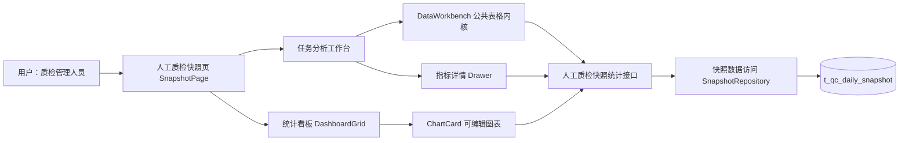

# 人工质检标注验收全流程结果统计与详情展开

任务：在 Quality Platform Lab 中实现前端完整的人工质检标注、验收等流程的结果统计与详情展开表，并配套后端统计输出与公共表格/图表组件。

- 审查文件：`workspaces/reviews/manual-qc-workflow-results/review.md`（唯一）
- 当前阶段：**R1 已确认；R2 待整体确认**
- R2 方案状态：R2 待整体确认，当前无开放决策

本轮修订：按人工反馈重排需求主线，明确"可复用的多维结果分析能力"为核心目标；补充日常使用、详情与图表、数据与复用的业务规则；范围与完成标准改为分类表格合并表达。

**R1 批准范围**：核心目标为可复用的多维结果分析能力；默认项目+任务视图、日期/组/标注员默认聚合、任意维度聚合与展开、整列/单行展开、各列筛选、勾选导出；独立详情窗口（上方每维度一图、下方公共多维表格明细）；图表卡可编辑坐标轴/类型/数据范围/维度/大小/布局并点击联动；完成率为整体口径、通过率分整体/Good/Bad；同一顶部范围数据尽量只取一次共同复用；快照数据定义与统计口径基线不变。

---

## R1 需求理解

### 背景与主要问题

人工质检平台（Quality Platform Lab）已经能运行一条本地数据链：14 天确定性快照 → FastAPI → Vue 页面。现有页面已有任务汇总表、业务总览卡片、多图层统计图和点击指标打开详情等分散能力。

主要矛盾是形成**可复用的多维结果分析能力**：公共多维表格和公共统计图表卡片是真实产品能力，不是一次性页面。当前实现把这些能力拆成了零散、各自为政的切片，后端接口也是"前端要什么给什么"的零散形态，缺少围绕"标注 → 验收"完整流程、能被主表、详情、图表、导出共同复用的统计输出。

### 用户怎样使用（日常使用）

- 默认按项目和任务显示：每个任务唯一属于一个项目，同时显示项目与任务不会增加行数；日期、组、标注员默认聚合；
- 需要时重新选择哪些维度聚合；展开不依赖预设顺序，使用者可任意选择尚未展开的维度；
- 两种展开方式同时支持：把当前一批同层行按某个维度整列展开，或只让某一行按某个维度展开；不同分支可选择不同维度；
- 不只是指标列，其他适合筛选的列也要有筛选能力；
- 表格行支持勾选，第一项明确动作是导出；本轮不虚构其他批量动作。

### 产品需要哪些能力

- **公共多维表格组件**：多维度聚合与任意维度展开、各列筛选、行勾选、点击列打开详情；同一组件服务主表、详情与统计视图；
- **详情窗口**：覆盖当前页面的独立窗口；上方针对当前行尚未锁定的每个维度各放一张图，每张图先只展开一个维度；下方用公共多维表格显示明细，并可继续按任意剩余维度展开；
- **公共统计图表卡片**：可编辑坐标轴、图表类型、数据范围、维度、大小和布局；点击图表可联动详情表；
- **详情入口**：所有合法的统计数值列都能作为详情入口，不只限于某个"缺口"指标。

### 数据与业务规则

- 统计覆盖当前快照表全部数据，以及从这些数据能够计算、符合业务语义的标注与验收统计指标；不要求用户逐个挑选字段；
- 同一顶部范围的数据应尽可能只取一次：主表、筛选、聚合、展开、详情、图表和导出共同复用，不让各区域重复查询；
- 验收完成率是当前范围的整体完成率，不按 Good/Bad 拆分；
- 验收通过率需要能分别观察整体、Good 和 Bad；
- 既有快照数据定义（V20260709_01）与统计口径基线保持不变。

### 范围与完成标准

| 类别 | 范围 | 完成表现 |
|---|---|---|
| 统计范围 | 当前快照表全部数据及可计算、符合业务语义的标注与验收统计指标；完成率、通过率按上节规则 | 页面展示完整流程结果统计，统计值可通过真实 API 数据核对 |
| 表格能力 | 公共多维表格支持按项目/任务默认视图、任意维度聚合与展开、整列或单行展开、各列筛选、行勾选、点击统计列打开详情 | 同一组件在主表和详情中都能完成上述全部操作；勾选行可导出 |
| 详情与图表 | 独立详情窗口：上方每维度一图、下方公共多维明细表；图表卡可编辑坐标轴/类型/数据范围/维度/大小/布局，点击图表联动详情 | 详情基于当前行的数据范围与未锁定维度计算；图表编辑生效并保持口径一致 |
| 数据复用 | 同一顶部范围数据尽可能只取一次，主表/筛选/聚合/展开/详情/图表/导出共同复用 | 多次操作不产生重复全量请求，各视图数值一致 |
| 不回归 | 现有已交付能力（总览卡片、任务汇总、逐级展开、列筛选、点击详情）不被破坏 | 真实页面验证既有功能不回退 |

### R1 确认摘要与尚未实施

人工反馈已澄清各环节边界、默认视图、展开方式、筛选范围、勾选动作、详情结构、图表编辑项与口径规则，本轮无遗留开放需求问题。具体技术选择（接口形式、组件实现、数据缓存策略等）留待 R2 形成可实施路径时确定，此处不提前写成已批准规格。

---

## R2 方案（待整体确认）

### 审查对象

- **审查对象：** 把人工质检页面的统计、详情与图表能力收敛为一套可复用的多维结果分析能力：公共多维表格（默认项目+任务视图、任意维度聚合/展开、各列筛选、行勾选导出、统计列点击打开详情）、覆盖当前页面的详情窗口（每未锁定维度一图 + 下方公共多维表格）、可编辑且点击联动详情的公共图表卡片，以及支撑这些能力的后端统计输出。
- **当前状态：** R1 已确认；R2 待整体确认。
- **怎样审查：** 从 R2 开始回复编号和意见；R1 已通过，不再重审需求。R2 通过前不修改产品代码。

### 1. 系统位置与现状

**产品与入口：** Quality Platform Lab 的人工质检快照页 `/manual-qc/snapshots`（`SnapshotPage.vue`）。本次改变集中在人工质检分析工作台（任务分析表、指标详情、统计看板），并扩展人工质检快照统计接口的能力边界。

**现状能力（已查证的复用资产）：**

- 后端已有 `POST /api/manual-qc/analysis/query`：按白名单维度（date/project/task/group/employee）服务端聚合，指标目录 37 项覆盖标注产出、Good/Bad、验收分配/完成/通过/打回、问题选项；支持维度筛选、聚合结果筛选、排序与分页（当前每页 ≤200，分页方式不固化，见第 5 节）。`POST /facets` 提供候选值。
- 完成率已按整体口径（`acceptance.completion_rate`），通过率已有整体/Good/Bad 三种（`acceptance.pass_rate`、`good.acceptance.pass_rate`、`bad.acceptance.pass_rate`）——与 R1 口径一致，无需新增指标。
- 前端 `DataWorkbench`（共享）已是 TanStack Table 内核：排序、表头筛选（文本/精确多选/日期/数值范围）、独立列宽、列显隐/顺序、懒加载子行展开、行选择。`ChartCard/DashboardGrid/ChartBuilderDialog` 已提供可编辑图表卡与布局持久化。`TaskMetricDetailDrawer` 是固定形态的指标详情抽屉。
- 数据复用现状：顶部范围由 `useSnapshotExplorer` 一次加载原始快照行与场景/项目聚合；任务分析树按层级调用分析接口；图表卡各自调用分析接口；总览在浏览器端从原始行汇总。

**本次改变的阻碍：**

- 任务分析表是固定"任务 → 日期 → 组 → 标注员"四级下钻，无法按任意维度聚合或选择未展开维度；
- 表格行选择已具备但任务表关闭，勾选后导出动作不存在；
- 只有三个指标列能打开固定形态详情，不是"所有合法统计数值列都能进详情"；
- 详情不是覆盖页面的独立窗口，也没有"每未锁定维度一图 + 下方公共多维表格"；
- 图表卡点击目前只把所选类别提升到全页范围，不能联动详情表；
- 服务端统计接口当前限制 `group_by` 1–3 维，而 R1 要求任意 5 维组合与逐级展开。

### 2. 总体方案

**现状能力 → 本次改变 → 用户结果：**

现状是"固定四级任务表 + 固定三指标详情抽屉 + 独立图表卡 + 浏览器端总览"，各部分按自己的口径查询。本次把分析工作台升级为**一个公共多维结果表 + 一个覆盖页面的详情窗口 + 可编辑联动详情的图表卡**：默认按项目+任务显示（任务唯一属于项目，同时显示不增行数），日期/组/标注员默认聚合；用户可任意选择未展开维度做整列或单行展开；所有统计列可进详情；勾选行可导出；图表点击联动详情。

**继续复用：** `DataWorkbench` 表格内核（排序/筛选/选择/懒加载展开）、人工质检快照统计接口与指标目录、图表卡编辑与持久化、顶部范围与"应用到全页"语义、快照数据定义。

**本次新增/增强：** 后端统计接口放开到最多 5 维组合；前端新增"多维聚合工作台"composable（维度组合、整列/单行展开、勾选导出）；新增覆盖页面的详情窗口组件（每未锁定维度一图 + 公共多维表格明细）；图表卡点击行为从"改全页范围"扩展为"打开对应详情"。

**保持不变：** 快照 Schema 与统计口径基线、顶部范围筛选语义、"应用到全页"只提升可无损条件、配置保存到 PostgreSQL、只读分析边界。

### 3. 模块方案

| 所在位置 | 当前职责与现状 | 本次改变 | 改变后的作用 | 上下游 |
|---|---|---|---|---|
| SnapshotPage.vue | 组装总览、看板、任务表；处理图表下钻到全页 | 接入多维聚合工作台与详情窗口；图表点击改为打开详情窗口 | 页面组合所有新能力 | 接收顶部范围；向工作台/看板/详情分发 |
| 多维聚合工作台（新 composable） | 无；现有 useTaskAnalysisTree 只支持固定四级 | 管理当前维度组合、整列展开与单行展开、勾选与导出、复用快照统计接口 | 任意维度聚合与展开的数据来源 | 读顶部范围；调快照多维统计与候选值接口；喂给表格与详情 |
| DataWorkbench.vue | 通用表格状态与渲染；任务表已用但关闭行选择 | 主表与详情共用；开启行选择；支持列点击打开详情 | 公共多维表格：聚合/展开/筛选/勾选/列点击 | 接收行与列定义；发出选择、下钻、详情、导出 |
| TaskAnalysisTable.vue | 固定四级任务树列定义 | 改为按维度组合生成列；统计列均可点击进详情；开启勾选与导出 | 主结果表，仍保留任务/日期/组/标注员列作为默认维度路径 | 读工作台数据；发详情/导出/展开 |
| TaskMetricDetailDrawer.vue | 固定三指标详情抽屉 | 重构为覆盖当前页面的独立详情窗口 | 上方每未锁定维度一图、下方公共多维表格可继续展开 | 读选中行范围与未锁定维度；复用工作台展开逻辑 |
| ChartVisualization.vue | 渲染图表并发 drill(category) | drill 语义改为"打开该类别详情"，保留应用到全页 | 图表点击联动详情表 | 发 drill；页面打开详情窗口 |
| 快照模块（`src/manual_qc/snapshot/`，按文件职责组织） | 快照行查询、范围聚合 SQL、白名单统计校验与对外服务 | 同一模块内按文件职责组织：快照刷新、Repository、对外 Service、统计规则强相关，不拆出平行目录；group_by 放开到 5 维；按业务功能命名，不造泛化 analysis 服务 | 提供快照数据访问与人工质检快照统计的对外能力 | 读 scope/group_by/measures；返回聚合行、候选值与快照行 |
| 快照数据访问（快照模块内 Repository） | 快照行查询与项目/任务/组/员工聚合 SQL | 继续作为快照数据访问的唯一入口；不新建职责重叠的仓储 | 提供统计与明细所需快照数据 | 供统计 Service 与快照查询 Service 复用 |
| 导出（新工具） | 无 | 将勾选行序列化为可打开文件 | 勾选行导出，含筛选范围与口径说明 | 消费工作台选中行 |

### 4. 关键流程与数据

- **默认使用路径：** 顶部范围确定全页快照范围 → 主表按 `project+task` 聚合显示（任务唯一属于项目，行数等于任务数）→ 点击统计列（如完成率、通过率、Good 占比、验收分配等任意合法统计列）打开详情窗口；详情窗口对当前行尚未锁定的每个维度各出一张图（每图只展开一个维度），下方公共多维表格显示明细并可继续按任意剩余维度展开。
- **可调整路径：** 用户可重新选择聚合维度集合；展开不依赖预设顺序——通过整列展开（把当前一批同层行按某个维度全部展开）或单行展开（只让某一行按某个维度展开）实现，不同分支可选择不同维度；展开时保留必要的上级路径并继承当前筛选。
- **筛选与口径：** 表头筛选默认只影响明细，层级条件保留上级路径；"应用到全页"仍只提升日期、单项目、单任务等可无损条件；完成率始终为整体口径，通过率可按整体/Good/Bad 观察。聚合比率由后端按"总分子 ÷ 总分母"计算，前端不重算口径。
- **数据复用：** 顶部范围数据在一次加载中取得（原始快照行 + 范围聚合），主表、详情、图表基于同一顶部范围与统计接口取数；多次展开同一维度组合时结果可复用（前端按"范围+维度组合"缓存），不重复全量拉取；图表卡以"当前筛选结果"为数据范围，与表格口径一致。
- **勾选与导出：** 勾选聚合或展开行，第一项明确动作是导出所选行；默认导出 XLSX（见下方"导出设计"）；本轮不虚构其他批量动作。当前没有异步导出的真实需求，不设计导出队列、异步任务或备用导出方式；实际规模证明有必要时再讨论。
- **结果完整性：** 完整结果由接口保证——成功返回即取齐，取不齐则整体失败并暴露问题；不增加 `complete`、`loaded` 一类标志，不设计局部结果或运行时备用数据路径。请求失败时保留上一次完整成功结果，不消费半份新数据，不靠完成标志判断可用性。详情窗口基于选中行的数据范围重新取数，若该范围与已缓存完整结果一致则复用。
- **分页与完整性关系：** 当前代码按 1000 行分页、10000 行阻止继续加载，只是临时实现，不代表合理上限。本轮不把这些临时数字固化为业务上限，也不能因此漏数据。表格、详情和导出所需数据按"范围+维度组合"完整取得；分页方式与页大小先通过实际运行观察查询效率、负载、传输与浏览器成本后决定，再据此确定是否分页、分页起点与页大小。

#### 导出设计（默认 XLSX）

- 默认导出 **XLSX**，避免 CSV 在 Excel 中因编码出现中文乱码，并容纳快照中的固定 JSON 与变长问题选项；导出在前端生成，不新增后端导出接口，不设计异步任务或备用导出方式。
- **统计结果工作表：** 用户当前看到的统计视图——聚合行与统计指标展开为有类型列（数量、百分比），不放任何大段 JSON。
- **明细工作表：** 可追溯的底层明细。固定嵌套 JSON（`good_metrics`/`bad_metrics`/`option_metrics` 等）按固定字段展开为有类型列；**变长问题选项**拆成独立行（问题标签 + 问题选项 + 对应指标），以关联键（如行标识 + 问题标签 + 问题选项）与统计结果或明细行关联，可直接筛选，不把大段 JSON 塞进单元格。
- **说明工作表：** 记录筛选范围、数据时间、导出时间和关键口径。
- 引入 XLSX 生成库时先写清候选与验证条件：候选（如 SheetJS、ExcelJS）中择一，先在真实 Excel 中验证中文无乱码、数值/日期类型正确、变长问题选项可关联，并用当前 3024 行代表性数据量验证，通过后再定选型，不把第一个想到的包直接写成批准选型。

### 5. 接口与代码组织

**后端组织与命名（人工质检领域单模块，不造泛化服务）：**

- 本需求归属人工质检快照统计。`src/manual_qc/snapshot/` 下不再拆 `snapshot` 与 `snapshot_statistics` 两个目录；快照刷新、Repository、对外 Service 与统计规则强相关，在同一个 `snapshot` 模块内按文件职责组织（例如数据访问、统计服务、校验规则分文件，同属一模块）。
- Router 按人工质检领域组织（`/api/manual-qc/...`），接口与类按业务功能命名，不创建无边界的 `analysis` 服务，不复用或新建 `analysis` 这类能装下任何内容的平行命名。
- 快照数据访问继续由现有快照 Repository 提供；不新建职责重叠的数据访问仓储。统计能力只做白名单校验与聚合请求组装，SQL 与数据访问仍归属快照数据访问文件。
- 现有 `AnalysisQueryService/Repository` 泛化命名属于"当前兼容入口"：本轮不新建平行仓储，也不把泛化命名升级为目标设计；目标用例按业务功能表达，迁移时明确唯一消费者与退出条件（详见迁移与退出）。

**本轮确定建设的后端能力（按业务用例、不建万能接口）：**

| 用例 | owner | 输入 | 成功输出 | 失败方式 | 消费者 |
|---|---|---|---|---|---|
| 快照多维统计（按维度组合聚合） | 快照模块统计 Service | 顶部范围 + 维度组合（≤5）+ 指标 + 筛选/排序 + 分页 | 按维度组合聚合的统计行与总数 | 未知指标/维度、非法范围或分页参数返回 422 | 主表、详情窗口、图表卡 |
| 快照维度候选值 | 快照模块统计 Service | 顶部范围 + 目标维度 | 候选值列表 | 未知维度返回 422 | 表头筛选、展开维度选择 |
| 快照明细/范围行查询 | 快照模块 Repository | 顶部范围 + 分页 | 快照行或范围聚合 | 参数校验失败返回 422 | 顶部范围、总览、导出取数 |

每个接口只服务一个可说清输入、输出和失败方式的用例，不把完整结果、指标定义、聚合统计与导出交给同一个万能端点。指标定义（目录）与候选值作为独立用例分别表达，导出由前端消费已取得数据生成 XLSX，不新增后端导出接口。

后端改动集中在快照模块内统计 Service 的校验与 Pydantic Schema：`group_by` 上限由 3 放开到 5（date/project/task/group/employee），维度合法性保持白名单。不新增"万能分析"接口，不改变指标目录与口径，不新建数据访问仓储。分页上限与完整性策略按上文"分页与完整性关系"先实测后定，不把当前 1000/10000 临时数字写死。

**前端代码组织（按业务模块归属）：**

- 多维聚合工作台、详情窗口、主表列定义放 `src/frontend/src/features/manual-qc/` 下对应业务子目录（composables/components），沿用现有模块边界，不复用泛化的 `analysis` 命名；
- `DataWorkbench`、`ChartCard`、`DashboardGrid`、`BaseCheckbox` 等共享组件留在 `src/shared/`，作为公共能力复用；
- 导出工具放 `src/frontend/src/shared/data-workbench/`（通用"把当前表格行导出"能力）或人工质检 feature 内按业务列定义实现，二选一由实现时按复用度确认，不新增后端导出接口；
- 图表卡点击联动详情：`ChartVisualization` 继续发 `drill(category)`，页面把该类别映射为详情窗口的数据范围。

**迁移与退出：** 新统计能力接管原有固定四级任务表与固定详情抽屉后，主表/详情切到公共多维表格与详情窗口；原固定四级树、固定三指标详情抽屉及其专属状态在页面内不再作为主链路，仅在迁移或回归阶段保留，唯一消费者确认后再删除旧路径。现有泛化 `analysis` 命名作为兼容入口保留唯一消费者，不继续承担新目标用例的命名与数据访问。导出从 CSV 思路改为默认 XLSX（见"导出设计"），旧导出路径若有则一并按此迁移。

### 6. 验证方案

- **真实用户路径（Edge/Chromium）：** 选择顶部范围 → 主表默认按项目+任务聚合 → 整列按日期展开 → 某行单按组展开（另一行单按标注员展开，验证不同分支不同维度）→ 各列筛选（文本、多选、数值范围）→ 勾选行导出并用真实表格软件打开核对 → 点击完成率/通过率/Good 占比等统计列打开详情窗口 → 详情窗口上方每未锁定维度一图、下方公共表格继续展开。
- **分页与完整性实测：** 在当前 3024 行快照上分别实测任务级、日期级、组级、员工级聚合的查询耗时、传输量与浏览器渲染成本，据此确定是否分页、分页起点与页大小；验证多页取齐不漏数据、导出与详情都取得完整底层数据，不把现有 1000/10000 临时数字当作业务上限。
- **API 与数据对账：** 主表、详情、图表对同一范围的统计值与人工质检快照统计接口（`/api/manual-qc/analysis/query`）聚合结果、`scripts/verify` 的 SQL 对账一致；完成率为整体口径、通过率整体/Good/Bad 三值核对。
- **口径边界：** 分母为零返回 null 显示"—"；问题选项多选占 Bad 之和不等于 100%；覆盖率不强制截断；"应用到全页"只提升可无损条件并明确提示。
- **回归与构建：** `python -m unittest discover -s tests`、`npm test`、`npm run type-check`、`npm run build` 全绿；既有任务表、总览卡、图表编辑与保存不回退；详情窗口键盘关闭与焦点行为在真实浏览器验证。

### R2 反馈区

- **本轮修订（第二轮收敛反馈）：** `src/manual_qc/snapshot/` 不再拆 `snapshot` 与 `snapshot_statistics` 两个目录，快照刷新、Repository、对外 Service、统计规则在同一个快照模块内按文件职责组织；结果完整性由接口保证（成功即取齐、取不齐整体失败并暴露问题，不增加 `complete`/`loaded` 标志，无局部结果或运行时备用路径）；接口按具体业务对象命名，不建万能接口包办完整结果、指标定义、聚合统计与导出；导出默认 XLSX 并明确固定 JSON 与变长问题选项的呈现方式；不设计异步导出。其余内容已获认可。
- **审查目的：** 确认 R2 可实施，然后交给 `develop-with-knowledge` 实施。
- **待审内容：** 上文的系统位置、总体方案、模块表、数据与接口组织、导出设计、验证方案。
- **可批准/修订/驳回：** 可整体批准；可修订任何模块职责、维度上限、详情窗口结构、导出呈现或验证重点。
- **反馈将影响：** 前端公共表格与详情窗口的实现范围、后端维度上限扩展与命名、图表联动行为、XLSX 导出呈现。
- **当前无开放决策：** R1 已确认的业务语义与口径全部由本方案承接；分页方式与页大小按实测确定，不固化为业务上限；XLSX 库在候选验证后确定，不预先写死；技术选择（快照单模块内组织、沿用快照统计接口扩展维度、复用 DataWorkbench、前端生成 XLSX、数据访问收敛到快照仓储）均由现状与验证支持，不把实现责任转交用户。

#### R2 确认项（待一次批准）

- 快照单模块组织：`src/manual_qc/snapshot/` 内按文件职责组织，不拆平行目录，不造泛化 `analysis` 命名，不新建职责重叠的仓储。
- 接口按业务对象命名：快照多维统计（维度组合聚合，≤5 维）、快照维度候选值、快照明细/范围行查询；不建万能接口。
- 结果完整性：接口成功即完整，取不齐整体失败并暴露问题；无 `complete`/`loaded` 标志、无局部结果或备用数据路径。
- 主表与详情：默认项目+任务视图，任意维度聚合/展开（整列或单行、不同分支不同维度），各列筛选，勾选行导出；详情为覆盖页面的独立窗口（上方每未锁定维度一图、下方公共多维表格继续展开）；所有合法统计列可进详情。
- 图表卡：可编辑坐标轴/图表类型/数据范围/维度/大小/布局，点击联动详情表。
- 口径：完成率为整体口径；通过率分整体/Good/Bad；聚合比率由后端计算。
- 数据复用：同一顶部范围数据尽量只取一次；多次展开同一维度组合复用完整结果。
- 导出：默认 XLSX（统计结果、明细、说明工作表；固定 JSON 展开为有类型列，变长问题选项拆独立行并给关联键）；不做异步导出。
- 分页：先实测后定，不固化 1000/10000 临时数字，不因分页漏数据。

#### 尚未实施边界

- 固定四级任务树与固定三指标详情抽屉在迁移完成前保留，唯一消费者确认后删除旧路径；泛化 `analysis` 命名仅作兼容入口，不承担新目标用例。
- XLSX 生成库选型未定：在候选（如 SheetJS、ExcelJS）中择一，经真实 Excel 打开验证中文、类型与变长问题选项后再定，不预写。
- 分页参数与页大小未定：实施时按真实维度组合实测后确定。
- 采样配额、验收操作闭环、多用户权限等仍不属于本轮范围（与 R1 不回归边界一致）。

**用户反馈占位：**（等待确认项整体批准或修订意见）
