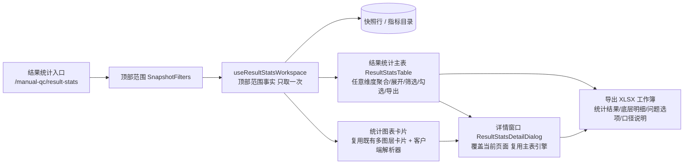

# 人工质检标注验收结果统计与详情展开

## 状态

- 本轮阶段：R1 已确认 → R2 已按两轮架构反馈收敛修订，待整体确认（当前无开放决策）
- 审查入口：本文件 `workspaces/reviews/manual-qc-result-stats/review.md`（唯一）
- R2 可实施方案：已按两轮反馈修订，待整体确认
- 产品代码：未修改

---

## 原始请求要点（事实）

用户提出实现"前端显示完整的人工质检标注验收等流程的结果统计和详情展开表"，属前后端完整开发：

- 后端能有效吐出前端想要的统计信息；
- 前端需考虑查询效率、结果复用性和日常使用频次，决定接口和数据形式；
- 需要优质公共表格组件：多维度聚合和展开、各列筛选、聚合展开行勾选、点击某些列打开详情；
- 详情里复用公共表格组件，对选中行数据做更细粒度的展开和统计；
- 需要公共统计图表卡片，对聚合和展开数据做多维度呈现分析，支持编辑、点击交互；
- 后端接口和类需要高内聚、低耦合、可扩展；
- 先形成需求理解和技术方案，做成可逐步审查的本地 `review.md`；需求未确认前不得把技术选择写成已批准规格，方案未确认前不得修改产品代码。

---

## 本轮修订

- 主要矛盾重新表述为：形成**可复用的多维结果分析能力**，公共表格与公共统计图表卡片是真实产品能力，不是一次性页面，也不是把原始需求拆成只完成一小点的纵切。
- 补入日常使用方式：默认按项目+任务显示（日期/组/标注员默认聚合）、可重新选择聚合维度、任意未展开维度可展开、同时支持整批整列展开与单行展开且不同分支可选不同维度、非指标列也要有筛选、勾选的第一项明确动作是导出。
- 明确详情形态：所有合法统计数值列都可作为详情入口；详情是覆盖当前页面的独立窗口，上方对当前行每个未锁定维度各放一张图（每张图先只展开一个维度），下方用公共多维表格显示明细并可继续任意展开。
- 明确图表能力：可编辑坐标轴、图表类型、数据范围、维度、大小和布局；点击图表联动详情表。
- 明确指标口径：验收完成率是当前范围的整体完成率，不按 Good/Bad 拆；验收通过率需能分别观察整体、Good 和 Bad。
- 明确数据与复用：覆盖当前快照表全部数据及符合业务语义的可计算统计指标，不再让用户挑选字段；同一顶部范围数据尽量只取一次，主表、筛选、聚合、展开、详情、图表和导出共同复用。
- 表达调整：按"问题 → 使用 → 能力 → 数据与规则 → 范围与完成标准"一条自然逻辑组织；不混用面向用户的流程与面向实现的模块；范围与完成标准用分类表格合并表达；真正需要技术选择的内容留到 R2。

---

## R1 需求理解

### 1. 背景与主要问题

主要矛盾是形成一套**可复用的多维结果分析能力**。现有工作台已有业务总览、多图层统计图、任务分析表和指标详情等只读分析，但结果分散、各区域各自取数，缺少一个从"标注产出 → 验收进度 → 验收结论"连贯的结果统计与详情展开视图。本次要沉淀的公共多维表格与公共统计图表卡片是真实产品能力，供主表、详情等后续能力复用，而不是一次性页面。

### 2. 用户怎样使用

- 打开结果统计页，默认按**项目和任务**显示；每个任务唯一属于一个项目，两者同显不增加行数；日期、组、标注员默认聚合；
- 可重新选择哪些维度聚合；展开不依赖预设顺序，使用者可对任一尚未展开的维度任意展开；
- 既支持把当前一批同层行按某个维度整列展开，也支持只让某一行按某个维度展开；不同分支可以选择不同维度；
- 不只是指标列，其他适合筛选的列也提供筛选能力；
- 表格行支持勾选，当前明确的批量动作只有**导出**，不虚构其他批量动作；
- 点击任一合法统计数值列打开详情：详情是覆盖当前页面的独立窗口，上方针对当前行每个尚未锁定的维度各放一张图（每张图先只展开一个维度），下方用公共多维表格显示明细并可继续按任意剩余维度展开；
- 统计图表卡片可编辑坐标轴、图表类型、数据范围、维度、大小和布局；点击图表可联动详情表。

### 3. 产品需要哪些能力

| 能力 | 说明 |
|---|---|
| 多维结果统计主表 | 覆盖标注与验收全流程结果；默认项目+任务显示、日期/组/标注员聚合；可重新聚合；任意未展开维度展开；整批整列展开与单行展开；各适合筛选的列均可筛选；行勾选与导出 |
| 详情展开 | 由任一合法统计数值列进入；覆盖当前页面的独立窗口；上方对每个未锁定维度各放一张图、每张图先展开一个维度；下方公共多维表格显示明细并支持继续任意展开 |
| 统计图表卡片 | 对聚合/展开数据做多维度呈现；支持编辑坐标轴、图表类型、数据范围、维度、大小和布局；点击图表联动详情表 |
| 数据复用 | 同一顶部范围数据尽量只取一次，主表、筛选、聚合、展开、详情、图表与导出共同复用，避免各区域重复查询 |

### 4. 数据与业务规则

- 覆盖当前快照表全部数据，以及从这些数据能够计算且符合业务语义的标注、验收统计指标；字段不必用户逐项挑选；
- `scene_name` 是标注任务名/批次名，不是项目；`project_name` 是项目；每行快照粒度是 `stat_date × project_name × scene_name × group_name × employee_id`；
- 百分比 = 聚合后的总分子 ÷ 总分母，禁止平均行百分比；分母为零返回 `null`，页面显示 "—"；
- 问题信息保留"问题标签 → 问题选项"两层；问题选项可能多选，占 Bad 比例之和不保证等于 100%；
- 验收完成率是当前范围的整体完成率，不按 Good/Bad 拆；验收通过率需能分别观察整体、Good 和 Bad；
- 同一顶部范围的数据尽量只取一次，主表、筛选、聚合、展开、详情、图表与导出共同复用，不让各区域重复查询。

### 5. 范围与完成标准

| 类别 | 必须覆盖 | 完成标准（可观察结果） |
|---|---|---|
| 结果统计主表 | 标注与验收全流程结果；默认项目+任务、日期/组/标注员聚合；重新聚合与任意维度展开；整批整列展开与单行展开；各列筛选与排序；行勾选与导出 | 选定范围后主表显示全流程结果，可重新聚合、任意展开、筛选、排序、勾选并导出 |
| 详情 | 所有合法统计数值列均可作为入口；覆盖当前页面的独立窗口；上方每个未锁定维度一张图、每图先展开一个维度；下方公共多维表格明细并可继续任意展开 | 点击任一合法统计数值列打开独立详情窗口，图与表数据一致，可按剩余维度继续展开与统计 |
| 图表卡片 | 对聚合/展开数据多维度呈现；编辑坐标轴、图表类型、数据范围、维度、大小、布局；点击联动详情 | 卡片可编辑并保存，点击图表能联动对应详情表 |
| 指标口径 | 覆盖快照全部数据及符合语义的标注/验收统计指标；完成率整体口径；通过率分别看整体/Good/Bad | 指标与口径经真实数据库/API/页面验证一致 |
| 数据复用 | 同一顶部范围数据尽量只取一次，各区域共同复用 | 同一筛选范围下主表/筛选/聚合/展开/详情/图表/导出取数一致且不重复查询 |
| 后端供给 | 有效供给主表、详情、图表所需统计信息；接口与类高内聚、低耦合、可扩展 | 前端消费与后端接口一一对应；具体接口与数据形式在 R2 确定 |
| 质量与回归 | 现有业务总览、多图层统计图、任务分析表、指标详情继续可用；旧四级接口与 V1 配置作为迁移/回退基线保留；只连接本地实验集群 | 真实 PostgreSQL/API/页面路径验证通过；现有 Python/Vue 测试、类型检查与构建保持通过 |

**边界：** 本次是结果统计与详情展开的只读分析能力，不包含验收操作闭环（采样、下发、状态回查）与验收覆盖矩阵的完整实现。

### 6. 待确认项

本轮反馈已回答原 Q1–Q5：范围覆盖全部可计算的统计指标（原 Q1）；勾选第一项明确动作是导出（原 Q2）；所有合法统计数值列均可进入详情，详情为覆盖当前页面的独立窗口（原 Q3）；图表可编辑并点击联动详情（原 Q4）；同一顶部范围数据尽量只取一次共同复用（原 Q5）。R1 已确认，无开放产品决策。

---

## R2 可实施方案

**状态：已按两轮架构反馈收敛修订，待整体确认（当前无开放决策）。** 依据已确认 R1、产品入口文档与当前源码形成；方案获批前不修改产品代码。

### 系统位置与现状

**产品：** 人工质检本地实验平台（Quality Platform Lab）。**业务模块：** 人工质检标注与验收分析。**本次入口：** 在现有"标注与验收快照"页（`/manual-qc/snapshots`）之外，新增独立"结果统计与详情"页（`/manual-qc/result-stats`），复用同一套顶部范围筛选与既有公共组件。

**当前能力与阻碍：**

- 后端已具备受控分析接口（指标目录 `GET /api/manual-qc/analysis/catalog`、聚合查询 `POST /query`、候选值 `POST /facets`）与快照行/四级聚合接口，指标目录覆盖标注、验收、Good/Bad、问题选项四类指标；SQL 只在 Repository，指标公式由目录与 Repository 统一维护；
- 前端已有通用表格 `DataWorkbench`（TanStack Table：排序、筛选、展开、选择、列状态）与 `HeaderFilter`/`WorkbenchToolbar`/`BaseCheckbox`；已有可编辑、可保存的多图层统计卡片（`DashboardGrid`/`ChartCard`/`ChartBuilderDialog`/`ChartVisualization`）与顶部范围筛选组件 `SnapshotFilters`；
- 现有"任务分析表"是**固定四级路径**（任务→日期→组→标注员），由前端按层调后端查询懒加载；它不支持任意维度聚合/展开、不同分支选不同维度、整批展开、勾选导出，也不承载"完成率整体口径、通过率分 Good/Bad 观察"的新语义；
- 现有统计卡片的数据解析按卡片各自调用后端聚合查询；总览在浏览器汇总原始快照行。**没有**一份"顶部范围事实只取一次、主表/筛选/聚合/展开/详情/图表/导出共同复用"的统一数据面。

### 总体方案

**现状 → 本次改变 → 用户结果：** 现在用户只能在固定四级任务表里逐层下钻、在各自独立取数的图表卡上看统计；本次把"顶部范围原始快照行 + 指标目录"变成一份全页共享事实，新增可复用多维结果统计表、覆盖页面的详情窗口、基于客户端解析的可编辑图表卡和勾选导出。用户选定顶部范围后，主表、筛选、聚合、展开、详情、图表与导出都从同一份事实计算，不再重复查询。

**关键取舍：** 多维度任意聚合与"不同分支选不同维度"的展开、整批展开、勾选导出、详情窗口继续展开，本质是**对一份顶层事实做 OLAP 式切片**，而不是逐层发后端请求。**取数实现是待实验项，不预设数字：** 现有代码按 1000 行分页、10000 行阻止继续加载只是当前实现的临时数字，不代表合理业务上限，不能固化为约束，更不能因此漏数据。实施开始时先用真实数据测量查询耗时、传输体积与浏览器聚合成本，再判断分页与取数形态；在结论出来前，接口与数据契约保持"完整取回全部命中事实或整体失败"，不允许静默丢失部分数据。若实测表明客户端完整取回不可行，再改为后端聚合接口，数据契约不变。指标定义仍由后端目录唯一维护，前端只按目录标签与单位展示并执行"先汇总计数、再算比例"的规则。

### 模块方案

| 所在位置 | 当前职责与现状 | 本次改变 | 改变后的作用 | 上下游 |
|---|---|---|---|---|
| 前端页面 `result-stats/pages/ResultStatsPage.vue`（新） | 无 | 组装顶部范围、主表、详情窗口与图表卡 | 结果统计页的唯一入口，持有全页共享工作台 | 上接路由与 `SnapshotFilters`；下接 `ResultStatsWorkspace`、主表、图表卡 |
| 前端工作台 `useResultStatsWorkspace.ts`（新） | 无 | 一次性取顶部范围快照行 + 指标目录，向全页分发只读事实与目录 | "取一次共同复用"的单一数据面；顶部范围变化才重新取数 | 上接页面范围；下接主表、详情、图表、导出 |
| 客户端聚合引擎 `resultStatsAggregate.ts`（新，纯函数） | 无 | 把快照行按任意维度集合聚合/展开；按"先汇总计数再算比率"计算指标 | 主表、详情、图表、导出共用同一份聚合结果 | 消费快照行 + 目录；产出聚合行与指标值 |
| 结果统计主表 `ResultStatsTable.vue`（新，基于 `DataWorkbench`） | 无 | 多维度聚合与任意维度展开、整批整列展开、各列筛选、聚合行勾选、点击指标列开详情、导出动作 | 公共多维结果表格，可被主表与详情窗口复用 | 上接工作台；下接详情与导出 |
| 详情窗口 `ResultStatsDetailDialog.vue`（新） | 无 | 覆盖当前页面的独立窗口：上方对当前行每个未锁定维度各放一张图（每图先只展开一个维度）；下方用主表同款表格继续按任意剩余维度展开 | 所有合法统计数值列的详情入口 | 上接主表；复用聚合引擎、表格与图表组件 |
| 图表卡解析 `resultStatsChart.ts`（新，复用既有卡片壳） | 既有卡片走后端查询解析 | 增加"从共享事实集在客户端聚合"的解析器 | 图表卡对聚合/展开数据做多维呈现，编辑与点击联动详情 | 复用 `DashboardGrid`/`ChartBuilderDialog`/`ChartVisualization`；点击联动详情窗口 |
| 导出 `resultStatsExport.ts`（新） | 无 | 把选中/当前结果导出为 **XLSX 多工作表工作簿**（统计结果、底层明细、问题选项明细、口径说明）；同步生成，不设计导出队列或异步任务 | 勾选聚合行后的第一项批量动作 | 消费共享事实、当前视图与目录 |
| 共享表格 `DataWorkbench`（复用，小增强） | 排序/筛选/展开/选择/列状态 | 扩展"按当前未展开维度展开"的交互契约（事件与可选控件） | 主表与详情窗口共用同一表格内核，不另写平行表格 | 上接领域表格；下接 TanStack 状态 |
| 共享统计卡片（复用） | 编辑坐标轴/图表类型/数据范围/维度/大小/布局、保存恢复 | 不改卡片模型；只换解析器数据源 | 结果统计页与现有快照页共用同一卡片能力 | 上接页面；下接 `t_portal_view_config` 持久化 |
| 后端（复用为主） | 快照行读取在 `SnapshotRepository`/`SnapshotQueryService`，指标目录与受控查询在 `src/manual_qc/analysis/`，卡片配置在 `ViewConfigRepository/Service` | 主要复用，不新建后端领域模块；导出默认 XLSX 需在前端引入工作簿库 | 快照数据访问继续由现有 `SnapshotRepository` 提供，**不新建职责重叠的 Repository**；接口与 Service 按业务功能归属人工质检快照统计，**不创建泛化的 `analysis` Service**；`manual_qc` 下**不新增 `snapshot`/`snapshot_statistics` 拆分的平行目录**，快照刷新、Repository、对外 Service 与统计规则在同一模块内按文件职责组织 | 上接 Router→Service→Repository→PostgreSQL |

### 关键流程与数据

**数据面与取数边界：** 顶部范围（日期、项目、任务、组、员工）确定后，`useResultStatsWorkspace` 只取一次：快照行与指标目录。主表、筛选、聚合、展开、详情、图表、导出全部从这份事实派生；顶部范围变化才重新取数。任何区域内操作（筛选、展开、勾选）不再发查询。**完整性由接口保证：** 成功响应就代表已取齐全部命中事实，取不齐就整体失败并显式暴露原因；不增加 `complete`、`loaded` 一类标志，不设计局部结果或运行时备用数据路径。**取数形态先实验再定：** 现有代码的 1000 行分页与 10000 行守卫只是临时实现，不作为业务约束；实施开始时测量真实查询耗时、传输体积与浏览器聚合成本后，再决定沿用"分页取齐后在浏览器聚合"还是改为"服务端聚合后回传"。

**主表默认与调整：** 默认按"项目 + 任务"显示（任务唯一属于一个项目，同显不增加行数），日期、组、标注员默认聚合；可重新选择聚合维度集合。展开不依赖预设顺序：对尚未展开的维度可任选其一展开；既支持把当前一批同层行按某维度整列展开，也支持只让某一行按某维度展开，不同分支可选不同维度。问题标签→选项作为可展开的末级维度保留。

**筛选与勾选：** 不只是指标列，维度列（日期/项目/任务/组/标注员/问题标签/选项）与数量、比率列都提供筛选；表头筛选默认只影响明细，沿用既有"表头默认明细、可无损提升"约定。表格行支持勾选，勾选后的第一项明确批量动作是**导出**，不虚构其他批量动作。

**详情窗口：** 所有合法的统计数值列都可作为详情入口。点击后打开覆盖当前页面的独立窗口：上方针对当前行**尚未锁定**的每个维度各放一张图，每张图先只展开一个维度；下方用主表同款表格显示明细，并可继续按任意剩余维度展开。

**图表卡片：** 复用既有可编辑卡片（编辑坐标轴、图表类型、数据范围、维度、大小和布局），数据来自共享事实集；点击图表可联动打开对应详情表。

**导出数据布局（默认 XLSX）：** 导出默认生成 XLSX 工作簿，不用 CSV（避免 Excel 中文乱码，且快照含 JSON 字段）。固定 JSON 指标对象展开为有类型列（如 Good/Bad/选项的 11 个计数键与比例列），不把大段 JSON 塞进单个格子；变长的问题标签→选项数据放入独立"问题选项明细"工作表，用关联键（统计日期+项目+任务+组+标注员）与"底层明细"工作表关联；另设"统计结果"与"口径说明"工作表，口径说明记录筛选范围、数据时间、导出时间与关键指标口径。导出为同步客户端生成，当前没有异步导出需求，不设计导出队列、异步任务或备用导出方式。

**指标口径与一致性：** 验收完成率是当前范围的整体完成率，不按 Good/Bad 拆；验收通过率分别提供整体、Good、Bad 三个口径。百分比一律先对计数求和再算比率（聚合分子÷聚合分母），分母为零返回 `null` 页面显示 "—"；问题选项占 Bad 比例之和不保证等于 100%。指标名、单位、筛选运算符从后端目录读取，前端不维护第二套公式副本。

### 接口与代码组织

接口命名按具体业务功能描述查询或计算的对象，不叫无边界的 `query`/`catalog`/`export`，也不让一个接口包办完整结果、指标定义、聚合统计和导出等多重职责；每个接口只服务一个可说清输入、输出与失败方式的对象：

| 用例 | owner | 输入 | 成功输出 | 失败方式 | 消费者 |
|---|---|---|---|---|---|
| 读取顶部范围快照事实 | 既有 `SnapshotRepository`/`SnapshotQueryService`（不变） | 顶部范围筛选 + 分页参数 | 快照行列表 + `total` + `computed_at`；成功即取齐，取不齐整体失败 | HTTP 4xx/5xx、超时、连接失败；取不齐时显式失败并提示原因，无 `complete`/`loaded` 标志、无局部结果或备用数据路径 | `useResultStatsWorkspace`（全页唯一事实源） |
| 读取指标与维度目录 | 既有 `AnalysisQueryService`（不变） | 无 | 目录（维度 + 指标标签/单位/运算符） | HTTP 错误 | 主表列定义、详情、图表解析、导出口径 |
| 导出勾选行结果工作簿 | 新增 `resultStatsExport.ts`（无新增后端接口，客户端同步生成 XLSX） | 勾选/当前结果、共享事实、目录、范围说明 | XLSX 工作簿下载（统计结果/底层明细/问题选项明细/口径说明） | 浏览器生成失败、文件打开失败 | 用户在 Excel/WPS 打开 |
| 卡片/表格配置保存恢复 | 既有 `ViewConfigRepository/Service`（不变，新增 page key） | page key + 卡片/列配置定义 | 保存/恢复定义响应 | HTTP 4xx/5xx | 结果统计页图表卡、主表列配置 |

**代码组织：** 新增 `src/frontend/src/features/manual-qc/result-stats/`（页面、工作台、聚合引擎、主表、详情、图表解析、导出），领域指标语义留在 feature 内，公共表格/图表能力继续放在 `shared/data-workbench/` 与 `shared/dashboard/`。后端按人工质检领域组织：`manual_qc` 下**不拆 `snapshot` 与 `snapshot_statistics` 两个目录**，快照刷新、Repository、对外 Service 与统计规则在同一 `snapshot` 模块内按文件职责组织；快照数据访问继续由现有 `SnapshotRepository` 提供，不新建职责重叠的 Repository；接口与 Service 按具体业务功能命名并归属人工质检快照统计，不创建泛化的 `analysis` Service；指标权威仍在 `src/manual_qc/analysis/`，不做自由 SQL。

### 迁移与退出

本次**新增**独立页面与能力，不替换、不吸收现有页面：现有"标注与验收快照"页、任务四级表、指标详情侧栏、总览与统计卡片继续可用。共享表格与卡片通过小增强复用，不建立平行组件。新页面使用独立 page key 保存卡片/列配置，不与既有配置混写。无旧路径需要删除；V1 配置迁移与旧四级接口维持既有回退边界不变。

### 验证方案

| 用户结果 | 验证方式 |
|---|---|
| 取数形态实验 | 实施开始时用真实 PostgreSQL/接口测量查询耗时、响应体积与浏览器聚合成本，据此决定分页取齐或在服务端聚合；记录当前临时 1000/10000 数字不能作为方案依据 |
| 顶部范围一次取数、全页共用 | 切换范围只触发一次快照行取数；主表/图表/详情/导出显示同口径数据 |
| 主表默认项目+任务、可重新聚合 | 真实页面核对默认 24 任务；改聚合维度后行数与分组符合预期 |
| 任意维度展开、整批/单行、分支不同维度 | 真实页面逐项操作：整列展开日期、单行展开组、另一分支展开标注员 |
| 各列筛选与勾选导出 | 维度列与指标列筛选生效；勾选行后导出 XLSX 并在 Excel/WPS 打开核对：中文无乱码、数值/日期为真实类型、固定 JSON 展开为列、问题选项变长数据在工作表内按关联键可直接使用、不出现整段 JSON 塞进单格 |
| 详情窗口（每未锁定维度一图 + 明细继续展开） | 点击 Good 占比/完成率/通过率等列，核对上方图与下方明细展开到标注员与问题选项 |
| 图表卡片编辑与点击联动 | 编辑坐标轴/图表类型/数据范围/维度/大小/布局后保存恢复；点击图表打开对应详情 |
| 指标口径 | 用已知确定性种子对账：完成率整体、通过率整体/Good/Bad、零分母 "—"、选项占比之和可超 100% |
| 回归 | `python -m unittest discover -s tests`、前端 `npm test`、`npm run type-check`、`npm run build` 通过；现有快照页不受影响 |

### 确认摘要与尚未实施

**R2 确认项（本轮待一次批准）：**

- 结果统计页 `/manual-qc/result-stats` 新增独立入口，复用顶部范围筛选与既有公共表格/图表组件；
- 顶部范围事实取一次，主表/筛选/聚合/展开/详情/图表/导出共同复用；取数形态由实施开始时的真实测量决定，完整性由接口保证（成功即取齐、取不齐整体失败，无 `complete`/`loaded` 标志与备用路径）；
- 导出默认 XLSX 工作簿（统计结果、底层明细、问题选项明细、口径说明），固定 JSON 展开为列、变长问题选项用独立工作表关联，不同步生成，不引入导出队列或异步任务；
- 后端不新增领域模块、不拆 `snapshot`/`snapshot_statistics` 目录、不新建职责重叠 Repository、不创建泛化 `analysis` Service，指标权威仍在 `src/manual_qc/analysis/`；
- 指标口径：完成率整体、通过率整体/Good/Bad、零分母 "—"、选项占比之和可超 100%。

**尚未实施的边界：** 后端聚合接口（仅在取数实验证明客户端完整取回不可行时再评估）；导出队列、异步任务与备用导出方式（无真实异步需求，不做）；验收操作闭环与覆盖矩阵（不在本次范围）；现有快照页、任务四级表、指标详情、总览与统计卡片不替换、不吸收。方案获批前不修改产品代码。

---

## R2 反馈区

**审查目的：** 确认"结果统计与详情展开"可实施方案能否在不读源码的情况下指出改在哪里、数据怎样流动、模块为何这样分。

**当前待审：** 本 R2 全节（系统位置、总体方案、模块表、关键流程、接口表、迁移退出、验证方案、确认摘要与尚未实施）。

**可选决定：**
- 批准 R2，进入实施（确认摘要即待批准范围）；
- 修订方案，说明修订原因与影响；
- 驳回并说明阻塞点。

**反馈将影响：** 模块表、接口与代码组织、验证方案、确认摘要的相应部分；不影响已确认的 R1 需求正文。

**用户反馈占位：** 待人工反馈。
