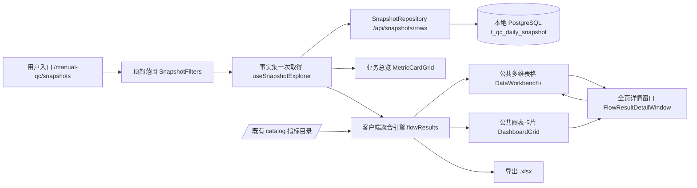

# 人工质检标注验收流程结果统计与详情展开 — 需求与方案审查

- 任务 ID：`qc-acceptance-flow-results`
- 创建时间：2026-08-16
- 修订记录：R1 第二轮修订；R2 第一轮反馈修订
- 产品工程：`../product/`（Quality Platform Lab）
- 当前状态：**R1 已确认；R2 已按两轮反馈修订，待整体确认**

## 一、任务来源与推进阶段

用户要求先形成可逐步审查的需求理解与技术方案，不直接开发；需求未确认前不把技术选择写成已批准规格，方案未确认前不修改产品代码。

本轮处于 **R2 可实施方案**。R1 已由用户确认通过；R2 按技术问题清单定向读取当前实现后形成，方案批准前不修改产品代码。

## 二、用户原始请求（事实）

> 要实现一下前端显示完整的人工质检标注验收等流程的结果统计和详情展开表。这是一个复杂的前后端完整开发内容：
>
> - 后端要能有效吐出前端想要的统计信息；
> - 前端需要考虑查询效率、结果复用性和日常使用频次，决定接口和数据形式；
> - 需要一个优质的公共表格组件，实现多维度聚合和展开、各列筛选、聚合展开行勾选、点击某些列后打开详情；
> - 详情里也要复用公共表格组件，对选中行的数据做更细粒度的展开和统计；
> - 需要公共统计图表卡片，对聚合和展开数据做多维度呈现分析，并支持编辑、点击交互等；
> - 后端接口和类需要高内聚、低耦合、可扩展。
>
> 请先结合当前项目和已有知识，把需求理解和技术方案形成一份可以逐步审查的本地 `review.md`。不要直接开发。

## 三、R1 需求理解（已确认）

> R1 已由用户确认（2026-08-16），本节作为需求基线保留。

> 本轮修订：主要矛盾从"完成一个小切片"调整为**形成可复用的多维结果分析能力**，公共表格与公共统计图表卡片是真实产品能力，不是一次性页面；补充分组、任意维度展开、整列/单行展开、勾选导出、列筛选范围、详情独立窗口、图表编辑与联动，以及验收完成率/通过率口径；明确同一顶部范围数据一次取用、共同复用；删除面向实现的模块分层，把技术选择留给 R2。

### 1. 要解决的问题

质检相关人员要从标注到验收看完整流程的结果，并按自己的方式汇总、下钻和继续分析。

当前产品已能运行一条只读分析链：快照数据进入本地 PostgreSQL，页面上有业务总览、多图层统计图、任务分析表（任务 → 日期 → 组 → 标注员）和指标详情。但结果分散在不同页面块和固定下钻路径里，用户要拼出完整流程结果只能跨多个图表手动对照；分析能力与具体页面绑定，无法在详情等场景复用。

最值得解决的矛盾：把分散的分析收敛为**可复用的多维结果分析能力**——一张主视图按任意维度聚合与展开，勾选与导出，点击任意统计列进入复用同一套能力的独立详情窗口，公共表格和公共图表卡片成为真实可复用的产品能力，而不是一次性页面。

### 2. 用户怎样使用

- 打开流程结果页面，先选顶部范围：日期、项目、标注任务、组、人员。
- 默认按**项目 + 任务**显示；每个任务唯一属于一个项目，同时显示项目与任务不增加行数。日期、组、标注员默认聚合。
- 需要时重新选择哪些维度聚合；展开不依赖预设顺序，可任意选择尚未展开的维度。
- 既可以把当前一批同层行按某个维度**整列展开**，也可以只让**某一行**按某个维度展开；不同分支可以选择不同维度。
- 对适合筛选的列做筛选（不只指标列）。
- 勾选需要关注的行，第一项明确动作是**导出**；当前不虚构其他批量动作。
- 点击任意**合法的统计数值列**打开详情；详情是覆盖当前页面的独立窗口。
- 详情窗口上方针对当前行尚未锁定的每个维度各放一张图，每张图先只展开一个维度；下方用公共多维表格显示明细，并可继续按任意剩余维度展开。
- 用公共统计图表卡片对聚合与展开数据做多维度呈现；卡片可编辑坐标轴、图表类型、数据范围、维度、大小和布局；点击图表可联动详情表。

### 3. 产品需要哪些能力

| 能力 | 用户行为 | 关键表现 |
|---|---|---|
| 结果统计主视图 | 选择顶部范围与聚合维度 | 一页看全标注 → 验收各环节：标注产出与质量（标注量、Good/Bad 及占比）、验收分配（预期/实际）、验收完成、通过/打回等 |
| 多维聚合与任意展开 | 重选聚合维度；整列展开或单行展开 | 展开不依赖预设顺序，任意选择尚未展开的维度，不同分支可选不同维度；指标随粒度变化，下级继承上级上下文 |
| 列筛选 | 对适合筛选的列筛选 | 不只指标列，其他适合筛选的列也可筛选；聚合筛选默认只影响明细 |
| 勾选与导出 | 勾选行并导出 | 勾选跨页保持；第一项批量动作是导出 |
| 详情窗口 | 点击任意合法统计数值列打开详情 | 独立覆盖当前页面；上方逐未锁定维度配图，下方公共多维表格继续展开 |
| 公共图表卡片 | 编辑坐标轴/图表类型/数据范围/维度/大小/布局；点击图表 | 对聚合与展开数据多维度呈现；可编辑保存；点击联动详情表 |

### 4. 数据与业务规则

- 覆盖当前快照表的**全部数据**，以及从这些数据能够计算且符合业务语义的标注、验收统计指标；不需要用户逐项挑选字段。
- 百分比＝聚合后的总分子 ÷ 总分母，不平均员工行百分比；分母为零显示"—"；问题选项可多选，占 Bad 比例之和不保证等于 100%；没有统一阈值时不擅自标成风险。
- 验收完成率是当前范围的**整体完成率**，不按 Good/Bad 拆分；验收通过率需要能分别观察**整体、Good 和 Bad**。
- 数据粒度保持 日期 × 项目 × 标注任务 × 组 × 员工；任务唯一属于一个项目。
- 同一顶部范围的数据应尽可能**只取一次**，主表、筛选、聚合、展开、详情、图表和导出共同复用，不让各区域重复查询。
- 顶部范围决定全页数据；表头聚合筛选默认只影响明细，只有可无损表达的条件才允许显式"应用到全页"。

### 5. 范围与完成标准

| 分类 | 本次必须覆盖（范围） | 完成表现（完成标准） |
|---|---|---|
| 结果统计 | 标注 → 验收全流程可计算指标 | 选定范围与维度后得到各环节统计，切换维度即时刷新 |
| 聚合与展开 | 维度重选；整列/单行任意维度展开 | 展开行指标随粒度正确变化，下级继承上级筛选上下文 |
| 勾选与导出 | 跨页勾选 + 导出 | 勾选保持；导出得到当前范围/筛选下的数据 |
| 列筛选 | 适合筛选的列均可筛选 | 筛选后主表、展开与详情一致 |
| 详情窗口 | 所有合法统计数值列可作入口；独立窗口含逐维度图与公共表格明细 | 点击任一并合法统计列打开详情；详情可继续按任意剩余维度展开 |
| 图表卡片 | 编辑与点击联动 | 可编辑保存；点击可联动详情表 |
| 数据复用 | 同一顶部范围一次取用 | 主表/详情/图表/导出共用同一批数据，不重复查询 |
| 回归与安全 | 现有功能与边界不变 | 现有总览/图表/任务分析继续工作；本地实验库边界不变；现有测试基线不回归 |

保持不变的内容：

- 现有业务总览、多图层图表、任务分析表和指标详情继续工作；
- 视图配置保存机制继续复用（保存定义与布局，不保存过期统计结果）；
- V1 配置迁移与旧四级聚合 API 仍作为显式回退边界保留；
- 只读分析定位：本阶段不引入数据写入、采样下发或执行闭环；
- 本地实验 PostgreSQL 边界：不连接材料中的内部数据库、Delta、OBS、SSO 或生产地址。

### 6. 仍需确认的问题

前一轮的五个问题已由本次反馈覆盖（环节范围＝快照全部数据及可计算指标、缺口不再是唯一详情入口、勾选用途＝导出、详情粒度＝任意剩余维度展开至明细、公共组件＝真实复用能力）。另两项（导出内容与组织、点击图表联动语义）已在 R2 中给出有依据的推荐方案并确认，见第四节"R2 确认项"。R1 已确认通过。

## 四、R2 可实施方案（已按两轮反馈修订，待整体确认）

> 第一轮修订：分页实现不以当前 1000/10000 临时值为依据，先用真实数据量实测传输/延迟/浏览器成本再决定，且任何方式都保证范围内数据完整、不漏行；不创建泛化的 `analysis` Service，不新建职责重叠的 `AnalysisRepository`，后端按 `manual_qc` 领域组织，快照数据访问继续由现有 `SnapshotRepository` 提供。
>
> 第二轮修订：`manual_qc` 下不拆 `snapshot` 与 `snapshot_statistics` 两个目录，快照刷新、Repository、对外 Service 与统计规则在同一 `snapshot` 模块内按文件职责组织；结果完整性由接口保证，成功即取齐、取不齐整体失败并暴露问题，不加 `complete`/`loaded` 标志、不做局部结果或备用数据路径；接口与计算用具体业务对象命名，一个接口只承担一个清晰职责；默认导出 XLSX 并明确固定 JSON 与变长问题选项的可直接用结构；不设计导出队列或异步任务。

### 1. 系统位置与现状

产品是人工质检平台本地实验工程（Quality Platform Lab），业务模块为人工质检标注与验收只读分析。用户入口是单页 `/manual-qc/snapshots`（`SnapshotPage.vue`），自上而下：顶部范围（日期、项目、标注任务、组、标注员）→ 业务总览（`MetricCardGrid`，浏览器聚合快照行）→ 统计图表卡（`DashboardGrid`，后端受控查询）→ 任务分析表（`TaskAnalysisWorkspace`，后端懒加载四级下钻）。

本次改变的位置：把**任务分析表演进为"流程结果工作区"**，并新增覆盖全页的**详情窗口**；公共多维表格与公共统计图表卡片成为真实可复用能力。

- `U → F`：顶部范围定义全页快照范围（既有不变）。
- `F → S`：按范围一次取得完整快照行作为共享事实集；获取方式（一次取齐或分页分批）按真实数据量实测决定，保证范围内数据完整、不漏行。
- `S → O`：业务总览继续从事实集聚合（既有不变）。
- `S → AG`：客户端聚合引擎按任意维度子集分组求和并解析全目录指标，统一供给主表、详情、图表与导出。
- `AG → T / C / V / X`：四类消费者共用同一事实集与同一口径，不各自重复查询。
- `CAT → AG`：指标与维度定义（id、label、unit）来自既有 catalog 接口。
- `T → V / C → V`：点击统计列或图表分类值打开全页详情窗口。

### 2. 总体方案

现状能力：单页只读分析——总览浏览器聚合、图表服务端查询、任务表服务端懒加载。本次改变：任务表演进为流程结果工作区，一次取得完整快照行（获取方式按真实数据量实测决定），客户端多维聚合引擎统一计算主表、筛选、聚合、展开、详情、图表与导出；公共表格支持任意维度展开、勾选导出与全列详情入口；公共图表卡片从共享事实集解析；详情升级为覆盖全页窗口。用户结果：在任意维度组合上看到标注 → 验收全流程统计，任意展开、勾选导出、点任一统计列看详情、用可编辑图表卡继续分析，同一范围内数据只取一次、不漏行。

复用与改变清单：

- **继续复用**：顶部范围与快照拉取（`useSnapshotExplorer`）、业务总览、图表卡外壳（`DashboardGrid`/`ChartCard`/`ChartVisualization`/`ChartBuilderDialog`）、视图配置持久化（`t_portal_view_config`）、后端 `rows`/`catalog`/`facets`/`view-config` 接口、`DataWorkbench` 的排序/筛选/勾选/列管理/视图状态。后端按 `manual_qc` 领域组织，快照数据访问继续由现有 `SnapshotRepository` 提供。
- **需要增强**：`DataWorkbench` 增加任意维度展开与导出动作；客户端指标计算从 `snapshotOverview` 提升为覆盖全目录（含问题选项）的单一解析器。
- **迁移后退出**：任务分析表（`TaskAnalysisWorkspace`/`TaskAnalysisTable`/`useTaskAnalysisTree`）与指标详情抽屉（`TaskMetricDetailDrawer`/`useTaskMetricDetail`）被吸收，删除条件见第 6 节。
- **有待实测**：事实集获取方式（传输大小、延迟、浏览器成本，用当前 3024 行真实数据量先实验再定分页实现）；客户端聚合与后端 `analysis` 接口在代表性组合上的数值对账；浏览器渲染与展开性能；导出文件用 Excel 真实打开。

### 3. 模块方案

| 所在位置 | 当前职责与现状 | 本次改变 | 改变后的作用 | 上下游 |
|---|---|---|---|---|
| `SnapshotPage.vue` | 组合总览/图表/任务表，处理图表下钻与"应用到全页" | 任务表区替换为流程结果工作区；持有全页详情窗口状态 | 页面根，定义顶部范围与整体数据流 | 顶部范围、流程结果工作区 |
| `useSnapshotExplorer` | 拉取聚合与快照行，生成选项 | 事实集获取方式按真实数据量实测决定（一次取齐或分页分批），保证完整不漏行 | 提供共享事实集与顶部范围 | 总览、流程结果工作区 |
| `flowResults` 聚合引擎（新增，feature） | 无 | 新增：按维度子集分组求和、全目录指标解析（含问题选项）、筛选 | 主表/详情/图表/导出的唯一数据计算源 | 共享事实集、catalog |
| 流程结果工作区（新增，feature） | 无 | 新增：维度管理、主表组装、图表卡区域、导出动作、详情入口 | 流程结果多维分析界面 | 聚合引擎、公共表格、公共图表 |
| `DataWorkbench`（共享） | 排序/筛选/勾选/懒加载展开/列管理/视图状态 | 增强：任意维度展开（维度选择）、导出按钮与事件 | 公共多维表格 | 流程结果主表与详情表 |
| `FlowResultDetailWindow`（新增，feature） | 无 | 新增：覆盖全页窗口；逐未锁定维度配图 + 公共表格继续展开 + 导出 | 全页详情 | 聚合引擎、公共表格、图表 |
| shared/dashboard 图表卡 | 卡片外壳/布局/编辑/持久化，服务端解析 | 新增事实集解析器（复用外壳） | 公共图表卡片，对聚合与展开数据多维度呈现 | 聚合引擎 |
| 后端 `manual_qc/snapshot` 模块（快照/既有 analysis 兼容入口/视图配置） | 快照行、catalog、facets、view-config 接口 | 无新增端点或类；快照数据访问继续由现有 `SnapshotRepository` 提供；不另设 `snapshot_statistics` 目录 | 事实集、指标定义、候选值、配置持久化 | 前端 |

### 4. 关键流程与数据

**一次取数、共同复用**：顶部范围确定后，前端需要取得范围内完整快照行作为共享事实集。获取方式（一次取齐、分页分批或服务端聚合）不以当前 1000/10000 临时值为依据，先用当前真实数据量（3024 行）实测查询效率、传输大小、延迟与浏览器渲染成本，据此决定分页实现；任何方式都必须保证范围内数据完整、不漏行，不把临时数字固化为业务上限。主表、表头筛选、聚合切换、展开、详情、图表卡与导出全部从该事实集经聚合引擎计算；范围不变不重新取数，范围变化才重新获取一次。

**默认与可调整路径**：默认聚合"项目 + 标注任务"（任务唯一属于项目，两列同显不增加行数）；日期、组、标注员默认聚合。用户可重选当前聚合维度；展开不依赖预设顺序，可把一批同层行按某维度整列展开，也可只让某一行展开，不同分支可选不同维度；某行已锁定的维度不再出现在其展开选项中。

**指标口径**：客户端解析器与后端 `catalog`/`repository` 语义一致——数量用计数合计；比率用聚合后的总分子 ÷ 总分母，分母为 0 → `null` 显示"—"；验收完成率是当前范围整体口径（Good+Bad 合计，不拆分）；验收通过率可分别观察整体、Good、Bad（`acceptance.pass_rate` 与 `good.*`/`bad.*` 指标）；问题选项多选，占 Bad 比例之和可超过 100%。所有合法统计数值列（目录中的数值指标）都可作为详情入口。

**完整性**：结果完整性由接口保证——成功即取齐范围内全部数据，取不齐则整体失败并显式暴露问题，不消费半份结果、不漏行。不增加 `complete`、`loaded` 一类完成标志，不设计局部结果或运行时备用数据路径，避免掩盖正确性问题。

**导出**：勾选行是第一个批量动作，用于标记关注行；默认导出当前范围与筛选下的全部统计行，勾选的聚合行导出其全部下级明细。默认导出 **XLSX**（避免 CSV 在 Excel 中因编码出现中文乱码），一个工作簿多张工作表，JSON 字段不塞进单个格子：

- ①统计结果：当前筛选后的聚合行，稳定标量展开为有类型列。
- ②底层明细：当前范围与筛选下的完整快照行，关联键为 日期×项目×标注任务×组×标注员；顶层字段与固定结构 JSON（`good_metrics`/`bad_metrics` 的 11 个计数键 + conclusion + exec_status）逐列展开为有类型列（计数为数值、结论/状态为枚举），不做 JSON 序列化文本列。
- ③问题选项明细：变长结构 `option_metrics`（问题标签 → 问题选项 → 指标）拆成独立工作表，每行一个"问题标签 × 问题选项"组合，关联键为快照行唯一键（stat_date, scene_name, group_name, employee_id），指标为有类型列；不做大段 JSON 塞一格。
- ④口径说明：筛选范围、数据时间、导出时间、比率口径。

导出为浏览器内同步生成下载；当前没有异步导出需求，不设计导出队列、异步任务或备用导出方式。导出库选型在实现时按目标软件（Excel）兼容性对候选（`xlsx`/`exceljs`）实测后确定，不预先写死。

**详情窗口**：点击任一合法统计数值列打开覆盖当前页面的独立窗口。上方对当前行未锁定的每个维度各放一张图（每张图先只展开该维度），展示所点指标在该维度下的分布，通过率指标支持整体/Good/Bad 切换；下方用公共多维表格展示当前行子范围明细，可继续按任意剩余维度展开、筛选、勾选与导出。点击图表中的维度值 → 在详情内锁定该值并刷新下方明细。

**图表卡片**：复用 `DashboardGrid`/`ChartCard`/`ChartBuilderDialog` 外壳，新解析器从共享事实集客户端聚合；支持编辑坐标轴、图表类型、数据范围（筛选）、维度、大小与布局；定义与布局保存到独立 page key（`manual-qc-flow-results`），重开页面用最新事实集重算。点击图表分类值 → 联动详情窗口。

### 5. 接口与代码组织

本需求属于**人工质检快照统计**。后端按 `manual_qc` 领域组织：快照数据访问继续由现有 `SnapshotRepository`/`SnapshotQueryService` 提供；不创建泛化的 `analysis` Service（名称无业务边界），也不新建职责重叠的 `AnalysisRepository`。`manual_qc` 下不拆 `snapshot` 与 `snapshot_statistics` 两个目录：快照刷新、Repository、对外 Service 与统计规则都强相关，在同一 `snapshot` 模块内按文件职责组织。指标与维度定义由既有 catalog 提供，视图配置由 `ViewConfigRepository`/`Service` 提供；这些均为既有能力，标记"既有不变"，不扩展为新的泛化服务。

接口命名与职责：每个接口和计算都以具体业务对象命名，一个接口只承担一个清晰用例，不出现泛化的 `query`、`catalog`、`export` 万能入口，也不让单个接口包办完整结果、指标定义、聚合统计与导出。完整结果（事实集）由 `rows` 接口提供、指标定义由 catalog 提供、聚合统计与导出为客户端具名本地用例，各自独立。既有 `analysis/query` 与 `analysis/catalog` 泛化命名仅作为既有图表卡的兼容入口保留，不作为本次流程结果的目标 owner；目标责任归人工质检快照统计领域。

复用既有接口（标注"既有不变"）：

| 用例 | owner | 输入 | 成功输出 | 失败方式 | 消费者 |
|---|---|---|---|---|---|
| 完整快照事实集（既有不变） | `SnapshotQueryService`/`SnapshotRepository`，`GET /api/snapshots/rows` | 顶部范围筛选 + 分页 | 18 字段完整行（含 good/bad/option 嵌套计数）、`total`、`computed_at` | 422 参数错误；网络/服务错误 | `useSnapshotExplorer` → 流程结果事实集（一次取得完整集合） |
| 指标与维度目录（既有不变） | 既有 analysis 模块，`GET /api/manual-qc/analysis/catalog` | 无 | dimensions/metrics 定义（id、label、unit、是否需问题选项参数） | 网络/服务错误 | 主表列定义、图表编辑器 |
| 候选值（既有不变） | 既有 analysis 模块，`POST /api/manual-qc/analysis/facets` | scope、dimension_id、questionLabel | 候选值列表 | 422/网络/服务错误 | 表头精确多选、图表拆分 |
| 视图配置读写（既有不变） | `ViewConfigRepository`/`Service`，`/api/view-configs/*` | pageKey + 定义 | 配置响应或 204 | 网络/服务错误 | 流程结果列配置、图表卡保存 |

说明：后端不新增任何端点或类。`analysis` 模块保持现状继续服务既有图表卡（兼容入口），本次流程结果的目标责任归人工质检快照统计领域，不新增泛化服务，也不迁移其职责到新建类。

客户端本地用例（**无新增后端接口**）：

| 用例 | owner | 输入 | 成功输出 | 失败方式 | 消费者 |
|---|---|---|---|---|---|
| 多维聚合 | `flowResults` 聚合模块（feature） | 事实集、维度子集、指标引用、筛选 | 聚合行（维度 + 数量/比率，比率＝总分子÷总分母，分母 0 → null） | 未知指标/维度 → 显式报错 | 主表、详情、图表、导出 |
| 全目录指标解析 | `flowResults` 指标模块（覆盖 annotation/acceptance/good/bad/option） | 指标引用 + 分组总量 | 数量或比率 | 未知指标 → 显式报错 | 聚合引擎、总览（迁移点） |
| 任意维度行展开 | `flowResults` composable | 行 + 可选维度 | 该行按维度展开的子行 | 无剩余维度 → 无子行 | 主表 `DataWorkbench` |
| 流程结果导出（XLSX 工作簿生成） | 导出模块（feature，xlsx） | 统计行、底层明细、问题选项明细、筛选摘要 | 四工作表 XLSX 下载（统计结果 / 底层明细 / 问题选项明细 / 口径说明） | 无数据/生成失败 → 显式提示 | 主表与详情导出 |
| 详情图表解析 | `FlowResultDetailWindow` | 当前行、所点指标、事实集 | 逐未锁定维度图表数据 | 无数据 → 空图占位 | 详情窗口 |
| 流程结果图表解析 | `resolveFlowChartCard` | 卡片定义 + 事实集 + catalog | `DashboardChartResult` | 未知指标 → 报错 | `DashboardGrid` |

### 6. 迁移与退出

- 流程结果主表吸收任务分析表职责：默认"项目 + 标注任务"路径即等价旧任务表顶层；固定问题选项列、列配置保存（独立 page key）、"生成统计卡片/应用到全页"事件全部迁移到新表。
- 删除条件（全部满足后删除旧实现与对应测试）：新表默认路径、固定选项列、列配置持久化、导出、全列详情入口、生成统计卡片与应用到全页均在真实页面验证通过。删除对象：`TaskAnalysisWorkspace`、`TaskAnalysisTable`、`useTaskAnalysisTree`、`useTaskMetricDetail`、`TaskMetricDetailDrawer`。
- 保留：`useSnapshotExplorer`（顶部范围与事实集）、业务总览、既有图表卡（服务端解析）、既有 analysis 模块与旧四级聚合 API（继续服务图表卡与 sceneOptions/projectOptions，作为兼容入口保留），不新建重叠的 Repository。
- 客户端指标计算统一：`snapshotOverview` 的指标计算迁移到新的单一解析器，总览与流程结果共用，消除两份公式副本。

### 7. 验证方案

| 用户结果 | 真实证据 |
|---|---|
| 事实集获取方式与数据完整 | 用当前真实数据量（3024 行）实测一次取齐/分页的传输大小、延迟与浏览器渲染成本，据此决定分页实现并记录；主表总行数与导出明细行数均与后端 `total` 对账一致，不漏行 |
| 一次取数、共同复用 | 范围不变时，主表/展开/详情/图表/导出不再发 `rows` 请求（Network 面板计数）；范围变化仅重新获取一次 |
| 聚合口径正确 | 客户端聚合与后端 `analysis` 接口在固定组合（task 层、date 层、某问题选项）数值对账一致；比率＝总分子÷总分母、分母 0 显示"—" |
| 默认与任意展开 | 页面默认"项目 + 任务"（24 个任务行，不因项目列增加行数）；整列/单行按任选维度展开，不同分支不同维度 |
| 列筛选 | 表头筛选后主表/展开/详情一致；聚合筛选默认只影响明细，可无损条件可"应用到全页" |
| 勾选与导出 | 勾选行导出；XLSX 用 Excel 真实打开，验证中文无乱码、日期/数值类型、固定 JSON（good/bad）展开为有类型列、变长问题选项在独立明细表可透视关联、无大段 JSON 塞格、口径说明区、代表性数据量；导出为同步生成，无队列/异步任务 |
| 全列详情入口 | 点击任一统计数值列打开全页详情；上方逐未锁定维度图、下方明细继续展开；完成率为整体口径，通过率可切整体/Good/Bad |
| 图表卡编辑与联动 | 编辑坐标轴/类型/数据范围/维度/大小/布局并保存，刷新恢复；点击图表联动详情 |
| 规模与回归 | 3024 行事实集下浏览器流畅；现有 Python/Vitest 基线不回归；真实浏览器（Edge/Chrome）验证弹层、滚动、图表尺寸 |

### 8. R2 确认项与尚未实施边界

**R2 确认项**（一次批准的方案摘要）：

1. **页面形态**：在现有单页内把"任务分析表"演进为"流程结果工作区"（吸收旧表并给出删除条件），不新建独立页面或路由。
2. **数据与取数**：同一顶部范围一次取得完整快照行作为共享事实集，主表/筛选/聚合/展开/详情/图表/导出共同复用；获取方式（一次取齐或分页分批）以真实数据量实测决定，成功即取齐、取不齐整体失败，不加完成标志、不漏行。
3. **聚合与展开**：客户端聚合引擎统一计算；默认"项目 + 标注任务"，任意维度展开（整列/单行、分支不同维度），列筛选覆盖适合筛选的列。
4. **勾选与导出**：勾选为第一批量动作（导出）；默认导出当前范围与筛选下全部统计行；默认 XLSX 多工作表（统计结果 / 底层明细 / 问题选项明细 / 口径说明），固定 JSON 展开为有类型列、变长问题选项独立成表，不做 JSON 塞格；同步生成，不建队列或异步任务。
5. **详情窗口**：点击任一合法统计数值列打开覆盖全页的详情；上方逐未锁定维度配图、下方公共表格继续展开；完成率为整体口径，通过率可切整体/Good/Bad。
6. **公共图表卡片**：复用图表卡外壳，新增事实集解析器；可编辑坐标轴/类型/数据范围/维度/大小/布局并保存，点击联动详情。
7. **后端领域组织**：后端无新增端点或类；快照数据访问沿用 `SnapshotRepository`；不拆 `snapshot`/`snapshot_statistics` 目录，统计规则与数据访问在同一 `snapshot` 模块按文件职责组织；不创建泛化 `analysis` Service 或重叠 `AnalysisRepository`。

**尚未实施边界**：

- 本方案（R1 需求 + R2 方案）尚未实施任何产品代码，开发将在 R2 确认后由 `develop-with-knowledge` 按已确认方案进行。
- 本次不实现：异步导出/导出队列、服务端聚合统计端点、独立新页面或路由、多用户权限与共享视图、采样下发与执行闭环、缓存与物化视图。
- 旧任务分析与指标详情抽屉在删除条件（第 6 节）全部满足后才删除；在此之前保持现有行为。
- 待实测项：事实集获取方式（传输/延迟/渲染）、客户端聚合与后端数值对账、3024 行下浏览器性能、导出 Excel 兼容性——这些在实施时先做实验/验证再定型，不预先固化为业务上限。

## 五、状态与下一步

- [x] 唯一审查文件已创建（本文件）
- [x] R1 需求理解已确认
- [x] R2 可实施方案已形成
- [x] R2 已按第一轮反馈修订（分页/后端领域组织三项）
- [x] R2 已按第二轮收敛反馈修订（模块目录/完整性/接口命名/导出/异步五项）
- [ ] R2 可实施方案已确认（待整体确认，当前无开放决策）

下一步：请用户整体确认第四节 R2（两轮修订后版本）与第 8 节确认项；确认后由 `develop-with-knowledge` 实施。本阶段未修改任何产品代码。
