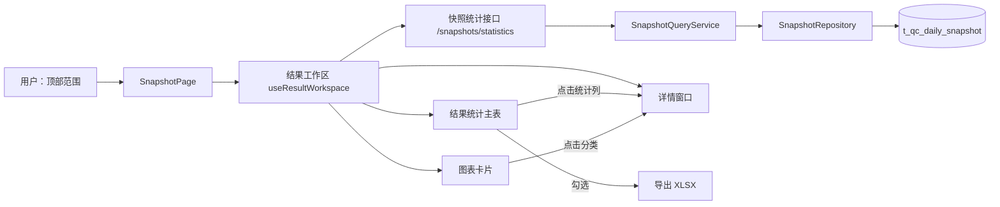
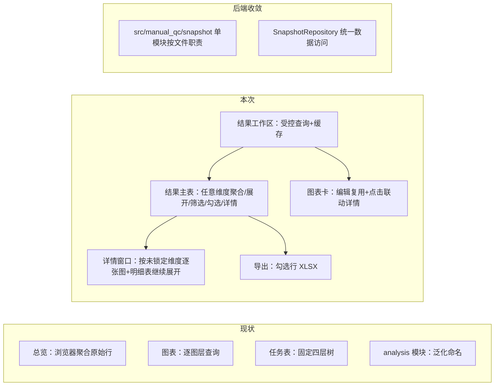

# 人工质检标注→验收流程结果统计与详情展开表 — 需求与方案审查

审查入口：`workspaces/reviews/manual-qc-flow-results/review.md`

阶段状态：**R1 已确认 → R2 已按两轮反馈收敛（待整体确认）**

## 顶部入口

- **审查对象：** 人工质检快照统计：结果统计主表、任意维度聚合与展开、详情窗口、图表联动与勾选导出。
- **当前状态：** R1 已通过；R2 已按两轮人工反馈原位重构，待整体确认。
- **怎样审查：** 从 R2 的确认摘要与尚未实施开始，确认后进入开发；R2 通过前不修改产品代码。
- **内容导航：** 背景与需求 → R1（已确认）→ R2 方案 → 确认摘要与尚未实施。

## 任务

### 原始请求（事实）

在本项目实现前端显示完整的人工质检标注→验收等流程的结果统计和详情展开表，属于复杂前后端开发：

1. 后端要能有效吐出前端想要的统计信息；
2. 前端要考虑查询效率、结果复用性和日常使用频次，决定接口和数据形式；
3. 需要一个优质的公共表格组件，实现多维度聚合和展开、各列筛选、聚合展开行勾选、点击某些列后打开详情；
4. 详情里也要复用公共表格组件，对选中行的数据做更细粒度的展开和统计；
5. 需要公共统计图表卡片，对聚合和展开数据做多维度呈现分析，并支持编辑、点击交互等；
6. 后端接口和类需要高内聚、低耦合、可扩展。

用户要求先形成需求理解和技术方案供逐步审查，不直接开发。

---

## R1 需求理解（已确认）

### 本轮修订记录

按人工反馈原位合入：主线从「流程页面实现」调整为**可复用的多维结果分析能力**；明确默认聚合、任意维度展开、整列展开与单行展开、全列筛选、勾选导出、全统计列详情入口、详情窗口结构、图表卡编辑与点击联动；明确数据全覆盖与一次取数复用；把范围与完成标准合并为分类表格。原 R1-Q1~Q5 已由反馈逐条回答，关闭为确认摘要。

### 1. 要解决什么问题（背景与主要问题）

当前产品是人工质检的只读分析工作台：任务分析表按 任务→日期→组→标注员 固定层级下钻并支持表头筛选、指标详情、列配置保存；总览卡与多图层统计图卡可编辑、复制、拖拽、缩放并保存。

主要矛盾是形成**可复用的多维结果分析能力**，而不是把原始需求拆成只完成一小点的实验性纵切。公共表格和公共统计图表卡片都是真实产品能力，不是一次性页面。现状的阻碍是：

- 表格只做固定层级下钻，不能由使用者任意选择聚合维度与展开方式；
- 指标详情只对单个指标展开，不是「对所有合法统计列可进、按未锁定维度呈现」的统一详情窗口；
- 图表卡通过「当前筛选结果」事件与表格连接，没有可编辑的图表→详情联动；
- 表格与图表各自取数，同一范围的数据缺少一次取用、共同复用的约束。

### 2. 用户怎样使用（目标与使用结果）

- 设定顶部范围（日期/项目/任务/组/标注员）后，结果默认按**项目和任务**显示；每个任务唯一属于一个项目，同时显示项目与任务不会增加行数；**日期、组、标注员默认聚合**。
- 需要时可以重新选择哪些维度聚合；展开不依赖预设顺序，使用者可以任意选择尚未展开的维度。
- 既可以把当前一批同层行按某个维度整列展开，也可以只让某一行按某个维度展开；不同分支可以选择不同维度。
- 不只是指标列，其他适合筛选的列也有筛选能力。
- 表格行支持勾选，勾选后的明确动作是**导出**；本轮不虚构其他批量动作。
- 所有合法的统计数值列都能作为详情入口，不只是某个「缺口」指标。
- 详情是覆盖当前页面的独立窗口：上方针对当前行尚未锁定的每个维度各放一张图，每张图先只展开一个维度；下方用公共多维表格显示明细，并能继续按任意剩余维度展开。
- 统计图表卡片支持编辑坐标轴、图表类型、数据范围、维度、大小和布局；点击图表可以联动详情表。

### 3. 产品需要哪些能力（功能与业务规则）

| 类别 | 能力 | 规则 | 完成表现 |
|---|---|---|---|
| 结果统计主表 | 多维聚合与任意展开 | 默认项目+任务显示，日期/组/标注员默认聚合；可重新选择聚合维度；展开不依赖预设顺序 | 打开页面即见项目×任务的默认结果，可随时切换聚合维度 |
| 展开方式 | 整列展开与单行展开 | 一批同层行可按某维度整列展开；某一行可按某维度单独展开；不同分支可选不同维度 | 使用者能把一批行或单行按任意未展开维度展开，不同分支互不干扰 |
| 筛选 | 各列筛选 | 不只指标列，其他适合筛选的列也可筛选；沿用「表头筛选只影响表，日期/单值条件才可提升全页」 | 适合筛选的列都可筛选并按作用域生效 |
| 行勾选与导出 | 勾选行并导出 | 勾选聚合展开行，明确动作为导出 | 勾选后可导出所选行的结果 |
| 详情入口 | 统计列点击进详情 | 所有合法的统计数值列都可作为详情入口 | 点击任一合法统计列打开对应详情窗口 |
| 详情窗口 | 覆盖页面的独立窗口 | 上方对当前行尚未锁定的每个维度各放一张图，每张图先只展开一个维度；下方用公共多维表格显示明细，可继续按任意剩余维度展开 | 详情中按未锁定维度逐张呈现，明细表可继续任意展开 |
| 统计图表卡片 | 多维呈现、编辑、点击联动 | 可编辑坐标轴、图表类型、数据范围、维度、大小和布局；点击图表联动详情表；保存定义不保存易过期统计 | 卡片可按需编辑并保存，点击图表打开联动详情 |

### 4. 数据与业务规则

- **数据覆盖**：覆盖当前快照表的全部数据，以及从这些数据能够计算且符合业务语义的标注、验收统计指标；不要求用户继续挑选字段。
- **一次取数复用**：同一顶部范围的数据应尽可能只取一次，主表、筛选、聚合、展开、详情、图表和导出共同复用，不因区域不同重复查询。
- **聚合口径**：百分比=聚合后分子÷分母；分母为零返回 null，页面显示「—」；问题信息保留「标签→选项」两层；问题选项多选，占比之和不保证等于 100%。
- **验收完成率**：当前范围的整体完成率，不按 Good/Bad 拆分。
- **验收通过率**：可分别观察整体、Good 和 Bad。

### 5. 范围与完成标准

| 类别 | 范围 | 完成标准 |
|---|---|---|
| 能力形态 | 可复用的多维结果分析能力；公共表格与公共统计图表卡是真实产品能力，可复用、可扩展 | 同一公共表格承载主表与详情明细，图表卡可编辑并点击联动详情；能力不绑定单一页面 |
| 数据覆盖 | 快照表全部数据及可计算的标注/验收统计指标 | 无需用户挑字段即可得到完整统计 |
| 数据复用 | 同顶部范围只取一次，主表/筛选/聚合/展开/详情/图表/导出共用 | 顶部范围不变时各区域不重复查询同一范围数据 |
| 交互路径 | 聚合展开、全列筛选、勾选导出、统计列详情入口、详情内继续展开、图表编辑与点击联动 | 上述路径逐条可真实走通并验证 |
| 保持不变 | 顶部全页范围与应用全页语义；聚合口径与「—」显示；任务表下钻/筛选/列配置保存；总览卡与图表卡 V2 编辑/复制/拖拽/缩放/保存；V1 配置迁移与旧四级 API 回退边界 | 上述现有行为不被本次破坏 |
| 边界外 | 不实现任务下发/执行闭环、采样配额预览与确认、状态回查；不引入缓存、物化视图或专用分析存储 | 边界外能力不在本轮交付 |

### 6. 确认摘要与尚未实施

- R1-Q1（统计边界）→ 已确认：覆盖快照表全部数据及可计算的标注/验收统计指标，不要求挑字段；覆盖矩阵/配额缺口分析不在本轮范围。
- R1-Q2（聚合维度）→ 已确认：默认项目+任务（日期/组/标注员聚合），可重新选择聚合维度，展开不依赖预设顺序。
- R1-Q3（勾选用途）→ 已确认：勾选后的明确动作是导出，不虚构其他批量动作。
- R1-Q4（详情粒度）→ 已确认：详情为覆盖页面的独立窗口，上方按未锁定维度各一张图、先展开一个维度，下方明细表可继续任意展开。
- R1-Q5（公共组件边界）→ 已确认：公共表格与图表卡是真实产品能力；跨 feature 复用边界与抽象层级等属于技术选择，留待 R2。

R1 正文已按上述结论合入。尚未实施的内容仍是本需求的全部目标；R2 前不再开放需求层面问题。

---

## R2 可实施方案（待整体确认）

### 0. R2 修订记录（两轮反馈）

- **第一轮：** 不把现有 1000 行分页 / 10000 行上限固化为业务上限；不创建泛化 `analysis` Service；后端 `src` 按人工质检领域组织，快照数据访问继续由现有快照 Repository 提供，不新建职责重叠的 `AnalysisRepository`。
- **第二轮：** `manual_qc` 下不拆 `snapshot` 与 `snapshot_statistics` 两个目录，全部在 `snapshot` 模块内按文件职责组织；结果完整性由接口保证（成功即取齐、取不齐整体失败并暴露），不增加 `complete`/`loaded` 标志、不做局部结果或运行时备用路径；接口按查询对象命名，不叫泛化的 `query`/`catalog`/`export`，也不让单一接口包办不同职责；默认导出 XLSX 并明确固定 JSON 与变长问题选项的落点，不把大段 JSON 塞进单元格；不设计异步导出、队列或备用导出方式。

### 1. 系统位置与现状

产品：Quality Platform Lab（人工质检只读分析工作台）。页面：`/manual-qc/snapshots`（`SnapshotPage.vue`）。本次改变集中在**结果统计区**（主表、详情、图表联动、导出）及其数据入口与后端组织。

节点职责与本轮变化：

- **用户顶部范围**：定义全页数据范围；本轮不变。
- **SnapshotPage**：组装总览、图表、结果主表与详情；本轮把任务表替换为新主表、把图表点击 drill 改为打开详情。
- **结果工作区（新增，feature composable）**：持有当前范围，按「范围+维度+指标+筛选」缓存快照统计查询结果，是主表/详情/图表/导出的统一取数入口；缓存 key 相同即复用，顶部范围变化时整体失效。
- **快照统计接口（新增业务路径）**：`GET /snapshots/statistics/metrics`、`POST /snapshots/statistics/aggregate`、`POST /snapshots/statistics/filter-options`，由快照统计 Service 提供。
- **结果统计主表（新增，feature 组件）**：默认项目×任务聚合，支持任意维度整列/单行展开、全列筛选、勾选、点击列进详情。
- **详情窗口（新增，feature 组件）**：覆盖页面的独立窗口，上方按未锁定维度各一张图，下方复用主表组件继续展开。
- **图表卡片**：既有编辑能力复用；数据源切到快照统计接口；点击分类从「应用到全页」改为「打开该分类详情」。
- **导出**：前端基于主表已加载行与一次选项聚合查询生成 XLSX，不新增后端接口。

### 2. 总体方案

现状：三个区域各自取数——总览浏览器聚合原始行、图表逐卡逐层查询、任务表固定四层树查询；后端存在边界不清的 `analysis` 模块（Service/Repository）与通用命名接口。

本次改变：

- 后端把指标目录、统计规则、聚合查询全部归入**单一 `src/manual_qc/snapshot` 模块**，按文件职责组织（`catalog.py`、`models.py`、`repository.py`、`snapshot_service.py`）；快照数据访问一律由 `SnapshotRepository` 提供；删除 `analysis` 模块与 `/api/manual-qc/analysis` 路由，接口改为按查询对象命名。
- 前端新增**结果工作区**统一取数并缓存；新建**结果统计主表**承接任意维度聚合/展开/筛选/勾选/详情入口；新建**详情窗口**复用主表组件；图表点击联动详情；勾选后导出 XLSX。

用户结果：一个页面内完成「范围→聚合统计→任意展开→勾选导出→点击进详情→详情继续展开→图表联动」的完整闭环，且同范围不重复取数、接口命名按业务对象可读。

继续复用：顶部范围、总览卡（保留浏览器行聚合的 V1 回退路径）、`DataWorkbench` 表格内核、视图配置持久化、图表卡 V2 编辑能力。本次替换：固定层级任务树与新主表、单指标 drawer 与详情窗口、`analysis` 模块与快照统计路径。迁移后退出：`analysis` 模块/路由、固定层级树与 drawer 组件在验证后删除，不长期并存。

### 3. 模块方案

| 所在位置 | 当前职责与现状 | 本次改变 | 改变后的作用 | 上下游 |
|---|---|---|---|---|
| `src/manual_qc/snapshot/catalog.py` | 无（当前在 `analysis/catalog.py`） | 迁入指标与维度定义，作为快照统计规则 | 维度/指标白名单与口径的唯一维护者 | 被 `SnapshotQueryService` 校验、被前端目录消费 |
| `src/manual_qc/snapshot/models.py` | 快照行、过滤与聚合模型 | 并入统计查询模型（范围/分组/指标/筛选/排序），删除 `analysis/models.py` | 快照域数据契约 | 被 Repository/Service/Router 使用 |
| `src/manual_qc/snapshot/repository.py` | `SnapshotRepository`：行查询与四级聚合 SQL | 吸收 `AnalysisRepository` 的聚合统计与候选值 SQL，成为快照域唯一数据访问 | 所有快照数据访问（行、四级聚合、统计聚合、候选值） | 被 `SnapshotQueryService` 调用 |
| `src/manual_qc/snapshot/snapshot_service.py` | `SnapshotQueryService`：行查询与四级聚合边界 | 吸收 `AnalysisQueryService` 的指标校验、统计查询与候选值边界 | 快照统计对外 Service：指标定义、聚合统计、候选值、行与四级聚合（V1 回退） | 被快照路由调用；依赖 `SnapshotRepository` 与 `catalog` |
| `src/manual_qc/analysis/` | 泛化 `analysis` 模块（Service/Repository/catalog） | 职责全部迁入 `snapshot` 模块后删除 | 退出 | — |
| `src/api/routers/snapshot.py` | `/api/snapshots`：rows 与四级聚合 | 保持 V1 路径不变；新增 `statistics/metrics`、`statistics/aggregate`、`statistics/filter-options` | 快照域唯一 Router，含新统计业务路径与 V1 回退 | 快照统计 Service |
| `src/api/routers/analysis.py` | `/api/manual-qc/analysis` 泛化路由 | 迁移到 snapshot 路由后删除 | 退出 | — |
| `src/api/schemas/analysis.py` | 泛化 HTTP 契约 | 并入 `snapshot.py` 的统计契约后删除 | 退出 | — |
| `SnapshotPage.vue` | 组装顶部范围、总览卡、图表卡、任务表 | 接入结果工作区；图表 drill 改开详情；任务表换为新主表 | 页面主链路，统一驱动主表/详情/图表/导出 | 顶部范围 → 结果工作区 |
| `useResultWorkspace`（新增，feature composable） | 无 | 持有范围，按「scope+groupBy+measures+filters」缓存聚合统计结果 | 主表/详情/图表唯一取数入口，同范围同配置不重复请求 | 快照统计接口；被主表/详情/图表消费 |
| `ResultAggregationTable`（新增，feature 组件） | 无 | 默认 [project,task] 聚合；聚合维度选择器；整列/单行按维度展开；全列筛选/排序/列配置保存；勾选+导出；统计列点击进详情 | 主结果统计表，承载任意维度聚合与展开 | 结果工作区、DataWorkbench、视图配置、导出 |
| `ResultDetailDialog`（新增，feature 组件） | 无 | 覆盖页面的独立窗口；顶部按未锁定维度各一张图；底部复用主表组件继续展开 | 所有合法统计列的详情入口 | 结果工作区、DataWorkbench |
| `DataWorkbench`（shared） | 通用表格状态：排序/筛选/展开/选择/列显隐/宽度 | 增加通用「按维度展开」能力：接收行的可展开维度、发出按行展开与整列展开动作 | 主表与详情共用同一表格内核 | 泛化表格内核，不持有业务维度语义 |
| `features/manual-qc/analysis/`（前端） | 任务树、指标详情、受控查询客户端 | 迁移并更名为 `features/manual-qc/statistics/`，客户端切到快照统计接口；旧组件删除 | 快照统计 feature 目录 | 结果工作区、主表、详情、图表 |
| 图表卡（`ChartCard`/`ChartBuilderDialog`） | 可编辑横轴/坐标轴/图层/筛选/呈现/布局 | 数据源切到快照统计接口；点击分类 drill 改为打开该分类的详情窗口 | 复用现有编辑能力，联动对象从全页变为详情 | 结果工作区 |

### 4. 关键行为与数据

- **默认路径**：顶部范围 → 主表一次统计聚合查询（`group_by=[project, task]` + 全流程指标集）→ 整列/单行按维度展开（增量查询）→ 点击统计列开详情 → 详情顶部按未锁定维度出图、底部明细继续展开 → 勾选导出。
- **一次取用**：以「scope+groupBy+measures+filters」为缓存 key；同 key 结果只请求一次，主表/详情/图表/导出复用；顶部范围变化时整缓存失效。图表卡若与已缓存配置相同直接复用，否则独立查询（维度可自由配置，天然不能全共享）。
- **结果完整性由接口保证**：聚合统计成功返回即完整结果，可整体使用；无法取齐时整体失败并显式暴露原因，前端不消费半份结果。不增加 `complete`/`loaded` 标志，不设计局部结果或运行时备用数据路径。分页/响应上限不作为业务常量：当前 1000 行分页、10000 行停止加载只是现状代码的临时数字，本方案不把其固化为业务上限；主表、详情、图表和导出的取数规模由真实数据量与传输成本实测后决定（见验证方案），未实测前先交付完整结果、不静默截断。
- **聚合口径**：全部由后端 `SnapshotRepository` 的 SQL 保证（百分比=聚合分子÷分母、分母 0→null、完成率整体、通过率整体/Good/Bad）；前端不复制指标公式。
- **展开语义**：单行展开=按该行路径收窄 scope + `group_by=[所选维度]`；整列展开=当前层级 scope + `group_by=[当前维度+所选维度]`；不同分支各自携带独立路径，互不覆盖。
- **详情**：合法统计列（目录中的指标列）均可点击；对话框顶部对每个未锁定维度一次查询渲染一张图；底部明细表复用主表组件，用该行路径继续展开。
- **导出（XLSX）**：勾选动作仅导出。导出工作簿包含三张工作表，不使用大段 JSON 单元格：
  1. **统计结果**：勾选的聚合行，列为维度（日期/项目/任务/组/标注员，有类型）与指标（数量/比例，有类型）。`good_metrics`/`bad_metrics` 的固定键已被指标目录展开为类型化列，不出现原始 JSON 文本。
  2. **问题选项明细**：独立关系表，列为维度组合关联键（与统计结果同维度列）+ 问题标签 + 问题选项 + 该选项的标量指标列（标注量/占 Bad 比例/验收分配/完成/通过/打回等）；长格式一行一个选项，目标软件可筛选、透视与关联。数据来自对勾选行范围的选项指标聚合查询（复用 `statistics/aggregate`）。
  3. **说明**：筛选范围、数据时间、导出时间、关键口径（百分比分母、null 显示「—」、问题选项多选占比和）。
  - 格式选 XLSX 而非 CSV：规避 Excel 中文乱码。前端引入 XLSX 生成库（候选与验证见验证方案）。
- **无异步导出**：当前没有异步导出的真实需求，不设计导出队列、异步任务或备用导出方式；导出在用户动作时同步完成，规模证明有必要时再讨论。

### 5. 接口与代码组织

后端按业务归属收敛到单一 `src/manual_qc/snapshot` 模块；Router 只保留 `src/api/routers/snapshot.py`（快照域）；接口按查询对象命名，每个接口只承担一个业务用例，不设万能端点。前端新增组件归属 `features/manual-qc/statistics/`，共享表格扩展在 `shared/data-workbench`。

| 用例 | owner | 输入 | 成功输出 | 失败方式 | 消费者 |
|---|---|---|---|---|---|
| 读取指标与维度定义 | SnapshotQueryService（快照统计） | `GET /api/snapshots/statistics/metrics` | 维度与指标定义（含单位、筛选算子、是否需问题选项） | HTTP 失败→前端提示 | 主表列定义、聚合维度选择、详情、图表编辑 |
| 聚合统计行查询 | SnapshotQueryService（快照统计） | `POST /api/snapshots/statistics/aggregate`：scope+groupBy+measures+filters+sort | 完整聚合行（一次返回，可整体使用）+ total + computed_at | 422 校验失败；结果无法整体取齐→整体失败并暴露原因 | 主表、整列/单行展开、详情顶部图、详情明细、图表卡、导出问题选项明细 |
| 筛选候选值查询 | SnapshotQueryService（快照统计） | `POST /api/snapshots/statistics/filter-options`：scope+dimension | 候选值列表 | 422→前端提示 | 筛选下拉、问题标签/选项枚举 |
| 保存/恢复表格列配置 | portal view_config（既有不变） | 列显隐/顺序/宽度+固定问题选项 | 配置保存/恢复 | 保存失败→提示 | 新主表列配置持久化 |
| 导出勾选聚合行（XLSX） | 前端 `statistics` 导出模块（无新增后端接口） | 勾选聚合行+列定义+范围说明 | XLSX 工作簿（统计结果+问题选项明细+说明） | 无勾选→按钮禁用；生成失败→提示 | 用户（Excel 打开） |
| 快照行/四级聚合（V1 回退） | SnapshotQueryService（既有不变） | `GET /api/snapshots/rows`、`/aggregate/project\|scene\|group\|employee` | 行/聚合响应 | 既有错误行为 | 总览卡、V1 配置迁移（新统计主链路不消费） |

接口表说明：聚合统计、指标定义、候选值、导出分属独立接口；「聚合统计行查询」承担主表/展开/详情/图表/导出选项明细的统计取数，输入输出以业务对象（维度、指标、筛选）表达，不做自由 SQL 或万能公式。快照统计能力已从 `analysis` 泛化命名迁入快照统计业务路径；旧 `/api/manual-qc/analysis` 不再有目标消费者，迁移完成后删除。

后端校验上限调整（有依据的技术裁决）：`SnapshotQueryService` 的 group_by 支持 1-5 个维度（覆盖全部五个维度）、measures 支持 1-24 个（覆盖全流程指标集与问题选项指标）。SQL 生成（`SnapshotRepository`）按 group_by/指标列表动态展开，无硬编码维度数。该上限是校验边界，不承担「分页/响应大小」职责——结果完整性与响应上限按接口保证原则与实测决定，不在此固化。

### 6. 迁移与退出

- **`analysis` 模块 → `snapshot` 模块**：指标目录、统计模型、聚合 SQL、校验边界全部迁入 `src/manual_qc/snapshot/` 对应文件；`src/manual_qc/analysis/`、`src/api/routers/analysis.py`、`src/api/schemas/analysis.py` 在消费者迁移后删除。
- **前端 `analysis/` → `statistics/`**：api 客户端、类型、composables 迁入 `features/manual-qc/statistics/` 并切到 `/snapshots/statistics/*`；旧任务树与 drawer 组件在验证后删除。
- **固定层级树 → 新主表**：默认 [project,task] 等价覆盖原项目→任务根；原 task→date→group→employee 可通过任意维度展开等价完成，故旧 `TaskAnalysisTable`/`useTaskAnalysisTree` 不再需要，新主表验证通过后删除。
- **单指标 drawer → 详情窗口**：`TaskMetricDetailDrawer` 被 `ResultDetailDialog` 替换，验证后删除。
- **列配置与固定问题选项**：沿用 `useTaskTableWorkspace` 与页面 key `manual-qc-task-analysis` 的持久化通道，用户已有列配置可恢复。
- **图表 drill 语义**：点击分类从「应用到全页」改为「打开详情」；「应用到全页」仍保留为单独动作（日期/单值可无损提升）。
- **保留**：`/api/snapshots/rows` 与旧四级聚合接口仍为总览数据源与 V1 回退边界，不删除；总览卡浏览器聚合路径本轮不改（R1 复用范围只针对主表/详情/图表/导出）。

### 7. 验证方案

- **主表默认聚合**：真实启动 postgres+migrate+seed+API+前端；打开页面见 24 个任务的「项目×任务」默认结果，日期/组/标注员聚合。
- **任意展开**：整列展开 date 得任务×日期（约 336 行）；单行展开 group/employee；不同分支选不同维度互不干扰。
- **筛选与勾选**：维度列与指标列筛选按作用域生效；勾选行后导出，用真实 Excel 打开验证中文、数值/日期类型、统计结果/问题选项明细/说明三张表、关联键与 UTF-8 兼容（XLSX 不依赖 BOM）。
- **完整性与规模实测**：统计真实数据量下的查询延迟、响应体量、浏览器渲染成本，据此决定聚合结果的分页/响应上限策略；上限落地前先保证完整返回、整体失败不截断（此结论不作为固定业务上限）。记录实测数字与结论。
- **详情**：点击各合法统计列打开详情窗口；顶部按未锁定维度逐张出图；底部明细可继续展开；完成率取整体、通过率整体/Good/Bad 数值与后端对账。
- **图表联动**：编辑坐标轴/维度/布局并保存恢复；点击图表分类打开对应详情。
- **导出库验证**：候选 XLSX 生成库为 SheetJS（`xlsx`）；验证条件为真实 Excel 打开后中文不乱码、数值/日期类型正确、多工作表与关联键可用；若社区版能力不足再评估备选并重新验证（这是验证步骤，不是异步/备用导出路径）。
- **回归**：`pytest`、`npm test`、`npm run type-check`、`npm run build` 全绿；总览卡、顶部范围、列配置恢复不回归。
- **一次取数**：顶部范围不变时，通过网络面板确认同「scope+groupBy+measures+filters」只发一次请求。

### 8. 确认摘要与尚未实施

两轮反馈已全部合入，R2 当前无开放决策项：

- **已确认**：单一 `snapshot` 模块按文件职责组织；删除泛化 `analysis` Service/Repository/Router 与 `/api/manual-qc/analysis`；快照数据访问统一由 `SnapshotRepository` 提供；接口按查询对象命名（指标定义/聚合统计/候选值），不做万能接口；结果完整性由接口保证，无 `complete`/`loaded` 标志、无局部结果与备用路径；分页/响应上限由实测决定、不固化现有 1000/10000 临时数字；默认导出 XLSX（统计结果+问题选项明细+说明三张表），固定 JSON 展开为类型化列、变长问题选项为独立关系表；无异步导出/队列/备用方式。
- **尚未实施**：本需求全部开发内容尚未实施；R2 通过后进入开发，按接口表、模块方案与验证方案逐项落地。

### R2 反馈说明

- 审查目的：确认后端收敛方案、接口命名与完整性原则、XLSX 导出设计、迁移与验证目标。
- 待审内容：上方 R2 全节与确认摘要。
- 反馈影响：模块表、接口表与验证方案会同步调整；R2 通过前不修改产品代码。

---

## 状态与下一动作

- 当前状态：R1 已确认；R2 已按两轮反馈收敛，待整体确认；当前无开放决策。
- 需要用户做：确认 R2 后即可进入开发。
- Agent 下一步：收到 R2 确认后，由开发 Skill 按已确认 R1/R2 实施；R2 通过前不修改产品代码。
