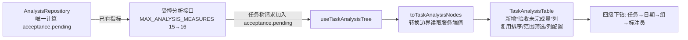
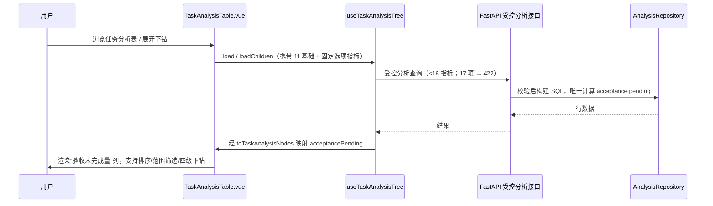

# 审查单：验收未完成量可见性（manual-qc-pending-visibility）

- **状态：** 候选（待审，未获人工批准，未发布）
- **审查对象：** 独立开发用例“让验收负责人直接看到未完成工作量”，新增任务分析表“验收未完成量”列
- **产品仓库：** `../product`（隔离的 `quality-platform-lab` 工作树，只读检查）
- **修改前：** `35948ae`（`fix(manual-qc): preserve category-specific allocation shortfalls`）
- **修改后：** `26db0e1`（`feat(manual-qc): expose pending acceptance workload`，父提交即修改前版本）
- **任务性质：** Harness 实验设计者构造的独立开发用例；不是用户原始“完整人工质检多维统计与详情”诉求的拆分，未获生产优先级、方案或上线批准
- **批准/发布状态：** 未批准、未发布；验证记录为评测者冻结的已有记录，本轮未复跑

## 怎样使用

按 `R1 → R2 → R3 → R4 → R5 → D1` 顺序审查，前一个审查点不通过即可停止，无需继续读下游。回复时直接写编号和意见，例如 `R1：认可` 或 `R3：驳回，理由……`。每一阶段先陈述事实，再给待审问题；只有第一个未确认的审查点开放填写，其余显示“等待前序通过”。

## 内容导航

- [完整工作全貌](#2-完整工作全貌)
- [R1 需求审查](#3-需求审查)
- [R2 方案审查](#4-方案审查)
- [R3 实现审查](#5-修改内容与软件实现审查)
- [R4 验证审查](#6-运行演示与验证审查)
- [R5 总体决定](#7-总体决定)
- [D1 报告体验](#8-报告体验)

---

## 2. 完整工作全貌

### 2.1 背景与任务来源

人工质检快照页任务分析表已显示“实际验收分配量”和“验收完成量”，验收负责人需要手工相减才知道每个任务还有多少没验收完。固定任务要求表格直接展示“验收未完成量”，并在任务 → 日期 → 组 → 标注员四级下钻中保持一致。

任务来源（忠实记录）：

- 用户原始“完整人工质检多维统计与详情”诉求是更宽的需求，**本次工作不属于它的合法拆分**，也**不能**用它证明原始多维需求已完成；
- 本用例由 Harness 实验设计者独立构造，执行模型收到的完整任务见 `original-task.md`；
- 没有找到实施前认可的需求与方案文档；固定任务自身即本次审查的需求依据，生产优先级、方案或上线批准均不存在。

**对齐结论：** 实际执行对象（任务分析表新增“验收未完成量”列，消费既有 `acceptance.pending`）与固定任务原文一致，与原始多维诉求是**相互独立**的关系——审查只判定该独立任务自身是否成立。

### 2.2 采用的方案

把后端已存在但未被任务表请求的 `acceptance.pending` 指标接入现有查询与表格，不新建指标、不复制业务公式。业务逻辑（`max(实际分配 − 完成, 0)`）仍在 `AnalysisRepository` 唯一计算，前端只消费。



### 2.3 完成的功能与结果

| 用户功能 / 契约 | 结果 |
|---|---|
| 任务分析表直接显示“验收未完成量” | 新增 `acceptance_pending` 列，表头、排序、数值范围筛选与既有列一致 |
| 四级下钻一致 | 任务 → 日期 → 组 → 标注员均携带该指标（已有记录给出 1737 / 144 / 51 / 20） |
| 复用既有能力 | 复用受控分析接口、树查询、转换边界、DataWorkbench 表格；未在前端复制公式 |
| 共享契约变化 | 默认基础指标 10 → 11 项；`MAX_ANALYSIS_MEASURES` 15 → 16（11 基础 + 5 固定问题选项 = 16 为最大合法；第 17 项受控拒绝，已有测试与 HTTP 422 记录） |
| 兼容性 | 旧版保存列顺序未包含新列时，新列按 TanStack 列排序规则追加在末尾，不会被隐藏（代码推断，非本轮实跑） |
| 5 个固定问题选项 | 保留；上限逻辑与 `setPinnedMetrics` 未改动 |

### 2.4 当前边界

- 未获人工批准、未发布；实验环境（本地 PostgreSQL / FastAPI / Edge）不等于生产；
- 本用例只证明该独立任务成立，不能外推为原始“完整多维统计与详情”需求完成；
- 不新增阈值、风险等级、责任人、催办或告警规则；不推断交付承诺；
- 未执行 seed、reset、migration 或夹具身份改写；未改写正式知识；
- 验证记录是评测者冻结的已有证据，本轮只做静态交叉核对，没有复跑。

---

## 3. 需求审查

### 3.1 原始问题

固定任务原文（见 `original-task.md`）：任务分析表已显示“实际验收分配量”和“验收完成量”，但验收负责人仍要手工相减才能知道每个任务还有多少工作没有验收完成，请让表格直接展示“验收未完成量”，并在任务 → 日期 → 组 → 标注员既有下钻中保持一致。

### 3.2 需求要做成什么

1. **要解决的问题：** 负责人需要手工相减（实际分配量 − 完成量）才能获得未完成量，低效且易错；
2. **希望达到的使用效果：** 表格直接显示每个任务的“验收未完成量”，逐级下钻到日期、组、标注员时数值保持一致；
3. **需要增加或改变的功能：** 任务分析表新增“验收未完成量”数量列；既有指标、接口、排序、范围筛选、保存配置和下钻全部复用，不新建平行系统；前端不复制业务公式；
4. **做到什么算完成：** 表格直接可见新列；四级下钻一致；与 5 个固定问题选项共存时最大 16 项合法、第 17 项受控拒绝；旧版保存列顺序不隐藏新列；真实 PostgreSQL/FastAPI/Edge 验证正常结果、排序、范围筛选、四级下钻；全量 Python/Vue 回归、类型检查和生产构建通过；
5. **本次范围：** 只解决“已有未完成量无法在任务主表直接消费”；不涉及阈值、风险等级、责任人、催办、告警规则或生产结论。

### R1：任务与需求是否成立

- **审查目的：** 当前必须先确认独立任务自身的需求是否成立、边界是否正确，才能继续审方案与实现；同时确认它不能被当作原始多维诉求的完成证明。
- **当前待审内容：** “任务分析表直接展示验收未完成量并四级一致、复用既有能力、不扩散业务语义”这一需求是否成立且范围适当。
- **请你决定：**
  - **认可** → 进入 R2；
  - **修订** → 指出需求理解或范围需调整之处，回写本节并重查下游；
  - **补信息** → 列出还缺的需求事实；
  - **驳回** → 需求本身不成立，停止下游审查。
- **处理结果：** 认可后按本需求核验方案与实现；修订/补信息会更新需求段并阻断 R2 及之后；驳回则本候选维持“未批准”，不进入方案与实现审查。原始多维诉求是否完成不在本单结论范围内。
- **你的反馈：**

```
状态：□ 认可　□ 修订　□ 补信息　□ 驳回
意见：
```

---

## 4. 方案审查

### 4.1 功能位于系统的哪里

```text
产品（人工质检快照页）→ 任务分析工作台 → 任务分析表 / 任务树 → Vue 表格与转换边界 → FastAPI 受控分析接口 → AnalysisRepository（SQL）
```

### 4.2 总体方案

改动前：`acceptance.pending` 在指标目录与 Repository SQL 中已存在，但任务树请求未包含它，表格无此列，负责人只能手工相减。

改动后：任务树请求把 `acceptance.pending` 加入基础指标 → 转换边界映射为 `acceptancePending` → 表格渲染为“验收未完成量”列，复用既有排序、范围筛选、列配置与四级下钻。指标定义与计算公式（`GREATEST(allocated - completed, 0)`）**保持不动**，只在 Repository 一处计算。

### 4.3 模块变更方案

| 所在位置 | 原来情况 | 本次修改 | 修改后的作用 |
|---|---|---|---|
| 服务端查询契约（`models.py`） | `MAX_ANALYSIS_MEASURES = 15` | 改为 16，注释同步为 11 基础 + 5 固定选项 | 共享上限容纳新增基础指标，同时保住 5 固定问题选项工作流 |
| 指标定义与计算（`catalog.py`、`repository.py`） | `acceptance.pending` 已定义、已计算 | **未改动** | 继续唯一负责业务公式 |
| API 路由（`src/api/routers/analysis.py`） | `AnalysisValidationError` → HTTP 422 已存在 | **未改动** | 第 17 项仍受控拒绝 |
| 前端任务树（`useTaskAnalysisTree.ts`） | 基础指标 10 项，无 pending | 增加 `acceptance.pending` | 根表与各级下钻请求都携带新指标 |
| 前端转换边界（`utils.ts`） | 无 pending 字段 | 读取服务端 `acceptance.pending` → `acceptancePending` | 组件内不重新计算业务指标 |
| 前端类型（`types/analysis.ts`） | 无 `acceptancePending` | 增加非空 `number` 字段 | 数据模型与服务端契约对齐 |
| 任务分析表（`TaskAnalysisTable.vue`） | 无此列 | 新增 `acceptance_pending` 列 | 展示“验收未完成量”，复用排序/筛选 |
| DataWorkbench / 表格配置（共享组件） | 列排序规则 | **未改动** | 旧版顺序不含新列时按既定规则把新列追加末尾 |

设计取舍：只有“共享指标上限 15→16”一项触及共享契约，属于支撑新增基础指标的必然最小调整；其余全部走既有能力，无新增无关模块。

### R2：方案是否合理

- **审查目的：** 确认方案落在“复用既有能力、只在 Repository 计算、最小契约调整”的边界内。
- **当前待审内容：** 直接消费既有 `acceptance.pending` + 共享上限 15→16 是否合理，是否引入平行计算或过度改动。
- **请你决定：** 认可 / 修订（指出方案偏差）/ 驳回（方案被否定时不批准现有实现）。
- **处理结果：** 认可后进入 R3；修订会改方案并重查实现与验证；驳回则停止，不动现有代码。
- **你的反馈：**

```
状态：□ 认可　□ 修订　□ 驳回
意见：
```

> 等待 R1 通过后开放填写。

---

## 5. 修改内容与软件实现审查

### 5.1 版本与查看入口

- 修改前 `35948ae`，修改后 `26db0e1`（单提交，父提交即修改前版本）；验证记录 `docs/acceptance-pending-visibility-verification.md` 位于修改后提交内。
- 完整 Diff：`git diff 35948ae..26db0e1`（10 文件，+83 −2）。

### 5.2 按模块说明修改

| 文件 | 本次实现 | 影响 |
|---|---|---|
| `src/manual_qc/analysis/models.py` | `MAX_ANALYSIS_MEASURES` 15→16，注释更新 | 共享查询指标上限 |
| `tests/test_analysis_service.py` | 基础指标列表加入 `acceptance.pending`；同测试内验证 16 项通过、17 项受控拒绝 | 契约边界回归 |
| `src/frontend/.../useTaskAnalysisTree.ts` | 基础指标 10→11 项，加入 `acceptance.pending` | 根表与下钻请求 |
| `src/frontend/.../types/analysis.ts` | `TaskAnalysisRow.acceptancePending: number` | 类型契约 |
| `src/frontend/.../utils.ts` | 转换边界读取 `acceptance.pending` | 前端数据映射 |
| `src/frontend/.../TaskAnalysisTable.vue` | 新增 `acceptance_pending` 列（表头标签、`sortDescFirst`、数值范围筛选） | 用户可见列 |
| `TaskAnalysisTable.test.ts` | 行工厂与断言加入新列（含“验收未完成量”表头存在性） | 组件回归 |
| `TaskMetricDetailDrawer.test.ts`、`utils.test.ts` | 测试数据加入 `acceptancePending` | 测试契约同步 |
| `docs/acceptance-pending-visibility-verification.md` | 新增验证记录 | 证据入口 |

### 5.3 关键实现流程



### 5.4 核心算法与边界

- 本次**没有新增算法**：业务公式 `GREATEST(allocated − completed, 0)` 的 owner 仍是 `AnalysisRepository`（`repository.py:285`），前端只读服务端返回值；
- 共享契约边界：指标上限由 `MAX_ANALYSIS_MEASURES` 统一约束，17 项触发 `AnalysisValidationError` → HTTP 422（`analysis_service.py:87-90`、`routers/analysis.py:103-104`）；
- 兼容性：旧保存列顺序不含 `acceptance_pending` 时，按 TanStack 列排序规则（未列出的列排在有序列之后）追加末尾，列可见性默认开启，不会被隐藏——此为代码推断，非本轮实跑。

### R3：实现是否符合方案

- **审查目的：** 确认 Diff 是否落在方案边界，有无平行计算、无关重构、遗漏消费者或兼容问题。
- **当前待审内容：** 一次 9 文件改动 + 1 份验证记录，覆盖前端请求/映射/列、服务端上限与回归测试，是否与方案一致且无越界。
- **请你决定：** 认可 / 修订（指出实现偏差与影响处）/ 驳回。
- **处理结果：** 认可后进入 R4；修订会定位到具体文件重做并重查验证；驳回则停止，不批准现有实现。
- **你的反馈：**

```
状态：□ 认可　□ 修订　□ 驳回
意见：
```

> 等待 R1—R2 通过后开放填写。

---

## 6. 运行演示与验证审查

### 6.1 验证范围

**要证明的用户结果：** 表格直接显示未完成量；四级下钻一致；排序、范围筛选正常；16 项最大合法、17 项受控 422；旧版保存列顺序不隐藏新列；全量回归通过。

**证据性质（忠实区分）：**

- **已有运行记录（评测者冻结，本轮不复跑）：** `docs/acceptance-pending-visibility-verification.md` 记录的 PostgreSQL 16 本地夹具（3024 条员工日快照，2026-07-13 至 2026-07-26，最新计算时间 2026-07-26 18:34:00+08:00）、HTTP 与 Edge 151 交互结果；
- **本轮新鲜观察：** 无；本轮只做只读代码与 Diff 检查；
- **静态交叉核对（非运行）：** 前端测试文件数与用例数（10 文件 / 30 项）、Python 测试函数数（18）与记录一致；但这只是数量吻合，不代表本轮通过。

### 6.2 真实结果（已有记录）

| 验证路径 | 对象 | `acceptance.pending` |
|---|---:|---:|
| 任务 | 拥堵跟车任务-08 | 1737 |
| 日期 | 2026-07-16 | 144 |
| 组 | 质检组-12 | 51 |
| 员工 | E120 | 20 |

- HTTP：11 基础 + 5 固定问题选项 → 200 与 24 个任务；第 17 项 → 422 并说明最多 16 项（已有记录）；
- Edge 151：表头与真实值可见；点击表头首轮降序（1737 居首）、二轮升序（零提交任务居首）；范围筛选把 24 个任务缩至目标 1 个；连续展开四级依次显示 1737/144/51/20；控制台无错误（已有记录）。

### 6.3 回归与证据边界

- 高价值回归：新增列的组件渲染、16/17 项契约边界（`test_analysis_service.py`）、转换映射（`utils.test.ts`）、测试数据契约（`TaskMetricDetailDrawer.test.ts`）；
- 已有记录还包括：Python 18 项、Vue 10 文件 30 项、`vue-tsc --noEmit`、生产构建、`git diff --check` 通过；
- **不能外推：** 记录覆盖固定日期范围与本地实验夹具，不能代表生产或其它数据范围；旧版列顺序兼容性为代码推断，未在已有记录中找到对应 Edge 实测项；本轮未复跑任何测试。

### R4：验证是否足以支持当前结论

- **审查目的：** 判断已有证据能否支撑“已完成”声明，是否需要补真实路径或收窄声明。
- **当前待审内容：** 冻结的验证记录是否足以支持“新增列四级一致、16/17 上限、排序与筛选正常、回归通过”的声明；旧版列兼容性是否需补测。
- **请你决定：** 认可（证据足够）/ 修订（指出缺口，如补测旧版配置兼容性或限定声明）/ 驳回（证据不足）。
- **处理结果：** 认可后进入 R5；修订会补验证或收窄声明并更新记录；驳回则停止，不把证据不足当通过。
- **你的反馈：**

```
状态：□ 认可　□ 修订　□ 驳回
意见：
```

> 等待 R1—R3 通过后开放填写。

---

## 7. 总体决定

只有 R1—R4 均通过后才开放 R5。

| 决定 | 代码 | 报告 | 知识 | 发布 |
|---|---|---|---|---|
| 认可 | 维持 `26db0e1` | 标记已通过 | 不自动发布；知识变化候选另走人工决定 | 保持候选状态，由人工决定是否进入正式流程 |
| 修改后复审 | 按 R 反馈修订 | 更新相应阶段 | 不变 | 继续等待 |
| 驳回 | 不采用当前 Diff | 记录驳回原因 | 不变 | 停止 |

### R5：总体决定

- **审查目的：** 在需求、方案、实现、验证全部通过后，由人工决定该候选如何处置。
- **当前待审内容：** 是否认可本次独立任务成果。
- **请你决定：** 认可 / 修改后复审 / 驳回。
- **处理结果：** 认可则按上表维持现状并记录；修改后复审则回到对应 R；驳回则整个候选不成立。注意：无论何种决定，都不能把本独立任务当作原始多维诉求完成或生产上线的证明。
- **你的反馈：**

```
状态：□ 认可　□ 修改后复审　□ 驳回
意见：
```

> 等待 R1—R4 通过后开放填写。

---

## 8. 报告体验

### D1：这份审查单是否好用

- **评价维度：** 缺少背景时能否看懂；重点顺序是否合理；信息量是否合适；待决点是否清晰可答。
- **反馈去向：** 你的反馈先只修本报告/本次评测候选；同一问题在第二类任务仍成立后，才考虑进入共享 Harness 修订。
- **你的反馈：**

```
状态：□ 好用　□ 需调整
意见：
```
