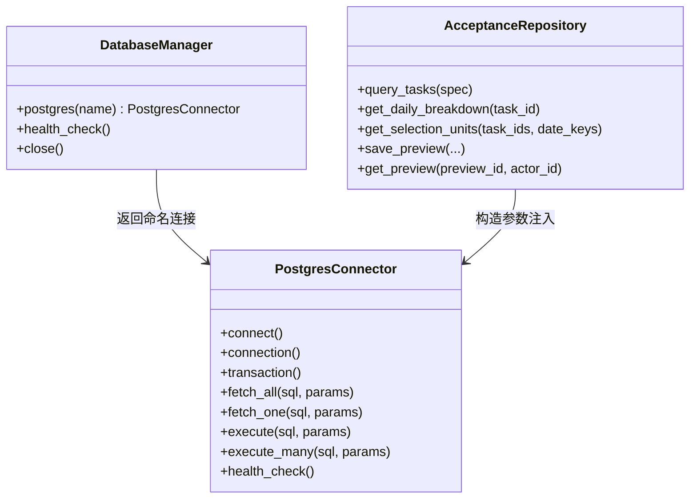
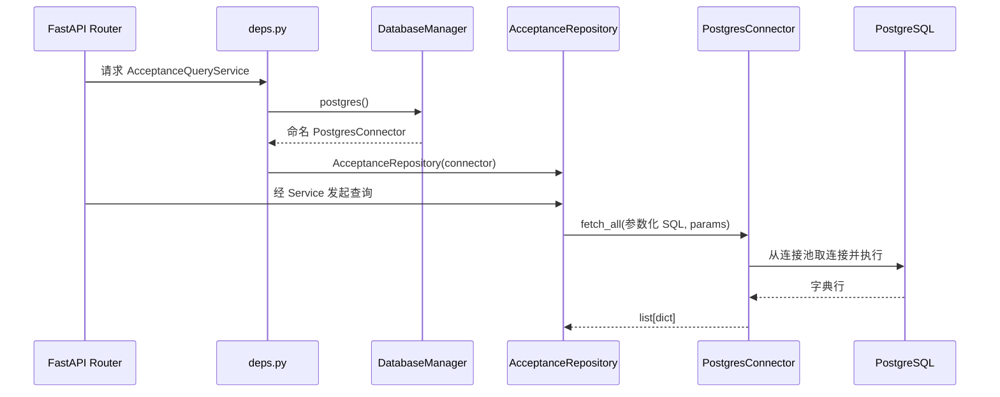

# 数据库访问公共能力

## 本页导航

- [能力概览](#能力概览)
- [组件结构与职责](#组件结构与职责)
- [查询调用链](#查询调用链)
- [人工质检验收的使用契约](#人工质检验收的使用契约)
- [当前证据边界](#当前证据边界)

## 能力概览

**责任边界：** `src/database/` 管理 PostgreSQL 连接池、事务和通用查询，`AcceptanceRepository` 管理人工质检 SQL、字段语义和行映射。其他领域可以复用前者，不需要理解验收表；后者则不能把采样或规则责任推给公共连接组件。

**适用范围：** 领域 Repository 还要决定哪些业务写入应处于同一事务。这些结论只适用于固定提交 `3cf3934` 的本地原型，不证明生产部署或负载表现。

## 组件结构与职责

**组件关系：** `DatabaseManager` 提供命名连接，`PostgresConnector` 管连接与事务，领域 Repository 通过构造参数使用连接器。

| 代码 | 实际职责 | 不负责什么 |
|---|---|---|
| `src/database/manager.py` | 从配置组装命名连接，提供默认连接，统一关闭 | 不知道验收表或业务查询 |
| `src/database/postgresql.py` | 懒加载连接池、连接归还、事务提交/回滚、参数化执行和健康检查 | 不拼接领域 SQL，不映射业务对象 |
| `src/api/deps.py` | 取得共享连接并组装 Repository、Service | 不执行业务流程 |
| `src/manual_qc/repository.py` | 编写人工质检查询、过滤、聚合和预览读写 | 不创建连接池，不决定采样配额 |

## 查询调用链

**调用主线：** 应用入口组装连接与 Repository，领域层生成参数化 SQL，公共连接组件负责执行和连接回收，领域层再解释结果。

| 阶段 | 输入 | 处理 | 输出 |
|---|---|---|---|
| 依赖组装 | 应用配置、连接名称 | `DatabaseManager` 返回连接器，`deps.py` 构造 Repository 与 Service | 可注入 Router 的 Service |
| 领域查询 | 查询条件 | Repository 生成参数化 SQL 和参数 | SQL 调用 |
| 通用执行 | SQL、参数 | 连接器从池中取得连接并执行 | 字典行或影响行数 |
| 领域映射 | 字典行 | Repository/Service 解释字段并转为业务响应 | 类型化业务结果 |
| 事务写入 | 一组写操作 | 成功提交，异常回滚并归还连接 | 原子写入结果或异常 |

连接池在第一次实际查询时创建。`SimpleConnectionPool` 是否适合未来部署并发，需要真实运行条件后判断，本页不提前作性能结论。

## 人工质检验收的使用契约

**契约目的：** 公共能力保证连接、参数和事务语义，验收模块负责业务表、查询口径和失败后的业务解释。

验收模块依赖公共能力提供以下保证：

- 能按配置取得正确的命名 PostgreSQL 连接；
- SQL 参数与 SQL 模板分离；
- 一组写操作可以处于同一事务；
- 连接由公共组件取得、归还和关闭；
- 数据库异常向上抛出，由 API 或任务入口转换成用户可理解的失败。

验收模块自己负责：

- `t_qc_delivery_task`、`t_qc_daily_snapshot`、`t_qc_operation_preview` 等业务表语义；
- 查询条件、聚合口径、行到业务结构的转换；
- 哪些步骤必须放在同一事务，以及失败后业务状态如何解释。

## 当前证据边界

**证据结论：** 当前代码能证明组件责任和局部调用链，不能证明真实数据库兼容、部署或并发负载。

- 固定代码确实存在上述连接和依赖链；没有证据说明其已经用于生产。
- 原型测试使用 `FakePostgres` 或内存替身，没有连接真实 PostgreSQL。
- 当前迁移没有创建查询依赖的 `t_qc_daily_snapshot`，因此仅凭该迁移不能从空库运行完整查询。
- 连接池规模、并发模型、监控和故障演练不属于本页基础范围；有真实维测需求时再单独分析。

# Citations

1. [当前验收原型来源](../sources/current-prototype.md)
2. [目标验收平台设计](../sources/target-design.md)
