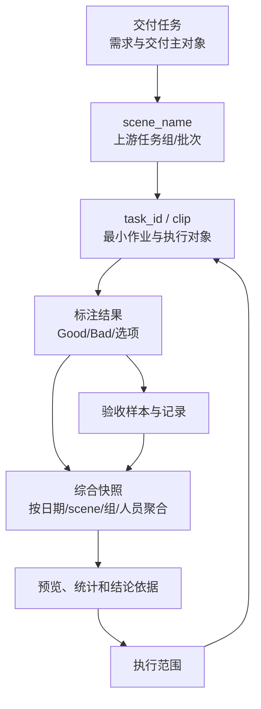
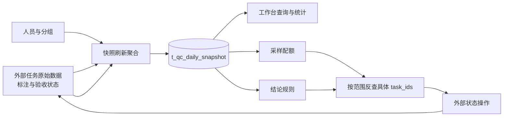

# 人工质检验收数据对象、数据流与状态

## 原始任务、派生统计和操作结果不能混成一种事实

task/clip 是最小作业和执行对象，`scene_name`、日期和人员用于管理与聚合，交付任务把多个 scene 和 task 汇总回同一需求。综合快照、操作预览和质量结论都是从原始事实派生出来的读模型或过程记录，不能替代外部 task 的当前状态。

页面、采样和规则可以使用快照，真正执行必须回到原始任务数据取得当前可操作对象。当前代码与目标材料还存在快照字段版本和通过率分母冲突，K0 不会把它们静默合并。

## 核心数据对象与标识

| 对象 | 作用 | 当前已知边界 |
|---|---|---|
| 交付任务 | 连接需求、目标数量、时间和全流程 | 当前迁移有 `t_qc_delivery_task`；生产模型未知 |
| `scene_name` | 一批上游任务的管理与统计标识 | 不是 clip 名或 task_id；与交付任务当前以 `scene_name` 连接 |
| task/clip | 单条标注、验收或执行对象 | 材料中两词近似，但精确外部模型需平台确认 |
| 综合快照 | 为页面、采样和规则提供聚合计数 | 目标 Schema 版本多；固定迁移未创建该表 |
| 操作预览 | 保存本次选择、参数、结果、来源版本和有效期 | 当前原型已实现，但不保存具体 task_ids |
| 结论与执行结果 | 保存决定依据、确认人和外部结果 | 目标设计存在，固定代码未实现 |

对象之间存在两类不同关系：

- **归属关系**：交付任务包含多个 `scene_name`，scene 关联多个 task/clip；
- **派生关系**：标注与验收记录聚合成快照，预览和结论再消费快照；
- **执行关系**：结论定义范围，Repository 从原始任务事实中反查 task_ids；
- **回写关系**：外部系统改变 task 状态，刷新任务再重建派生快照。

## 目标数据闭环

| 数据处理阶段 | 输入 | 处理 | 输出 | 状态 |
|---|---|---|---|---|
| 原始事实获取 | 外部 task 标注/验收状态、人员与分组 | 读取当前状态和历史归属 | 可聚合的明细 | 目标与历史材料 |
| 快照刷新 | 明细、统计日期和维度 | 按日期、scene、组和人员聚合 | `t_qc_daily_snapshot` | 当前代码无刷新实现 |
| 查询与展示 | 快照、交付任务 | 汇总、分页和下钻 | 工作台统计 | 当前有局部查询 |
| 采样与规则 | 快照容量和质量指标 | 计算配额或结论 | 预览、PASS/REJECT/PENDING | 仅 Ratio 计算已实现 |
| task 反查 | 已确认范围、原始任务状态 | 找到当前可操作 task_ids | 执行集合 | 未实现 |
| 外部执行与回写 | task_ids、目标动作 | 分配、通过或打回 | 新的 task 状态 | 未实现 |
| 再次刷新 | 外部新状态 | 重建派生统计 | 页面可见的新快照 | 未实现 |

目标材料把快照最小统计单元定义为 `(stat_date, scene_name, group_name, employee_id)`，同时冗余 `project_name`。个人行可以向上聚合到组、scene、项目和日期；`group_name` 作为当时人员归属的历史快照，不应因之后调组而回写历史。

这是目标设计，不是当前生产表事实。

## 目标快照字段组

| 字段组 | 主要语义 | 关键说明 |
|---|---|---|
| 标注进度 | `annotation_total`、`annotation_submitted`、选项分布 | 待完成数可以运行时相减 |
| 验收分配与完成 | `acceptance_allocated`、`acceptance_completed` | allocated 是成功分配条数，不是人数 |
| Good/Bad 和选项结果 | allocated、completed、passed、conclusion | 固定维度可用列，可变选项可用 JSONB |
| 执行与人工确认 | 执行计数、确认人/时间、执行人/时间和备注 | 刷新统计时不应覆盖人工执行字段 |
| 新鲜度 | `computed_at`、`updated_at` | 页面必须展示数据计算时间 |

## 当前代码与目标模型的差异

固定代码使用 `acceptance_submitted`、`good_passed`、`bad_passed` 等字段查询 `t_qc_daily_snapshot`；较新的目标材料改称 `acceptance_completed`，并增加 `good_completed`、`bad_completed`。固定迁移只创建交付任务、操作预览和视图配置，没有创建快照表。因此：

- 当前代码能够说明查询期望什么字段，不能证明数据库真实存在或字段版本正确；
- `submitted` 与 `completed` 不能在知识中静默合并；
- 目标材料声称已经落地的另一版本，必须取得对应仓库提交后才能升级为当前代码事实。

## 统计口径

| 指标 | 推荐表达 | 回答的问题 | 状态 |
|---|---|---|---|
| 分配达成率 | 实际成功分配 / 预期分配 | 分配是否按计划完成 | 推荐解释 |
| 验收完成进度 | 已完成验收 / 已分配验收 | 已分的任务做完多少 | 三阶段材料支持，仍待业务确认 |
| 质量通过率 | 通过 / 已完成验收，或通过 / 已分配验收 | 已判断样本质量，还是把未完成也计入 | Batch 1 两份目标材料冲突，暂不选定 |

三阶段语义与快照材料要求按 completed 计算质量；规则设计的输入指标段却写成按 allocated 计算。K0 只指出：页面必须显式展示公式，业务负责人确认前不能只写一个“通过率”。

## 状态与新鲜度

页面至少要同时说明：数据统计到什么时候、预览何时生成并过期、结论依据何时计算、执行请求何时提交、外部状态何时最后确认。同一任务可以出现“结论 PASS，但执行仍在回查”的组合，不能压成一个状态字段。

# Citations

1. [目标验收平台设计](../../../../sources/target-design.md)
2. [当前验收原型](../../../../sources/current-prototype.md)
3. [人工语义决定来源](../../../../sources/human-decisions.md)
