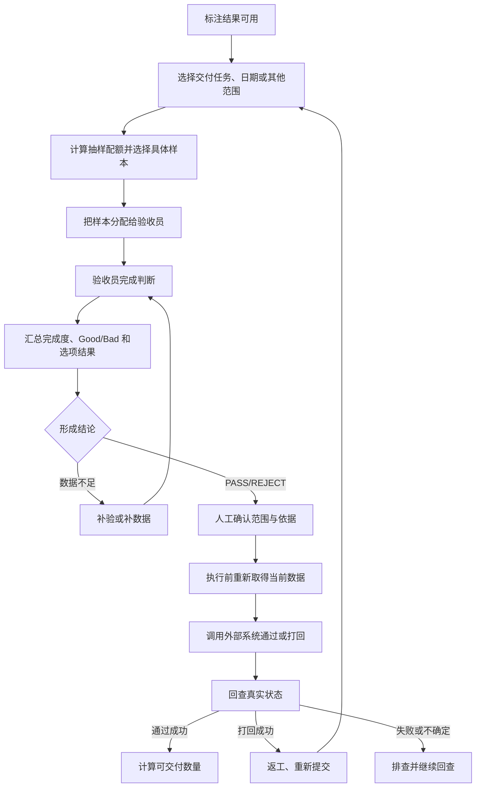

# 人工质检验收生命周期与阶段边界

## 闭环成立的前提是分清判断、决定与实际状态

验收并不是“抽一些任务检查，然后点通过或打回”。它连接了标注结果、抽样作业、质量判断、外部状态变化和最终交付，任何一段没有闭合，都可能出现“表面完成、实际无法交付”。

- 标注产生结果，验收判断抽样集，执行根据结论作用于明确范围内的标注全集；
- 抽样集、验收记录、质量结论、执行对象和外部最终状态是不同业务对象，不能互相替代；
- PASS 之后仍需执行与回查，REJECT 之后进入返工与再次验收，数据不足时只能补验或补数据；
- Batch 1 能说明完整目标闭环和部分历史做法，当前固定代码只覆盖范围查询与 Ratio 数量预览。

## 先分清三个阶段和五种业务对象

| 阶段 | 执行者 | 输入 | 输出 | 明确不做什么 |
|---|---|---|---|---|
| 标注 | 标注员 | 待标注 clip 和规则 | Good、Bad 或选项级标注结果 | 不产生正式验收结论 |
| 验收 | 验收员 | 标注结果的抽样集 | 验收记录、完成度和质量依据 | 不直接对标注全集执行通过/打回 |
| 执行 | 有相应权限的人员与外部系统 | 已确认结论及操作范围 | 标注全集的通过/打回实际状态 | 不能用接口即时返回替代最终回查 |

这里的 clip 是最小作业片段；一批 clip 通常由 `scene_name` 归组。执行范围可以是 Good/Bad 类别、选项、任务、组或个人，但都必须显式说明，不允许从抽样集偷偷推成全集。

五类容易混淆的业务对象如下：

| 对象 | 形成阶段 | 用途 | 不能替代 |
|---|---|---|---|
| 候选总体 | 选择范围后 | 定义本轮可能被抽取和最终执行的数据边界 | 具体验收样本 |
| 验收样本 | 抽样与分配后 | 交给验收员判断质量 | 对应范围内的标注全集 |
| 验收记录 | 人工作业后 | 记录逐样本判断、完成度和原因 | PASS/REJECT 结论 |
| 质量结论 | 规则计算与人工确认后 | 决定是否允许进入通过或打回 | 外部系统实际状态 |
| 执行结果 | 外部操作并回查后 | 证明标注全集实际通过、打回或仍不确定 | 接口即时响应 |

## 业务闭环

### 环节接口

| 环节 | 主要输入 | 核心处理 | 可观察输出 | 进入下一环节的条件 |
|---|---|---|---|---|
| 选择范围 | 交付任务、日期、scene、组、人员或选项 | 解析业务范围，排除无效或不可验收数据 | 候选总体、范围标识、当前数据时间 | 范围非空，粒度与权限明确 |
| 抽样与预览 | 总体计数、采样策略及参数 | 计算类别/桶配额，必要时选择具体样本 | 目标量、样本或统计单元、缺口、警告、有效期 | 数据未过期，用户确认范围与缺口 |
| 正式分配 | 已确认预览、具备资格的验收员 | 固定 task_ids，调用外部系统并记录结果 | 成功、跳过、失败、结果未知及实际分配量 | 外部状态确认已进入待验收 |
| 实际验收 | 已分配样本、验收规则和任务界面 | 验收员逐条判断并提交原因 | 已完成数、通过数、分类结果、人员进度 | 达到结论规则要求的完成度 |
| 形成结论 | 完成度、分类通过率、规则、适用范围 | 计算 PASS/REJECT/PENDING，人工确认依据与影响范围 | 带原因、指标快照和范围的结论 | 结论非 PENDING，且确认时数据仍有效 |
| 通过/打回执行 | 已确认结论、标注全集范围、当前 task 状态 | 执行前重取 task_ids，调用外部接口 | 请求量、即时成功/失败、跳过和未知量 | 不能依赖即时响应，必须进入回查 |
| 状态回查与闭环 | 操作记录、外部任务当前状态、交付目标 | 确认实际成功量，计算可交付量或建立返工轮次 | 最终状态、剩余量、责任人、返工或交付判断 | 通过任务满足交付条件，或打回任务重新提交 |

### 关键状态回路

| 回路 | 触发条件 | 业务含义 | 后续动作 |
|---|---|---|---|
| 补验/补数据 | 完成度不足、样本不足或指标无法支持判断 | 证据不足，不应强行得出 PASS/REJECT | 补充分配或数据后重新汇总 |
| 返工再验 | 结论为 REJECT 且打回状态已确认 | 本轮验收结束，但需求交付尚未结束 | 建立返工轮次，重新提交、抽样和验收 |
| 执行回查 | 接口超时、部分失败或结果未知 | 请求已发出不等于状态已改变 | 查询外部系统，分类记录实际成功、失败与未知 |
| 交付汇总 | PASS 且执行成功 | 单批通过仍不一定满足交付目标 | 汇总可交付 Good 数量、剩余量和归档条件 |

## 关键业务约束

- **验收完成不等于交付完成**：通过以后仍需确认真实执行状态、可交付 Good 数量和归档条件。
- **REJECT 不等于需求结束**：打回会创建返工和再次验收链路。
- **按日执行不等于按日割裂业务**：日期是分配和统计维度，结果仍要汇总到同一交付任务及返工轮次。
- **结论范围必须显式保存**：Good/Bad、选项、任务、组或个人粒度变化时，执行全集也随之变化。

## 历史、目标与当前实现

| 现实形态 | Batch 1 能确认的内容 | 不能据此推断 |
|---|---|---|
| 历史运行 | 曾按 `waiting_review` 等状态抽样、按看板结果批量通过或打回，并定时刷新状态 | 这些状态、脚本和阈值仍在当前生产使用 |
| 目标闭环 | 材料要求预览、正式执行、结论重算、外部调用和状态回查分离 | 目标组件已经实现或部署 |
| 固定代码 | 已实现范围查询、按日展开和 Ratio 数量预览 | 已选择具体样本、正式分配、结论、执行或回查 |

# Citations

1. [人工语义决定来源](../../../../sources/human-decisions.md)
2. [历史验收运行快照](../../../../sources/historical-pipeline.md)
3. [目标验收平台设计](../../../../sources/target-design.md)
4. [当前验收原型](../../../../sources/current-prototype.md)
