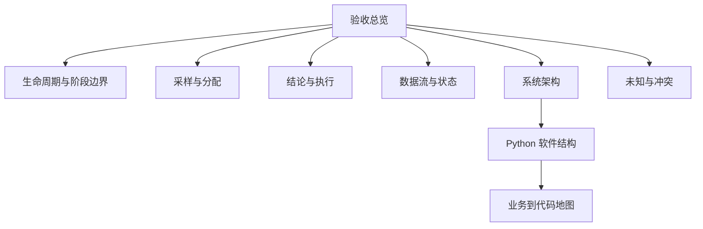

# 人工质检验收领域

## 验收用样本证据推动标注全集进入下一状态

验收从标注结果总体中选择样本、分配人工作业并收集判断，最终形成支持通过、打回或继续补验的质量依据。真正的结论与执行作用于明确范围内的标注全集，而不是只处理被抽中的样本。

理解验收需要始终分清三件事：样本判断不等于质量结论，质量结论不等于外部状态已经改变，一批任务通过也不等于整个需求已经满足交付条件。

Batch 1 同时包含人工语义、历史运行、目标设计和当前原型；当前候选进一步补充了交付任务与行动项、人员权限、统一数据工作台的业务和目标设计边界。K0 会分别说明这些信息的现实形态，可以解释验收业务、数据、算法和局部软件实现，但不能替代当前生产操作手册，也不能证明生产页面、API、SSO、Schema、实际日常责任、真实监控分析流程或端到端部署。

## 验收业务位置

| 业务阶段 | 输入 | 输出 | 与相邻阶段的边界 |
|---|---|---|---|
| 上游准备与标注 | 待作业数据、规则和人员 | 标注结果总体 | 不产生正式验收结论 |
| 抽样、分配与验收 | 标注结果总体、策略、验收人员 | 验收样本及其判断记录 | 样本不等于执行全集 |
| 质量依据与结论 | 完成度、通过率、规则和范围 | PASS/REJECT/PENDING 及原因 | 结论不等于外部状态已改变 |
| 通过/打回执行 | 已确认结论、标注全集 task_ids | 操作请求和即时结果 | 即时结果仍需回查 |
| 状态刷新与后续处理 | 外部最终状态、交付目标 | 可交付判断或返工轮次 | 验收闭环重新汇总到交付任务 |

## 信息的现实形态

| 现实形态 | 包含什么 | 怎样使用 |
|---|---|---|
| 人工语义线索 | 标注—验收—执行边界、执行全集和可变粒度 | 作为业务理解基线，但需要业务负责人最终确认 |
| 历史运行 | 旧分配脚本、历史阈值、批量通过打回、状态刷新和中间表 | 保留具体机制和教训，不冒充当前生产 |
| 目标设计 | 快照、Group/Personal/Ratio、规则、外部任务系统、Repository 和分层架构 | 用于方案理解，不宣称已经实现 |
| 当前原型 | 任务查询、按日展开、Ratio 数量预览和对应前端 | 可以精确下钻代码，但不等于部署状态 |

## 知识模块结构

| 知识模块 | 核心问题 | 与其他模块的关系 |
|---|---|---|
| 生命周期 | 业务从哪里开始、如何结束或返工 | 提供所有专题的业务主干 |
| 采样与分配 | 抽多少、抽哪些、分给谁 | 使用数据容量，产出验收作业 |
| 结论与执行 | 如何从指标形成决定并改变状态 | 消费验收依据，进入外部执行 |
| 数据流与状态 | task、scene、快照、预览和执行结果怎样连接 | 为采样、规则和页面提供对象与口径 |
| 系统/Python 架构 | 业务职责如何落到组件、代码和运行链路 | 把业务与数据映射到实现 |
| 业务到代码地图 | 某项能力的入口、数据和证据在哪里 | 用于实现下钻与现实状态核对 |
| 未知与冲突 | 哪些结论仍不可靠、缺什么直接证据 | 横切所有知识模块 |

## 推荐学习顺序

1. [生命周期与阶段边界](lifecycle.md)
2. [采样与分配](sampling-and-assignment.md)
3. [结论与执行](conclusion-and-execution.md)
4. [数据流与状态](data-flow-and-state.md)
5. [系统架构](system-architecture.md)
6. [Python 软件结构](python-architecture-and-implementation.md)
7. [业务到代码地图](implementation-map.md)
8. [未知与冲突](open-questions.md)

## 回答范围与证据边界

| 问题 | 当前状态 |
|---|---|
| 标注、验收和执行的区别 | 有直接语义材料，答案可追溯 |
| 历史怎样抽样、判断和回写 | 有历史快照，可以解释但不能称当前 |
| 目标平台怎样分层 | 有较完整设计，可以讲架构和边界 |
| 当前代码实现了什么 | 固定提交可证明局部纵向原型 |
| 负责人每天怎样监控、分析和推进返工 | 当前候选已补充交付任务、行动项和统一数据工作台的业务/目标设计边界；实际日常责任、监控分析流程和返工运行仍缺直接证据 |
| 当前生产规则、Schema、接口和部署 | 缺直接证据，保持未知 |

# Citations

1. [人工语义决定来源](../../../../sources/human-decisions.md)
2. [历史验收运行快照](../../../../sources/historical-pipeline.md)
3. [目标验收平台设计](../../../../sources/target-design.md)
4. [当前验收原型](../../../../sources/current-prototype.md)
