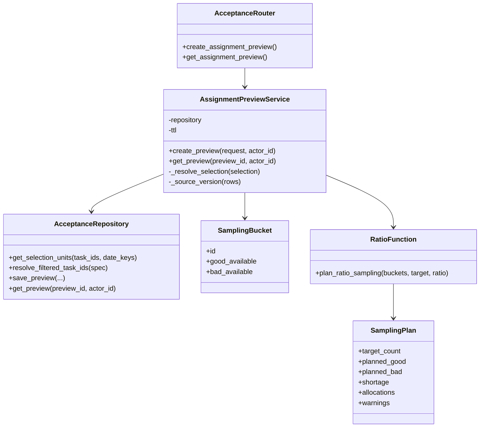
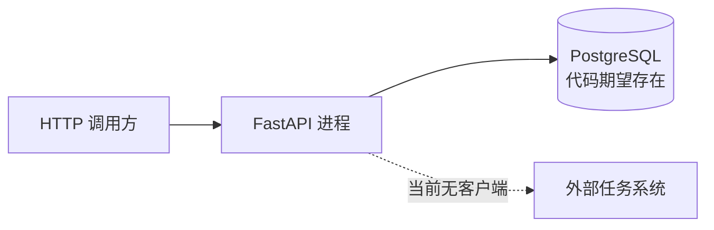

# 人工质检验收 Python 软件结构、设计与实现

## 一条真实纵向链路怎样完成 Ratio 分配预览

固定代码已经为任务查询、日期展开和 Ratio 数量预览贯通 Router、Service、纯算法、Repository 和数据库访问。它最值得保留的设计不是分层名称，而是把配额计算与 I/O 分开，并把领域 SQL 收束到 Repository。

这条纵向链路仍只生成数量预览：代码没有选择具体 task、执行真实分配，也不存在已验证的结论规则、外部客户端和调度任务。下面从一次用户动作出发，依次说明对象协作、包结构、运行过程、部署边界、数据转换和一次真实修改会影响哪里。

Batch 2 的前端材料把验收工作台补充为目标交互边界：状态至少区分 `idle`、`loading`、`ready`、`stale`、`executing`、`refreshing`，统计带 `computed_at`，执行后先显示即时摘要再等待外部回查；无数据、部分失败、重复点击和重试也必须有可读反馈。这些是原型/设计验收清单，不是固定代码已经部署的证据；人员画像中仍出现旧 `level`/`unit_price` 字段，与 SCD2 人力设计不一致。

## 业务场景：生成分配预览

用户已经在验收队列选择一个任务或若干日期，希望知道：当前最多能抽多少、Good/Bad 各抽多少、每个日期桶分多少、数据是否不足。系统生成 30 分钟有效的预览，但不会真正改变任务状态。

```text
选择范围和 Ratio 参数
→ 解析任务/日期
→ 查询可用量
→ 计算配额
→ 组装预览
→ 保存预览
→ 返回用户
```

## 逻辑视图：核心对象协作



| 对象 | 主要职责 | 输入 | 输出 | 依赖 |
|---|---|---|---|---|
| `AcceptanceRouter` | 接收请求、读取操作者、映射错误和统一响应 | HTTP 请求 | Pydantic 响应 | `AssignmentPreviewService` |
| `AssignmentPreviewService` | 解析选择、查询容量、调用算法、组装和保存预览 | 请求、操作者、Repository | `AssignmentPreviewResponse` | Repository、Ratio 函数 |
| `AcceptanceRepository` | 查询统计单元并持久化预览 | task/date 范围、预览 payload | 字典行或保存结果 | PostgreSQL 连接器 |
| `SamplingBucket` | 表示一个统计桶的最小算法输入 | ID、Good/Bad 可用量 | 不可变桶对象 | 无 I/O |
| `plan_ratio_sampling` | 计算类别与分桶配额 | buckets、目标量、比例 | `SamplingPlan` | 无 I/O |
| `SamplingPlan` | 表示数量计划、缺口、分桶和警告 | 算法计算结果 | 不可变计划对象 | 无 |

`SamplingBucket` 和 `SamplingPlan` 是冻结 dataclass。服务把 Repository 字典行收缩为算法所需的最小输入；算法不知道 FastAPI、SQL、用户或预览表，可以使用普通 Python 数据直接验证。

## 开发视图：包与文件层级

```text
src/
├── api/
│   ├── deps.py                              组装连接、Repository 与 Service
│   └── schemas/acceptance.py                HTTP 请求与响应
├── database/
│   ├── manager.py                           命名数据库连接
│   └── postgresql.py                        连接池、事务和查询助手
└── manual_qc/
    ├── repository.py                        人工质检 SQL 与预览持久化
    └── acceptance/
        ├── router.py                        HTTP 路由
        ├── sampler.py                       纯 Ratio 配额算法
        └── services/
            ├── query_service.py             只读查询编排
            └── assignment_preview_service.py 选择解析、计算与保存预览
```

依赖方向基本是 `Router → Service → 算法/Repository → 数据库公共能力`。当前 Service 还直接 import API Schema，这是后文会说明的实际耦合点。

## 进程视图：一次调用

| 顺序 | 真实代码入口 | 输入如何变化 | 输出或副作用 |
|---|---|---|---|
| 1 | `router.create_assignment_preview` | HTTP JSON 先成为 `AssignmentPreviewRequest`；请求头得到 `employee_id` | 调用 Service，非法选择转为 422 |
| 2 | `AssignmentPreviewService._resolve_selection` | 显式 ID 解析成 task_ids/date_keys；筛选全选转为最多 5000 个 task IDs | 无数据库写入 |
| 3 | `AcceptanceRepository.get_selection_units` | 业务范围转成参数化 SQL | 读交付任务和快照，返回可用量字典行 |
| 4 | `SamplingBucket(...)` | 字典行收缩为 ID、Good 可用量、Bad 可用量 | 算法输入不含 SQL 或用户对象 |
| 5 | `plan_ratio_sampling` | 计算总目标、类别补足和每桶配额 | 返回不可变 `SamplingPlan` |
| 6 | `AssignmentPreviewResponse(...)` | 将计划与原行的任务、日期、scene 信息合并 | 生成 preview_id、来源版本和过期时间 |
| 7 | `AcceptanceRepository.save_preview` | Pydantic 对象转成 JSON payload | 写入 `t_qc_operation_preview` |
| 8 | Router | Service 返回对象 | FastAPI 包装成统一响应 |

## 物理视图：运行与部署边界



| 运行边界 | 代码证据 | 尚不能证明 |
|---|---|---|
| HTTP 调用方 → FastAPI | Router、Schema、依赖组装和路由测试存在 | 服务已部署、认证和网关配置 |
| FastAPI → PostgreSQL | 连接器、Repository 和 SQL 存在 | 真实数据库字段兼容、空库可启动和负载表现 |
| FastAPI → 外部任务系统 | 只有目标材料 | 客户端、接口、认证、状态映射或真实调用 |

查询依赖的 `t_qc_daily_snapshot` 不在当前迁移中，因此固定代码不能证明空数据库执行迁移后即可完成查询。

## 跨边界数据转换


| 转换 | 保留的信息 | 移除或新增的信息 | 责任 |
|---|---|---|---|
| JSON → Pydantic 请求 | 用户选择、目标量和比例 | 增加类型与取值校验 | FastAPI/Pydantic |
| 请求 → task_ids/date_keys | 业务选择语义 | 移除 UI 结构，形成查询条件 | Service |
| Repository 行 → `SamplingBucket` | 桶 ID、Good/Bad 可用量 | 移除 SQL 列和展示信息 | Service |
| `SamplingPlan` → Pydantic 响应 | 目标、配额、缺口和警告 | 补充任务、日期、scene、ID 和有效期 | Service |
| 响应 → JSONB | 可重放的请求与预览结果 | 转为持久化 payload | Repository |

这些转换避免数据库行直接泄漏给前端，也使算法只接收所需计数。代价是 `AssignmentPreviewService` 同时承担选择解析、算法输入转换、响应组装和预览保存；当前规模仍可理解，是否拆分应由真实扩展压力决定。

## 设计评价

### 当前结构的优点

- Router 很薄：读取请求、注入 Service、映射错误和响应，没有 SQL 或配额公式。
- Ratio 算法是无 I/O 的普通函数，输入输出明确、同样输入结果稳定。
- Repository 集中参数化 SQL；公共连接组件不理解业务表。
- 依赖在 `deps.py` 组装，测试可以把 Repository 或数据库替换成小型替身。
- 当前只实现 Ratio，没有为了目标文档中的所有未来策略先搭一套复杂框架。

### 当前结构的限制

- `AssignmentRuleSpec.strategy` 被限制为 `ratio`，Service 也直接调用 `plan_ratio_sampling`；目标文档中的采样注册表和多策略并未实现。
- Service 直接依赖 API Pydantic Schema。若未来同一用例还由 DAG、CLI 或其他接口调用，HTTP 结构变化可能波及应用服务；目前还没有足够消费者证明必须抽象。
- `AcceptanceRepository` 同时承担队列查询、统计单元查询和预览持久化。当前文件仍可读，继续加入快照刷新、人员、执行和外部状态 SQL 后可能需要按真实职责拆分。
- 当前预览只冻结数量和统计单元，不冻结具体 task_ids，因此不能直接支撑目标所说的“看到什么就执行什么”。
- 测试证明纯 Python 和模拟数据路径，不证明真实 PostgreSQL、外部系统或完整用户旅程。

## 修改场景：新增 Personal 采样

如果现在新增 `Personal` 采样，真实代码至少要修改：

1. 在 `sampler.py` 增加算法输入/输出或新函数；
2. 扩展 `AssignmentRuleSpec.strategy` 及其参数；
3. 在 `AssignmentPreviewService` 根据策略分支调用；
4. 补充人员/组所需查询字段；
5. 增加算法和 Service 的真实输入输出测试；
6. 更新 `/metadata` 返回的能力。

这说明当前结构能容纳一次有限扩展，但并不是“新增策略零修改”。只有多种策略真的出现后，注册表或统一接口才可能减少重复；不能因为目标文档写了 `SAMPLER_REGISTRY` 就宣称当前已具备开闭性。

## 按需专题

性能、通用幂等、重试、可测试性和可观察性不在本页基础路线中展开。若未来遇到大规模查询、并发执行、维测或专项验证需求，应基于真实负载与故障路径另建分析；本页只保留会直接改变业务结果的预览过期、执行对象和状态回查边界。

# Citations

1. [当前验收原型](../../../../sources/current-prototype.md)
2. [目标验收平台设计](../../../../sources/target-design.md)
3. [数据库访问公共能力](../../../../capabilities/database-access.md)
