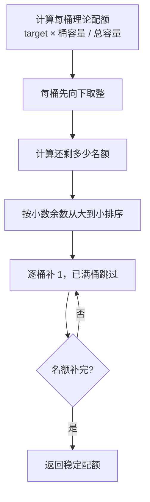

# 人工质检验收采样、选择与分配

## 本页导航

- [采样与分配概览](#采样与分配概览)
- [采样策略及适用目的](#采样策略及适用目的)
- [Ratio 数量算法](#ratio-数量算法)
- [选择范围](#选择范围)
- [当前预览的数据边界](#当前预览的数据边界)
- [从配额到正式分配](#从配额到正式分配)
- [输入校验与失败行为](#输入校验与失败行为)

## 采样与分配概览

**核心问题：** 一次真正的验收分配包含三个不同决定：各范围抽多少、具体抽哪些 task、由哪些验收员接收。当前代码只解决第一个决定中的 Ratio 数量规划，所以“预览已经生成”不能解释为“任务已经分配”。

**当前能力边界：**

- Group 和 Personal 来自历史材料及目标设计，能够保留其机制，但不能称为当前代码能力；
- 数量不足、类别互补、分桶稳定性和预览过期都必须显式呈现，不能静默改变用户请求。

**目标边界：** 目标设计还要求 `SAMPLER_REGISTRY` 作为策略名称、描述和实现的唯一来源，前端通过 `/samplers` 读取；这只是目标契约，当前代码仍只有 Ratio 数量预览。预览与正式分配之间必须固定具体 `task_ids`，而不是把统计桶当作执行对象。

## 采样策略及适用目的

| 策略 | 业务目的 | 已知规则 | 证据状态 |
|---|---|---|---|
| Group | 以组为单位保证覆盖并控制组总抽检量 | 历史记录为 `min(组员数×90, 300)`，Good/Bad 初始各半，再按 scene 分配 | 历史与目标；当前代码未实现 |
| Personal | 每个标注员独立抽检，支持个人质量观察 | 历史记录每人 90，Good/Bad 各 45，一侧不足由另一侧补 | 历史与目标；当前代码未实现 |
| Ratio | 用户指定最终数量和 Good 比例，处理临时业务范围 | 按容量比例分桶、类别互补和总量缺口 | 固定代码已实现数量预览 |

90、300 和 50% 都是旧材料中的数值，当前是否沿用仍需业务决定。

通过率分母存在材料冲突：三阶段流程要求以 `acceptance_completed` 为分母，总览和部分规则材料写成按分配数计算。两者不能静默统一；知识页面必须保留公式、字段版本和数据时间，等待业务决定。

## Ratio 数量算法

### 算法契约

| 项目 | 内容 |
|---|---|
| 输入 | 多个统计桶的 ID、Good/Bad 可用量，可选目标总数，Good 目标比例 |
| 输出 | 最终目标、Good/Bad 计划数、总量缺口、每桶配额和警告 |
| 保证 | 不超过总可用量、不超过任一桶容量、相同输入得到相同结果 |
| 不负责 | 查询数据库、选择具体 task、选择验收员或调用外部系统 |

### 总量与类别配额

1. 汇总全部桶的 Good、Bad 和总可用量。
2. 最终目标为“请求目标或总可用量”与总可用量的较小值。
3. 请求超过可用量的部分记录为 `shortage`。
4. 期望 Good 数为 `round(target × good_ratio)`；固定代码使用 Python `round`，恰好 `.5` 时采用向偶数舍入。
5. Good 先取期望值与 Good 可用量的较小值，Bad 再填剩余目标。
6. 仍有缺口时，先由额外 Good、再由额外 Bad 补足，且始终不超过可用量。
7. 类别不足和总量不足生成用户可见 warning。

### 类别配额的分桶过程

| 计算阶段 | 处理方式 | 约束 | 阶段输出 |
|---|---|---|---|
| 理论分配 | `类别目标数 × 桶容量 / 类别总容量` | 只在同一 Good 或 Bad 类别内计算 | 每桶带小数的理论配额 |
| 初始整数配额 | 对每桶理论配额向下取整 | 初始配额不得超过桶容量 | 保守整数配额及未分名额 |
| 余数排序 | 按小数余数降序排列 | 余数相同时按桶 ID 排序 | 稳定、可重复的补位顺序 |
| 逐桶补位 | 按顺序为未满桶增加 1 | 满桶跳过，所有桶均不得超出容量 | 满足类别目标的最终配额 |
| 完整性检查 | 汇总所有桶配额 | 总配额应等于类别计划数；容量不足时必须产生警告 | 类别分桶结果与异常信息 |

Good 与 Bad 分别执行上述过程。桶容量是硬上限，桶 ID 只在余数相同时用于稳定排序，不代表业务优先级。该过程只产出数量，不包含 task 选择或验收员分配。

### 类别不足示例

| 项目 | 数值或结果 |
|---|---|
| 用户请求 | 总量 20，Good 比例 50% |
| 理论类别目标 | Good 10，Bad 10 |
| 实际容量 | Good 40，Bad 5 |
| 类别互补结果 | Good 15，Bad 5 |
| 总量结果 | 仍达到 20 |
| 用户可见信息 | “Bad 可用量不足，已由 Good 补足” |

如果 Good 与 Bad 总容量合计也不足 20，最终目标必须下降并产生总量 `shortage`；系统不能只返回一个较小数字而不说明原因。

## 选择范围

| 选择形式 | 解析结果 | 当前限制 |
|---|---|---|
| 纯数字任务 ID | `task_ids` | 必须能在当前查询范围中找到 |
| `<任务ID>-date-<YYYY-MM-DD>` | 任务与日期组成的统计桶 | 只实现日期叶子，其他维度尚不支持 |
| 携带 `filter_snapshot` 的筛选全选 | 根据筛选条件解析 task_ids | 最多解析 5000 个任务 |
| 排除特定行或任务 | 从全选结果中移除对应 ID | 无法识别的排除项应被拒绝或明确忽略 |

Repository 计算 `annotation_submitted - acceptance_allocated` 作为总可用量；Good 可用量取选项中的 GOOD 减已分配 Good，并受总可用量限制；Bad 是剩余量。这个口径属于固定代码期待的快照版本，真实生产字段仍未知。

## 当前预览的数据边界

| 保存内容 | 业务作用 | 当前缺失带来的影响 |
|---|---|---|
| 选择描述与原始请求 | 还原用户选择和 Ratio 参数 | 不能独立证明候选数据未变化 |
| 每个统计桶的可用量和计划量 | 展示数量怎样分布 | 只能表示配额，不表示具体样本 |
| 创建人、预览 ID 和状态 | 限制读取者并标识一次预览 | 尚无正式执行状态机 |
| 来源版本 | 感知统计单元及计算时间变化 | 版本并不覆盖外部 task 全部状态 |
| 创建时间与 30 分钟过期时间 | 防止长期使用陈旧结果 | 过期后必须重新计算 |
| **未保存：具体 task_ids** | — | 无法保证正式执行“所见即所得”，不能作为执行凭证 |

## 从配额到正式分配

| 分配步骤 | 所需输入 | 应产出 | 固定代码状态 |
|---|---|---|---|
| 查询候选 task | 日期、scene、人员、Good/Bad 类别及合法状态 | 可被选择的 task_ids | 未实现 |
| 应用人员约束 | 标注员、验收员、供应商、分组和有效期 | 合法的任务—验收员组合 | 未实现 |
| 固定样本 | 配额、候选 task、稳定排序或抽样规则 | 与预览绑定的 task_ids | 未实现 |
| 用户确认 | 预览、缺口、警告和影响范围 | 可审计的执行请求 | 未实现 |
| 外部分配 | task_ids、验收员及外部接口契约 | 即时成功、失败、跳过和未知 | 未实现 |
| 状态回查 | 操作记录与外部当前状态 | 实际分配量和待处理异常 | 未实现 |

## 输入校验与失败行为

- 空选择、无法识别的 ID 和当前不支持的叶子维度会被拒绝。
- 目标总数不能小于 1，Good 比例必须在 0 到 1 之间。
- 数据不足不应静默减少目标，必须显示缺口和类别补足。
- 预览过期或来源版本变化时，不能继续沿用旧结果。
- Group 的奇数余量、具体 task 排序和当前业务常量都尚未确认。

# Citations

1. [当前验收原型](../../../../sources/current-prototype.md)
2. [历史验收运行快照](../../../../sources/historical-pipeline.md)
3. [目标验收平台设计](../../../../sources/target-design.md)
