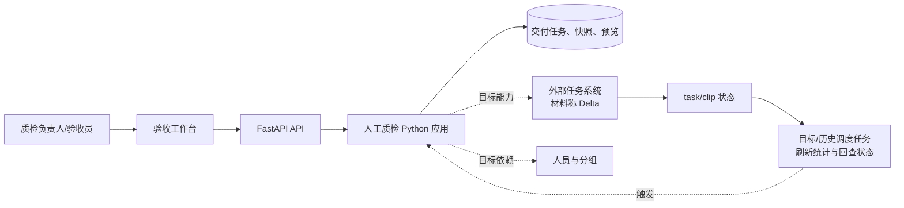
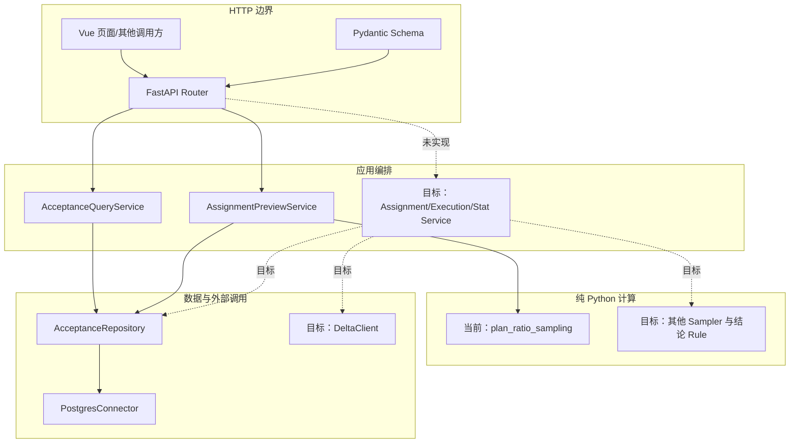
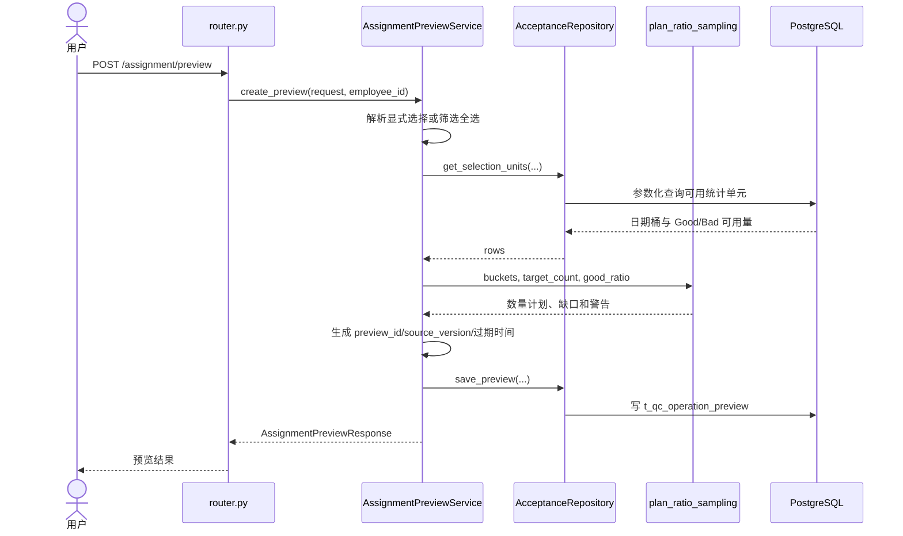
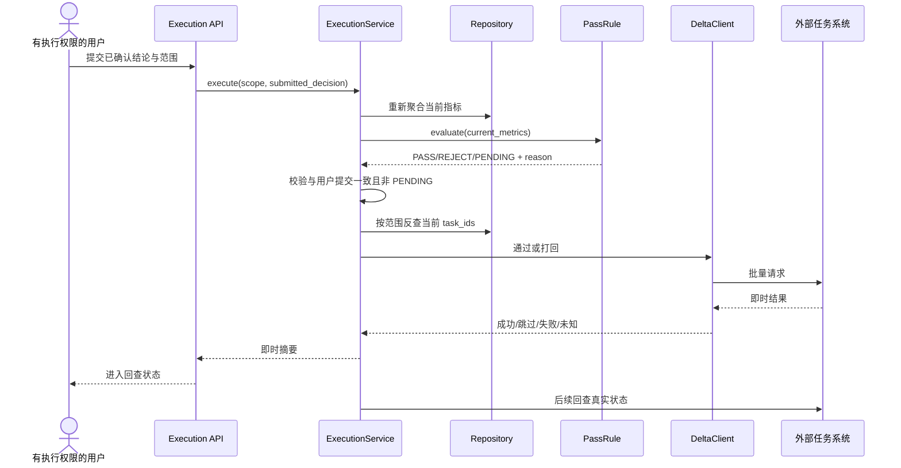
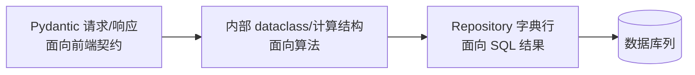

# 人工质检验收系统架构与跨层调用

## 系统结构首先要守住两类事实和三类责任

验收系统同时读取本平台的管理数据和外部任务系统的最终状态。本平台数据库可以保存交付任务、派生快照、预览和操作记录，但只有外部任务系统能证明 task/clip 是否真实完成分配、通过或打回。

在进程内部，API 维护接口契约，Service 组织完整业务用例，纯 Python 算法负责确定性计算，Repository 和外部客户端分别处理两类 I/O。当前分层的价值来自这些责任和数据边界，而不是 Router、Service、Repository 等名称本身。

固定代码只贯通查询与 Ratio 数量预览；正式分配、规则结论、通过/打回和回查仍属于目标设计。

## 系统上下文与事实边界

| 边界或系统 | 主要职责 | 输入 | 输出 | 事实归属 | 固定代码状态 |
|---|---|---|---|---|---|
| 验收工作台 | 选择范围、展示统计、发起预览与高风险动作 | 用户筛选、选择和参数 | API 请求、状态与结果展示 | 不拥有业务事实 | 有局部前端 |
| 人工质检 Python 应用 | 校验请求、编排用例、计算规则、组织 I/O | API 请求、数据库读模型、外部状态 | 预览、结论、操作摘要 | 拥有应用过程，不拥有外部最终状态 | 有查询与预览纵切 |
| 本平台数据库 | 保存交付任务、统计快照、预览和管理记录 | 刷新数据、用户操作与应用写入 | 查询读模型、预览和审计记录 | 平台管理事实与派生统计 | 有访问代码；Schema 不完整 |
| 人员与分组来源 | 提供人员、供应商、分组、角色和有效期 | 组织管理数据 | 可用于分配和权限判断的人员事实 | 人员主数据 | 目标依赖，当前切片未实现 |
| 外部任务系统 | 保存 task/clip 当前状态并执行分配、通过或打回 | task_ids、目标状态和操作者 | 即时结果与可回查最终状态 | task/clip 最终状态 | 当前无客户端 |
| 调度/刷新任务 | 聚合原始状态、刷新快照、回查异步结果 | 外部原始状态、人员数据、操作记录 | 新快照、最终结果和异常 | 派生事实，不覆盖原始状态 | 仅有目标和历史材料 |

本平台数据库与外部任务系统承担不同事实：前者提供管理读模型和操作记录，后者决定 task/clip 是否真实完成分配、通过或打回。目标材料描述了周期刷新和状态回查，固定代码中尚无对应 DAG 或任务实现。

## 进程内组件与职责

| 组件 | 核心职责 | 接收 | 产出 | 不应承担 | 状态 |
|---|---|---|---|---|---|
| Vue 工作台 | 组织查询、下钻、选择、预览和结果呈现 | 用户操作、API 响应 | 类型化 API 请求、界面状态 | SQL、配额公式、外部系统调用 | 当前有局部实现 |
| Router + Pydantic Schema | HTTP 校验、身份读取、错误映射和稳定响应 | JSON、路径/查询参数、操作者信息 | 类型化请求与响应 | 业务步骤、SQL 和规则计算 | 当前已实现查询与预览接口 |
| QueryService | 编排只读查询与返回时间信息 | 查询条件、Repository | 任务页、日期明细 | 自行管理连接或编写 SQL | 当前已实现 |
| AssignmentPreviewService | 解析选择、查询容量、调用算法、组装并保存预览 | 选择、Ratio 参数、操作者、Repository | 带有效期和来源版本的预览 | 选择具体 task、正式执行 | 当前已实现 |
| Sampler / Rule | 计算配额或根据指标形成结论 | 无 I/O 的明确数据结构 | 配额计划或 PASS/REJECT/PENDING | HTTP、数据库和外部调用 | Ratio 当前实现；其余目标设计 |
| Repository | 集中领域 SQL、参数和行映射 | 业务查询条件、数据库连接器 | 字典行、保存结果 | 采样公式和结论规则 | 当前局部实现 |
| PostgresConnector | 连接池、参数化执行和事务 | SQL 与参数 | 查询结果、写入结果 | 业务表语义 | 当前已实现 |
| 外部客户端 | 状态查询、分配、通过/打回和错误归类 | task_ids、动作和身份 | 成功、失败、跳过、未知及回查状态 | 本地规则判断 | 目标设计，当前未实现 |

实线组件能在固定提交中定位；虚线组件只来自目标材料。真正的分层约束是：纯计算不做 I/O，Repository 不决定业务规则，外部客户端不把即时响应冒充最终状态。

## 当前实现链路：Ratio 分配预览

### 数据变化与副作用

| 调用阶段 | 输入形态 | 关键处理 | 输出形态 | 是否产生副作用 |
|---|---|---|---|---|
| Router 接收请求 | HTTP JSON、操作者请求头 | Pydantic 校验并建立请求对象 | `AssignmentPreviewRequest` | 否 |
| Service 解析选择 | 任务、日期或筛选全选 | 转换为 task_ids/date_keys，处理排除项 | 明确选择范围 | 可能读取筛选任务 |
| Repository 查询容量 | 选择范围、SQL 参数 | 聚合日期桶及 Good/Bad 可用量 | `list[dict]` 统计行 | 只读数据库 |
| Sampler 计算 | `SamplingBucket`、目标量、Good 比例 | 类别互补和稳定分桶 | `SamplingPlan` | 无 I/O |
| Service 组装预览 | 计划、原始统计行、操作者 | 生成 ID、来源版本和有效期 | `AssignmentPreviewResponse` | 否 |
| Repository 保存预览 | 请求与响应 JSON、元数据 | 写 `t_qc_operation_preview` | 持久化预览 | 写数据库 |
| Router 返回 | 类型化响应 | 统一响应包装 | HTTP JSON | 否 |

该链路冻结选择描述、请求、统计单元和数量结果，但没有冻结具体 task_ids，也没有 execute 端点。因此保存成功只表示“数量预览已记录”，不表示“任务已经分配”。

## 目标链路：结论执行与状态回查

### 执行检查点与结果语义

| 检查点 | 需要验证的内容 | 失败时的行为 | 目的 |
|---|---|---|---|
| 权限与范围 | 操作者权限、决定粒度和影响范围 | 拒绝请求，不产生外部动作 | 防止越权或范围扩大 |
| 当前指标重取 | 完成度、通过率和数据时间仍有效 | 要求重新审视 | 防止使用陈旧快照 |
| 结论重算 | 当前结论与用户提交一致且非 PENDING | 停止执行 | 防止前后端或规则版本不一致 |
| task_ids 反查 | 每条 task 仍处于可操作状态 | 分类为跳过、失败或需确认 | 防止对过期对象操作 |
| 外部即时结果 | 成功、失败、跳过和未知分别记录 | 未知进入回查，不声明完成 | 保留部分失败语义 |
| 最终状态回查 | task 是否到达目标状态 | 继续回查或人工排查 | 以外部最终状态闭环 |

整条时序来自目标设计，不是当前代码。生产权限模型、接口、状态值、批量限制和回查方式仍需直接证据。

## 跨层数据结构与转换

| 数据形态 | 服务对象 | 包含内容 | 转换责任 | 主要风险 |
|---|---|---|---|---|
| Pydantic 请求/响应 | 前端与 API 契约 | 用户选择、规则参数、预览和错误 | Router/Service | 接口字段变化影响应用服务 |
| 内部 dataclass/计算结构 | Sampler 与 Rule | 算法所需的最小计数或指标 | Service | 过度抽象或丢失必要业务语义 |
| Repository 字典行 | 领域数据访问 | SQL 返回列和聚合结果 | Repository/Service | 数据库字段版本泄漏到上层 |
| 数据库列与 JSONB | 持久化 | 交付、快照、预览和操作记录 | Repository | Schema 与代码不一致 |

当前代码已经进行了“数据库行 → `SamplingBucket` → `SamplingPlan` → Pydantic 响应”的转换，算法不会直接依赖 SQL 行。但隔离并不彻底：`AssignmentPreviewService` 直接 import API Schema。它对当前小切片较直接；只有 CLI、DAG 或其他入口真的复用同一用例时，才有足够理由抽取独立应用输入输出，而不是提前增加模型层。

## 当前能力与目标能力对账

| 能力 | 固定代码 | 目标材料 |
|---|---|---|
| 前端队列 | 已有任务表、日期展开、选择和 Ratio 预览交互；未证明部署 | 目标材料只给分层原则，尚无完整监控分析工作台 |
| 查询、按天展开 | 已实现 | 继续扩展到组、人员和 scene |
| Ratio 数量预览 | 已实现 | 预览应含具体 task_ids 和更多约束 |
| 真正分配 | 未实现 | Service + Repository + DeltaClient |
| 结论规则 | 未实现 | 纯规则输出 PASS/REJECT/PENDING |
| 通过/打回与回查 | 未实现 | 执行前重算、即时结果、最终回查 |
| 快照刷新与调度 | 未实现 | 目标材料描述周期刷新和状态驱动任务；历史材料也记录过定时脚本 |

# Citations

1. [当前验收原型](../../../../sources/current-prototype.md)
2. [目标验收平台设计](../../../../sources/target-design.md)
3. [数据库访问公共能力](../../../../capabilities/database-access.md)
