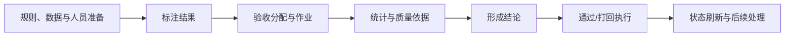

# 人工质检领域

## 人工质检从任务准备走向可交付结果

人工质检从规则、数据和人员准备开始，经过标注、验收、结论执行、状态刷新与返工，最终才形成可以交付的数据。验收负责提供质量依据并推动后续动作，但它既不是人工质检的起点，也不是交付完成本身。

父版本 Batch 1 对验收有历史运行、目标设计和当前原型三类材料，对需求接纳、过程监控和最终交付描述不足；当前候选已用 Batch 2 补充交付任务、行动项、人员权限和统一数据工作台的业务与目标设计边界。候选仍不能把整个人工质检描述成已经运行的一站式平台；当前仓库原型停在 Ratio 数量预览，也不代表验收闭环已经成立。

Batch 2 将全貌补到交付任务和行动项：人工质检以数据集对应的交付任务为主对象，从需求登记持续到验收通过、打回返修完成和可交付 Good 数量确认；标注任务创建成功不是交付完成。标准轨道包含需求对齐、送检、规则与适配、建任务审批、生产、标注、验收、通过/打回回查和交付确认，数据准备与规则对齐可并行，规则变化可能触发培训、试标和再对齐循环。这个流程是当前业务决定，不证明系统已实现完整闭环。

## 人工质检目标业务链

| 环节 | 主要输入 | 核心职责 | 主要输出 |
|---|---|---|---|
| 规则、数据与人员准备 | 质检需求、行为规范、待作业数据、人员与权限 | 明确作业对象、规则、平台配置和执行资源 | 可下发的标注任务 |
| 标注 | 任务、素材和标注规则 | 产生 Good、Bad 或选项级结果 | 标注结果总体 |
| 验收分配与作业 | 标注结果、抽样策略、验收人员 | 选择样本、分配验收并收集判断 | 验收记录与完成进度 |
| 统计与质量依据 | 标注与验收记录 | 聚合完成度、通过率和分类结果 | 可用于结论的指标 |
| 结论与执行 | 当前指标、规则、人工确认范围 | 形成 PASS/REJECT/PENDING，并执行通过或打回 | 操作记录与外部状态变化 |
| 状态刷新与后续处理 | 外部最终状态、交付目标 | 回查、返工、再次验收和交付判断 | 可交付结果或下一轮任务 |

人工质检目标架构还包含人员与分组、权限、快照、API/前端、数据库访问和外部任务系统边界。Batch 1 没有充分描述需求如何进入、交付负责人怎样持续推进、最终什么条件算交付完成；Batch 2 已补充这些主题的目标边界，但预测口径、现实组织、页面/API/SSO 与端到端实现仍不能由设计材料推出。

## 验收内部业务链

| 业务链 | 目的 | Batch 1 中的状态 |
|---|---|---|
| 验收分配 | 从待验收总体计算抽样或配额并分给验收员 | 有历史做法、目标设计；当前原型只做到 Ratio 数量预览 |
| 统计刷新 | 把原始任务和人员信息聚合为按日、场景、组和人员等统计 | 有目标快照与历史中间表设计；固定提交没有快照刷新实现 |
| 通过/打回 | 根据验收依据形成结论，对相应标注全集执行并回查 | 有历史规则和目标设计；固定提交未实现 |

## 角色与责任

| 角色 | K0 能确认的责任 | 仍不确定 |
|---|---|---|
| 标注员 | 产生 Good、Bad 或选项级结果；打回后可能返工 | 当前组织、分组、产量和交付责任 |
| 验收员 | 对抽样结果做验收，产生质量依据 | 当前分配规则、权限和责任边界 |
| 质检负责人/操作人员 | 选择范围、确认结论并发起高风险动作 | 当前岗位名称、审批和交付责任 |
| 平台 | 查询、计算、展示、记录并与数据库/外部系统交互 | 当前生产覆盖范围和部署状态 |

人员材料描述了目标表、分组和权限，但缺少当前生产数据与对应代码，所以不能作为现行组织事实。

## 交付状态与行动项

交付阶段、健康状态、行动项状态和验收结论是四个独立维度：阶段回答走到哪里，健康回答正常/风险/阻塞/逾期，行动项回答具体事项进展，验收结论回答 `PENDING`/`PASS`/`REJECT`。交付中心还应并列保留需求计划值与实际值，行动项至少记录标题、归属任务、责任人、截止时间、状态、优先级、风险和闭环结论。交付时间预测的计算口径仍未知，约两天验收预留只是经验值，不是冻结规则。

## 当前仓库原型的能力位置

| 能力阶段 | 当前状态 | 结果含义 |
|---|---|---|
| 任务查询与按日展开 | 固定代码已实现 | 能看到候选范围和按日统计 |
| Ratio 数量预览 | 固定代码已实现 | 能计算各统计桶计划数量 |
| 具体样本选择 | 未实现 | 尚不能确定本次验收 task_ids |
| 正式分配 | 未实现 | 尚未改变外部任务状态 |
| 结论与执行 | 未实现 | 尚不能形成正式结论或通过/打回 |

当前原型是人工质检验收中的局部纵向切片，不等于人工质检平台全貌。

## 相关知识入口

- [平台与模块地图](platform-and-module-map.md)
- [验收总览](acceptance/overview.md)
- [验收生命周期](acceptance/lifecycle.md)
- [当前原型](../../../systems/manual-qc-acceptance-prototype.md)

## 来源

1. [目标验收平台设计](../../../sources/target-design.md)
2. [人工语义决定](../../../sources/human-decisions.md)
3. [历史验收运行快照](../../../sources/historical-pipeline.md)
4. [当前验收原型](../../../sources/current-prototype.md)
