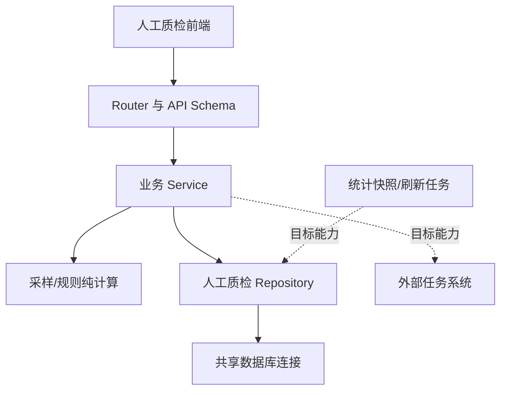

# 人工质检平台与模块地图

## 本页导航

- [平台架构概览](#平台架构概览)
- [目标模块协作结构](#目标模块协作结构)
- [模块职责、接口与现实状态](#模块职责接口与现实状态)
- [分层责任边界](#分层责任边界)
- [当前产品能力与缺口](#当前产品能力与缺口)

## 平台架构概览

**架构目的：** 目标平台把用户交互、接口契约、业务编排、领域计算、数据访问和外部任务状态分给不同模块。这样的分工只有在职责、输入输出和事实边界清楚时才有价值，不能用 Router、Service、Repository 等类名代替软件结构解释。

**当前范围：** 当前代码只落地任务查询、日期展开和 Ratio 数量预览这一条纵向切片。需求接纳、验收监控、返工跟踪、统一人员工作台和外部执行仍缺少完整产品或实现证据。

**共享边界：** 平台目标还包含交付中心、人员与权限、统一数据工作台和可配置看板。它们共享 Shell、表格、卡片、选择、预览、反馈、权限和可访问性语言，但不合并人工质检、大模型质检、自动化质检和专题质量各自的业务模型、表或流程。

## 目标模块协作结构

**协作主线：** 前端通过 API 进入业务 Service；Service 调用纯计算和 Repository，并在目标状态下连接外部任务系统与快照刷新。

## 模块职责、接口与现实状态

**对账方式：** 每个模块同时说明输入、职责和当前代码状态，避免把目标名称误当成已经实现的能力。

| 模块 | 主要输入 | 目标输出与职责 | 固定提交状态 |
|---|---|---|---|
| 前端验收队列 | 用户筛选、选择、API 响应 | 查询、按日展开、选择范围和展示分配预览 | 有 Vue 页面、组合函数和测试；未证明部署 |
| Router/API Schema | HTTP 请求、操作者信息 | 请求校验、统一响应和业务错误映射 | 已实现查询、日期展开、预览创建/读取和 metadata |
| QueryService | 类型化查询与 Repository | 带数据时间的任务页和明细 | 已实现 |
| AssignmentPreviewService | 选择范围、Ratio 参数、操作者 | 数量计划、来源版本、有效期和预览记录 | 已实现；不选择具体 task |
| Sampler | 统计桶容量、目标量和比例 | 无 I/O 的 Ratio 配额计划 | 已实现且有测试 |
| AcceptanceRepository | 查询条件、预览数据、数据库连接 | 任务/日期/统计行及预览持久化 | 已实现；SQL 未经真实数据库验证 |
| Config/Database | 配置、SQL 与参数 | 命名连接、参数化查询和事务 | 已实现共享基础代码 |
| 快照刷新 | 原始任务状态、人员与分组 | 按日期/scene/组/人员聚合的统计读模型 | 只有设计和契约 |
| Group/Personal 采样 | 组/人员容量、策略参数 | 配额和具体 task 选择 | 历史与目标设计 |
| 规则与结论 | 完成度、质量指标、阈值和范围 | PASS/REJECT/PENDING 及依据 | 历史与目标设计 |
| 正式执行与回查 | 结论、task_ids、外部接口 | 即时摘要、最终状态和异常分类 | 历史与目标设计 |
| 人员与权限 | 人员、组、供应商、角色与有效期 | 分配约束和操作授权 | 只有目标材料 |

## 分层责任边界

**边界原则：** 分层不是为了增加类名，而是避免接口、规则、SQL、连接和外部状态相互混杂。

- Router 不编写 SQL，不承载采样规则；
- Service 负责业务步骤和一致性，不直接管理连接池；
- Sampler/Rule 尽量是无 I/O 的领域计算；
- Repository 集中 SQL 和行映射；
- 共享数据库模块拥有连接配置、池和事务；
- 外部系统调用必须和本地结论、即时响应、最终回查状态分开。

这些是目标设计与当前局部代码共同体现的结构，不代表未来必须保留每个类名。

## 当前产品能力与缺口

**知识覆盖：** 当前知识已经说明交付任务与行动项、人员与权限、统一数据工作台及其导航的业务边界和目标设计；这不等于已部署页面、API、SSO 或端到端运行证据。需求接纳的真实入口、验收监控分析、返工跟踪和统一人员工作台仍缺少完整产品或实现证据。

**工作台目标：** 统一数据工作台由 `DataWorkbench` 管布局与事件、由 `useDataWorkbench` 管列/筛选/排序/选择/展开状态；业务页提供列契约、数据源、权限、批量动作和展开维度。跨页危险操作必须表达为明确 ID 或筛选快照加排除项，并遵循选择、预览、冻结集合、权限/版本复核、执行、回查、审计；这些仍是目标设计，不是当前实现证据。

# Citations

1. [目标验收平台设计](../../../sources/target-design.md)
2. [当前验收原型](../../../sources/current-prototype.md)
3. [历史验收运行快照](../../../sources/historical-pipeline.md)
