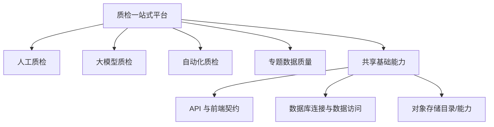

# 质检领域

## 目标平台包含四类质检问题

Batch 1 把一站式质检平台设计为人工质检、大模型质检、自动化质检和专题数据质量四个子域。它们可以共享 API、数据库和对象存储等基础能力，但各自维护领域规则和数据语义。

这一划分属于目标架构，不是当前生产能力清单。K0 只有人工质检验收具备足够材料，其余子域只能保留位置，不能补写内部能力。

## 目标领域结构

图中的四个业务子域是并列关系，共享基础能力是跨子域依赖，不是第五种质检方式。该结构表达领域归属，不表达执行顺序、系统集成状态或当前成熟度。

## 子域定位与 K0 覆盖

| 子域 | Batch 1 能确认 | K0 覆盖深度 |
|---|---|---|
| [人工质检](manual/overview.md) | 有整体目标架构、历史验收材料和当前验收原型 | 讲人工质检目标全貌，纵向深入验收 |
| 大模型质检 | 顶层设计声明它是平台子域 | 只保留位置，不解释内部能力 |
| 自动化质检 | 顶层设计声明它是平台子域 | 只保留位置，不解释内部能力 |
| 专题数据质量 | 顶层设计声明它是平台子域 | 只保留位置，不解释内部能力 |

因此，K0 不能回答四种方式当前如何协作、各自覆盖哪些数据需求、成熟度或运行效果。它只能可靠地把人工质检放回目标平台坐标中。

## 跨子域共享边界

目标设计提出以下共同边界：

- 前端通过 API 调用业务能力，不直接访问数据库或外部系统；
- Router 处理 HTTP 协议，Service 编排业务，领域算法保持纯计算，Repository 集中数据访问；
- 预览和正式执行应分离，高风险动作需要先看范围和结果；
- 通用数据库、配置和对象存储能力应由公共模块拥有，业务域只维护自己的使用语义。

固定提交已经局部实现配置、数据库连接、验收 Router/Service/Repository 和前端队列，但不能据此证明整个质检平台成立。

## 相关知识入口

- [人工质检](manual/overview.md)
- [人工质检平台与模块](manual/platform-and-module-map.md)
- [人工质检验收](manual/acceptance/overview.md)
- [数据库公共能力](../../capabilities/database-access.md)

## 来源

1. [目标验收平台设计](../../sources/target-design.md)
2. [当前验收原型](../../sources/current-prototype.md)
