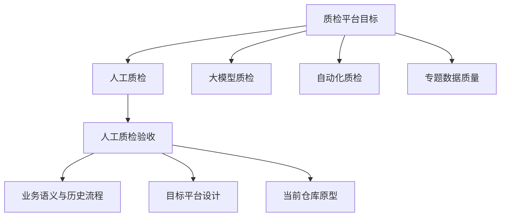

# 质检领域位置与人工质检验收

## 本页导航

- [领域浏览概览](#领域浏览概览)
- [领域层级](#领域层级)
- [知识深度](#知识深度)
- [按角色进入](#按角色进入)
- [软件与公共能力](#软件与公共能力)
- [来源边界](#来源边界)

## 领域浏览概览

**本页用途：** 沿“质检领域 → 人工质检 → 人工质检验收”逐层下钻，并在每一层说明当前知识能回答什么、不能回答什么。

**默认路线：** [质检领域全貌](../../domains/quality/overview.md) → [人工质检全貌](../../domains/quality/manual/overview.md) → [人工质检验收总览](../../domains/quality/manual/acceptance/overview.md)。第一次学习沿这条路线进入；已经明确任务时可使用下方角色入口。

**专题入口：** [交付与行动项](../../domains/quality/manual/delivery-management.md) · [人员与权限](../../domains/quality/manual/personnel-and-permissions.md) · [统一数据工作台](../../capabilities/quality-data-workbench.md) · [平台与模块地图](../../domains/quality/manual/platform-and-module-map.md) · [业务到代码地图](../../domains/quality/manual/acceptance/implementation-map.md) · [待确认事项](../../domains/quality/manual/acceptance/open-questions.md)

**知识边界：** 目标设计把质检平台分为人工质检、大模型质检、自动化质检和专题数据质量四个并列子域。人工质检验收位于人工质检内部，连接上游标注结果与下游结论执行、返工和交付判断。现有知识对人工质检验收最深入，对其余三个子域只说明位置，不能据此推断已经建设完成。

## 领域层级

**层级关系：** 业务历史、目标设计和当前仓库原型是验收知识的三种证据视角，不是三个连续业务阶段。

## 知识深度

**使用方法：** 先依据所在层级判断问题能否被现有知识回答，再进入对应规范页；缺失的现实事实不能由上级概览补全。

| 层级 | 当前知识可以回答 | 当前知识不能回答 | 入口 |
|---|---|---|---|
| 质检 | 目标平台包含哪些子域、共享什么架构原则 | 四类质检当前真实分工、运行数据和成熟度 | [质检领域](../../domains/quality/overview.md) |
| 人工质检 | 目标模块、验收三条业务链，以及交付、人员权限和共享工作台边界 | 当前生产页面/API/SSO、完整交付推进和组织责任 | [人工质检](../../domains/quality/manual/overview.md) |
| 人工质检验收 | 阶段边界、历史做法、目标数据/系统、当前原型和算法 | 当前生产规则、完整执行工作台和端到端部署 | [验收总览](../../domains/quality/manual/acceptance/overview.md) |

## 按角色进入

**入口选择：** 不同角色沿最短路径进入所需知识，遇到跨层问题时再回到上级全貌。

- 业务学习者：[人工质检](../../domains/quality/manual/overview.md) → [验收生命周期](../../domains/quality/manual/acceptance/lifecycle.md)
- 方案设计者：[人工质检平台](../../domains/quality/manual/platform-and-module-map.md) → [验收系统架构](../../domains/quality/manual/acceptance/system-architecture.md)
- 开发者：[Python 软件结构](../../domains/quality/manual/acceptance/python-architecture-and-implementation.md) → [当前原型](../../systems/manual-qc-acceptance-prototype.md)
- 规则与数据人员：[采样与分配](../../domains/quality/manual/acceptance/sampling-and-assignment.md) → [数据流与状态](../../domains/quality/manual/acceptance/data-flow-and-state.md)

## 软件与公共能力

**继续开发：** 下列页面把业务知识连接到当前代码和共享基础能力。

- [业务到组件、代码与证据地图](../../domains/quality/manual/acceptance/implementation-map.md)
- [数据库访问公共能力](../../capabilities/database-access.md)
- [对象存储公共能力与当前缺口](../../capabilities/object-storage.md)

## 来源边界

领域层级来自目标设计；验收边界由人工业务语义、历史材料和当前代码交叉说明。具体文件和版本参见[来源记录](../../sources/index.md)。
