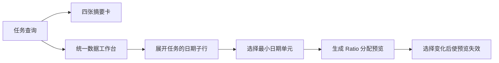

# 人工质检验收当前仓库原型

## 当前原型只走到 Ratio 数量预览

固定提交 `3cf393479d59dae57280df3c80a1ff213a936909` 实现了任务查询、日期展开和 Ratio 数量预览，前端、API、Service、纯算法、Repository 和数据库公共组件都有对应代码。

这条链路没有选择具体 task、正式分配、形成结论、通过/打回、调用外部系统或跟踪返工。代码与测试存在只能证明固定提交中的局部行为，不能证明服务已经部署或真实数据库 Schema 兼容。

## 能力边界

| 能力 | 当前状态 | 可证明的结果 |
|---|---|---|
| 任务查询 | 已实现 | 参数化筛选、分页、排序和汇总 |
| 日期展开 | 已实现 | 按天读取标注与验收聚合 |
| Ratio 数量预览 | 已实现 | 计算目标、Good/Bad 配额、分桶、缺口和警告 |
| 固定具体 task_ids | 未实现 | 当前预览不能成为执行集合 |
| 正式分配至状态回查 | 未实现 | 原型没有产生外部任务状态变化 |

## API 入口

| 方法与路径 | 当前行为 |
|---|---|
| `POST /api/v1/manual-qc/acceptance/tasks/query` | 按 name、topic、priority、status 过滤，分页和排序 |
| `GET /tasks/{task_id}/breakdown?dimension=date` | 按天聚合；其他维度返回未实现 |
| `GET /metadata` | 声明 date 已实现，group/annotator/scene 未实现，采样只有 ratio |
| `POST /assignment/preview` | 解析选择、查询统计单元、计算数量并保存预览 |
| `GET /assignment/previews/{preview_id}` | 仅创建人可读取 READY 且未过期的预览 |

## 前端交互

`AcceptanceQueueView.vue` 已经把当前后端能力接成一条可读界面链：

| 前端模块或状态 | 功能 | 输入 | 输出或状态变化 |
|---|---|---|---|
| 摘要卡 | 展示任务数、标注提交、验收分配和待分配量 | 查询汇总 | 四项概览指标 |
| `DataWorkbench` | 列显隐、排序、父子行展开和叶子选择 | 任务页与日期明细 | 当前选择集合 |
| `useAssignmentPreview` | 发起预览并管理加载、错误和失效 | 选择集合与 Ratio 参数 | 预览或错误状态 |
| 选择变更 | 防止继续展示旧预览 | 新选择 | 清除旧 preview |
| 页面壳层标签/按钮 | 表达未来产品入口 | 用户点击 | 不能证明对应后端能力存在 |

因此，固定提交有一个局部可交互验收页面，而不是完整验收产品中心。

## Python 代码结构

| 文件 | 当前实际职责 |
|---|---|
| `src/manual_qc/acceptance/router.py` | FastAPI 路由、操作者请求头和错误映射 |
| `src/api/schemas/acceptance.py` | 查询、选择、Ratio 规则、任务行和预览 Pydantic 结构 |
| `src/manual_qc/acceptance/services/query_service.py` | 查询与按天展开编排 |
| `src/manual_qc/acceptance/services/assignment_preview_service.py` | 选择解析、算法调用、预览组装和保存 |
| `src/manual_qc/acceptance/sampler.py` | `SamplingBucket`、`SamplingPlan` 与 Ratio 纯算法 |
| `src/manual_qc/repository.py` | 队列、日期、统计单元和预览 SQL |
| `src/api/deps.py` | 从公共数据库能力组装 Repository 和 Service |
| `src/database/*.py` | 命名连接、懒加载池、事务和查询封装 |
| `src/frontend/src/features/manual-qc/acceptance/` | 验收队列、API 调用、列定义、选择和预览状态 |
| `src/frontend/src/shared/data-workbench/` | 父子表格、选择、排序、列显隐和批量预览事件 |
| `src/frontend/src/shared/dashboard/` | 摘要卡布局和可编辑布局壳层 |

完整业务到代码走读见[Python 软件结构与实现](../domains/quality/manual/acceptance/python-architecture-and-implementation.md)。

## 预览持久化

`t_qc_operation_preview` 保存：

- `preview_id`、操作类型、创建人、状态和有效期；
- 选择描述与原始请求 JSON；
- 预览响应 JSON；
- 基于统计单元 ID、available 和 computed_at 生成的 `source_version`；
- executed_at 预留字段。

默认有效期为 30 分钟。当前结果包含每个日期桶的可用量和 Good/Bad 计划，但没有具体 task_ids。因此“预览已保存”不能解释为“执行集合已冻结”。

## 数据库迁移与查询缺口

迁移 `20260705_acceptance_vertical_slice.sql` 创建：

- `t_qc_delivery_task`；
- `t_qc_operation_preview`；
- `t_portal_view_config`。

Repository 查询依赖 `t_qc_daily_snapshot`，该迁移没有创建此表。代码和目标材料对 `acceptance_submitted/completed` 等字段也存在版本差异。因此当前提交不能证明空库初始化后端到端查询可运行。

## 测试证据

7 项聚焦测试覆盖：

- 参数化筛选、分页和排序参数；
- Service 返回带时区计算时间的类型化页面；
- 五个路由已注册；
- Router 的统一响应；
- Ratio 类别不足补足和总量守恒；
- 预览保存创建人和结果；
- 非法选择 ID 被拒绝。

这些测试使用 `FakePostgres` 或小型内存 Repository。它们可以证明局部 Python 行为，不证明真实 PostgreSQL SQL、生产字段、外部任务状态或完整用户路径。

## 设计评价

| 判断 | 当前结论 | 影响 |
|---|---|---|
| 调用链清晰度 | 薄 Router、用例 Service、纯算法和 Repository 构成短链路 | 适合当前原型规模 |
| 策略扩展 | 新增策略仍需修改 Schema、Service、metadata 和查询 | 尚未形成稳定的多策略扩展接口 |
| 边界耦合 | Service 直接依赖 API Schema | 未来出现 CLI、DAG 等入口时可能需要调整 |
| Repository 规模 | 当前职责仍可理解 | 加入快照刷新、人员与执行 SQL 后再判断是否拆分 |
| 主要限制 | 真实分配、结论、执行和外部系统能力尚未实现 | 增加设计模式不能替代业务纵向闭环 |

具体判断见[Python 软件结构与实现](../domains/quality/manual/acceptance/python-architecture-and-implementation.md)。

# Citations

1. [当前验收原型来源](../sources/current-prototype.md)
