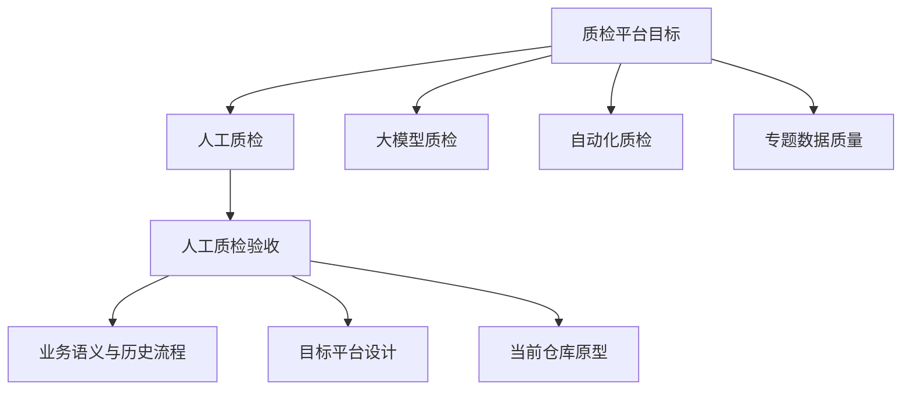

# 质检领域位置与人工质检验收

## 验收在质检领域中的位置

目标设计把质检平台分为人工质检、大模型质检、自动化质检和专题数据质量四个并列子域。人工质检验收位于人工质检内部，连接上游标注结果与下游结论执行、返工和交付判断。

K0 只有人工质检验收具备较完整的历史、设计和代码材料。其余三个子域在这里仅用于说明位置，不能据此推断已经建设完成。

## 领域层级

人工质检验收下的业务历史、目标平台设计和当前仓库原型是三种证据视角，不是三个连续业务阶段。

## 知识深度

| 层级 | K0 可以回答 | K0 不能回答 | 入口 |
|---|---|---|---|
| 质检 | 目标平台包含哪些子域、共享什么架构原则 | 四类质检当前真实分工、运行数据和成熟度 | [质检领域](../../domains/quality/overview.md) |
| 人工质检 | 目标模块、验收三条业务链和主要组件 | 完整需求接纳、交付推进和当前组织责任 | [人工质检](../../domains/quality/manual/overview.md) |
| 人工质检验收 | 阶段边界、历史做法、目标数据/系统、当前原型和算法 | 当前生产规则、完整工作台和端到端部署 | [验收总览](../../domains/quality/manual/acceptance/overview.md) |

## 角色入口

- 业务学习者：[人工质检](../../domains/quality/manual/overview.md) → [验收生命周期](../../domains/quality/manual/acceptance/lifecycle.md)
- 方案设计者：[人工质检平台](../../domains/quality/manual/platform-and-module-map.md) → [验收系统架构](../../domains/quality/manual/acceptance/system-architecture.md)
- 开发者：[Python 软件结构](../../domains/quality/manual/acceptance/python-architecture-and-implementation.md) → [当前原型](../../systems/manual-qc-acceptance-prototype.md)
- 规则与数据人员：[采样与分配](../../domains/quality/manual/acceptance/sampling-and-assignment.md) → [数据流与状态](../../domains/quality/manual/acceptance/data-flow-and-state.md)

## 软件与公共能力

- [业务到组件、代码与证据地图](../../domains/quality/manual/acceptance/implementation-map.md)
- [数据库访问公共能力](../../capabilities/database-access.md)
- [对象存储公共能力与当前缺口](../../capabilities/object-storage.md)

## 来源边界

领域层级主要来自 Batch 1 的 06/08 目标设计；验收边界由 23/24 人工语义线索、历史材料和固定代码交叉说明。参见[来源记录](../../sources/index.md)。
