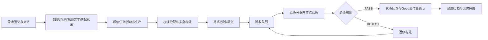

# 人工质检在质量交付系统中的定位

## 目的与边界

- **解决的问题**：回答“人工质检是什么、验收为什么存在、验收前后发生什么”，作为零背景读者进入验收知识的第一张地图。
- **包含**：交付任务、规则/数据准备、任务生产、标注、验收、结论、返修和交付归档的关系。
- **不包含**：未由来源证实的组织架构、生产部署和任何单一旧系统的完整实现。

## 全局业务地图

- **结论**：验收是交付闭环中的质量判定段，不是标注任务创建的同义词；打回会回到返修再验收。
- **现实形态**：目标设计/人工决定，部分相邻历史流程来自 source-a wiki。
- **依据**：[quality_check 设计来源](../../sources/omni-brain-m1-quality-check.md#业务闭环与交付完成)；[ai-knowledge-base 来源](../../sources/ai-knowledge-base-qc.md#旧版人工质检流程)
- **适用范围**：零背景导航、交付中心与验收中心之间的定位。
- **冲突/未知**：当前 source-a vertical slice 只覆盖验收读取和 preview，不证明图中所有节点已在同一系统落地。

## 从定位进入细节

先读[人工质检验收子域总览](acceptance/overview.md)，再读[验收数据粒度与快照口径](acceptance/data-granularity-and-snapshot.md)和[验收抽样与分配预览](acceptance/sampling-and-preview.md)。若需要代码事实，进入[验收前后端实现边界](acceptance/implementation-boundaries.md)和[验收运行链与公共能力关系](../../systems/acceptance-runtime-chain.md)。

# Citations

1. [quality_check 设计来源](../../sources/omni-brain-m1-quality-check.md)
2. [ai-knowledge-base 来源](../../sources/ai-knowledge-base-qc.md)
