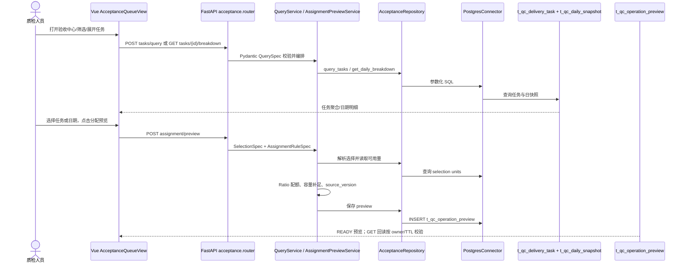

# 验收运行链与公共能力关系

## 目的与边界

- **解决的问题**：把业务动作“查看验收队列/展开日期/生成分配预览”映射到真实 Python、API、Repository、数据库对象，并明确公共能力没有被实际使用时不能硬接入。
- **包含**：当前 source-a vertical slice 的 FastAPI、Service、Repository、PostgresConnector、Vue 调用和三张相关表；OBS/Delta 的证据边界。
- **不包含**：对生产 Delta/OBS 的运行状态、网络、凭证或部署的推断。

## 当前已证实调用链

- **结论**：当前代码实际使用 PostgreSQL；查询使用 `t_qc_delivery_task` 与 `t_qc_daily_snapshot`，preview 结果写入 `t_qc_operation_preview`。Vue 通过 API 调用查询、日期下钻和 preview；当前 API 没有 execute 路由。
- **现实形态**：当前实现。
- **依据**：[ai-knowledge-base 当前代码来源](../sources/ai-knowledge-base-qc.md#当前实现)
- **适用范围**：Git `3cf3934` 的验收首个纵切。
- **冲突/未知**：source-a 的工作区 dirty；未提交材料和真实部署不纳入本结论。

## 公共能力与验收的真实关系

| 能力 | 当前验收 vertical slice | 旧流程/目标设计关系 | 证据边界 |
|---|---|---|---|
| FastAPI/API schema | 实际使用；Router 接收 `QuerySpec`、`SelectionSpec` 和 preview 请求 | 目标 API 还规划 execute/状态相关契约 | source-a 源码/测试可证；execute 未证实 |
| PostgreSQL/Repository | 实际使用；`AcceptanceRepository` 通过 `PostgresConnector` 查询和保存 preview | source-b 规划更完整的 Snapshot/AcceptanceTask Repository | 当前代码可证；目标 schema 不等同当前表 |
| Vue/DataWorkbench | 实际使用；`AcceptanceQueueView` 调查询、日期 breakdown、preview | 工作台/卡片有更广泛平台设计 | 当前前端代码可证；所有交互页签未必实现 |
| Delta | 当前 vertical slice 未调用 | 旧版分配/通过打回和 source-b execute 设计依赖 Delta API | 只能证明相邻历史/目标关系，不能声明当前使用 |
| OBS | 当前验收 vertical slice 未调用、未见直接 import/调用链 | source-a 旧质检材料有 OBS 公共读取/审计占位或其他流程关系 | OBS 工具卡自身标为待补/过时，不能推出验收依赖 |
| Airflow/DAG | 当前 vertical slice 不是其调用方 | source-b 设计了快照刷新调度 | 目标设计，未证实当前验收运行 |

## 业务动作到 Python 实现

| 业务动作 | Python/前端入口 | 数据副作用 | 当前状态 |
|---|---|---|---|
| 查看验收队列 | `AcceptanceQueueView` → `queryAcceptanceTasks` → `query_tasks` → `AcceptanceQueryService` | 读任务与快照 | 已实现并测试 |
| 展开按日明细 | `getAcceptanceDailyBreakdown` → `get_breakdown` → `get_daily_breakdown` | 只读快照 | 已实现；metadata 只标 date implemented |
| 生成验收分配预览 | `createAssignmentPreview` → `create_assignment_preview` → `AssignmentPreviewService.create_preview` | 读可用量、写 preview | 已实现并测试 |
| 执行 PASS/REJECT | 当前前端只有页签占位，当前 router 无 execute | 应调用外部 Delta、更新状态并回查 | 未证实，保持未知 |
| OBS 审计/读取 | 当前验收代码无直接入口 | 可能属于其他流程或旧设计 | 未证实与验收的真实绑定 |

## 关联与边界

业务定位见[人工质检在质量交付系统中的定位](../domains/manual-quality/system-landscape.md)，业务细节见[验收前后端实现边界](../domains/manual-quality/acceptance/implementation-boundaries.md)，开放冲突见[候选知识开放问题](../questions.md)。

# Citations

1. [ai-knowledge-base 当前代码来源](../sources/ai-knowledge-base-qc.md)
2. [quality_check 设计来源](../sources/omni-brain-m1-quality-check.md)

## Citations

1. [ai-knowledge-base 当前代码来源](../sources/ai-knowledge-base-qc.md)
2. [quality_check 设计来源](../sources/omni-brain-m1-quality-check.md)
