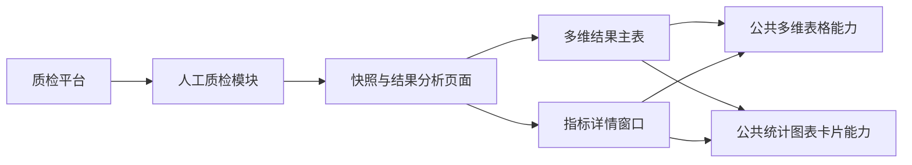
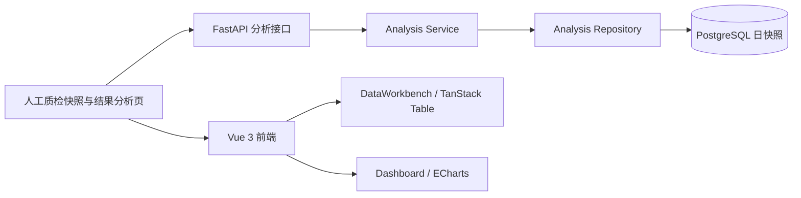
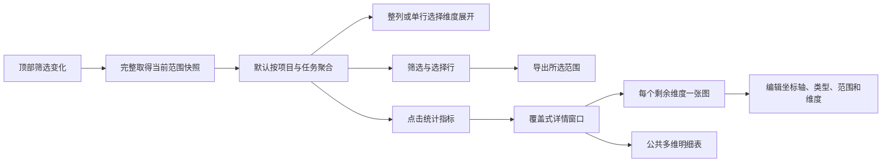
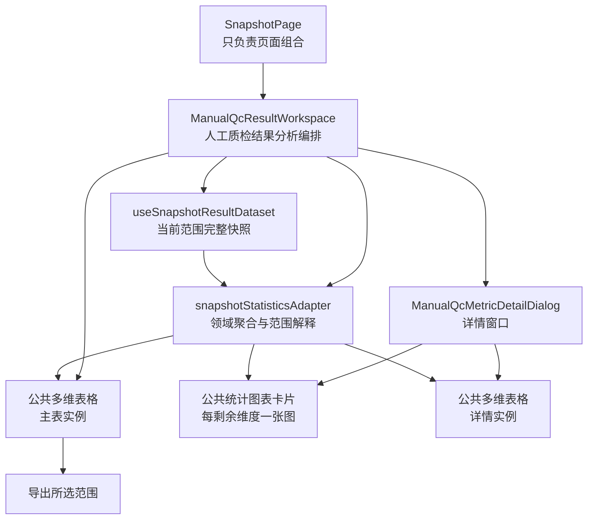
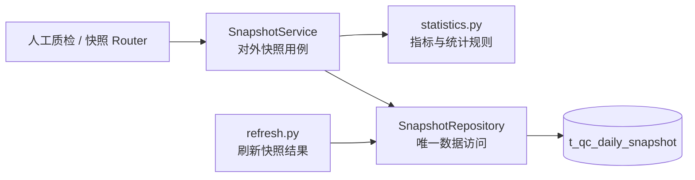

# 人工质检多维结果分析：需求与方案审查

> **版本：** v0.7 方案候选
> **审查对象：** 人工质检多维结果分析的完整开发需求
> **产品现场：** `quality-platform-lab` 的人工质检快照与结果分析页面
> **代码基线：** `quality-platform-lab@89e48d9`
> **当前状态：** R1 与 R2 均已于 2026-08-15 获用户批准，可冻结为方案形成认证参考
> **代码状态：** 尚未修改产品代码

## 审查方法

本页先完成需求确认，再讨论技术方案。R1 只回答“为什么做、使用者怎样完成工作、产品需要提供什么、哪些数据和业务规则必须遵守、怎样算完成”，不提前决定组件类名、API 数量、缓存方式或代码目录。

R1 按下面这条主线组织：


前一部分不成立时，不继续批准后一部分。R1 通过后，Agent 才基于确认后的需求和当前代码形成 R2 技术方案。

## 内容导航

- [R1：需求确认](#r1需求确认)
  - [一、目标与主要问题](#一目标与主要问题)
  - [二、完整使用过程](#二完整使用过程)
  - [三、产品模块与职责](#三产品模块与职责)
  - [四、数据和业务规则](#四数据和业务规则)
  - [五、需求范围与验收](#五需求范围与验收)
  - [六、R1 整体确认](#六r1-整体确认)
- [当前系统现场](#当前系统现场)
- [R2：方案状态](#r2方案状态)
- [证据边界](#证据边界)

## R1：需求确认

### 一、目标与主要问题

#### 1. 产品位置

本需求发生在质检平台的人工质检模块。目标页面用于查看标注、验收等环节的完整结果，帮助使用者从项目、任务、日期、组和标注员等不同角度理解数据、找到主要问题并继续查看明细。



#### 2. 用户原始请求

> 要实现一下前端显示完整的人工质检标注验收等流程的结果统计和详情展开表，这是一个复杂的前后端完整开发内容，需要实现后端怎么能有效吐出前端想要的统计信息、需要前端考虑到查询效率、结果复用性、日常使用的频次来决定怎么样的接口和怎么样的数据形式；需要前端要有一个优质的公共表格组件，能实现多维度的聚合和展开，实现各个列的筛选、聚合展开行的勾选、点击某些列详情以后的展开弹窗，弹窗里的内容也要能复用公共表格组件来对选中行里的数据进行更细粒度的展开和统计，要有公共的卡片统计图表组件，能对聚合数据和展开数据做多维度的呈现分析，也要能支持编辑、点击交互等等，后端要能够有一些高内聚低耦合可扩展性强的接口类设计等等。

#### 3. 主要问题

**主要矛盾：** 当前页面更接近固定维度、固定展开方式和专用详情的实现，难以适应不同的日常分析角度。需要建设的是一套**可复用的多维结果分析能力**，而不是继续增加几个固定列、固定层级或专用弹窗。

围绕这个主要矛盾，本需求要同时取得三类结果：

| 结果层次 | 需要取得的结果 |
|---|---|
| 业务使用 | 人工质检结果可以灵活聚合、展开、筛选、选择、导出和下钻，帮助使用者找到影响指标的主要维度与具体明细 |
| 产品能力 | 主表和详情共同使用公共多维表格，以及公共统计、图表和卡片能力，不为每个页面重复开发 |
| 工程质量 | 前后端围绕一致的数据范围和业务口径协作，尽量复用已经取得的数据，并保持清晰、可扩展的软件结构 |

### 二、完整使用过程

本节只从使用者角度，按照实际操作顺序说明页面怎样使用。每一行都采用“目的—操作—结果”三个相同维度。

| 顺序 | 使用目的 | 用户操作 | 页面应得到的结果 |
|---:|---|---|---|
| 1 | 查看日常全貌 | 直接进入页面 | 默认按**项目和任务**展示；因为每个任务唯一属于一个项目，每个项目—任务组合只产生一行；日期、组和标注员全部聚合 |
| 2 | 缩小观察范围 | 对项目、任务、日期、组、标注员或统计指标等列进行筛选 | 所有适合筛选的列都提供与数据类型匹配的筛选方式，表格、统计图和后续详情使用同一筛选范围 |
| 3 | 改变聚合方式 | 勾选或取消本次需要聚合的维度 | 被勾选的维度合并统计；未聚合维度可以继续用于展开，不要求预先排列展开顺序 |
| 4 | 批量比较一个维度 | 对当前结果整列展开日期、组、标注员等任意未聚合维度 | 所有适用行按所选维度展开，方便进行同一角度的横向比较 |
| 5 | 深入一条结果 | 只在某一行下选择任意未聚合维度展开 | 只有该行继续细分，其他行保持原状；不同分支可以展开不同维度 |
| 6 | 取得部分结果 | 勾选一行或多行并执行导出 | 导出内容准确对应所选行代表的数据范围，并保留必要的维度、指标和口径信息 |
| 7 | 分析某个指标 | 点击任意具有明确业务含义的统计数值单元格 | 在当前页面上方打开一个独立覆盖窗口，并锁定顶部筛选、所在行范围和所点指标 |
| 8 | 找到指标的主要矛盾 | 查看详情窗口上半部分 | 对每一个尚未被当前行锁定的可分析维度分别生成一张统计图；每张图只展开一个维度，避免混杂，并帮助识别哪个维度及其哪个取值对指标影响最大 |
| 9 | 查看组成明细 | 查看详情窗口下半部分 | 复用公共多维表格，在同一数据范围内按其余维度查看、筛选、聚合和展开明细 |
| 10 | 调整分析图 | 编辑某张统计图 | 可以调整坐标轴、图表类型、数据范围和分析维度等画图配置，结果仍受当前详情范围约束 |
| 11 | 返回原分析位置 | 关闭详情窗口 | 主表原有筛选、聚合、展开、选择、列状态和滚动位置不丢失 |

### 三、产品模块与职责

本节按用户能接触到的产品模块归纳需求。模块之间是协作关系，不是技术类名或最终代码拆分。

| 产品模块 | 面向用户的主要职责 | 必须具备的公共或协作能力 |
|---|---|---|
| 结果分析页面 | 承载默认视图、范围筛选、主表、详情入口和状态恢复 | 统一管理当前分析范围，保证主表、图表、详情和导出使用一致条件 |
| 公共多维表格 | 呈现主表和详情明细，支持多维聚合与展开 | 动态维度与指标列、全列筛选排序、整列/单行展开、行选择、单元格交互、受控编辑和状态保持；至少被主表和详情两处复用 |
| 指标详情窗口 | 在不离开当前页面的情况下分析所点指标 | 覆盖在当前窗口上方；继承当前范围；上方按剩余维度逐图分析，下方复用公共多维表格展示明细 |
| 公共统计图表卡片 | 直观呈现当前范围内的数量、比例、趋势、构成和对比 | 可消费主表、详情或所选行范围；支持点击联动、坐标轴编辑、图表类型切换、数据范围与维度调整、卡片大小和布局调整 |
| 导出能力 | 输出选中行所代表的结果 | 导出范围必须可解释、可追溯，不能只导出当前屏幕上的格式化文字或丢失维度与指标口径 |
| 后端数据能力 | 为页面提供完整、正确、可复用的人工质检结果 | 统一表达数据范围、维度、指标、筛选和聚合；统一维护指标口径；减少同条件重复查询；支持页面、API 和数据结果对账 |

公共组件提供领域无关的呈现、交互和状态能力；Good、Bad、验收完成率、验收通过率等业务含义仍由人工质检模块定义。

### 四、数据和业务规则

#### 1. 数据覆盖

本需求覆盖当前 `t_qc_daily_snapshot` 表中的**全部数据**，而不是由用户从现有字段中再挑一个子集。全部数据进入可筛选、分析、下钻、明细或导出的可用范围，不等于所有原始字段必须同时堆在主表默认列中。

| 数据类别 | 当前数据内容 | 产品中的使用方式 |
|---|---|---|
| 分析维度 | 日期、项目、标注任务、组、标注员 | 默认按项目与任务展示；其余维度默认聚合，但都可以筛选或按需展开 |
| 顶层标注量 | 标注总量、标注提交量 | 形成标注规模、提交进度及相关派生指标 |
| Good/Bad 指标对象 | 标注、验收分配、完成、正确/错误、预期与实际通过/打回、结论和执行状态 | 形成分类统计、验收过程统计和结果统计；展示方式必须服从业务口径 |
| 问题选项指标 | 问题标签 → 问题选项 → 同构指标对象 | 按问题标签和选项分析标注与验收结果，保留两层业务结构 |
| 确认与执行信息 | 确认人/时间、执行人/时间、执行备注、计算时间、更新时间 | 用于筛选、明细、导出、时效判断和执行状态解释 |

#### 2. 指标覆盖

现有代码目录登记了 37 个指标，但数据表还能计算出更多标注与验收指标。本需求以数据表字段和业务口径为边界，系统整理并补齐指标目录，而不是只展示目前恰好已经编码的指标。

| 指标类别 | 需要覆盖的统计内容 | 口径要求 |
|---|---|---|
| 标注规模与提交 | 标注总量、提交量、未提交量、提交率；Good/Bad 提交量及占比；问题选项标注量及占比 | 聚合后重新汇总分子与分母；问题选项多选时占比之和可以超过 100% |
| 验收分配 | 预期分配量、实际分配量、分配不足/超额、分配覆盖率、分配达成率 | 明确分母是标注提交量还是预期分配量，不混用两种比例 |
| 验收完成 | 验收完成量、未完成量和整体验收完成率 | 完成率按整体呈现，不机械增加 Good/Bad 完成率主指标 |
| 验收正确性 | 正确量、错误量及有明确业务依据的正确率/错误率 | `correct/incorrect` 的业务用途必须与验收通过/打回区分，不能只因字段存在就混为同一含义 |
| 验收结果 | 预期通过/打回量、实际通过/打回量、整体通过率/打回率、Good 通过率、Bad 通过率 | 验收通过率需要同时观察整体、Good 和 Bad；分母为验收完成量 |
| 问题标签与选项 | 各标签—选项下的标注量、分配量、完成量、通过量、打回量及合法比例 | 必须保留问题标签层；不同选项不能脱离标签后混合 |
| 结论与执行状态 | 结论分布、执行状态分布，以及确认和执行相关数量与时效 | 状态指标和计数指标分开表达，不把状态编码直接当数值求和 |

#### 3. 范围继承

顶部筛选、当前行条件和所点指标共同构成当前分析范围。整列展开、单行展开、详情图、详情表和导出都只能在这个范围内工作，不能悄悄扩大范围或换用另一批查询结果。

#### 4. 数据复用

主表、筛选、聚合、展开、详情窗口、统计图、卡片和导出共享一份已经完整取得的数据。当前范围无法取齐时，本次加载整体失败，不能让不同区域分别查询或消费局部结果。

这里确认的是“结果共享且口径一致”的需求。一次全量加载、分块加载、服务端聚合或缓存方式由 R2 根据真实数据量和性能验证决定。

#### 5. 比例计算

所有比例必须先聚合原始分子和分母，再相除；不能平均各行百分比。分母为零时显示空值或明确的不可计算状态，不能伪装成 0%。

### 五、需求范围与验收

本节把原来的“需求覆盖范围”和“完成标准”合并。每一项需求直接对应可观察的验收结果，避免一边列功能、一边在另一章节重新解释完成条件。

| 类别 | 需求项 | 完成时必须观察到的结果 |
|---|---|---|
| 默认使用 | 项目与任务默认展开，其余维度默认聚合 | 进入页面后无需配置即可看到每个项目—任务一行；任务唯一归属项目，不因同时显示两列产生重复行 |
| 筛选 | 所有适合筛选的列均可筛选 | 项目、任务、日期、组、标注员、状态、文本、数量和比例按各自类型筛选，所有区域使用同一结果范围 |
| 聚合 | 可以勾选本次聚合维度 | 勾选日期后得到跨日期汇总；取消聚合后可以继续按日期展开；比例结果与原始分子分母对账 |
| 展开 | 支持任意未聚合维度的整列展开和单行展开 | 整列展开作用于所有适用行；单行展开只改变目标行；不同分支可以展开不同维度且不依赖固定顺序 |
| 选择与导出 | 行勾选后优先支持导出 | 导出记录准确对应所选范围，带有必要维度、指标标识和口径信息；空选择、跨层选择和大量导出有明确行为 |
| 指标下钻 | 合法统计数值都能打开详情 | 点击数量或比例后，详情锁定来源范围和指标；空值也能解释无数据或分母为零，而非显示误导结果 |
| 详情图 | 每个剩余分析维度分别形成一张图 | 每张图只展开一个维度，并能识别该维度中对当前指标影响最大的取值；不同图使用同一数据范围 |
| 详情表 | 详情下方复用公共多维表格 | 能在当前范围内继续筛选、聚合和整列/单行展开，不另做一套专用表格 |
| 图表编辑 | 编辑坐标轴、类型、范围和维度 | 修改后图表立即按新配置重算或重绘，不突破详情范围；卡片大小和布局可调整 |
| 状态保持 | 关闭详情后返回原位置 | 主表筛选、聚合、展开、选择、列状态和滚动位置保持不变 |
| 数据覆盖 | 使用当前快照表全部数据，并覆盖可计算的标注和验收指标 | 字段盘点无遗漏；新增指标有字段与公式依据；页面、API 和等价数据查询结果一致 |
| 数据复用 | 相同范围的数据供多个区域共同使用 | 主表、详情、图表、卡片和导出不会无意义重复获取同一结果；相同条件下的统计数值一致 |
| 公共能力 | 公共表格和公共统计图表卡片真实复用 | 主表与详情至少两个场景使用同一公共能力；人工质检业务规则没有被写进公共组件 |
| 后端设计 | 数据服务高内聚、低耦合、可扩展 | 维度、指标和公式有统一归属；没有为每张图和每个弹窗复制专用查询；真实 API 与数据结果可对账 |
| 业务口径 | 完成率、通过率、Good/Bad 和问题选项口径正确 | 完成率只按整体呈现；通过率能比较整体、Good、Bad；问题标签层保留；比例不平均百分比 |
| 异常与边界 | 空范围、零分母、请求失败和快速切换都有明确结果 | 页面不会显示旧请求覆盖新状态、伪造 0%、范围外数据或无法解释的空白 |

### 六、R1 整体确认

#### 已确认内容

- 主要矛盾是建设可复用的多维结果分析能力；
- 默认按项目与任务展示，其余维度全部聚合；
- 聚合维度按需勾选，展开不依赖预先排序；
- 支持任意维度的整列展开和单行展开；
- 所有适合筛选的列都要提供筛选能力；
- 行选择优先支持导出；
- 主表和详情共同复用公共多维表格；
- 需要公共统计图表卡片，并支持坐标轴、图表类型、数据范围、维度、大小和布局调整；
- 详情采用覆盖在当前页面上的独立窗口，上方每个剩余维度一张分析图，下方显示可继续展开的明细表；
- 当前快照表全部数据进入可用范围，覆盖能从表中计算且符合业务语义的标注、验收指标；
- 同一分析范围的数据应尽量一次取得并在不同区域共享复用。

#### 当前判断

R1 已没有需要用户从字段或指标中继续挑选的事项。具体导出格式、详情窗口尺寸、图表默认类型、指标目录结构、数据加载和缓存方式属于 R2 方案设计。

> **当前状态：** 已批准
> **批准依据：** 用户在 2026-08-15 明确回复“R1通过”；后续方案不得缩小或改写本节需求。

## 当前系统现场

### 产品与调用位置

下图只描述当前代码现场，其中泛化的 `Analysis Service / Repository` 正是 R2 需要纠正的边界，不是目标架构：



**页面入口：** `/manual-qc/snapshots`。

**当前数据粒度：** `日期 × 项目 × 标注任务 × 组 × 标注员`。当前确定性现场包含 14 天、24 个任务、12 个组、120 名轮换标注员和 3024 条员工日快照。

### 已有能力与缺口

| 层次 | 已有能力 | 与本需求的差距 |
|---|---|---|
| 数据 | 日快照有 18 个顶层字段；Good、Bad 和问题选项叶子均有 11 个数值字段及结论、执行状态 | 现有产品尚未证明完整消费全部字段和可计算指标 |
| 指标目录 | 已登记 5 个基础维度和 37 个统计指标 | 尚未覆盖未提交量、提交率、正确/错误、预期结果、结论与执行状态等全部可用统计 |
| 后端 | 已有受控维度、指标、筛选、排序、分页和统一 Repository | 尚未形成供主表、详情、图表和导出共同消费的数据结果与复用机制 |
| 公共表格 | `DataWorkbench` 已有筛选、排序、展开、选择、编辑契约和列状态 | 尚不支持聚合维度、任意维度整列/单行展开等完整组合 |
| 人工质检表格 | 已有任务、日期、组、标注员的固定分析路径 | 维度顺序、行结构和可点击指标写死，不能覆盖灵活分析 |
| 图表和卡片 | 已有 ECharts、指标卡片、卡片编辑和布局配置基础 | 尚未按所点指标和剩余维度自动生成分析图，也未与主表、详情共同消费一致范围 |
| 指标详情 | 已有摘要、趋势、Good/Bad 和问题选项的专用详情 | 入口和内容写死，且当前完成率拆分不符合最新业务规则 |

## R2：方案状态

旧方案建立在“有序分析维度、固定逐级展开、首批只读”的错误假设上，已经撤回。下面是依据已批准 R1 和当前代码重新形成的方案。

### 一、方案结论

本方案采用四个相互配合的设计：

1. **一份完整数据集：** 主表、聚合、展开、详情图、详情表和导出消费同一份当前范围完整快照；接口成功就必须代表结果已经取齐，失败就明确报错，不引入局部结果标志或运行时备用路径；
2. **聚合状态与展开动作分离：** 当前哪些维度被聚合是一种状态；使用者在某一行或整批当前行上选择哪个维度展开是一次动作，不需要提前排列维度顺序；
3. **两类公共能力真实复用：** 主表和详情表共同使用公共多维表格；详情图和页面图表共同使用公共统计图表卡片及其编辑器；
4. **指标语义由后端目录拥有：** 标注和验收指标的字段来源、汇总方式、分子分母与合法拆分由后端统一声明，前端不再维护另一份手写公式表。

完整用户路径如下：



### 二、数据方案选择

#### 1. 正确性目标

当前 `/snapshots/rows` 的前端实现按 1000 行分页，并在累计到 10000 行时停止。这只能说明**现有代码有一个临时保护值**，不能证明 1000 是最佳分页大小、10000 是浏览器安全边界，也不能成为产品限制。

本方案把完整性作为接口的基本正确性，而不是一种需要调用方判断的状态：

- 页面只调用一次“取得当前范围完整快照结果”接口；后端内部是否分批读取数据库或流式组装响应属于实现细节，不能把分页责任泄漏给页面；
- 接口成功时返回当前范围的全部快照行；任意分批失败、数量不一致或结果无法取齐时，整个动作失败；
- 页面只在完整请求成功后替换当前数据；失败时显示错误并保留上一份已经成功的数据，不展示半份新结果；
- 不增加 `complete`、`loaded` 等局部结果标志，不设计自动切换到另一条数据路径，也不允许截断后继续统计；
- 顶部范围不变时，聚合、展开、详情、图表和导出都从这份完整数据派生，不再重复读取相同范围。

#### 2. 性能实验与实现选择

正确性目标不等于忽略性能。实施第一步使用当前现场和放大后的代表性数据规模，验证“完整取得后在浏览器复用”是否能够满足日常工况，并据此选择具体分页或传输实现。至少记录：

| 环节 | 需要测量的内容 |
|---|---|
| 数据库 | 查询耗时、扫描量、分页方式及不同范围的数据量 |
| 后端 | 序列化耗时、响应体积、压缩后的传输体积和内存占用 |
| 网络与前端装载 | 传输时间、JSON 解析时间、浏览器峰值内存和首次可用时间 |
| 页面交互 | 聚合、整列/单行展开、筛选、详情打开和图表编辑的响应时间 |
| 导出 | 完整范围生成 Excel 的时间、内存和文件可用性 |

分页大小只能由实验结果与可接受的用户体验共同决定，不能写成业务上限。如果代表性规模下无法完整、稳定地满足使用要求，则停止实施并回到 R2 重新讨论数据方案；本轮不提前建设另一套后端聚合、缓存、分析会话或 OLAP 作为备用路径。

#### 3. 指标语义目录

现有 `catalog.py` 只有标签、单位和筛选能力，而具体公式分散在 `repository.py` 的 SQL 表达式中。方案将指标定义补成可解释的有限规则：

| 规则类型 | 例子 | 聚合方式 |
|---|---|---|
| 求和 | 标注提交量、验收完成量 | 对当前范围的基础计数字段求和 |
| 差值 | 未提交量、验收未完成量 | 先分别求和，再相减；需要时限制最小值为零 |
| 比例 | 提交率、完成率、通过率 | 先汇总分子和分母，再相除；分母为零时为空 |
| 分类计数 | 结论分布、执行状态分布 | 对明确状态值计数，不把状态编码求和 |
| 参数化指标 | 问题标签与问题选项统计 | 必须带标签和选项参数，并保留两层结构 |

快照模块中的指标定义是唯一业务语义来源；前端本地聚合按这份定义解释，不能重新写一套 Good/Bad 或完成率公式。代表性指标必须使用同一固定范围进行“浏览器计算—快照统计服务—等价 SQL”三方对账。

### 三、多维聚合与展开模型

#### 1. 状态结构

本方案不保存“有序维度列表”，而保存以下互相独立的状态：

```text
分析视图状态
├─ 顶部范围
├─ 根级展示维度：默认 {项目, 任务}
├─ 当前聚合维度：默认 {日期, 组, 标注员}
├─ 表格筛选与排序
├─ 每一行当前选择的展开维度
├─ 某一批当前行的统一展开维度
├─ 已选数据范围
└─ 列显隐、顺序和宽度
```

集合中的维度顺序不决定业务含义。界面可以按照固定的阅读顺序显示列，但展开层级只由使用者实际执行的展开动作产生。

#### 2. 行和范围

每一行代表一个可以解释的数据范围，而不是某个写死的“任务行、日期行或组行”：

```text
分析行
├─ 当前已锁定的维度值
├─ 当前仍被聚合的维度
├─ 当前范围的全部指标值
├─ 可以继续展开的维度
└─ 子行及其实际展开维度
```

默认根行按项目与任务分组。由于任务唯一归属项目，同时显示两列不会增加行数。

- **单行展开：** 在某一行选择日期、组或标注员，只有该行按目标维度生成子行；
- **整列展开：** 在当前一批同层行上选择目标维度，系统对所有适用行执行同一种展开动作；
- **分支独立：** 一条任务可以先按日期展开，另一条任务可以直接按组展开；同一分支的下一层仍可选择任意剩余维度；
- **重新聚合：** 收起或移除某次展开后，子行重新合并回父行，不丢失其他分支状态。

#### 3. 聚合计算

人工质检模块提供一个纯计算入口：

```text
输入：当前范围完整快照 + 行范围 + 分组维度 + 指标 + 筛选
输出：带明确数据范围的分析行
```

这个纯计算入口同时服务主表、详情表、每维度统计图和导出。相同输入可以在当前页面内复用计算结果，顶部筛选变化时整批失效。公共表格不接触原始 JSONB，也不理解标注、验收或 Good/Bad。

### 四、前端模块设计

#### 1. 总体结构



#### 2. 公共多维表格

不重写 `DataWorkbench` 已有的筛选、排序、选择、列管理和基础展开内核，而是在共享目录中增加一层“多维分析工作台”，组合以下能力：

| 责任 | 公共层提供什么 | 人工质检层提供什么 |
|---|---|---|
| 维度控制 | 展示哪些维度正在聚合、哪些可以展开 | 当前合法维度及默认项目—任务视图 |
| 展开交互 | 单行选择目标维度、当前批次整列展开、收起和状态恢复 | 根据所选维度计算子行的数据适配器 |
| 通用表格 | 全列筛选排序、列宽/顺序/显隐、行选择和加载/空/错误状态 | 动态业务列、指标格式和合法单元格详情入口 |
| 选择结果 | 输出一个或多个可解释范围 | 把范围转换为人工质检导出内容 |
| 单元格交互 | 发出所点行范围、列和数值 | 判断指标是否可下钻以及伴随哪些业务指标 |

建议的代码位置：

```text
src/frontend/src/shared/multidimensional-workbench/
├─ components/MultidimensionalWorkbench.vue
├─ components/DimensionAggregationBar.vue
├─ components/DimensionExpandControl.vue
├─ composables/useMultidimensionalView.ts
└─ types.ts
```

`DataWorkbench.vue` 继续作为底层表格状态和渲染内核。新公共层只管理多维交互契约，不计算领域指标。

#### 3. 人工质检结果工作区

```text
src/frontend/src/features/manual-qc/snapshot/
├─ components/ManualQcResultWorkspace.vue
├─ components/ManualQcResultTable.vue
├─ components/ManualQcMetricDetailDialog.vue
├─ composables/useSnapshotResultDataset.ts
├─ composables/useSnapshotStatisticsView.ts
├─ services/snapshotStatisticsAdapter.ts
├─ services/snapshotExcelExport.ts
└─ types/
```

- `ManualQcResultWorkspace` 是唯一领域编排者，持有当前分析视图和打开的详情；
- `useSnapshotResultDataset` 负责取得完整数据、取消旧请求和在请求失败时保留上一份成功结果；
- `snapshotStatisticsAdapter` 只负责按统一指标目录得到分析行，不持有 Vue 状态；
- `ManualQcResultTable` 把人工质检指标转换成公共表格列，不复制公共筛选和展开内核；
- `snapshotExcelExport` 根据选中范围从同一份完整数据生成 Excel 文件。

Vue 状态保持最小：数据源状态和用户动作是源状态，表格行、指标值、可展开维度和图表结果都从它们计算；副作用只用于取得数据、保存视图和导出文件。路由页面不拼统计请求，也不保存领域树。

#### 4. 旧模块迁移

| 当前模块 | 处理方式 | 原因 |
|---|---|---|
| `TaskAnalysisWorkspace.vue` | 由新的结果工作区替代 | 当前围绕固定任务树和专用详情编排 |
| `useTaskAnalysisTree.ts` | 完成迁移后删除 | 固定 `task → date → group → employee`，并为每次展开查询后端 |
| `TaskAnalysisTable.vue` | 领域列定义迁入新结果表 | 当前行类型、层级筛选和三个详情入口写死 |
| `useTaskMetricDetail.ts` | 由完整快照数据上的详情分析替代 | 当前一次详情触发汇总、趋势、Facet 和每选项多次查询 |
| `TaskMetricDetailDrawer.vue` | 由覆盖式详情窗口替代 | 当前窄抽屉和专用表格无法承载多图及公共表格 |
| `DataWorkbench.vue` | 保留并扩展组合入口 | 已有成熟筛选、排序、选择、列状态和基础展开能力 |
| Dashboard、ECharts、卡片编辑器 | 保留并接入共享数据解析器 | 已支持坐标轴、图层、类型、布局、缩放和编辑 |
| `src/manual_qc/analysis/` | 将仍有价值的指标和统计规则并回 `src/manual_qc/snapshot/` 后删除 | 它与快照数据强相关，既不需要泛化 `analysis`，也不需要平行的 `snapshot_statistics` 目录 |
| `src/api/routers/analysis.py`、`schemas/analysis.py` | 按具体接口职责并入 `api/.../manual_qc/snapshot.py` | Router 和 Schema 应与人工质检快照领域一致 |
| `AnalysisRepository` | 删除；数据读取回到 `SnapshotRepository` | 同一快照表不应存在职责重叠的两个 Repository |

### 五、详情窗口设计

详情使用 Vue `Teleport` 渲染到页面顶层，避免被当前页面滚动或层叠关系裁切。它覆盖当前窗口但不销毁主表状态。

```text
详情窗口
├─ 顶部：所点指标、当前范围、快照更新时间、关闭动作
├─ 上半区：剩余维度统计图网格
│   ├─ 日期图：只按日期拆分
│   ├─ 组图：只按组拆分
│   └─ 标注员图：只按标注员拆分
└─ 下半区：公共多维明细表
    ├─ 当前范围内的其余维度与指标
    └─ 继续筛选、聚合、整列展开、单行展开、选择和导出
```

已经被当前行锁定的维度不再生成图。每张图默认使用所点指标：

- 日期保持自然时间顺序；
- 其他维度默认按指标值从高到低，突出主要矛盾；
- 验收通过率图同时允许比较整体、Good 和 Bad；
- 验收完成率只使用整体口径；
- 点击图中某个类别时，将对应维度值应用为详情表筛选，不扩大范围。

现有 `ChartBuilderDialog`、`DashboardGrid`、`ChartVisualization` 和卡片配置结构继续复用。详情中的图表修改默认只在当前打开的详情会话内生效；R1 未要求把每次临时分析保存成长期看板，因此不新增自动持久化。用户仍可使用现有页面看板保存长期卡片。

窗口需要支持 Esc 关闭、关闭后焦点回到来源单元格、内部滚动、足够宽的图表和表格区域，以及明确的加载、空数据和错误状态。

### 六、后端设计

#### 1. 单一快照模块

快照刷新、快照读取和基于快照的统计都围绕同一份 `t_qc_daily_snapshot` 业务对象，不再拆成 `snapshot` 与 `snapshot_statistics` 两个目录。后端只保留一个人工质检快照模块：



推荐代码归属如下：

```text
src/
├─ api/
│  ├─ routers/manual_qc/
│  │  └─ snapshot.py
│  └─ schemas/manual_qc/
│     └─ snapshot.py
└─ manual_qc/
   └─ snapshot/
      ├─ models.py
      ├─ repository.py
      ├─ refresh.py
      ├─ statistics.py
      └─ service.py
```

| 文件 | 负责 | 不负责 |
|---|---|---|
| `refresh.py` | 从上游结果计算并刷新日快照 | 不对外提供页面统计查询 |
| `repository.py` | 统一读写 `t_qc_daily_snapshot`，提供快照行、计数和统计所需的数据库操作 | 不出现第二个 `AnalysisRepository`，不处理 HTTP 或页面状态 |
| `statistics.py` | 维护维度、指标定义及求和、差值、比例、分类计数等纯统计规则 | 不访问数据库，不承担所有人工质检“分析”功能 |
| `service.py` | 提供完整快照结果、指标定义和快照统计等明确的对外用例 | 不成为无边界的通用 `AnalysisService` |
| `api/.../manual_qc/snapshot.py` | 把具体快照用例暴露成 API | 不拼 SQL，不混入前端交互状态 |

如果单个文件在真实实现中因内容过多需要拆分，只能在 `snapshot/` 模块内部按明确职责拆文件，不能再把强相关能力提升为平行领域目录。

#### 2. 按具体功能拆接口

不再保留含义过宽的 `/manual-qc/analysis/query`、`catalog` 和 `facets`。本需求需要的接口按实际业务动作命名，并且一个接口只负责一种结果：

| 接口 | 唯一职责 | 当前页面怎样使用 |
|---|---|---|
| `GET /api/manual-qc/snapshots/result-dataset` | 根据顶部范围返回完整快照结果集；无法取齐就整体失败 | 顶部范围变化时调用一次，供主表、详情、图表和导出共同复用 |
| `GET /api/manual-qc/snapshots/statistical-metric-definitions` | 返回可用维度、统计指标、单位、计算规则和合法拆分 | 页面初始化时取得，驱动动态指标列和合法下钻 |
| `POST /api/manual-qc/snapshots/calculate-aggregated-results` | 根据明确范围、分组维度和指标计算快照汇总结果 | 作为后端权威统计能力和前端计算对账入口，不承担明细读取、维度枚举或导出 |

当前页面已经取得完整快照，维度候选值可以从这份数据生成，因此本轮不增加单独的 `facets` 接口。Excel 也从同一份数据生成，本轮不增加导出 API。

接口路径在实施前可以结合项目现有命名规范微调，但必须保留上表的三种独立职责，不得重新合并成一个万能 `query`。现有 `/manual-qc/analysis/*` 在调用方迁移和对账通过后删除，不长期并存。

#### 3. 当前需要修改的后端内容

1. 把 `manual_qc/analysis` 中仍有价值的指标与统计规则并回 `manual_qc/snapshot/`，删除泛化 Analysis Service 与 Repository；
2. 把 Router 与 Schema 移入对应的 `api/.../manual_qc/snapshot.py`；
3. 保留并扩展 `manual_qc/snapshot/repository.py` 作为快照唯一数据访问层；
4. 扩充快照统计定义，覆盖当前表可计算且符合业务语义的标注、验收、问题选项与状态指标；
5. 完整结果接口必须保证成功即取齐，内部传输失败或数量不一致时整体报错；
6. 不增加自由 SQL、局部结果状态、运行时备用数据路径、泛化分析会话或专用 OLAP 数据库。

### 七、导出设计

导出直接消费公共表格发出的选择范围和当前完整快照数据：

- 选择父行时，导出该父行代表的完整底层范围，不只导出屏幕上一行汇总文字；
- 同时选择父子重叠范围时先去重，不能重复导出底层记录；
- 默认且本轮唯一支持的格式为 `.xlsx`。XLSX 原生保存 Unicode，避免 CSV 被 Excel 按本地编码误判而出现中文乱码；
- 不把整段 JSON 原样塞进单个单元格。固定结构的 `good`、`bad` 等字段展开成稳定列；变长的问题标签和问题选项放到独立明细表，用快照记录标识关联；
- 工作簿至少包含“当前统计结果”“快照明细”“问题选项明细”“导出说明”四张表，分别承载聚合结果、底层字段、变长 JSON 内容和筛选范围/指标口径；
- 文件记录当前筛选摘要、快照更新时间、导出时间、维度列、所选统计指标及其口径标识；
- 优先在浏览器基于已取齐的数据同步生成 Excel，不重复请求后端；实施时验证 Excel 生成库的中文、数据类型、文件体积和浏览器性能；
- 当前前端没有 Excel 生成依赖，实施候选优先采用成熟的浏览器 XLSX 库（如 ExcelJS），不手写 XLSX 文件格式；只有通过中文、多工作表、数值类型和代表性数据量验证后才正式引入；
- 本轮不设计异步导出任务、导出队列或运行时备用导出方式。如果实际规模下同步 Excel 无法满足需求，回到方案审查再决定，不提前扩建。

### 八、实施顺序与任务关闭条件

下面只是同一完整任务的施工顺序，不把任何一步单独冒充原始需求已经完成。

| 顺序 | 实施内容 | 完成后可验证的结果 |
|---:|---|---|
| 1 | 建立完整数据加载与 Excel 导出的性能基线 | 得到不同数据规模下数据库、传输、浏览器交互和 Excel 导出的测量结果；分页实现有证据但不成为业务上限 |
| 2 | 收拢人工质检快照模块并统一指标语义 | Router、Schema、Service、Repository、刷新与统计都归属清楚；同一指标在浏览器、快照统计服务和 SQL 中一致 |
| 3 | 公共多维表格和人工质检主表 | 默认项目—任务、全列筛选、聚合维度、整列/单行任意展开和状态保持可用 |
| 4 | 行选择与 Excel 导出 | 所选范围正确、重叠去重；中文、数值和 JSON 拆分后的多个工作表均可直接使用 |
| 5 | 覆盖式详情窗口和每维度统计图 | 所有合法指标可下钻；每个剩余维度一张图；下方复用公共明细表 |
| 6 | 图表编辑、联动、旧模块退出和完整验证 | 编辑与联动可用；旧固定树和泛化 analysis 模块退出；规模、异常、API/SQL、构建和浏览器旅程全部通过 |

只有第 1—6 项全部完成并通过下面的真实场景，原始开发任务才算完成。任一步如果发现架构假设不成立，回到 R2 修订，而不是继续在错误结构上增加补丁。

### 九、验证方案

| 验证场景 | 操作 | 必须观察到的结果 |
|---|---|---|
| 默认视图 | 打开当前 14 天现场 | 24 个任务按项目—任务显示且无重复；日期、组、标注员已聚合 |
| 聚合切换 | 聚合项目与任务并按日期查看 | 每行表示某一天全部任务合并后的结果，指标与等价 SQL 一致 |
| 整列展开 | 对所有当前任务按组展开 | 每个任务下出现自己的组，父子汇总一致 |
| 单行展开 | 只给一个任务按日期展开，另一个按标注员展开 | 两个分支互不影响，不存在固定维度顺序 |
| 全列筛选 | 分别筛选项目、任务、日期、状态、数量和比例 | 筛选作用范围明确，主表、详情和导出一致 |
| 选择导出 | 选择父行、子行和重叠范围导出 | 底层记录不重不漏；XLSX 中文正常；固定 JSON 展开成列，变长问题选项进入独立工作表 |
| 完成率详情 | 点击验收完成率 | 只展示整体完成口径；每个剩余维度一张图；详情表范围正确 |
| 通过率详情 | 点击验收通过率 | 同时可比较整体、Good、Bad，通过率分母正确 |
| 图表编辑 | 修改坐标轴、图形、数据范围和维度 | 图表使用共享数据重新计算，不能突破来源范围 |
| 请求复用 | 完成加载后连续聚合、展开、开详情、改图和导出 | 不再请求相同范围数据，所有区域都从当前完整快照派生 |
| 规模实验 | 用当前现场及代表性放大数据分别执行完整加载、聚合、展开、详情和 Excel 导出 | 分页值有实测依据；不存在硬编码业务上限；完整数据和交互性能满足使用要求，否则停止并返回方案审查 |
| 完整加载失败 | 模拟任一分批失败、数量不一致和快速切换顶部范围 | 整次新加载失败且明确报错；页面不展示半份结果，不覆盖上一份成功数据 |
| 其他边界 | 空数据、零分母、接口失败、快速换顶部筛选 | 明确空值/错误/范围提示；旧请求不能覆盖新数据；不显示伪造结果 |
| 工程回归 | 运行 PostgreSQL、FastAPI、Vue 类型检查、构建和浏览器旅程 | 页面、API、SQL 一致；现有总览和长期看板能力不退化 |

聚焦单元测试只保护指标聚合、范围去重、分支展开状态、完整加载失败和 Excel 数据拆分；不以大量组件快照测试代替真实页面。

### 十、R2 确认项

请审查以下六项方案决定：

1. 不沿用 1000/10000 作为未经验证的方案边界；接口成功必须返回完整范围，任一分批失败就整体失败，不增加 `complete` 标志、局部结果或运行时备用路径；
2. 使用“根级展示维度 + 当前聚合维度 + 每行/当前批次展开动作”，不保存有序维度列表；
3. 在 `DataWorkbench` 上增加公共多维工作台，人工质检只提供指标、范围和聚合适配；
4. 复用现有 Dashboard/ECharts/卡片编辑能力建设覆盖式详情窗口，不另造一套专用图表系统；
5. 后端只保留 `manual_qc/snapshot` 业务模块；刷新、Repository、统计规则和 Service 在同一目录内按文件职责划分，三个 API 分别负责完整结果集、指标定义和聚合统计，不保留万能 `query`；
6. 默认导出 XLSX，固定 JSON 展开成列、变长问题选项进入独立工作表；本轮不建设导出 API、异步任务或备用导出路径；第 1—6 项施工全部完成并通过真实验证后，才关闭原始开发任务。

> **当前状态：** 已批准
> **批准依据：** 用户在 2026-08-15 明确回复“通过”；本方案可作为方案形成 Harness 的认证参考，但尚未实施，不代表产品功能已经完成。

## 证据边界

### 直接事实源

- 用户原始请求及两轮逐项纠正；
- 当前工程：`/home/yyh/project/quality-platform-lab@89e48d9`；
- 当前快照契约：`docs/snapshot-contract.md`；
- 维度与 37 项现有指标：`src/manual_qc/analysis/catalog.py`（这是当前实现位置，不代表批准后的目标边界）；
- 指标字段和状态：`src/manual_qc/snapshot/models.py`、`src/api/schemas/snapshot.py`；
- 前端固定树和详情：`useTaskAnalysisTree.ts`、`TaskAnalysisTable.vue`、`useTaskMetricDetail.ts`、`TaskMetricDetailDrawer.vue`；
- 公共组件：`src/frontend/src/shared/data-workbench/`、`src/frontend/src/shared/dashboard/`；
- 当前组件边界与运行现场：`docs/component-map.md`、`docs/handoff.md`、`docs/verification-report.md`。

### 当前没有证明的内容

- 尚未实现本需求，也没有对应页面、API、数据对账或性能结果；
- 尚未证明一次加载当前范围全部所需数据在真实数据规模下可行，也未证明现有 1000/10000 参数合理；
- R2 已获人工批准，但尚未实施，也没有产品运行证据；
- `correct/incorrect`、预期通过/打回、结论和执行状态的最终产品呈现仍需 R2 结合现有业务资料与代码语义设计；
- 现有模块名称和实验数据不能被当成最终产品架构或生产事实。
