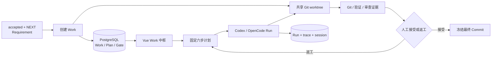
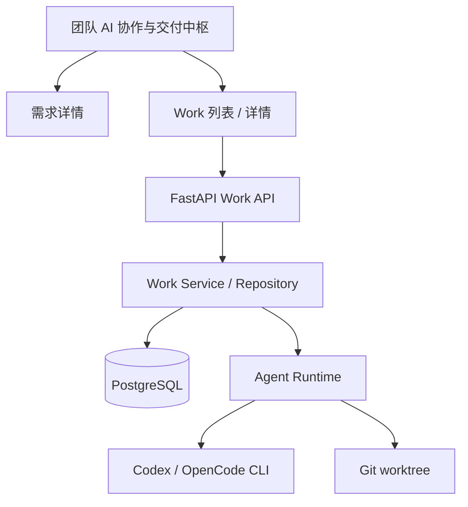
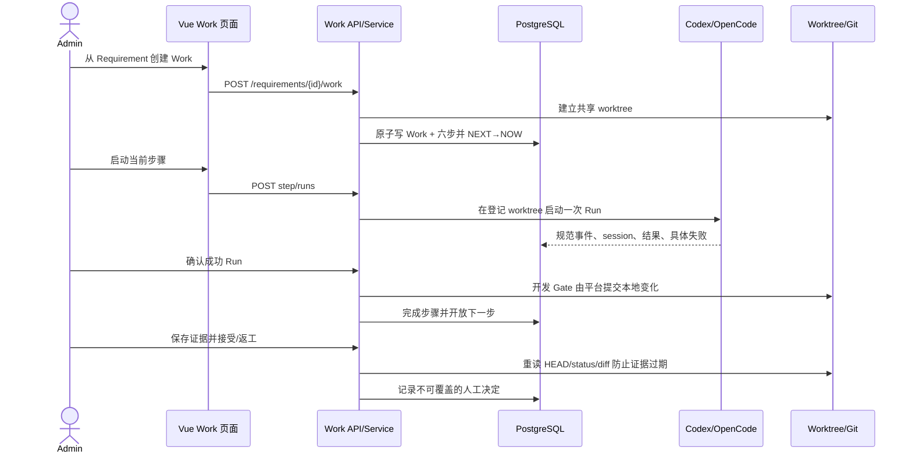

# S1：由平台管理的首个标准开发闭环——本地审查单

> 候选状态：实现与独立验证完成，等待人工审查；尚未接受、Push、创建 PR/MR 或 Merge  
> 审查对象：Requirement `req-20260830-042453-d51b4a` / Revision `rev-20260830-042453-c19d81`  
> 修改前版本：`2334f03c3036d54b6ec65516fc2e4c7e05767e6b`  
> 主线实现版本：`86c7918`（接力文档更新至 `df55026`）  
> 真实 Work：`work-20260830-060651-5cb1fa`  
> Work 最终候选：`ad6ca6e3fd9233c693b12177677047ab63dc7bd4`  
> 任务性质：已批准产品终稿中的 S1 纵切，不代表 S2—S5 已完成

**怎样使用：** 请从 R1 开始顺序审查；第一个不通过点即可停止。可直接回复
`R1：认可` 或 `R1：需要修改……`，我会修改同一份审查单及受影响成果，不另建 final-v2。

**导航：** [工作全貌](#1-完整工作全貌) · [R1 需求](#r1任务与需求是否成立) ·
[R2 方案](#r2方案是否合理) · [R3 实现](#r3实现是否符合方案) ·
[R4 验证](#r4验证是否足以支持当前结论) · [R5 决定](#r5总体决定) ·
[D1 报告体验](#d1报告是否好用)

## 1. 完整工作全貌

### 1.1 背景与任务来源

用户希望继续迭代已经进入主线的团队 AI 协作平台，而不是再停留在规划。数据库中已有一条经用户
批准的 `accepted + NEXT` Requirement，目标是把“需求、Agent 干活、过程、Git 结果、验证、审查、
人的决定”第一次串成真实闭环。本轮选它作为更大平台愿景的合法 S1 切片。

任务身份、批准边界见 [task-identity.md](task-identity.md)，施工规格见
[team-ai-collaboration-s1-r2.md](../../../docs/specs/team-ai-collaboration-s1-r2.md)。

### 1.2 采用的方案

不引入 Docker、远程 Worker 或通用工作流 DSL；在现有 Vue3 + FastAPI + PostgreSQL 宿主内增加
固定六步 Work。一个 Work 使用一个共享 worktree；CLI 只负责一次 Run，业务状态和历史以
PostgreSQL 为准；开发文件由 Codex 修改，本地 Commit 由受信的平台进程完成，最终接受始终由人决定。



### 1.3 完成的功能与结果

| 能力 | 用户得到的结果 | 当前证据 |
|---|---|---|
| Requirement → Work | 仅 accepted + NEXT 可创建；Requirement 转为 NOW | 真实 Work 与事务/冲突回归 |
| 固定计划 | 依次看到知识、方案、开发、验证、审查、人工接受 | Work 详情页与 PostgreSQL 回读 |
| Run 与 trace | 每次重试新增历史，进入具体 Run 才读取详细事件 | 真实 Codex/OpenCode Run |
| Git 交付 | 固定 base、共享分支、干净 worktree、最终 Commit 与 Diff 证据 | Work 分支及证据接口 |
| 返工安全 | 旧 Run 保留审计，但不能在返工后再次通过 Gate | 时间边界实现与正反回归 |
| 人工接受 | 证据新鲜且前五步完成后才开放；人仍可要求修订 | API/UI 门禁；尚未替用户接受 |
| 响应式页面 | 列表/详情在桌面和手机可读，时间输入不再撑宽或截断 | Chromium 12 组合与截图 |

### 1.4 当前边界

- 当前是本机单管理员、单仓同一时刻一个写入型 Work；不是多人认证或远程调度版本。
- 平台只做受管本地 Commit，不自动 Push、建 PR/MR 或 Merge；PR/MR 只能人工操作后回填。
- Knowledge Proposal 与 Candidate EvalCase 仍是交付候选文本，不是正式治理对象。
- 正式 Judge、评测编排、进化 Loop、Docker、远程 Worker、Lease 和 OBS ArtifactStore 均属后续切片。
- 当前 Work 尚未获人的最终接受；本报告也尚未经过 R1—R5。
- Vite 主包仍有超过 500 kB 的既有警告；当前真实工况没有证明它是本轮阻断项。

## 2. 需求审查

### 2.1 原始问题

原始请求是：“你往下自己迭代下去吧，看看一下午能完成到什么程度。”结合此前已批准产品终稿和
accepted S1 Requirement，本轮实际任务不是自由扩建，而是完成平台的第一条受管开发闭环。

### 2.2 需求要做成什么

1. 管理员从已接纳需求进入一个 Work，而不是在页面外手工拼接 CLI、目录和记录。
2. 每一步能启动 Agent、看到当前状态、历史 Run、结果和 trace，并由人确认 Gate。
3. 文件在独立 worktree 中修改，base、分支、Commit 和验证证据可回溯。
4. 交付可以接受或返工；返工不能覆盖历史，也不能复用返工前的旧成功 Run。
5. 页面、API、数据库和真实 CLI 串通，并在桌面/手机真实 Chromium 中可用。
6. S1 不借机引入认证、Docker、远程 Worker、通用 DSL、自动 Push/Merge 或进化系统。

### R1：任务与需求是否成立

- **审查目的：** 先确认把这一下午集中在 S1 真实闭环，而不是扩建更远能力，是否符合你的优先级。
- **当前待审内容：** 上述六点是否准确表达本轮要解决的问题、完成边界和不扩展范围。
- **请你决定：** `认可`、`需要修订`、`需要补信息` 或 `驳回该切片`。
- **处理结果：** 认可后开放 R2；修改则先改需求与受影响实现，驳回则停止后续验收并保留为实验事实。
- **你的反馈：** `状态：待审；意见：__________`

## 3. 方案审查

### 3.1 功能位于系统的哪里



入口仍在现有 AI 协作导航中；新增的是 Work 纵切及其后端/数据 owner，没有建立第二套前端或 SQLite。

### 3.2 总体方案与模块变化

原先平台能登记 Idea/Requirement、启动独立 Run，但 Run 与正式交付没有共同业务对象。现在 Work
把冻结 Revision、固定步骤、Run、Git 和人的决定关联起来：列表只查摘要；进入 Work 才读步骤和
Run 摘要；进入 Run 才读完整 prompt、结果和增量事件。

| 位置 | 原来 | 本次修改 | 修改后的作用 |
|---|---|---|---|
| PostgreSQL | Requirement 与 Run 分离 | 增加 Work/Plan/Step/Evidence/Decision；Run 加 Work/Step 外键 | 业务状态、历史和门禁可持久回读 |
| Agent Runtime | 运行独立 CLI 任务 | 接受已登记 workspace/branch；单 Step 单活跃 Run | CLI 会话不再充当业务事实源 |
| Git | 通用临时 worktree | 一个 Work 一个共享分支；平台受控本地 Commit | Codex 无需获得主仓 Git 元数据写权 |
| Work Service | 无 | 固定六步编排、Gate、返工、证据新鲜度 | 保持最小闭环，不引入 DSL |
| Vue | Idea/Requirement/能力/Run | 增加 Work 列表与详情，按需查看历史 | 成为任务起点、过程与结果中枢 |

OpenCode 保留 S0 的 `--auto` 非交互运行，但只读 Gate 注入 `edit/external_directory deny`、Bash
默认 deny 和有界完整命令白名单。官方语义明确 `--auto` 只自动通过原本为 ask 的请求，显式 deny
仍执行，见 [OpenCode Permissions](https://opencode.ai/docs/permissions/)。

### R2：方案是否合理

- **审查目的：** 判断固定六步、共享 worktree、PostgreSQL 事实源和人工 Gate 是否足够简洁且能覆盖 S1。
- **当前待审内容：** 上述系统位置、数据通路、Git 安全边界与按需加载方式。
- **请你决定：** `认可`、`需要修改方案` 或 `退回 R1`。
- **处理结果：** 认可后开放 R3；修改会同步影响代码、数据和验证，现有实现不提前视为批准。
- **你的反馈：** `状态：等待 R1；意见：__________`

## 4. 修改内容与软件实现审查

### 4.1 版本与 Diff 入口

```bash
git diff 2334f03c3036d54b6ec65516fc2e4c7e05767e6b..86c7918 -- \
  apps/quality-platform docs/specs/team-ai-collaboration-s1-r2.md \
  docs/team-ai-collaboration-delivery-hub-product-design.md docs/now.md
```

真实 Work 分支为 `agent-work/work-20260830-060651-5cb1fa`，最终候选 `ad6ca6e` 已回填到同一
Work 证据。主线中的实现提交从 `190e2f9` 到 `86c7918`，没有另建产品仓。

### 4.2 按模块说明修改

| 层 | 主要入口 | 实现与影响 |
|---|---|---|
| 数据 | `migrations/007_create_collaboration_s1.sql` | 新对象、约束、索引、Run 关联及单仓/单 Step 并发门禁 |
| 后端 | `src/work/`、`src/api/routers/work.py` | 创建、详情、步骤 Run、完成、证据、决定全链 |
| Runtime | `src/agent_runtime/` | workspace/branch 复用、取消、权限配置、受控 Commit 与真实错误保真 |
| 前端 | `src/frontend/src/features/work/` | 摘要列表、六步时间线、元数据、证据和人工决定 |
| 入口 | Router、AppShell、Requirement 详情 | Work 导航及 Requirement → Work 跳转 |
| 验证 | `tests/test_work.py`、Runtime 与 Vue tests | 正向、冲突、返工旧 Run、进程取消、API 与组件回归 |

### 4.3 关键实现流程



### 4.4 核心规则与边界

- `accepted + NEXT + frozen revision` 是创建 Gate；事务成功后才转 NOW，Git 创建失败有补偿清理。
- 只有前序完成才可启动下游；一个 PlanStep 同时最多一个 queued/running Run。
- 返工用 `step.updated_at` 作为新一轮 Run 的时间边界；旧 Run 可见但不再改变状态或通过完成 Gate。
- 开发 Run 只改文件；人在 Gate 确认时由平台执行本地 Commit。无变化且 HEAD 仍等于 base 时不能交付。
- 接受时重读 Git 并与最新证据比较；HEAD、分支、状态或 Diff 变化都要求重新保存证据。

### 4.5 批准关闭条件覆盖

| 批准条件 | 实现落点 | 正向证据 | 最可能失败的反例 | 状态 |
|---|---|---|---|---|
| accepted + NEXT 才创建 | create service/repository | 真实 Work、门禁测试 | LATER 或重复创建 | 通过 |
| 固定六步且顺序 Gate | plan schema/service | 页面与步骤回归 | 越级启动、人工步启动 Agent | 通过 |
| Run 历史不覆盖 | Run 外键与详情查询 | 7+ 个真实 Run | 重试覆盖旧结果 | 通过 |
| 单仓/单 Step 并发 | 部分唯一索引 + service 兜底 | 冲突测试 | 并发双启动 | 通过 |
| 返工不复用旧 Run | display + complete 双门 | 正反单测 | 旧 succeeded 再确认 | 通过 |
| Git 证据新鲜 | record/decide service | stale evidence 回归 | 保存后工作区变化 | 通过 |
| 人工最终决定 | acceptance step/API/UI | 接受按钮仍待用户操作 | Agent 自动接受 | 通过（未接受） |
| 不自动远端交付 | 无 Push/PR/Merge API + deny | Git/源码审计 | 自动 Push/Merge | 通过 |

### R3：实现是否符合方案

- **审查目的：** 确认实际 Diff 没有绕过共享契约、引入平行产品或遗漏关键 Gate。
- **当前待审内容：** 数据、Runtime、Work 服务、Vue 与测试是否按 R2 落地。
- **请你决定：** `认可`、`需要修改实现` 或 `退回 R2`。
- **处理结果：** 认可后开放 R4；修改会重跑受影响真实路径和回归。
- **你的反馈：** `状态：等待 R1/R2；意见：__________`

## 5. 运行演示与验证审查

### 5.1 验证范围与真实对象

本轮使用本机 PostgreSQL、FastAPI、Vite、真实 Git worktree、Codex CLI、OpenCode 1.18.10 和
Chromium。真实对象从已接纳 Requirement 创建，不是 mock 数据。没有执行 Push、PR/MR、Merge、
Docker、远端 Worker 或用户最终接受。

### 5.2 真实结果

| 证据 | 实际观察 | 结论 |
|---|---|---|
| Work | `work-20260830-060651-5cb1fa`，固定 base `2334f03c`、共享分支与时间盒 | 创建/持久化/回读成立 |
| Codex 开发 | `run-20260830-061827-314aa8` succeeded | 在 Work workspace 完成真实修改和验证 |
| OpenCode 验证 | `run-20260830-065128-653dc1` succeeded | 未授权复合 Bash 被 deny；白名单测试/构建成功 |
| 第一轮审查 | `run-20260830-065248-577c2c` succeeded | 找出返工复用旧 Run 的真实 P1；已修复 |
| 独立复审 | `run-20260830-070237-3ea76e` succeeded | 复核 P1 与权限争议、亲自重跑回归；P0=0、P1=0，可进入人工接受 |
| 后端 | 45 passed | 含旧 Run 展示与 complete Gate 双反例、真实子进程组取消 |
| 前端 | 15 files / 38 passed；`vue-tsc` 通过；Vite build 通过 | 类型、组件和生产构建成立；保留 bundle 警告 |
| Chromium | 1440/390/320 × 4 页面 = 12 组合；键盘 Requirement→Work→Run | 无横向溢出、Console/Page Error；主路径可操作 |

第一轮审查把 `--auto` 判为 P0，但该结论与已批准 S0 规格、OpenCode 官方权限语义和本轮真实 deny
事件冲突，因此没有机械删除参数；实现改为把兜底 deny、精确白名单和 `--auto` 的关系写入批准规格
并加回归断言。第一轮发现的返工 Gate P1 则已按事实修复，并补充旧 Run 在展示层和完成层都失败的测试。
独立复审确认修复成立；它当时提出的“完成 Gate 缺直接单测”已在最终 `ad6ca6e` 补齐。

截图位于忽略目录：
`apps/quality-platform/.runtime/screenshots/mainline-s1-final-20260830/`。运行详情可直接在本地页面打开：

- `http://127.0.0.1:5174/ai/works/work-20260830-060651-5cb1fa`
- `http://127.0.0.1:5174/ai/runs/run-20260830-070237-3ea76e`

### 5.3 证据边界

- 这些结果证明本机单管理员 S1 纵切，不外推到多人并发、远程工作站或生产权限模型。
- OpenCode 权限证明覆盖当前 1.18.10、当前 inline config 和真实命令；升级 CLI 时应重跑拒绝/允许用例。
- Chromium 覆盖核心 Work/Requirement/Run 页面与键盘跳转，不等于完整 WCAG 审计。
- 生产构建仍报告约 1,022 kB 主包警告；当前没有性能数据要求把它升级为 P0/P1。
- 人工接受仍未执行，因而“已实现并验证”不能写成“已验收发布”。

### R4：验证是否足以支持当前结论

- **审查目的：** 判断真实对象、CLI、数据库、Git、页面和回归证据是否足以支持 S1 候选结论。
- **当前待审内容：** 上述观察及其不能外推的边界。
- **请你决定：** `证据充分`、`需补指定路径` 或 `收窄结论`。
- **处理结果：** 充分后开放 R5；缺证据则执行补测或收窄声明，不用测试数量替代用户结果。
- **你的反馈：** `状态：等待 R1—R3；意见：__________`

## 6. 总体决定

| 决定 | 代码与 Work | 报告/知识/发布状态 |
|---|---|---|
| 认可 | 在 Work 页面人工接受当前最终 Commit | 报告记为通过；S1 可标 accepted@local-slice |
| 修改后复审 | 记录 request_changes，旧 Run 保留，产生新 Run/Commit/证据 | 受影响 R 点及下游重新开放 |
| 驳回 | 不接受 Work，不合并远端交付 | 保留最小审计，不称为已发布能力 |

### R5：总体决定

- **审查目的：** 在 R1—R4 均成立后决定是否接受本次 S1 交付。
- **请你决定：** `认可`、`修改后复审` 或 `驳回`。
- **处理结果：** 只有“认可”才由你或在你明确授权后执行 Work 接受；本报告不会替你接受。
- **你的反馈：** `状态：等待 R1—R4；意见：__________`

## 7. 报告体验

### D1：报告是否好用

这项反馈只评价报告是否让你快速理解和作决定，不等于对成果的通过/驳回。可反馈缺背景、重点不清、
顺序不顺、信息过多或待决点无效；我会先修同一报告，只有跨第二类任务仍成立时才提出 Harness 改进。

- **你的反馈：** `状态：可选；意见：__________`
