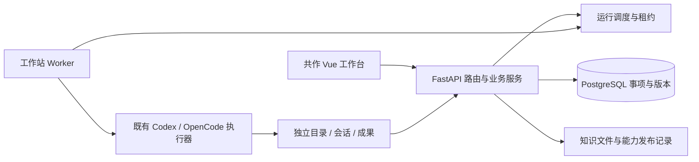

# 共作 v03：方案与交付审查

> 当前状态：本地实现与真实运行验证已完成，待人工审阅；未作公司部署或正式知识发布。
> 阅读顺序：产品输入已批准，可从 R2 查看工程方案；在第一个有异议处反馈即可。

## 1. 当前任务与批准依据

用户已明确要求按两轮讨论后的 v03 完成方案设计与实际开发，并授权分派子代理。
产品输入冻结于 `6b32092`：根目录 `共作-协作工作台-交互原型-v03.html` 与
`共作-产品定义与Linear拆解-v03.md`。文档内旧的“候选”说明保留作为输入历史；本次授权来自用户当前请求。
用户没有单独审批下述工程方案；本方案是在设计与开发授权范围内形成的可审实现记录。

长期结果是减少想法丢失、重复补背景、手工同步进度和重复汇报，让共同上下文连接事项、执行与成果。
本次产物落在唯一主线宿主 `apps/quality-platform/`，复用现有 Vue、FastAPI、PostgreSQL 和原生执行器。
旧知识体系与质检数据链作为已有能力引用，不因本次界面开发被重新定义。

## 2. 用户工作与关闭条件

| 编号 | 真实输入与操作 | 可观察结果 / 验收 |
|---|---|---|
| U1 | 在个人或团队记录原始灵感，讨论后形成或关联工作 | 刷新后仍存在，多来源/多后续关系保留，两个工作区互不混读 |
| U2 | 创建需求、研究、学习等事项；按专题/领域看工作并分派贡献 | 一个事项多专题归属，贡献引用父背景；个人轻任务无必经研发步骤 |
| U3 | 阅读共同背景、引用知识与材料，提出并采纳修订 | 有完整历史正文、来源与差异；并发旧提案报冲突；旧运行仍固定旧版本 |
| U4 | 委托现有 Codex/OpenCode，查看结果，暂停/重试/同步新共识 | 原生会话与机器/环境/版本有身份，失败如实回传，新尝试不覆盖旧记录 |
| U5 | 打开成果与运行证据，提交验收或要求修改 | 执行结束不冒充业务完成；证据来源、版本和人工接受分别存在 |
| U6 | 调整组会议程顺序、开关、范围、粒度、字段、分组 | 实时预览改变；重复进度折叠而独立决定保留；冻结后不随新事实漂移 |
| U7 | 会议中下钻、记决定、回原位置、导出纪要 | 决定关联回事项；导出含冻结事实与来源；列表/议程阅读位置保留 |
| U8 | 浏览真实知识、提修订；从事项形成能力候选 | 来源、内容版本和候选边界清晰，无模拟知识或模拟验证冒充事实 |
| U9 | 验证候选、发布并再次委托 | 验证绑定候选版本和实际运行/证据；新运行记录采用的发布版本；个人/团队分别发布 |
| U10 | 注册执行机、心跳、接单、暂停接单、取消、回收 | 独立进程通过协议工作，容量/租约真实生效，凭证不返回列表或跨工作区共享 |
| U11 | 从全新浏览器访问所有 v03 页面，使用弹窗与速览 | 视觉沿用原型；真实 API 持久化；焦点、Escape、回焦与窄屏可用 |
| U12 | 打开原有质检分析和历史 AI 页面 | 原有路由可用，既有回归通过；历史需求仅迁移为一个当前事项 |

内部 CodeHub API、公司镜像/网络/身份系统未提供本地连接。产品分别表示链接、状态读取与执行能力；
只保存 URL 不显示“已同步”。PPTX/PDF 与全能报表编辑器不在 v03 已定义操作范围中，会议交付浏览器呈现与 Markdown。

## 3. 工程方案与边界

采用业务对象表与局部 JSON 内容，不保存可被整包覆盖的浏览器 workspace blob。SQL 只在 Repository。
写入携带版本；上下文采纳通过事务生成不可变正文版本，Run 保存该版本的完整快照。
展示状态与业务状态分别建模；Artifact、Evidence、Run 完成和人工接受不能相互替代。

Vue 以 Shell、工作列表、详情五个页签、会议、知识、维护和覆盖层组成；API 类型、状态 composable
与组件分开。复用原型色彩、密度和导航，不嵌入 HTML 原型或使用整页 v-html。
主入口进入共作，原 `/manual-qc` 和 `/ai` 留作已有业务与历史入口。

知识保留 Git 中的正文与来源，工作台读已配置的根目录，记录文件路径与内容摘要哈希。
修订/能力候选单独管理，真实验证、发布记录与当前生效版本分离；不得通过改一个状态标签制造验证。
发布到个人与团队分别执行，运行明确记录采用版本，旧运行不追随新发布漂移。

运行复用现有 Codex/OpenCode adapter；平台只管理任务身份、固定上下文、环境和结果。
执行机使用注册凭证和独立机器令牌，服务端只存机器令牌哈希；容量和租约在服务端判断。
个人和团队各配置认证来源。普通查询可以使用本地环境；会改文件的并行任务隔离目录与原生会话。
Docker 由执行端真实检测，不因“配置了镜像”就声称容器已经运行。

### 状态迁移与兼容

新增 migration 008（业务）、009（运行）、010（知识/发布），不改质检已有字段语义。
S0 Requirement 迁移为统一事项并保留历史身份；旧历史链接仍可读。既有 Run 和 Work 不伪造成新版运行。
空数据库呈现真实空状态；演示对象必须由明确输入创建，不预置虚构完成结果。

### R1 / R2

R1 产品范围：按用户指定 v03 执行。R2 工程方案：本次授权内实施，待最终一起审阅。
R2 请判断：系统位置、版本与运行边界是否符合实际使用习惯。认可后顺序审阅 R3；需修改则由 Agent 调整受影响方案与实现。你的反馈：`R2：认可 / 需修改，理由：____`。
这是一份交付审阅记录，不作为已授权开发的额外许可门禁。

## 4. 施工隔离与验证计划

基线为主线 `2fe6888baa737ec78c89609f5320cfd72e037bf5`，产品输入提交 `6b32092`。
施工分支 `work/gongzuo-v03`，工作树 `.omni-brain-runs/gongzuo-v03-20260905`。
主线已有大量无关修改，本次保留。数据库使用该工作树自己的 `.runtime/postgres`，端口 55433；
后端 8011、前端 5175。因 Unix socket 路径长度限制，经 `/tmp/gongzuo-v03-app` 短符号链接访问相同本地数据库。
Python 复用已安装环境；前端独立安装锁文件依赖，测试前核对源码来源为当前工作树。

先走新会话真实页面，再以 API/数据库交叉核对持久化、作用域、冻结和版本；运行独立 Worker
执行真实原生会话并回查成果。覆盖过期提案、跨工作区对象、接单暂停、取消/失联、失败结果与发布版本。
会议至少构造两个专题共享事项并分别带独立决定，读取实际导出内容。新前端完成类型/构建及既有高价值回归。
最后用全新独立上下文对照冻结 v03 与候选代码复核，未证明项不得被测试数量覆盖。

## 5. 实施与逐项证据

### 实现位置与关键规则

| 产品操作 | 实现落点 | 用户得到的变化 |
|---|---|---|
| 记录灵感、创建事项、编辑关系与贡献 | `src/gongzuo/`、migration 008、前端 `features/gongzuo/` | 正式数据存于 PostgreSQL；一个事项通过关系服务多个专题 |
| 阅读、修订共同上下文 | 同一业务服务的 context/proposal/history | 创建事项与 v1 原子写入；采纳以版本比较阻止丢失更新，保留历次正文 |
| 委托、查看运行与结果、暂停和重试 | `src/gongzuo_runtime/`、migration 009、已有 `agent_runtime` adapters | Run 固定父事项背景、子贡献目标、代码提交和能力版本，独立 Worker 回传真实会话与结果 |
| 浏览知识与准备/验证/发布能力 | `src/gongzuo_knowledge/`、migration 010 | 正文可追溯至文件哈希；试验与发布分离，新运行采用已发布版本 |
| 调整、冻结和导出会议 | 业务服务 meeting projection 与会议页 | 同一服务端投影用于页面、快照与 Markdown；重复进展折叠，独立决定保留 |
| 保留旧数据和页面 | migration 008 的 S0 迁移、根路由 | 旧 Requirement 的身份、正文、状态与来源保留，重复迁移不覆盖用户修改 |

Run 的技术终态与事项验收是两个动作。证据必须关联当前空间和事项的真实 Run；接受证据不会自动完成事项。
取消/暂停已受理后，迟到的成功报告保留真实退出码和成果，但不能覆盖用户的取消/暂停决定。
子贡献优先采用正式父子关系确定共同背景，局部目标作为 focus；多父冲突与循环明确报错。

| 关闭条件 | 正向证据 | 反例与实际边界 | 当前结论 |
|---|---|---|---|
| U1 灵感记录、讨论、形成工作 | 真实页面创建 `idea-761ba261cb6247f2` 并保留讨论，形成 `item-aee2849dd2d84141` | 跨空间读取/关系被拒绝；没有启动必经研发流程 | 已验证 |
| U2 统一事项、专题、贡献 | 新建学习事项 `item-52137c6dd47a484a`；父子 context 与多专题关系有真实 API 证据 | 子贡献自动 local v1 曾遮蔽父背景，已修复并独立复核 | 已通过最终独立复核 |
| U3 共同上下文与修订历史 | 页面把 scope 候选采纳为 v2，历史同时可读 v1/v2；原生 Run 保留旧 v1 | 旧 baseVersion 提案 409；旧运行不会被后台改写 | 已验证 |
| U4 原生委托与固定版本 | 真实 Codex 会话、机器、分支、上下文和产物见 native evidence | 本机默认模型不兼容会如实失败；可指定可用模型，团队缺凭证明确 unavailable | 个人 native 已验证 |
| U5 证据与业务接受 | 真实产物由结果 API 回读并核对 SHA-256；接受证据后候选才能验证 | Run succeeded 不自动标记事项 completed；其他事项的 Run 不能用来冒领证据 | 已验证 |
| U6 会议配置与去重 | 默认决策/专题/成果议程；服务端范围/字段/分组与跨专题决定回归 | 重复交付无新决定则跳过，不把同一事项算两份成果 | API/浏览器/导出已验证 |
| U7 冻结、决定、导出 | 快照保留冻结时标题；决定关联事项与 snapshot ID | 后续事项变化不得漂移快照；冻结后记录决定与刷新单独实机复核 | 已通过最终独立复核 |
| U8 真实知识与修订 | 知识页实际读取 Markdown、来源哈希、发布覆盖版本 | 原料、路径逃逸与跨根符号链接受限制；不是浏览器虚构的知识 | 已验证 |
| U9 候选验证、发布、后续采用 | `cap-66c24cf0332245c8` 经真实试验/证据后发布，第二次原生 Run 自动采用其版本 | 未验证发布 409；发布是工作区运行版本，不冒充 Git 正式知识提交 | 真实 native 闭环已验证 |
| U10 执行机与租约 | 独立进程 HTTP 接单、心跳、容量、取消/暂停竞态和错 lease 403 | Docker 与另一台物理机尚未实测；团队配置不回退到个人认证 | 本机进程/协议已验证 |
| U11 页面与键盘/窄屏 | 新浏览器直接打开共作；弹窗 Tab/Shift-Tab、Escape、回焦实际执行 | 关系弹窗与下载曾有运行错误，修复后以新浏览器重新核对 | 最终浏览器无页面错误 |
| U12 旧能力与迁移 | 旧 `/ai`、`/manual-qc` 路由保留；迁移脚本对历史状态和幂等性实测 | 旧 Work/Run 不伪造成新版 Run | 已验证 |

完整实现差异：在主线执行 `git diff 6b32092 work/gongzuo-v03 -- apps/quality-platform docs/now.md workspaces/reviews/team-workbench-product-definition`。

R3 实现审查：核对上述变化是否符合 R2，是否遗漏用户操作或错误更改既有业务。当前等待 R2；反馈后由 Agent 修复相关实现并重跑受影响路径。
你的反馈：`R3：认可 / 需修改，具体位置与期望：____`。

## 6. 运行演示与独立复核

### 真实原生能力闭环

输入是三个可独立复算的合成工况：`samples=[3,7]`、`samples=[]`、缺少 `samples` 字段。
根代理独立计算的预期分别为 **10、0、未知**。试验与后续采用都通过个人 Worker 启动原生 Codex `gpt-5.6-luna`：

| 阶段 | Run / 结果 |
|---|---|
| 候选试验 | `gzrun-20260905-151003-847047be`，原生 session `01a0721f-01bf-7d43-9e20-e4d2519f8235`，成功；固定候选版本和上下文 v1 |
| 人工证据检查与发布 | 结果正文可经 API 打开；SHA-256 对齐；实际工况均与独立复算相同；之后接受证据、记录验证并发布 |
| 新运行自动采用 | `gzrun-20260905-151239-c2504114`，原生 session `01a07221-0ddf-70e3-b6f8-915f6b236720`，成功；无需再指定候选即采用发布版本，使用上下文 v2 |

完整输入、版本与结果身份：[native-capability-loop.json](evidence/native-capability-loop.json)；
[试验结果](evidence/gzrun-20260905-151003-847047be.md)、[后续采用结果](evidence/gzrun-20260905-151239-c2504114.md)。
报告只证明上述合成工况与能力消费过程，不把样本结论推广到生产数据。

### 独立复核与修复

`gongzuo_final_check` 使用全新上下文，仅接收冻结输入、运行入口与关闭条件，亲自创建测试对象。
其 [初次独立报告](evidence/independent-final-review.md) 明确发现父 context 继承失效并给出 FAIL；
本报告保留该失败事实。修复后由另一全新上下文 `gongzuo_fix_check` 对父子 Run、会议去重及实际页面复核，[最终复核报告](evidence/independent-fix-review.md) 中各项均通过。复核实际创建父子事项、修改父背景、冻结会议后写决定并改原事项，再以新页面下载与内容对账；没有以开发者测试数量覆盖失败。
独立审查中的 Worker 受控回报只证明协议状态机；上表的原生执行才是本轮真实执行器证据。

### 回归与边界

后端最终 **81 项测试通过**：[运行输出](evidence/backend-tests.txt)。
新浏览器访问首页及全部主页面、创建学习事项并采纳 scope v2、创建子贡献读取父背景、从复盘建议创建真实 Skill 候选，均以 API 回读交叉核对。
[页面操作记录](evidence/ui-browser-proof.json)、[候选正文回读](evidence/ui-capability-created.json)、[桌面首页](evidence/home-desktop.png)、[桌面上下文](evidence/context-desktop.png)、[平板](evidence/context-tablet.png)、[手机](evidence/context-mobile.png)。三档页面无横向溢出；修复后新浏览器无页面异常。
前端 **44 项测试通过**，共作与 Node 类型检查通过，Vite 构建通过：[前端验证输出](evidence/frontend-verification.txt)、[前端浏览器记录](evidence/frontend-browser-verification.json)。
全量类型诊断仍恰好为原有 40 条，文件/行号/TS 代码与基线一致，没有新增诊断：[当前全量结果](evidence/frontend-typecheck-full.txt)。
本次还发现原项目 `vue-tsc --noEmit` 没有递归检查引用的应用配置。按 `tsconfig.app.json` 真正检查后，
原主线存在 **40 条类型诊断**，保存于 [原代码检查结果](evidence/typecheck-baseline.txt)。本次修复新增代码的类型问题，并比较全量诊断，不能再将空检查报告为全量类型通过。
旧质检/协作的既有类型问题不在本次大范围重构；构建与行为测试另行真实执行。

Docker、不同物理主机、公司镜像、内源 OpenCode 分支接口与公司 SSO 尚未实测。
当前入口使用 localhost/local-admin；个人与团队可通过独立数据库、知识和凭证分别部署。

R4 验证审查：证据是否足够支持当前本地可用范围，是否需要补充某个真实团队场景。当前等待 R3；缺失证据由 Agent 补跑，不通过改写文案替代。
你的反馈：`R4：认可 / 需补证据，具体工况：____`。

## 7. 知识变化候选与总体决定

候选落点：新增 `knowledge/published/quality-check/systems/gongzuo-workbench.md` 实现来源页，并更新
`sources/current-prototype.md` 与系统导航的关联。内容限于本次代码与实测能力，不改业务规则或生产结论。
本次尚未发布正式知识，不将产品假设写成规范事实。

R1 产品输入已由本轮开发授权确认。当前可从 R2 工程方案开始审阅；R3/R4 可先阅读，决定按顺序处理。
R5 人工接受需 R2—R4 通过后再作决定；当前没有代替用户接受交付。本地合并实现不等于公司生产部署或正式知识发布。
人工可选择接受当前交付、指定修改后复审或驳回；后两者保留证据与可回退提交。
D1 报告体验单独反馈：是否能找到目标、入口、证据与待决问题，不与代码接受混为一项。
